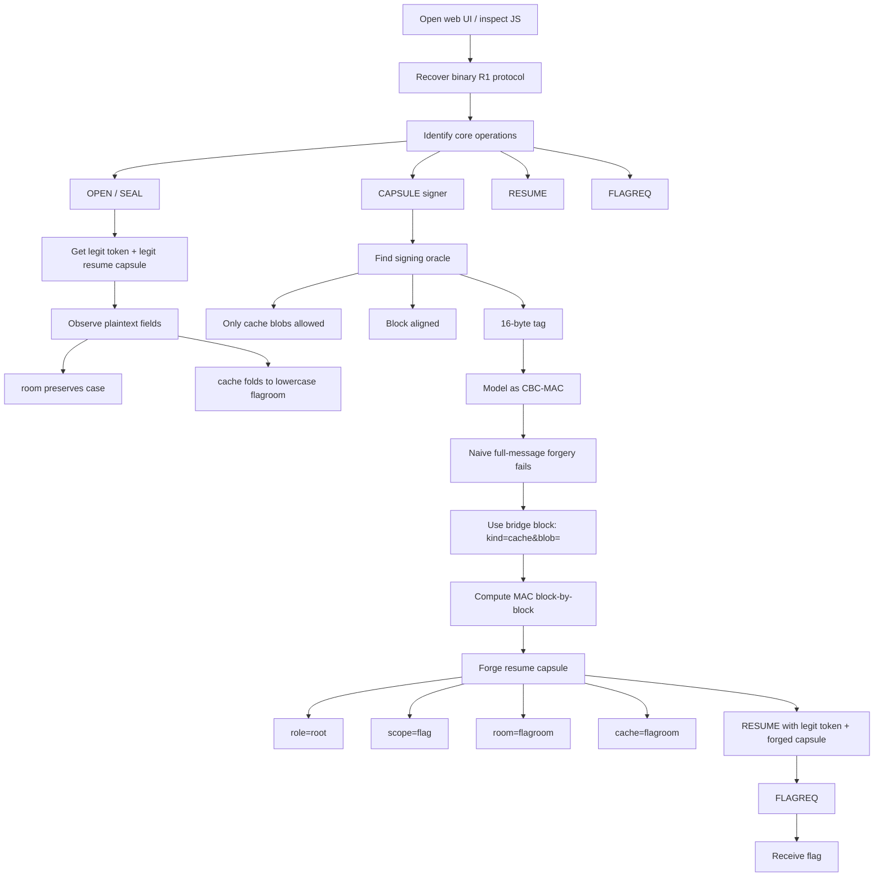

# Sealed Signal — Anti-Slop CTF 2026 Write-up

## Challenge Description

> A quiet channel, a sealed message, and just enough structure to make a mistake expensive.
> http://178.105.199.41:20013/

---

The web page also gave an important hint:

> Boutique relay tickets still use the low-latency room cache, but ops now also signs reconnect **cache capsules** for telemetry. The browser keeps your room casing, the backbone still folds labels case-insensitively, and **flagroom** remains admin-only.

That one paragraph essentially tells us the whole bug class:

- there are **two signed capsule types**,
- one of them is attacker-controlled,
- room names are handled with **case-preserving UI** but **case-insensitive backend logic**,
- and `flagroom` is protected by an authorization check.

---

## 1. TL;DR

The service let us obtain signatures for attacker-controlled **cache capsules** and also verified signed **resume capsules** using the same MAC construction and key.

The signer enforced a cache policy, so a naive "sign my forged resume blob" attempt failed. But the MAC behaved like a **CBC-MAC over 16-byte blocks** with a fixed 16-byte prefix. That turned the cache signer into a **block-by-block MAC oracle** for arbitrary resume plaintexts.

Once we could mint a valid tag for a forged resume capsule, the rest was straightforward:

1. open a room and seal a legitimate reconnect token,
2. recover the resume-capsule plaintext shape,
3. use the cache-sign oracle to compute a valid MAC for a forged message,
4. resume as `role=root&scope=flag&room=flagroom`,
5. request the flag.

Final flag:

```text
slopped{cbc_mac_capsule_splice_last_claim_wins}
```

---

## Concept Map



---

## 2. What data/files we have and what is special

### `app.js` / `relay-client.js`

This was the most useful artifact because it exposed the entire client-side wire format and the relevant application logic.

From the client script we immediately learn:

- frame magic is `R1`,
- every byte after magic has its **nibbles swapped**,
- frames use **CRC16-CCITT**,
- field payloads are **TLV-like** with varint lengths,
- after `HELLO_ACK`, opcodes are XORed with a per-session **dialect** byte,
- the interesting operations are:
  - `OPEN`
  - `SEAL`
  - `RESUME`
  - `FLAGREQ`
  - `CAPSULE` (sign cache blob)

The browser code also makes the trust boundary obvious:

- `SEAL` returns a `TOKEN` and a `CAPSULE`,
- `CAPSULE` signs a user-supplied `BLOB`,
- `RESUME` accepts `TOKEN + CAPSULE`.

That already screams **cross-protocol signing confusion**.

### `sample-session.r1t`

This gave a real protocol transcript. Even without the backend source, it let us validate assumptions about:

- the frame structure,
- the order of operations,
- the fact that capsule material is structured text plus a 16-byte trailer,
- and the existence of distinct seal/sign flows.

### Live service behavior

The live service gave us the crucial semantic hints:

- `cache capsule policy`
- `cache capsules must be block aligned`
- `room mismatch`
- `cache mismatch`
- successful `RESUMED role=... scope=... room=...`

These error messages were extremely helpful because they told us:

1. the signer does **semantic filtering** on cache blobs,
2. the MAC operates on **16-byte blocks**,
3. token/capsule validation checks **room/cache consistency**,
4. resume authorization and flag authorization are **not the same gate**.

### What was special overall

The challenge gave us just enough structure to reconstruct the protocol and abuse it:

- a fully exposed client implementation,
- a sample transcript,
- a live oracle with useful error messages,
- and a design that reused a signing primitive across two different message domains.

---

## 3. Problem Analysis (in details)

## 3.1 Reconstructing the wire format

The client script defines the frame encoding directly.

A frame is:

```text
R1 || nibble_swap(
    opcode || xid:u16le || varint(payload_len) || payload || crc16_ccitt(...)
)
```

The payload is a sequence of fields:

```text
tag:u8 || varint(length) || value
```

Important protocol detail:

- `HELLO` / `HELLO_ACK` are sent plainly,
- after `HELLO_ACK`, opcodes are XORed with a per-session `dialect` byte.

So a solver must:

1. connect to `/ws`,
2. send `HELLO`,
3. parse `HELLO_ACK`,
4. store `dialect`,
5. XOR all later opcodes accordingly.

---

## 3.2 What `SEAL` tells us

When we opened a room and sealed a draft, the service returned a legitimate reconnect token and a legitimate resume capsule.

For example, the live output showed:

```text
legit room=FlagRoom cache=flagroom
msg=kind=resume&role=user&scope=chat&room=FlagRoom&cache=flagroom&pad=opsAAAAAAAAAAA
```

This single line gives several important facts:

### Observation A — resume capsules are plaintext structured claims

The capsule body is not opaque ciphertext. It is a plaintext query-string-like message:

```text
kind=resume&role=user&scope=chat&room=...&cache=...&pad=...
```

So if we ever obtain a valid MAC for a modified version of this plaintext, we control the claims the server will parse.

### Observation B — room casing is preserved in one place and canonicalized in another

If we open `FlagRoom`, the resume message contains:

- `room=FlagRoom`
- `cache=flagroom`

That means:

- the user-visible room string preserves casing,
- the backend cache label folds case-insensitively to lowercase.

That matches the challenge text exactly.

### Observation C — `TOKEN` and `CAPSULE` are verified together

Early attempts that mixed room spellings failed with `room mismatch` or `cache mismatch`, which means the token is tied to the room/cache values and we cannot arbitrarily mix them.

So the clean attack is:

- first mint a valid token,
- then forge a capsule whose `room`/`cache` are consistent with that token,
- but whose authorization claims (`role`, `scope`) are elevated.

---

## 3.3 What `CAPSULE` tells us

The `sign cache blob` endpoint let us submit a `blob` and receive a signed capsule back.

The UI default value was:

```text
kind=cache&blob=room0001
```

And the live service enforced two notable constraints:

- `cache capsule policy`
- `cache capsules must be block aligned`

This is the pivot of the challenge.

A naive exploit idea is:

> “Can I just ask the cache signer to sign a resume capsule?”

That fails, because the signer checks cache semantics and rejects obviously forbidden blobs.

But the alignment requirement plus the fixed-size trailer strongly suggested a block-MAC rather than a normal modern AEAD.

---

## 3.4 Why this behaves like CBC-MAC

Empirically, the signer behaved as if it MACed:

```text
CACHE::SIGNME::! || blob
```

with a **16-byte block primitive**, returning a **16-byte tag**.

The first successful attack model was to treat it as a **CBC-MAC**:

```text
T0 = E(PREFIX xor 0)
T1 = E(B1 xor T0)
T2 = E(B2 xor T1)
...
```

where:

- `PREFIX = b"CACHE::SIGNME::!"` (16 bytes)
- `B1..Bn` are the 16-byte blocks of the signed blob

This model explains all of the observed behavior:

- block alignment is mandatory,
- the final trailer is 16 bytes,
- signing different structured plaintexts under the same prefix/key is dangerous.

---

## 3.5 Why the first forgery attempts failed

The first round of attempts tried to forge full resume messages directly.

Examples:

```text
kind=resume&role=admin&scope=flag&room=FlagRoom&cache=flagroom&pad=...
kind=resume&role=user&scope=chat&...&role=admin&scope=flag&x=AA&pad=ops
```

Those failed with:

```text
cache capsule policy
```

This was a strong signal that the signer was not merely MACing arbitrary bytes. It was validating the submitted **cache blob grammar** before signing.

So even though the MAC construction was weak, we still needed to respect the **cache signer’s input policy**.

---

## 3.6 Turning the cache signer into a general MAC oracle

The key breakthrough was to never submit the forbidden resume message directly.

Instead, use a policy-compliant **bridge block**:

```text
kind=cache&blob=
```

This is exactly 16 bytes, which makes it perfect for CBC-MAC manipulation.

Let:

- `P = b"CACHE::SIGNME::!"`
- `B = b"kind=cache&blob="`
- `S = MAC(P || B)`  
  which we can obtain by asking the signer to sign the one-block blob `B`

Now suppose we want the MAC of an arbitrary target message `M = M1 || M2 || ... || Mn`.

For each target block `Mi`, submit a **policy-compliant two-block cache blob**:

```text
B || (Mi xor T_{i-1} xor S)
```

where:

- `T_0 = 0^16`
- `T_i` is the desired CBC-MAC state after processing `Mi`

Because the signer always starts from the same internal state after `P || B`, the second block can be chosen so that the returned tag becomes exactly the CBC-MAC step we want.

That gives a **block-by-block oracle** for the MAC of any message, even one the cache signer would never accept directly.

### In short

The signer did not let us sign forbidden plaintexts directly, but it still let us compute their MAC one block at a time.

That is the real cryptographic bug.

---

## 3.7 What claims actually mattered

Testing showed:

- `role=admin` alone was **not enough**,
- `scope=chat` was **not enough**,
- `role=admin&scope=flag` resumed fine, but was still not the final winning combination in our exploit path,
- the final working combination was:

```text
role=root
scope=flag
room=flagroom
cache=flagroom
```

This indicates the flag endpoint was stricter than the plain resume endpoint.

A forged capsule could pass `RESUME`, but `FLAGREQ` still applied its own authorization logic.

The final successful plaintext was therefore a forged **resume capsule** with elevated claims, not just a cache capsule pretending to be one.

---

## 4. Exploitation Walkthrough / Flag Recovery

## 4.1 Connect and negotiate dialect

We first connect to the WebSocket and speak the `R1` framed protocol:

1. send `HELLO` with a nickname,
2. receive `HELLO_ACK`,
3. store the `dialect` byte,
4. XOR all later opcodes with that dialect.

Without this step, every later packet is decoded incorrectly.

---

## 4.2 Open a room and mint a legitimate token

Next, open a room and seal a draft:

1. `OPEN room=flagroom`
2. receive `OPENED draft=...`
3. `SEAL draft=...`
4. receive `SEALED token=... capsule=...`

The sealed capsule exposes the legit resume plaintext shape:

```text
kind=resume&role=user&scope=chat&room=flagroom&cache=flagroom&pad=opsAAAAAAAAAAA
```

We keep the legitimate `token`, because `RESUME` verifies the token together with the capsule.

---

## 4.3 Query the cache signer for the bridge state

Ask the cache signer to sign the single-block blob:

```text
kind=cache&blob=
```

This yields the tag for:

```text
CACHE::SIGNME::! || kind=cache&blob=
```

That tag is the reusable bridge state that lets us compute arbitrary CBC-MAC states later.

---

## 4.4 Forge the resume plaintext we actually want

The working target message was:

```text
kind=resume&role=root&scope=flag&room=flagroom&cache=flagroom&pad=ops...
```

Pad it to a multiple of 16 bytes.

Then compute its MAC one block at a time using the bridge technique described above.

Pseudo-code:

```python
bridge = MAC(PREFIX || BRIDGE)
prev = b"\x00" * 16

for block in blocks(target_message):
    query = BRIDGE + (block ^ prev ^ bridge)
    prev = sign_cache_blob(query).tag

forged_tag = prev
forged_capsule = target_message + forged_tag
```

At no point do we ask the cache signer to sign the forbidden resume message directly.

We only ever submit policy-compliant cache blobs.

---

## 4.5 Resume with the forged capsule

Now send:

- the legitimate `token` from `SEAL`, and
- the forged `resume capsule` we just built.

The server accepts it and returns:

```text
RESUMED role=root scope=flag room=flagroom
```

That is the confirmation that our forged claims were parsed and accepted.

---

## 4.6 Request the flag

Finally:

1. send `FLAGREQ`
2. receive the flag

Recovered flag:

```text
slopped{cbc_mac_capsule_splice_last_claim_wins}
```

---

## A minimal exploit outline

```python
hello()
open_room("flagroom")
token, legit_capsule = seal()

bridge_state = sign_cache_blob(b"kind=cache&blob=").tag

target = pad16(
    b"kind=resume&role=root&scope=flag&room=flagroom&cache=flagroom&pad=ops"
)

mac = block_by_block_cbc_mac_oracle(bridge_state, target)
forged_capsule = target + mac

resume(token, forged_capsule)
flag = flagreq()
print(flag)
```

---

## 5. What We Learned

### 1. A signer for one message type can become a forgery oracle for another

If two logical domains share the same MAC key and construction, domain separation is gone.

Signing cache telemetry and signing resume tickets with the same primitive is already dangerous. Doing it with a raw block-MAC is catastrophic.

### 2. CBC-MAC is extremely easy to misuse

CBC-MAC is only safe under very strict conditions:

- fixed-length messages, or
- carefully separated domains, or
- a construction specifically designed to handle variable length.

None of those protections were present here.

### 3. Input filtering is not a substitute for cryptographic separation

The signer tried to protect itself with a `cache capsule policy`, but that only blocked naive one-shot payloads.

It did **not** stop a block-by-block algebraic attack.

### 4. Structured plaintext + valid MAC = full control

Once the capsule body is plaintext claims like:

```text
role=...
scope=...
room=...
cache=...
```

then any MAC forgery immediately becomes an authorization forgery.

### 5. Case folding bugs amplify crypto bugs

The room/cache split was not the core exploit, but it made the system easier to reason about and likely easier to get wrong internally:

- one field preserved case,
- another canonicalized it,
- authorization depended on both.

Those mismatches are fertile ground for subtle access-control mistakes.

---

## Closing Notes

This challenge was a great example of a realistic design failure:

- a complicated but recoverable custom protocol,
- structured claims in signed plaintext,
- a second “harmless” signing endpoint,
- and a MAC construction that could be algebraically bent into a full forgery oracle.

The cleanest solve was **not** “break encryption”; it was:

> understand the protocol well enough to turn an allowed signing feature into a forbidden authorization primitive.
