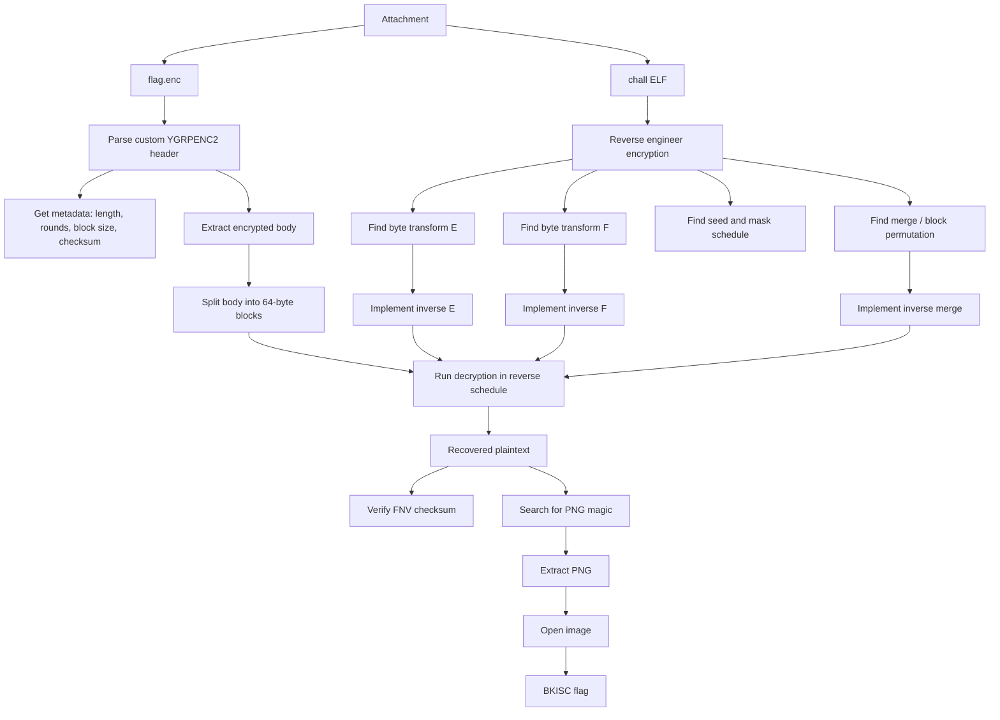

# Merge — BKISC CTF 2026 Writeup

## Challenge Description
> Merge...merge...merge...

## TL;DR

The challenge gives us a local binary called `chall` and an encrypted file called `flag.enc`. The encrypted file uses a custom format with the magic header `YGRPENC2`.

After reversing the binary, we find that the encryption is a custom 64-byte block cipher-like transformation with 12 rounds. Each round applies reversible byte-level operations, but the important part is the repeated **merge** operation, which is actually a block permutation.

After reversing the byte transforms and undoing all merge permutations, the decrypted plaintext passes the checksum stored in the header. The plaintext contains a PNG image at offset `50`. Opening the recovered image gives the flag:

```text
BKISC{Do_YoU_l1Ke_meRgE}
```

## What Data / Files We Have and What Is Special

The attachment contains two important files:

| File | Type | Purpose |
|---|---|---|
| `chall` | Stripped 64-bit ELF binary | Local encryption program |
| `flag.enc` | Custom encrypted file | Target encrypted file to recover |

There is no remote server interaction in this challenge. Everything is solved locally by analyzing the binary and decrypting `flag.enc`.

Running the binary without arguments shows a simple usage message:

```bash
$ ./chall
usage: ./chall <input_file>
```

Testing it with a small chosen plaintext shows that the program encrypts an input file and writes `<input_file>.enc`:

```bash
$ echo -n "ABCD" > sample
$ ./chall sample
ok: sample.enc
```

Looking at the encrypted file shows a clear custom magic value:

```bash
$ xxd -l 32 sample.enc
```

The first bytes decode to:

```text
YGRPENC2
```

This tells us that the challenge is not using a standard format such as ZIP, PNG, or AES output. It is a custom encryption/container format implemented inside `chall`.

For `flag.enc`, the parsed metadata is:

| Field | Value |
|---|---:|
| Magic | `YGRPENC2` |
| Original plaintext length | `158491` |
| Rounds | `12` |
| Block size | `64` bytes |
| Plaintext checksum | `0xfd2ee6a1` |
| Encrypted body size | `158528` bytes |
| Number of blocks | `2477` |

The body size is larger than the plaintext length because the plaintext is padded to a multiple of the 64-byte block size.

## Concept Map



## Problem Analysis in Details

### 1. Understanding the Custom File Format

The first important observation is the magic header:

```text
YGRPENC2
```

A magic header is a fixed byte sequence at the beginning of a file. It usually identifies the file format. For example, PNG files start with:

```text
89 50 4E 47 0D 0A 1A 0A
```

Here, `YGRPENC2` is not a known public format. It is almost certainly created by the challenge author.

The encrypted file layout can be understood as:

```c
struct header {
    char     magic[8];       // "YGRPENC2"
    uint32_t orig_len;       // original plaintext length
    uint32_t rounds;         // number of encryption rounds, here 12
    uint32_t block_size;     // block size, here 64
    uint32_t plain_hash;     // checksum of original plaintext
    uint32_t body_tag;       // extra metadata / tag
};
```

After the header, the remaining bytes are the encrypted body. The body is split into 64-byte blocks.

For this challenge:

```text
original length = 158491
block size      = 64
body size       = 158528
block count     = 158528 / 64 = 2477
```

The padding size is:

```text
158528 - 158491 = 37 bytes
```

The checksum in the header is extremely useful. It gives us a way to verify whether our decryption is correct without guessing from visual output.

### 2. The Encryption Is Reversible

The binary performs several byte-level operations on every 64-byte block. These operations include:

- XOR with seed-derived bytes
- addition modulo 256
- 8-bit rotations
- seed updates using xorshift-like logic

These operations look complicated, but each one is reversible:

| Operation | Forward | Inverse |
|---|---|---|
| XOR | `y = x ^ k` | `x = y ^ k` |
| Addition mod 256 | `y = (x + k) & 0xff` | `x = (y - k) & 0xff` |
| Rotate left | `y = rotl8(x, r)` | `x = rotr8(y, r)` |
| Permutation | `new[i] = old[p[i]]` | place `new[i]` back at `old[p[i]]` |

This means the challenge is not about breaking strong cryptography. It is about carefully reconstructing the custom transformation and applying every step in reverse order.

### 3. Why the Challenge Is Called Merge

The title `Merge` is the main hint.

At first, we may expect the word `merge` to mean file merging, compressed stream merging, or image layer merging. However, inside the encryption algorithm, the real meaning is block merging/shuffling.

The plaintext is split into 64-byte blocks. Then the program repeatedly reorders the blocks using permutations. One recovered permutation has the form:

```python
p[i] = (2197 + 327 * i) % 2477
```

The encryption uses this as:

```python
new_blocks[i] = old_blocks[p[i]]
```

This is a valid permutation because:

```text
gcd(327, 2477) = 1
```

When the multiplier and the modulus are coprime, the mapping visits every block index exactly once. Therefore, no block is lost or duplicated.

The important lesson is that even if we correctly reverse the byte-level encryption, the output still looks like garbage if the block order is wrong.

### 4. Encryption Schedule

The encryption can be summarized like this:

```python
blocks = split_into_64_byte_blocks(plaintext)
blocks = initial_merge(blocks)

for round_id in range(12):
    for block_id in range(number_of_blocks):
        apply_transform_E(blocks[block_id])

    for block_id in reversed(range(number_of_blocks)):
        apply_transform_F(blocks[block_id])

    if round_id != 11:
        blocks = merge(blocks)

ciphertext = join_blocks(blocks)
```

Therefore, decryption must do the exact opposite:

```python
blocks = split_into_64_byte_blocks(ciphertext)

for round_id in reversed(range(12)):
    if round_id != 11:
        blocks = inverse_merge(blocks)

    for block_id in range(number_of_blocks):
        inverse_transform_F(blocks[block_id])

    for block_id in reversed(range(number_of_blocks)):
        inverse_transform_E(blocks[block_id])

blocks = inverse_initial_merge(blocks)
plaintext = join_blocks(blocks)
plaintext = plaintext[:original_length]
```

The exact order matters. In reversible algorithms, the last encryption operation must become the first decryption operation.

## Important Concepts / Knowledge Needed

### Custom File Format Reversing

Many CTF reversing challenges use custom file formats. The first step is usually to identify:

| Item | Why it matters |
|---|---|
| Magic bytes | Identify the format |
| Length fields | Recover the original plaintext length |
| Round count | Understand loop structure |
| Block size | Split the encrypted body correctly |
| Checksum/hash | Verify successful recovery |

In this challenge, `YGRPENC2` tells us the file is custom, and the header gives enough metadata to guide the decryptor.

### Chosen-Plaintext Testing

The binary encrypts any file we provide. That means we can create our own plaintext and observe the ciphertext.

This is very useful for reverse engineering. For example:

```bash
echo -n "AAAAAAAAAAAAAAAA" > test
./chall test
```

Even better, we can create marker blocks where each block contains a unique ID:

```text
BLOCK_0000................
BLOCK_0001................
BLOCK_0002................
...
```

If the encryption shuffles blocks, these markers help us recover where each block moved.

### Block Permutation

A permutation only changes positions. It does not destroy data.

If encryption does:

```python
new[i] = old[p[i]]
```

then decryption can undo it with:

```python
old = [None] * len(new)
for i, src in enumerate(p):
    old[src] = new[i]
```

For this challenge, ignoring the permutation is the most common reason for getting unreadable output.

### Modular Arithmetic in Permutations

The permutation:

```python
p[i] = (2197 + 327 * i) % 2477
```

works because `327` and `2477` are coprime. This creates a full cycle over the block indices.

If the multiplier was not coprime with the block count, some indices would repeat and some would never appear. That would not be a valid permutation.

### Inverting Byte Operations

The byte transforms are scary-looking but conceptually simple. They combine reversible operations.

Example forward operation:

```python
y = rotl8(((x ^ key) + add_value) & 0xff, shift)
```

The inverse must undo the operations in reverse order:

```python
x = ((rotr8(y, shift) - add_value) & 0xff) ^ key
```

This is a common reversing pattern. Do not try to simplify everything at once. Reverse one operation at a time.

## Exploitation Walkthrough / Flag Recovery

### Step 1 — Inspect the Attachment

First, list the files:

```bash
$ ls -l
chall
flag.enc
```

Check the binary:

```bash
$ file chall
chall: ELF 64-bit LSB pie executable, x86-64, dynamically linked, stripped
```

The binary is stripped, so function names are not available. We need to use behavior testing and disassembly.

Check the encrypted file:

```bash
$ xxd -l 32 flag.enc
```

The file starts with:

```text
YGRPENC2
```

This confirms that the encrypted file is in the challenge author's custom format.

### Step 2 — Parse the Header

A small parser can extract the important metadata:

```python
import struct

with open("flag.enc", "rb") as f:
    data = f.read()

magic = data[:8]
orig_len, rounds, block_size, plain_hash, body_tag = struct.unpack("<IIIII", data[8:28])
body = data[28:]

print("magic     =", magic)
print("orig_len  =", orig_len)
print("rounds    =", rounds)
print("block     =", block_size)
print("hash      =", hex(plain_hash))
print("body size =", len(body))
print("blocks    =", len(body) // block_size)
```

Expected result:

```text
magic     = b'YGRPENC2'
orig_len  = 158491
rounds    = 12
block     = 64
hash      = 0xfd2ee6a1
body size = 158528
blocks    = 2477
```

### Step 3 — Reverse the Byte Transform Helpers

The binary uses 8-bit rotations and a 32-bit xorshift-style update.

```python
MASK = 0xffffffff


def rotl8(x, r):
    r &= 7
    return (((x << r) & 0xff) | (x >> (8 - r))) & 0xff


def rotr8(x, r):
    r &= 7
    return ((x >> r) | ((x << (8 - r)) & 0xff)) & 0xff


def xs32(x):
    x &= MASK
    x ^= (x << 13) & MASK
    x ^= x >> 17
    x ^= (x << 5) & MASK
    return x & MASK
```

The most important detail is that each byte transform updates its seed using the encrypted output byte. Because the output byte is known during decryption, we can reproduce the same seed sequence while decrypting.

### Step 4 — Implement Inverse Byte Transforms

The forward transform applies XOR, addition, and rotate-left. The inverse applies rotate-right, subtraction, and XOR.

Inverse transform `E`:

```python
def invE(block, seed, arg, src):
    seed &= MASK
    arg &= MASK

    for i in range(64):
        sb = (seed >> (8 * (i & 3))) & 0xff
        u = (src[(arg + 5 * i) & 15] + ((13 * i + 7 * arg) & 0xff)) & 0xff
        shift = ((seed >> 27) & 7) + 1

        out = block[i]
        b = rotr8(out, shift)
        block[i] = ((b - u) & 0xff) ^ sb

        seed = xs32(
            seed
            ^ ((out * 0x27d4eb2d) & MASK)
            ^ (((i + 1) * 0x9e3779b9) & MASK)
        )
```

Inverse transform `F`:

```python
def invF(block, seed, arg, src):
    seed &= MASK
    arg &= MASK

    for i in range(63, -1, -1):
        sb = (seed >> (8 * ((i + 1) & 3))) & 0xff
        u = (src[(3 * i + 9 * arg) & 15] + ((7 * i + 11 * arg) & 0xff)) & 0xff
        shift = ((seed >> 21) & 7) + 1

        out = block[i]
        b = rotr8(out, shift)
        block[i] = ((b - u) & 0xff) ^ sb

        seed = xs32(
            seed
            ^ ((out * 0x165667b1) & MASK)
            ^ (((i + 3) * 0x7f4a7c15) & MASK)
        )
```

### Step 5 — Recover and Undo Merge

The first visible merge permutation is:

```python
def initial_perm(n):
    return [(2197 + 327 * i) % n for i in range(n)]
```

The permutation convention is:

```python
new_blocks[i] = old_blocks[p[i]]
```

Therefore, the inverse is:

```python
def inv_perm(blocks, p):
    old = [None] * len(blocks)
    for i, src in enumerate(p):
        old[src] = blocks[i]
    return old
```

This is the key idea of the challenge. The byte transforms alone are not enough. The block order must also be restored.

### Step 6 — Verify with the Header Checksum

After reversing all operations, compute the checksum and compare it with the header value.

The checksum used by the challenge is FNV-1a:

```python
def fnv1a32(data):
    h = 0x811c9dc5
    for b in data:
        h ^= b
        h = (h * 0x01000193) & 0xffffffff
    return h
```

Successful recovery gives:

```text
calculated FNV-1a = 0xfd2ee6a1
target FNV-1a     = 0xfd2ee6a1
```

The matching checksum confirms that the plaintext has been recovered correctly.

### Step 7 — Extract the PNG

The recovered plaintext does not start directly with PNG bytes. Searching for the PNG magic finds it at offset `50`:

```python
png_magic = b"\x89PNG\r\n\x1a\n"
pos = plaintext.find(png_magic)
print(pos)
```

Result:

```text
50
```

Extract the PNG:

```python
png = plaintext[pos:]
with open("flag.png", "wb") as f:
    f.write(png)
```

Check the file:

```bash
$ file flag.png
flag.png: PNG image data, 1672 x 941, 8-bit colormap, non-interlaced
```

Open the image and read the flag:

```text
BKISC{Do_YoU_l1Ke_meRgE}
```

## Final Flag

```text
BKISC{Do_YoU_l1Ke_meRgE}
```

## What We Learned

This challenge is a good example of custom crypto in reverse engineering. The algorithm looks complicated because it uses multiple rounds, seed updates, rotations, masks, and block shuffling. However, most operations are individually reversible.

The most important trick is the merge layer. If we only reverse the byte-level encryption, the result still looks random because the 64-byte blocks are in the wrong order. The title is the hint: **merge** means block permutation.

A strong way to solve this type of challenge is chosen-plaintext testing. Because the binary can encrypt our own input, we can create marker blocks with unique IDs and observe how blocks move. This turns a confusing shuffle into a recoverable permutation.

The header checksum is also very useful. Instead of relying on whether the output "looks right", we can verify the recovered plaintext mathematically with FNV-1a. Once the checksum matches, the decryption is confirmed.

Key takeaways:

| Concept | Lesson |
|---|---|
| Custom file format | Parse the header first. It often gives length, rounds, block size, and checksum. |
| Reversible byte operations | XOR, modular addition, and rotations can be inverted step by step. |
| Permutation layer | Correct bytes are useless if the block order is wrong. |
| Chosen plaintext | Unique marker blocks can reveal hidden block shuffles. |
| Checksum verification | A matching checksum confirms the recovery before manual inspection. |

In the end, the challenge is not about breaking AES or a real cipher. It is about carefully modeling the custom algorithm and reversing every operation in the correct order.
