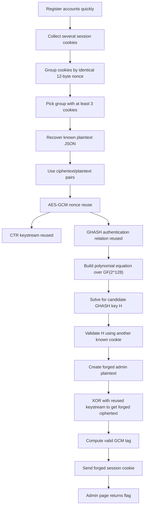

# AES Scissor Co 3 — BYUCTF 2026 Write-up

## Challenge Description

> Okay, I have vibe coded this app a couple times now, but this is the final version. This time I listened to the AI and let it use AES GCM, which is bulletproof
>
> Note: to run locally either use the docker or make a `.env` with the one environmental variable shown in the Dockerfile
>
> `https://aes.chals.cyberjousting.com`

**Flag:**

```text
byuctf{n0m_n0m_c00k13_a4fb6c0f}
```

---

## 1. TL;DR

The application stores the user session inside an AES-GCM encrypted cookie. AES-GCM itself is secure, but only when each encryption under the same key uses a unique nonce. In this challenge, the nonce is derived from the current Unix timestamp in seconds, meaning multiple cookies created within the same second reuse the same nonce.

Nonce reuse in AES-GCM is catastrophic. By registering several accounts quickly, we can collect multiple known plaintext/ciphertext/tag triples under the same nonce. Because we know the exact JSON structure of normal user cookies, we can recover the GCM authentication relation, forge a valid tag for a modified cookie, and change our role from `user` to `admin`.

After sending the forged admin cookie, the server returns the flag:

```text
byuctf{n0m_n0m_c00k13_a4fb6c0f}
```

---

## 2. What Data/File We Have and What Is Special

We are given the web challenge source code in `aes-scissor-co-3.zip` and a live instance:

```text
https://aes.chals.cyberjousting.com
```

The important part is the session cookie implementation. The app serializes user data into JSON, encrypts it with AES-GCM, and stores the result client-side as a cookie.

A normal decrypted session has this structure:

```json
{"id":"<uuid>","role":"user","username":"<username>"}
```

The server checks the cookie role to decide whether the user is an admin. Therefore, the target is to forge a valid encrypted cookie whose plaintext contains:

```json
"role":"admin"
```

The special vulnerability is the nonce generation. The nonce is not random and not a monotonic counter. It is derived from the current Unix timestamp in seconds. That makes it very easy to create multiple cookies under the same nonce by registering accounts quickly.

Conceptually, the vulnerable code is equivalent to:

```rust
let timestamp = SystemTime::now()
    .duration_since(UNIX_EPOCH)
    .unwrap()
    .as_secs();

let nonce = sha256(timestamp.to_be_bytes())[..12];
```

This gives only one nonce per second. If three users register in the same second, all three session cookies are encrypted with the same AES-GCM key and nonce.

---

## 3. Problem Analysis in Details

AES-GCM provides both confidentiality and integrity. Internally, it uses two main components:

| Component | Purpose |
|---|---|
| AES-CTR | Encrypts plaintext by XORing it with a keystream |
| GHASH | Authenticates ciphertext and additional data |

For a fixed key and fixed nonce, AES-CTR generates the same keystream. This already leaks relationships between plaintexts:

```text
C1 xor C2 = P1 xor P2
```

In this challenge, known plaintext is available because we control registration usernames and receive our own user IDs from the app response headers. Therefore, for each collected cookie, we can reconstruct the full plaintext JSON.

However, changing the ciphertext alone is not enough. AES-GCM also verifies an authentication tag. A modified cookie will be rejected unless we forge a valid tag.

The deeper issue is that GCM authentication also breaks under nonce reuse. For a ciphertext split into 16-byte blocks, GHASH evaluates a polynomial over `GF(2^128)` using a secret hash subkey `H`:

```text
GHASH_H(C) = C1 * H^n + C2 * H^(n-1) + ... + len_block * H
```

The final GCM tag is roughly:

```text
Tag = E_K(J0) xor GHASH_H(ciphertext)
```

For messages encrypted with the same nonce, `E_K(J0)` is the same. Therefore, when we compare two known cookies encrypted under the same nonce:

```text
Tag1 xor Tag2 = GHASH_H(C1) xor GHASH_H(C2)
```

This gives a polynomial equation in the unknown value `H`. With several cookies under the same nonce, we can solve for candidate `H` values and validate them against the remaining known cookies.

Once a valid `H` is found, we can compute the correct authentication tag for a forged ciphertext. The forged plaintext keeps the same total length but changes the role field from `user` to `admin` by adjusting nearby controlled bytes.

The final target plaintext is shaped like:

```json
{"id":"<uuid>","role":"admin","username":"<chosen>"}
```

Because the cookie uses client-side encrypted state, a valid admin cookie is enough to access the admin page.

---

## Concept Map



---

## 4. Exploitation Walkthrough / Flag Recovery

### Step 1 — Collect cookies with the same nonce

The exploit registers multiple users rapidly. Each registration returns a session cookie. A decoded cookie has this layout:

```text
nonce || ciphertext || tag
```

The nonce is the first 12 bytes. The script groups cookies by this value.

Example output:

```text
[*] collecting cookies, attempt 1
    iv=d540579d009c3a0ef2595d79 group=1 uid=b994060f-4586-4cda-9986-c54663af67e0
    iv=54eac3d5b57febaf12082bb9 group=1 uid=2d42472f-1566-4b67-aad9-aa99592ebf4f
    iv=54eac3d5b57febaf12082bb9 group=2 uid=c5aa9ec3-26e0-4d6f-b387-083101c577a8
    iv=54eac3d5b57febaf12082bb9 group=3 uid=4a259602-cb1b-417b-88ad-941d8233efc1
[+] got 3 cookies with same nonce 54eac3d5b57febaf12082bb9
```

Three cookies under the same nonce are enough to recover and validate the GCM authentication relation.

### Step 2 — Reconstruct known plaintext

For every registered user, we know:

| Field | How we know it |
|---|---|
| `id` | Returned by the server, for example through `X-User-ID` |
| `role` | Always `user` for normal registration |
| `username` | Chosen by us |

So we can reconstruct plaintext exactly:

```json
{"id":"2d42472f-1566-4b67-aad9-aa99592ebf4f","role":"user","username":"<chosen>"}
```

Exact JSON formatting matters. The exploit must match the server serialization, including field order and punctuation.

### Step 3 — Recover the GCM hash key relation

For two messages encrypted with the same nonce:

```text
TagA xor TagB = GHASH_H(CiphertextA) xor GHASH_H(CiphertextB)
```

This produces a polynomial equation over `GF(2^128)`. The solver tries the common GCM bit-order conventions and reduction polynomial representations, then validates candidate roots against all known cookies.

Example successful recovery:

```text
[*] normal/mod_normal: 0 candidate H roots
[*] bitrev/mod_normal: 1 candidate H roots
[+] bitrev/mod_normal: candidate validates against all known cookies
[*] normal/mod_recip: 1 candidate H roots
[+] normal/mod_recip: candidate validates against all known cookies
[*] bitrev/mod_recip: 0 candidate H roots
```

The important result is that a candidate `H` validates against the known cookie/tag pairs. That gives us enough information to forge a valid tag for a new ciphertext under the same nonce.

### Step 4 — Forge an admin cookie

The exploit constructs a same-length admin JSON plaintext. The role changes from `user` to `admin`, and the username is adjusted so the total length still matches.

Then it computes:

```text
forged_ciphertext = forged_plaintext xor recovered_keystream
```

After that, the solver uses the recovered GHASH relation to compute a matching AES-GCM tag.

The forged cookie is then:

```text
base64(nonce || forged_ciphertext || forged_tag)
```

One important implementation detail: when sending the forged cookie, we must avoid accidentally sending the old normal-user cookie from the HTTP session cookie jar. The fixed exploit sends the cookie directly in the `Cookie` header:

```python
r = requests.get(
    BASE + '/',
    headers={'Cookie': 'session=' + forged_cookie},
    timeout=10,
)
```

### Step 5 — Retrieve the flag

Running the final solver:

```bash
sage -python solve_aes_scissor_co_3_fixed2.sage https://aes.chals.cyberjousting.com
```

Successful output:

```text
[*] trying forged admin cookie with bitrev/mod_normal
    status=200, len=31
[+] FLAG: byuctf{n0m_n0m_c00k13_a4fb6c0f}
```

Final flag:

```text
byuctf{n0m_n0m_c00k13_a4fb6c0f}
```

---

## 5. What We Learned

AES-GCM is secure only when nonce uniqueness is guaranteed. The nonce does not need to be secret, but it must never repeat for the same key. Deriving a nonce from `UnixTimeSeconds` is unsafe because many encryptions can happen inside the same second.

This challenge also shows why authenticated encryption failures can be more serious than simple plaintext leakage. Reusing a GCM nonce does not only reveal XOR relationships between plaintexts; it can also allow authentication tag forgery. Once the attacker has several known plaintext/ciphertext/tag triples under the same nonce, the GHASH polynomial structure can be attacked directly.

The correct fix is to generate nonces using a cryptographically secure random source or a guaranteed unique counter. For AES-GCM, a standard 96-bit nonce should be unique per encryption under the same key. A timestamp alone is not unique enough.

