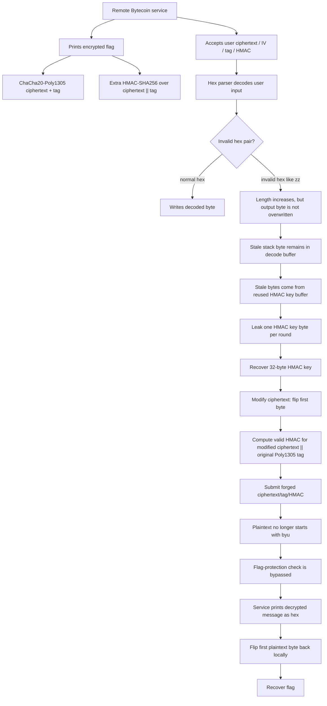

# Bytecoin — BYUCTF 2026 Write-up

## Challenge Description


> Would you like some crypto with your vulns?   
> `chals.cyberjousting.com:1362`

Flag:

```text
byuctf{crypt0_buffer_reuse_b4d}
```

---

## 1. TL;DR

The service repeatedly encrypts the flag using `ChaCha20-Poly1305`, then adds a separate `HMAC-SHA256(ciphertext || poly1305_tag)` check. The cryptography itself is not the only issue: the real vulnerability is a buffer-reuse bug in the hex parser.

When the user submits an invalid hex pair such as `zz`, the parser increases the decoded length but does not overwrite the output byte. Because the stack buffer previously contained the 32-byte HMAC key, this leaks one HMAC key byte per round.

After leaking all 32 HMAC key bytes, we forge a valid HMAC for a modified ciphertext. We flip the first byte of the encrypted flag so that the decrypted plaintext no longer starts with `byu`, bypassing the service's flag-protection check. The service then prints the decrypted plaintext as hex. Locally flipping the first byte back recovers the real flag.

---

## 2. What Data / Files We Have and What Is Special

The challenge provides a remote service:

```bash
nc chals.cyberjousting.com 1362
```

The local challenge package contains:

| File | Purpose |
|---|---|
| `challenge` | The compiled service binary |
| `Dockerfile` | Shows the runtime environment |
| `docker-compose.yml` | Local deployment helper |

From the service interaction, each round prints three important values:

```text
[+] Encrypted data: <ciphertext>
[+] Poly1305 authentication tag: <tag>
[+] HMAC tag: <hmac>
```

Then it asks us to submit:

```text
>>> Enter a ciphertext to decrypt:
>>> Enter an IV for the message:
>>> Enter a Poly1305 authentication tag for the message:
>>> Enter an HMAC tag for the message:
```

The important observation is that the same encrypted flag appears repeatedly. In the successful run, every round showed the same 32-byte ciphertext, same Poly1305 tag, and same HMAC tag:

```text
ct  = 506eb3bb111084411c5c83f1c26e232ab1f3c5f667e39cc3d7a81e6eb9a6e4a0
tag = ccfb400dd50208ee51d7d446a873a31f
hmac= cd097f2d3f524fa4d8e301b3aca0a7a67fb399b24a876ac6c6add88c2f0dc0ca
```

The service gives enough rounds to leak the entire HMAC key one byte at a time, then use the last round to submit a forged request.

---

## 3. Problem Analysis in Detail

### Concept Map



### Why the HMAC Key Leak Works

The bug is a classic stale-buffer leak. A safe hex parser should only count bytes that were actually decoded. Here, when an invalid hex pair is encountered, the parser still increases the returned length, but the destination byte at that position is left unchanged.

To leak byte `i`, we submit:

```text
00 repeated i times, then zz
```

For example:

| Target byte | Submitted ciphertext hex |
|---:|---|
| `0` | `zz` |
| `1` | `00zz` |
| `2` | `0000zz` |
| `31` | `00...00zz` |

The first `i` bytes are overwritten with null bytes. At byte `i`, `zz` is invalid, so the parser does not overwrite that position. The service later echoes the decoded buffer, and byte `i` reveals stale stack data.

Because the HMAC key was previously copied into the same stack area, this leaks the HMAC key byte by byte.

In the successful run, the leaked HMAC key was:

```text
384de176cea76b40c821fce41ca9a61612aa9f3aaac39acbb8c3e953b1312125
```

### Why We Need the HMAC Key

The service checks:

```text
HMAC-SHA256(hmac_key, ciphertext || poly1305_tag)
```

This prevents arbitrary ciphertext modification unless we know `hmac_key`.

After leaking the HMAC key, we can choose a modified ciphertext and compute a correct HMAC for it.

### Why Flipping One Ciphertext Byte Is Enough

ChaCha20 is a stream cipher internally. Encryption is effectively:

```text
ciphertext = plaintext XOR keystream
```

If we flip one ciphertext bit, the same plaintext bit flips after decryption.

The original flag starts with:

```text
byuctf{
```

The service appears to block direct flag decryption by checking whether the plaintext starts with `byu`. We bypass this by flipping the first ciphertext byte:

```python
forged_ct[0] ^= 1
```

>This changes the first plaintext byte from b to c

The decrypted text becomes:

```text
cyuctf{...}
```

That no longer starts with `byu`, so the service prints it. After receiving the printed plaintext, we flip the first byte back locally to recover:

```text
byuctf{...}
```

### Why the Poly1305 Tag Does Not Stop Us

Normally, `ChaCha20-Poly1305` should reject a modified ciphertext if the tag does not match. However, the challenge service mishandles the decryption result. It still prints the decrypted buffer even when authentication should fail.

That means we only need to pass the separate HMAC check. The original Poly1305 tag can be reused, while the HMAC is recomputed over:

```text
modified_ciphertext || original_poly1305_tag
```

---

## 4. Exploitation Walkthrough / Flag Recovery

### Step 1 — Connect to the Service

```python
from pwn import *

io = remote("chals.cyberjousting.com", 1362)
```

Each round, parse:

```text
Encrypted data
Poly1305 authentication tag
HMAC tag
```

A parser detail matters here. Do not regex-search the whole line for hex, because labels such as `Encrypted` contain hex-looking substrings like `ed`. Parse only the data after the exact marker.

### Step 2 — Leak the HMAC Key

For byte index `i`, send a ciphertext field like:

```python
bad_ct_hex = ("00" * i + "zz").encode()
```

Then submit dummy values for the other fields:

```python
io.sendlineafter(b">>> Enter a ciphertext to decrypt:", bad_ct_hex)
io.sendlineafter(b">>> Enter an IV for the message:", b"303132333435363738396162")
io.sendlineafter(b">>> Enter a Poly1305 authentication tag for the message:", b"00" * 16)
io.sendlineafter(b">>> Enter an HMAC tag for the message:", b"00" * 32)
```

The service echoes:

```text
[+] Decrypting message <decoded-buffer-as-hex>
```

The leaked byte is:

```python
leaked_byte = leak[i]
```

Repeat for all 32 bytes.

The final leaked key from the solve run:

```text
384de176cea76b40c821fce41ca9a61612aa9f3aaac39acbb8c3e953b1312125
```

### Step 3 — Forge the Final Request

Use the current round's original ciphertext and Poly1305 tag:

```python
ct  = bytes.fromhex("506eb3bb111084411c5c83f1c26e232ab1f3c5f667e39cc3d7a81e6eb9a6e4a0")
tag = bytes.fromhex("ccfb400dd50208ee51d7d446a873a31f")
key = bytes.fromhex("384de176cea76b40c821fce41ca9a61612aa9f3aaac39acbb8c3e953b1312125")
```

Flip the first byte:

```python
forged_ct = bytearray(ct)
forged_ct[0] ^= 1
forged_ct = bytes(forged_ct)
```

Compute a valid HMAC:

```python
import hmac
import hashlib

forged_hmac = hmac.new(key, forged_ct + tag, hashlib.sha256).digest()
```

In the successful run:

```text
forged_ct   = 516eb3bb111084411c5c83f1c26e232ab1f3c5f667e39cc3d7a81e6eb9a6e4a0
forged_hmac = 8f855c2aa114552b12d2f903003d9edf3cd46527d967b1db237ef24156cdb210
```

### Step 4 — Submit the Forged Values

Submit:

```text
ciphertext = 516eb3bb111084411c5c83f1c26e232ab1f3c5f667e39cc3d7a81e6eb9a6e4a0
IV         = 303132333435363738396162
tag        = ccfb400dd50208ee51d7d446a873a31f
HMAC       = 8f855c2aa114552b12d2f903003d9edf3cd46527d967b1db237ef24156cdb210
```

The service prints the decrypted message as hex:

```text
6379756374667b6372797074305f6275666665725f72657573655f6234647d00
```

Decode it:

```python
pt = bytes.fromhex("6379756374667b6372797074305f6275666665725f72657573655f6234647d00")
```

This gives:

```text
cyuctf{crypt0_buffer_reuse_b4d}
```

Flip the first byte back:

```python
fixed = bytes([pt[0] ^ 1]) + pt[1:]
```

Final flag:

```text
byuctf{crypt0_buffer_reuse_b4d}
```

---

## 5. What We Learned

This challenge is a good example of why “using strong crypto” does not automatically make a protocol secure.

`ChaCha20-Poly1305` and `HMAC-SHA256` are strong primitives, but the implementation had multiple dangerous mistakes:

| Mistake | Impact |
|---|---|
| Reused stack buffer for sensitive data and user-decoded data | HMAC key could be leaked |
| Hex parser counted bytes that were not actually written | Invalid hex caused stale-byte disclosure |
| Separate HMAC wrapped around AEAD data | Created an additional secret that became an attack target |
| Decryption result was mishandled | Modified ciphertext could still produce printable plaintext |
| Prefix check was used as a security boundary | One ciphertext bit flip bypassed it |

The main lesson is that memory-safety bugs can completely destroy cryptographic guarantees. Even when the crypto primitive is correct, surrounding parser logic, buffer lifetime, error handling, and authentication checks are equally important.
