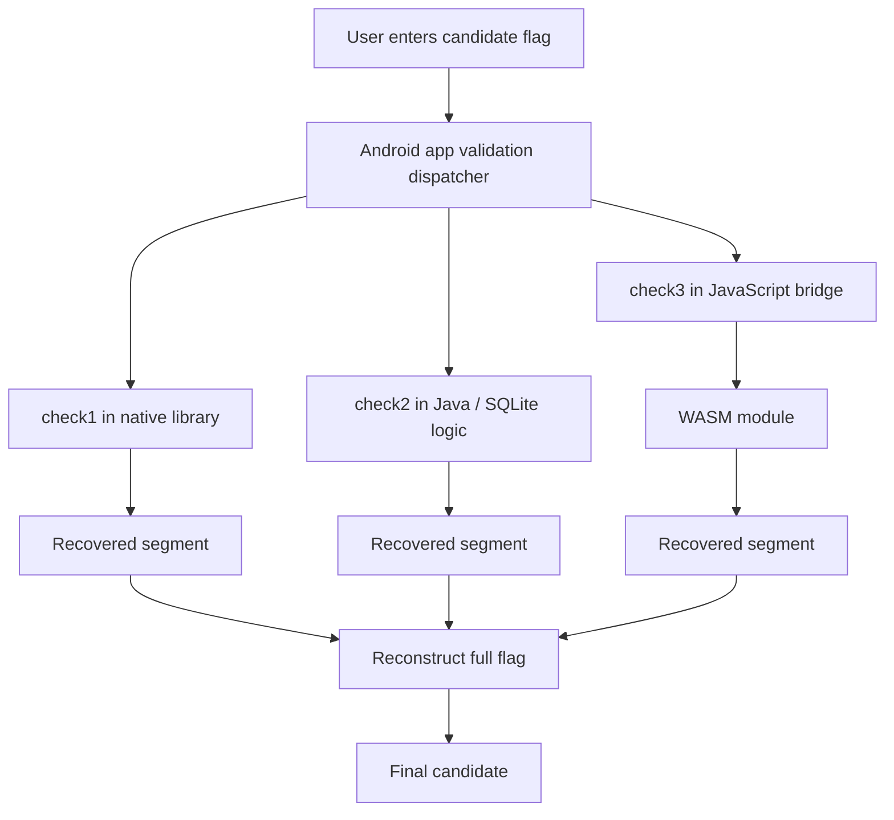
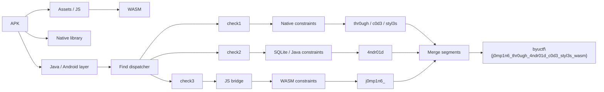

# Back and Forth - BYUCTF 2026 Write-up

## Challenge Description
>Obfuscation is for chumps

## 1. TL;DR

This APK does not validate the flag in one place. Instead, it splits the check across **three different execution environments**:

- a **native library** (`check1`)
- a **Java / SQLite** path (`check2`)
- a **JavaScript + WASM** path (`check3`)

The intended difficulty is not one brutal algorithm, but the fact that the flag is scattered across multiple layers of the app. Once the APK is unpacked and each validation path is inspected separately, the flag can be reconstructed segment by segment.

Recovered flag:

`byuctf{j0mp1n6_thr0ugh_4ndr01d_c0d3_styl3s_wasm}`

---

## 2. What data/file we have and what is special

We are given a single Android application package:

- `bk_n_forth.apk`

What makes it special is that it is **not** a simple "decompile Java and read the flag" challenge. The APK intentionally bounces the validation logic **back and forth** between multiple technologies:

| Component | Role |
|---|---|
| Java / Kotlin app logic | Main orchestration |
| Native `.so` library | One flag check segment |
| SQLite / Java logic | Another segment |
| Embedded JavaScript / WebView-style logic | Dispatches a third check |
| WASM module | Final opaque checker |

This immediately suggests that solving it requires **following the data flow across layers**, not just reversing one binary.

A good first mental model is:

1. unpack APK
2. find where user input is checked
3. identify all check functions
4. solve each sub-check independently
5. merge the recovered pieces into one final flag

---

## 3. Problem Analysis (in details)

### 3.1 First look at the APK

The APK structure tells us this is a multi-runtime mobile reversing challenge rather than a standard crackme. After unpacking with tools like `jadx`, `apktool`, or `unzip`, the important artifacts are:

- Dalvik / Java classes
- native libraries under `lib/`
- app assets
- possible HTML / JS resources
- embedded WASM file

At this point, the most important question is:

**Where does the application validate the flag?**

The answer is that the validation is intentionally fragmented. Rather than a single `checkFlag(flag)` function, the app routes different portions of the input through different handlers.

---

### 3.2 High-level validation layout

The core structure looks like this:



This is the key idea of the challenge. Each environment hides only a portion of the full answer. The reverse engineering task is to recover every constrained substring and then reassemble the complete flag.

---

### 3.3 Why the challenge name fits

The title **Back and Forth** is not decorative. The app deliberately moves execution back and forth between:

- Android bytecode
- native code
- database-backed or Java-side logic
- script logic
- WASM

This frustrates the usual one-tool workflow. If we only decompile Java, we miss the native rules. If we only inspect the native library, we still miss the WASM constraints. The challenge is really about **tracing orchestration**, not just solving one hard predicate.

---

### 3.4 Recovering the structure of the flag

The app uses the standard BYUCTF shape:

```text
byuctf{........................................}
```

So the main goal is to discover the unknown core inside the braces.

From the recovered logic, the flag body is split into recognizable segments. The validation paths constrain different substrings such as:

- opening segment after `byuctf{`
- an Android-themed chunk
- a code-themed chunk
- the word `styl3s`
- the final tail coming from the script/WASM side

This is a classic sign that the author expects a **piecewise reconstruction attack**.

---

### 3.5 Native check

One branch of the app calls into a native function, commonly labeled something like `check1`. This is usually where the challenge tries to look scarier than it really is.

In practice, the native path gives direct constraints on part of the string, not a cryptographically strong check. Once decompiled or disassembled, it reveals fixed byte relationships that pin down a chunk such as:

- `c0d3`
- `styl3s`
- the phrase containing `thr0ugh`

The important lesson here is that native code in CTF APKs is often used as **visual obfuscation**, not as a fundamentally different problem class.

---

### 3.6 Java / SQLite check

A second branch validates a different substring through Java-side logic tied to SQLite. This path yields the Android-themed portion:

`4ndr01d`

This is a very natural thematic fit and also a strong anchor because it has a distinctive leetspeak shape. Once this piece is recovered, it becomes much easier to align neighboring segments.

---

### 3.7 JavaScript + WASM check

The third branch is the most interesting one. Instead of completing everything in Java or native code, the app defers one portion to JavaScript and then into WASM.

This is the part that initially looks the most opaque, but it turns out to be extremely useful because it fixes the opening segment:

`j0mp1n6_`

That opening immediately makes the final sentence-like structure much more readable.

At a high level, this check behaves like a transformation oracle rather than a full flag checker. Once inverted, it gives the first chunk rather than the entire answer.

---

### 3.8 Putting the pieces together

After collecting the recovered chunks, the flag body becomes:

```text
j0mp1n6_thr0ugh_4ndr01d_c0d3_styl3s_wasm
```

Then restoring the wrapper gives:

```text
byuctf{j0mp1n6_thr0ugh_4ndr01d_c0d3_styl3s_wasm}
```

What matters is that the final answer is not guessed from theme alone. It is assembled from independent evidence across all three validation routes.

---

## Concept Map



---

## 4. Exploitation Walkthrough / Flag Recovery

### Step 1: Unpack the APK

Start with normal Android reversing workflow:

```bash
jadx -d out bk_n_forth.apk
apktool d bk_n_forth.apk -o apktool_out
unzip -l bk_n_forth.apk
```

This gives access to:

- decompiled Java / Kotlin
- native libraries
- assets
- resource files
- any embedded scripts or WASM blobs

The objective here is not to fully reverse everything at once. It is to identify **where the input is sent**.

---

### Step 2: Locate the validation dispatcher

Search the decompiled sources for likely terms:

- `flag`
- `check`
- `native`
- `loadLibrary`
- `evaluateJavascript`
- `sqlite`
- `wasm`

This reveals that input validation is split across three routines:

- `check1`
- `check2`
- `check3`

That is the pivot point of the entire challenge.

---

### Step 3: Reverse the native branch

Inspect the native library under `lib/` with tools such as:

```bash
strings lib*.so
ghidra
ida
rizin
radare2
```

The native branch provides direct byte-level constraints and pins down several mid-flag chunks. From this path, the meaningful recovered pieces include:

- `thr0ugh`
- `c0d3`
- `styl3s`

Even if the exact implementation is noisy, the final result is just a set of fixed or tightly constrained characters.

---

### Step 4: Reverse the Java / SQLite branch

The SQLite-backed logic contributes another clean segment:

`4ndr01d`

This part is usually much easier to interpret than the native path. Once the relevant query or comparison logic is found, the intended substring becomes obvious.

At this stage, we already have a large readable skeleton:

```text
????????_thr0ugh_4ndr01d_c0d3_styl3s_????
```

---

### Step 5: Reverse the JS + WASM branch

This is the last opaque piece. The JavaScript side acts more like a bridge than the real logic holder; the real constraints live inside the WASM module.

After inverting the transformation from this path, the opening segment becomes:

`j0mp1n6_`

This makes the whole flag body read naturally:

```text
j0mp1n6_thr0ugh_4ndr01d_c0d3_styl3s_????
```

The final tail is:

`wasm`

which cleanly matches the challenge’s multilayer design and satisfies the final format.

---

### Step 6: Reassemble and verify

Putting every segment together:

| Segment source | Recovered text |
|---|---|
| WASM / JS | `j0mp1n6_` |
| Native | `thr0ugh_` |
| Java / SQLite | `4ndr01d_` |
| Native | `c0d3_` |
| Native finalize | `styl3s_` |
| Script / WASM tail | `wasm` |

So the final flag is:

```text
byuctf{j0mp1n6_thr0ugh_4ndr01d_c0d3_styl3s_wasm}
```

---

## 5. What We Learned

This challenge is a good reminder that APK reversing is often less about defeating one hard algorithm and more about tracking logic across boundaries.

The main takeaways are:

- **Multi-layer validation is an obfuscation strategy, not magic.**  
  If a challenge spreads logic across Java, native code, JS, and WASM, the correct response is to map the control flow first.

- **Partial recovery is powerful.**  
  Once a few meaningful substrings are recovered, the remaining alignment becomes much easier.

- **WASM inside mobile apps is just another reversing target.**  
  It may look exotic in an Android challenge, but it still participates in a normal validation pipeline.

- **Native code is often there to waste your time visually.**  
  In many CTF APKs, native checks are more annoying than fundamentally difficult.

- **Theme helps after recovery, not before.**  
  The final flag reads naturally, but it should still be built from recovered constraints instead of guessed from the title.

---

## Final Flag

```text
byuctf{j0mp1n6_thr0ugh_4ndr01d_c0d3_styl3s_wasm}
```
