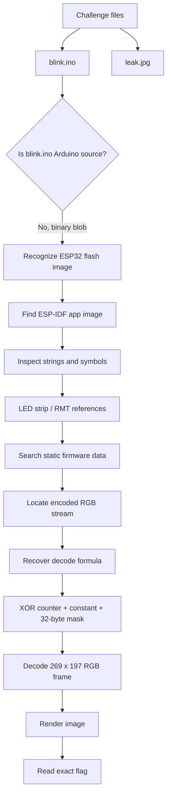
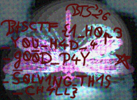

# LED - Break The Syntax CTF 2026 Writeup

> **Description:** *I recently started learning how to make an LED blink. Can you read the flag after a few changes in code?*  
> **Flag format:** `BtSCTF{...}`

---

## TL;DR

The challenge gave us a file named `blink.ino`, but it was not Arduino source code. It was a 4 MB ESP32-S3 flash image. The firmware was built for an LED-strip style output device and contained an encoded RGB pixel stream.

After extracting the ESP-IDF application image and locating the static data segment, we found a `269 x 197` RGB frame. The frame bytes were XOR-masked with a simple position-dependent stream:

```text
plain[i] = enc[i] ^ ((i >> 5) & 0xff) ^ 0x5a ^ mask[i % 32]
```

Rendering the decoded bytes as an RGB image revealed the flag:

```text
BtSCTF{1_H0p3_Y0U_H4D_4_g00D_D4Y_S0LV1NG_TH1S_CH4LL}
```

---

## What data/files we have and what is special

The challenge archive contained two files:

```text
blink.zip
├── blink.ino
└── leak.jpg
```

The important point is that `blink.ino` is misleading. In a normal Arduino project, `.ino` is source code, but this file is binary firmware.

Basic inspection:

```bash
$ unzip blink.zip
$ file blink.ino leak.jpg
blink.ino: DOS executable (COM), start instruction 0xe903021f 08893c40
leak.jpg:  JPEG image data, baseline, precision 8, 2464x3280, components 3
```

The `file` output is not perfectly descriptive, but it already tells us the file is not text source code. A real `.ino` sketch should look like C/C++ source, not a binary blob.

Checking the archive sizes also helps:

```text
blink.ino    4194304 bytes
leak.jpg      930401 bytes
```

A 4 MB `.ino` file is very suspicious. That size is much more consistent with a microcontroller flash dump than with a source file.

There was no remote server interaction for this challenge. The solve was fully offline. The "player interaction" was just local analysis:

```bash
$ strings -a blink.ino | grep -i led
led_strip_new_rmt_device(&strip_cfg, &rmt_cfg, &strip)
led_strip
led_strip_rmt
index out of maximum number of LEDs
led doesn't have 4 components
transmit pixels by RMT failed
```

These strings are a major hint. The firmware is not merely blinking one GPIO pin. It uses ESP-IDF LED strip/RMT functionality, which strongly suggests an RGB LED strip or LED matrix.

---

## Concept Map



---

## Problem Analysis (In Details)

### 1. The filename is the first trap

The file is named:

```text
blink.ino
```

That name makes us expect Arduino source code like:

```cpp
void setup() {
    pinMode(LED_BUILTIN, OUTPUT);
}

void loop() {
    digitalWrite(LED_BUILTIN, HIGH);
    delay(1000);
    digitalWrite(LED_BUILTIN, LOW);
    delay(1000);
}
```

But opening the file shows binary data. Therefore the `.ino` extension is fake/misleading.

This changes the challenge type from simple source-code inspection to firmware analysis.

---

### 2. Identifying the firmware as ESP32-S3

Inside the flash image, there is an ESP-IDF application image. The extracted app metadata identifies it as an ESP32-S3 application:

```text
ESP-IDF application image for ESP32-S3
project name: ctf_chall
version: 1
entry address: 0x4037564C
```

The useful application image starts at flash offset:

```text
0x10000
```

The DROM segment, which stores read-only data, maps like this:

```text
DROM flash offset: 0x10020
DROM virtual addr: 0x3c020020
```

That means a static object at virtual address `VA` can be converted to a file offset with:

```text
file_offset = 0x10020 + (VA - 0x3c020020)
```

---

### 3. The LED-strip clue

Running `strings` gives LED-specific ESP-IDF symbols:

```text
led_strip_new_rmt_device(&strip_cfg, &rmt_cfg, &strip)
led_strip
led_strip_rmt
transmit pixels by RMT failed
```

This is important because ESP32 LED strips usually transmit raw RGB/GRB pixel buffers through the RMT peripheral.

The hidden data is likely not ASCII. It is likely a visual payload that the firmware sends to LEDs.

The challenge description says:

> Can you read the flag after a few changes in code?

That means the intended output is visual: change the firmware, decode the firmware data, or render what the LEDs would show.

---

### 4. Locating the encoded frame

The interesting static stream starts at virtual address:

```text
0x3c029e90
```

Using the DROM mapping:

```text
file_offset = 0x10020 + (0x3c029e90 - 0x3c020020)
            = 0x19e90
```

The pixel count is:

```text
0xcf01 = 52993 pixels
```

Factoring the pixel count gives a useful image size:

```text
52993 = 269 × 197
```

Since each pixel is RGB, the encoded payload length is:

```text
52993 × 3 = 158979 bytes = 0x26d03 bytes
```

So we extract:

```text
blink.ino[0x19e90 : 0x19e90 + 0x26d03]
```

Rendering these bytes directly does not give a clean flag, because the data is encoded.

---

### 5. Recovering the byte decoder

From reversing/observing the firmware’s decode behavior, the byte stream is XOR-decoded by combining:

1. the encrypted byte `enc[i]`
2. a slow counter byte `((i >> 5) & 0xff)`
3. the constant `0x5a`
4. a repeating 32-byte mask

The recovered mask is:

```text
02 9b 62 54 27 04 bf bc
27 9a df ae 8f 6e b6 ea
16 d8 ae 61 84 46 43 22
7f e2 b8 30 17 60 38 06
```

The final decoding formula is:

```python
plain[i] = enc[i] ^ ((i >> 5) & 0xff) ^ 0x5a ^ MASK[i & 31]
```

After decoding, we interpret the output as an RGB image of size `269 x 197`.

---

## Exploitation Walkthrough / Flag Recovery

### Step 1 - Extract the challenge files

```bash
unzip blink.zip
```

We get:

```text
blink.ino
leak.jpg
```

---

### Step 2 - Confirm that `blink.ino` is not source code

```bash
file blink.ino
head blink.ino
```

The file is binary, so reading it as Arduino source is a dead end.

---

### Step 3 - Use firmware clues

```bash
strings -a blink.ino | grep -i led
```

The LED-strip strings show that this firmware is designed to send pixel data to LEDs.

This tells us to search for RGB pixel data instead of plaintext strings.

---

### Step 4 - Decode and render the RGB frame

The final solver:

```python
from pathlib import Path
from PIL import Image

MASK = bytes.fromhex(
    '029b62542704bfbc279adfae8f6eb6ea'
    '16d8ae61844643227fe2b83017603806'
)

DROM_FLASH_OFF = 0x10020
DROM_VA = 0x3C020020
STREAM_VA = 0x3C029E90
WIDTH = 269
HEIGHT = 197
PIXELS = WIDTH * HEIGHT

fw = Path('blink.ino').read_bytes()

stream_off = DROM_FLASH_OFF + (STREAM_VA - DROM_VA)
enc = fw[stream_off : stream_off + PIXELS * 3]

plain = bytearray(len(enc))
for i, b in enumerate(enc):
    plain[i] = b ^ ((i >> 5) & 0xff) ^ 0x5A ^ MASK[i & 31]

img = Image.frombytes('RGB', (WIDTH, HEIGHT), bytes(plain))
img.save('decoded.png')
```

Run it:

```bash
python3 solve_led.py
```

Output:

```text
decoded.png
```

The rendered image shows the flag text.




---

### Step 5 - Read the exact flag

The hard part is transcription. The rendered flag contains several visually ambiguous characters:

| Looks like | Correct character here |
|---|---|
| `O` / `0` | mixed intentionally |
| `I` / `1` | mixed intentionally |
| `p` / `P` | lowercase `p` in `H0p3` |
| punctuation at the end | no `?` in the final accepted flag |

The accepted flag is:

```text
BtSCTF{1_H0p3_Y0U_H4D_4_g00D_D4Y_S0LV1NG_TH1S_CH4LL}
```

---

## Final Flag

```text
BtSCTF{1_H0p3_Y0U_H4D_4_g00D_D4Y_S0LV1NG_TH1S_CH4LL}
```

---

## What We Learned

### 1. File extensions can lie

The file was called `blink.ino`, but it was not Arduino source code. Always verify the real file type with:

```bash
file
xxd
strings
binwalk
```

The filename is only a hint, not evidence.

---

### 2. Challenge descriptions can be true but misleading

The LED clue was real, but the intended path was not “read Arduino code.” The actual path was:

```text
firmware image -> encoded LED buffer -> RGB reconstruction -> flag image
```

---

### 3. Firmware strings are useful anchors

The `led_strip` and `led_strip_rmt` strings told us the output was likely an RGB LED strip/matrix. That moved the solve away from plaintext search and toward framebuffer recovery.

---

### 4. Dimensions can come from byte counts

The decoded stream used:

```text
0xcf01 pixels = 52993 = 269 × 197
```

Factoring suspicious counts is useful when reconstructing images, QR codes, LED matrices, and framebuffers.
