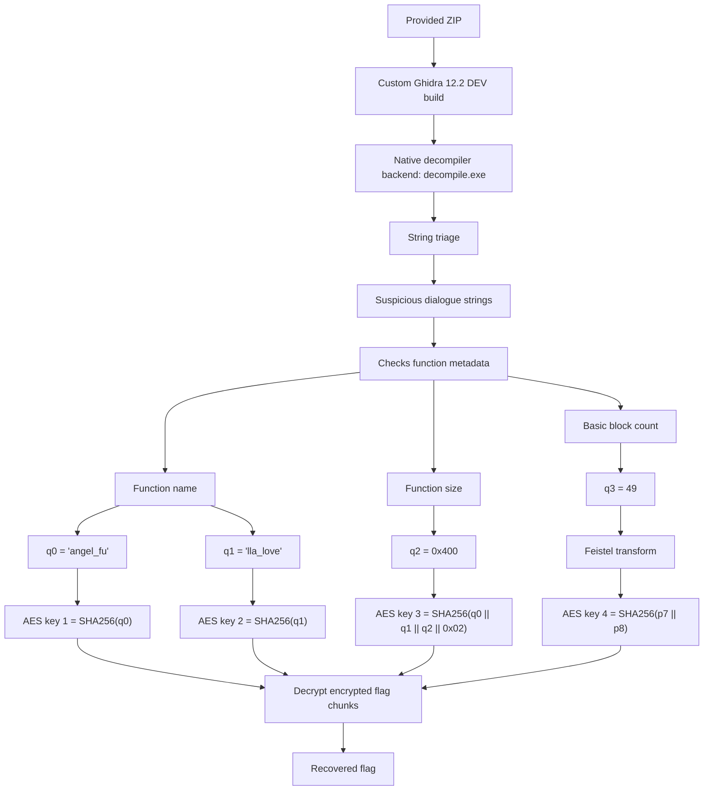

# Ghidra Gangster Edition - GreyCTF 2026 Writeup

## Challenge Description
> at three in the morning, my decompiler started talking to me. drop in a binary, and you'll see...
>
> dist: Google Drive / transfer mirror  
>
> NOTE: This challenge only works on 64-bit Windows. It has been built and tested on Windows 11 25H2 and should work on Windows 10 too.
---

## 1. TL;DR

The distributed file is not a normal challenge binary. It is a custom Ghidra build, and the interesting payload is hidden inside Ghidra's native Windows decompiler executable:

```text
ghidra_12.2_DEV/Ghidra/Features/Decompiler/os/win_x86_64/decompile.exe
```

The modified decompiler checks metadata of the function it is asked to decompile. The required function metadata is:

| Field | Required value |
|---|---:|
| Function name | `angel_fulla_love` |
| Function size | `0x400` bytes |
| Basic block count | `49` |

Internally, those values are used to derive AES keys through SHA-256 and a small Feistel-like transform. Reconstructing the key schedule and decrypting four ciphertext blocks gives the flag directly.

---

## 2. What data/files we have and what is special

After extracting the provided archive, the important structure is:

```text
Ucn7vnxjFJiCamQikKbY.zip
└── Multiple files/
    ├── build_details.txt
    └── ghidra_12.2_DEV.zip
        └── ghidra_12.2_DEV/
            └── Ghidra/Features/Decompiler/os/win_x86_64/decompile.exe
```

`build_details.txt` tells us this is a custom build of Ghidra 12.2 DEV, built on Windows with Visual Studio 2022 and OpenJDK 8. The challenge note also says it only works on 64-bit Windows, which is a strong hint that the interesting behavior is inside the Windows-native component, not in Java UI code.

The file that matters is `decompile.exe`. This is Ghidra's native decompiler backend. In normal Ghidra, the Java frontend sends functions to this process for decompilation. Here, that executable has been modified to perform extra checks and hide the flag.

Useful strings found in `decompile.exe` include:

```text
I don't like this function size (%llu bytes)...
this block count (%llu) tells me nothing...
I want the function name to be nice too...
```

These strings reveal the intended route: make the decompiler inspect a function whose name, size, and block count satisfy the hidden checks. Instead of building such a binary first, we can reverse the checks directly and decrypt the flag offline.

---

## Concept Map



---

## 3. Problem Analysis in Details

### 3.1 Initial triage

The archive is very large because it contains a full Ghidra distribution. That is already suspicious. A normal reverse challenge usually gives a small binary or a packed executable, but this one gives a toolchain.

The challenge text says:

```text
my decompiler started talking to me. drop in a binary, and you'll see...
```

This suggests the decompiler itself is the challenge. Ghidra's actual native decompiler lives at:

```text
Ghidra/Features/Decompiler/os/win_x86_64/decompile.exe
```

Running `strings` against that executable reveals normal Ghidra/decompiler strings plus extra challenge-like text. The most useful strings are the three complaints about function size, block count, and function name.

### 3.2 Locating the hidden logic

Searching around the suspicious strings in the native executable leads to a custom routine added to the decompiler. The routine reads metadata about the current function being decompiled, then derives several 64-bit quantities:

| Internal value | Meaning |
|---|---|
| `q0` | first 8 bytes of the required function name |
| `q1` | second 8 bytes of the required function name |
| `q2` | required function size |
| `q3` | required basic block count |

The first two values decode cleanly as little-endian ASCII:

```python
q0 = int.from_bytes(b"angel_fu", "little")
q1 = int.from_bytes(b"lla_love", "little")
```

Together they form the required function name:

```text
angel_fulla_love
```

The size check resolves to:

```text
0x400 bytes
```

The remaining value is the basic block count. From the recovered key schedule and printable plaintext test, the correct value is:

```text
49
```

### 3.3 Crypto structure

The flag is split into four encrypted 16-byte chunks. Each chunk is decrypted with AES-ECB using a key derived from the recovered metadata.

The first two chunks use the two halves of the function name:

```python
key0 = SHA256(q0_bytes)
key1 = SHA256(q1_bytes)
```

The third chunk binds the name and size together:

```python
key2 = SHA256(q0_bytes + q1_bytes + q2_bytes + b"\x02")
```

The fourth chunk uses the basic block count after a Feistel-like transform:

```python
p7, p8 = feistel3(q3)
key3 = SHA256(p7_bytes + p8_bytes)
```

This is why the function metadata matters. The decompiler is effectively asking for a binary containing a function with exactly the right name, size, and control-flow graph shape. Once those values are known, generating the real binary is unnecessary; the encrypted chunks can be decrypted directly.

### 3.4 Why `q3 = 49`

The name and size are strongly constrained by direct checks. The block count is less direct: it is fed through the fourth Feistel schedule and then into AES key derivation.

A practical way to recover it is to brute-force plausible block counts and check which one decrypts the final chunk to printable flag text. Basic block counts for a hand-crafted challenge function are small, so searching values such as `0..4096` is trivial. The only valid value is:

```text
49
```

---

## 4. Exploitation Walkthrough / Flag Recovery

### 4.1 Extract the native decompiler

```bash
unzip Ucn7vnxjFJiCamQikKbY.zip
cd "Multiple files"
unzip ghidra_12.2_DEV.zip
```

Target file:

```text
ghidra_12.2_DEV/Ghidra/Features/Decompiler/os/win_x86_64/decompile.exe
```

Quick triage:

```bash
strings -a ghidra_12.2_DEV/Ghidra/Features/Decompiler/os/win_x86_64/decompile.exe | grep -iE 'function size|block count|function name|grey|decompiler'
```

The suspicious strings point us to the custom metadata-checking path.

### 4.2 Offline flag solver

The final solver reconstructs the required values and decrypts the flag chunks.

```python
#!/usr/bin/env python3
from hashlib import sha256

try:
    from Crypto.Cipher import AES
    def aes_dec(key, block):
        return AES.new(key, AES.MODE_ECB).decrypt(block)
except Exception:
    from cryptography.hazmat.primitives.ciphers import Cipher, algorithms, modes
    def aes_dec(key, block):
        dec = Cipher(algorithms.AES(key), modes.ECB()).decryptor()
        return dec.update(block) + dec.finalize()

MASK = (1 << 64) - 1

def rol(x, n):
    n &= 63
    return (((x << n) | (x >> (64 - n))) & MASK) if n else (x & MASK)

# Recovered metadata requirements.
q0 = int.from_bytes(b"angel_fu", "little")
q1 = int.from_bytes(b"lla_love", "little")
q2 = 0x400
q3 = 49

# Fourth protected schedule, used for the block-count-dependent key.
shifts3 = [1, 8, 16, 26, 54, 61, 63, 53, 54, 32, 55, 53, 22, 15, 53, 2]
consts3 = [
    2671190606, 1809168036, 2154809582, 3997157552,
    435317346, 4210934046, 76081144, 3481770029,
    2507916406, 625174193, 1777852824, 4185976578,
    2552576414, 1344554555, 2569730286, 3699020294,
]

def feistel3(x):
    r0 = x & MASK
    r1 = rol(r0, 32)
    for s, c in zip(shifts3, consts3):
        t = (rol(r1, s) + c) & MASK
        r0 ^= t
        r0, r1 = r1, r0
    return r0, r1

cts = [
    bytes.fromhex("abb3227449dd9caab141fce63f0ecfc4"),
    bytes.fromhex("d4d1e0f68534097f3e786144afbe21bc"),
    bytes.fromhex("3c0a1e0d612b0f84a38ca4a2c629d0f4"),
    bytes.fromhex("a7264da2cb1cba0ab2aee61bf90d4bb8"),
]

q0b = q0.to_bytes(8, "little")
q1b = q1.to_bytes(8, "little")
q2b = q2.to_bytes(8, "little")
p7, p8 = feistel3(q3)

keys = [
    sha256(q0b).digest(),
    sha256(q1b).digest(),
    sha256(q0b + q1b + q2b + b"\x02").digest(),
    sha256(p7.to_bytes(8, "little") + p8.to_bytes(8, "little")).digest(),
]

chunks = [aes_dec(k, c) for k, c in zip(keys, cts)]
flag = b"".join(chunks).decode()

print("function name:", (q0b + q1b).decode())
print("function size:", hex(q2), q2)
print("block count:", q3)
print("flag:", flag)
```

Run it:

```bash
python3 solve.py
```

Expected output:

```text
function name: angel_fulla_love
function size: 0x400 1024
block count: 49
flag: grey{a80u7_7im3_w3_add3d_SROP_in70_0ur_d3c0mpi13r5...cute...:3c}
```

### 4.3 Result

Submit:

```text
grey{a80u7_7im3_w3_add3d_SROP_in70_0ur_d3c0mpi13r5...cute...:3c}
```

---

## 5. What We Learned

This challenge is a good reminder that the artifact itself may be the target. The prompt talks about a decompiler and the distribution is a full Ghidra build, so the correct first move is to inspect the toolchain rather than search for a missing user binary.

The key reverse-engineering trick was to follow suspicious strings. The added messages about function name, function size, and block count reveal the custom logic quickly. From there, the challenge becomes a metadata-recovery and decryption problem.

The intended dynamic path is likely to create a binary containing a function named `angel_fulla_love`, with size `0x400`, and exactly `49` basic blocks, then feed it to the modified Ghidra decompiler. The faster CTF path is to reverse the checks, recover those values, and decrypt the embedded ciphertext offline.

The crypto is not the hard part: AES-ECB and SHA-256 are used as final gates. The real protection is the linkage between Ghidra function metadata and key derivation. Once the metadata is known, the flag recovery is deterministic.
