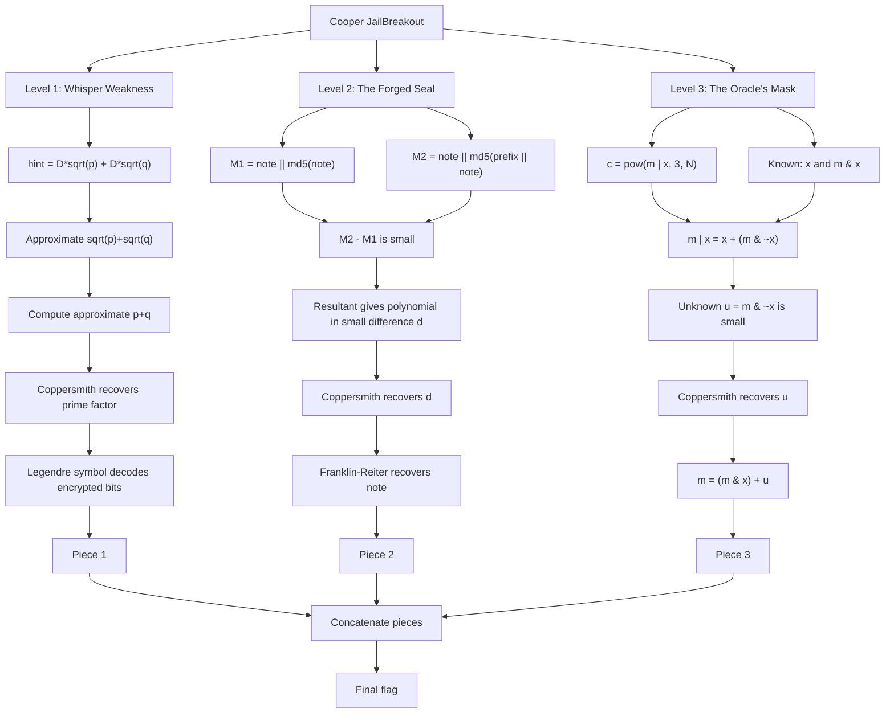

# Cooper JailBreakout - Hackअस्त्र Write-up

## Challenge Description

> A locked cryptographic cell was built to hold tight, but one small weakness may be enough to escape.

The challenge gives three RSA-style levels. Each level hides one piece of the final flag. The final answer is obtained by recovering the three notes and concatenating the text after `>>>`.

## 1. TL;DR

This challenge is a three-part RSA jailbreak. Each part leaks the plaintext through a different structural weakness.

| Level | Weakness | Main idea | Recovered piece |
|---|---|---|---|
| Level 1 | Leaked approximation of `sqrt(p) + sqrt(q)` and quadratic-residuosity bit encryption | Approximate `p + q`, recover a prime factor with Coppersmith, then decode bits with the Legendre symbol | `FLAG{R34DY_T0_3SC4P3_WH3N` |
| Level 2 | RSA with `e = 3` and two highly related messages | Recover the small difference between two padded messages, then use Franklin-Reiter | `_TH3_D00R_0P3N5_WH1L3_C0PP3R5M17H_3NT3R` |
| Level 3 | RSA with `e = 3`, plaintext is <code>m &#124; x</code>, while <code>(m & x)</code> and <code>x</code> are leaked | Rewrite <code>m &#124; x</code> as <code>x + u</code>, where <code>u = m & ~x</code> is small, then use Coppersmith | `_7H3_C4G3_xD}` |

Final flag:

```text
FLAG{R34DY_T0_3SC4P3_WH3N_TH3_D00R_0P3N5_WH1L3_C0PP3R5M17H_3NT3R_7H3_C4G3_xD}
```

## 2. What Data/Files We Have and What Is Special

The attachment contains these important files:

| File | Purpose |
|---|---|
| `chall.py` | Challenge source code. It reveals how each level encrypts its note. |
| `output_level1.txt` | Public output for Level 1: `hint`, `D`, `n`, and encrypted bit list. |
| `output_level2.txt` | Public output for Level 2: RSA modulus, exponent `e = 3`, and two ciphertexts. |
| `output_level3.txt` | Public output for Level 3: RSA modulus, exponent `e = 3`, ciphertext, `(m & x)`, and `x`. |

The challenge is unusual because each level is not simply “break RSA.” The modulus sizes are large enough that plain factorization is impossible, but the source code leaks extra algebraic structure.

### Concept Map



## 3. Problem Analysis in Detail

### Level 1: Leaking `sqrt(p) + sqrt(q)`

The source code generates two 1337-bit primes and computes:

```python
D_value = 63 ** 14
hint_value = int(D_value * sqrt(prime1) + D_value * sqrt(prime2))
```

After dividing by `D`, the hint gives a high-precision approximation of:

```text
sqrt(p) + sqrt(q)
```

Squaring gives:

```text
(sqrt(p) + sqrt(q))^2 = p + q + 2sqrt(pq)
```

Since `n = pq` is public, we know `sqrt(n) = sqrt(pq)`. Therefore:

```text
p + q ≈ (hint / D)^2 - 2sqrt(n)
```

Once we have an approximate value for `S = p + q`, we can approximate the two roots of:

```text
X^2 - S X + n = 0
```

This gives an approximation of `p` or `q`. The approximation is close enough that the unknown error can be recovered using univariate Coppersmith on:

```text
P0 + x ≡ 0 mod p
```

After recovering a factor, the encryption is decoded using quadratic residuosity. The challenge encrypts each message bit as:

```python
encrypted_piece = x ** (1337 + bit) * rand_val ** 2674 mod n
```

Here `x` is chosen to be a quadratic non-residue modulo both primes. The random part is always a square, so it does not change the Legendre symbol. Therefore:

| Plain bit | Legendre symbol modulo `p` |
|---|---|
| `0` | `-1` |
| `1` | `1` |

This recovers the first note:

```text
[Chapter 1] - Whisper Weakness >>> FLAG{R34DY_T0_3SC4P3_WH3N
```

### Level 2: Related Messages with Small Exponent RSA

The second level uses RSA with `e = 3`:

```python
M1 = note + md5(note).digest()
M2 = note + md5(b'One more time!' + note).digest()
C1 = M1^3 mod n
C2 = M2^3 mod n
```

The key observation is that `M1` and `M2` share the same note prefix. Only the final 16-byte MD5 digest changes, so:

```text
M2 = M1 + d
```

where `d` is small, about 128 bits.

We have:

```text
M1^3 ≡ C1 mod n
(M1 + d)^3 ≡ C2 mod n
```

Eliminating `M1` produces a polynomial only in `d`. Coppersmith finds the small root:

```text
d = 17224190586111786304335194046515521186
```

After `d` is known, Franklin-Reiter related-message recovery gives `M1`. Because Sage does not always support polynomial `gcd()` over a composite modulus, we used a closed-form derivation instead.

Expanding:

```text
(M1 + d)^3 - M1^3 ≡ C2 - C1 mod n
```

gives:

```text
3d M1^2 + 3d^2 M1 + d^3 + C1 - C2 ≡ 0 mod n
```

Let:

```text
A = 3d
B = 3d^2
C = d^3 + C1 - C2
```

Together with `M1^3 = C1`, this yields:

```text
M1 = (A^2 C1 - B C) / (B^2 - A C) mod n
```

Then we strip the last 16 bytes and verify them as `md5(note)`.

Recovered second note:

```text
[Chapter 2] - The Forged Seal >>> _TH3_D00R_0P3N5_WH1L3_C0PP3R5M17H_3NT3R
```

### Level 3: Bitmask Leak and Small Root

The third level encrypts:

```python
c = pow(m | x, 3, N)
```

The output also leaks:

```python
(m & x)
x
```

The key bit identity is:

```text
m = (m & x) + (m & ~x)
```

and:

```text
m | x = x + (m & ~x)
```

Let:

```text
u = m & ~x
```

Then the ciphertext equation becomes:

```text
(x + u)^3 ≡ c mod N
```

The unknown `u` is much smaller than the RSA modulus because the note is short compared with the 2048-bit modulus. This is a textbook small-root setup:

```text
f(u) = (x + u)^3 - c ≡ 0 mod N
```

Using Coppersmith recovers `u`, and then:

```text
m = (m & x) + u
```

Recovered third note:

```text
[Chapter 3] - The Oracle’s Mask >>> _7H3_C4G3_xD}
```

## 4. Exploitation Walkthrough / Flag Recovery

The final solver was run from the folder containing the challenge files:

```bash
sage solve.sage
```

Important output:

```text
======================================================================
[*] Level 1
[*] estimating p + q from hint
[*] trying approximate prime candidate 0, bits=1337
[+] factored Level 1
[+] p bits = 1337
[+] q bits = 1337
[+] Level 1 note:
b'[Chapter 1] - Whisper Weakness >>> FLAG{R34DY_T0_3SC4P3_WH3N'
======================================================================
[*] Level 2
[*] trying Level 2 sign +1
[*] roots: [17224190586111786304335194046515521186]
[+] Level 2 note:
b'[Chapter 2] - The Forged Seal >>> _TH3_D00R_0P3N5_WH1L3_C0PP3R5M17H_3NT3R'
======================================================================
[*] Level 3
[*] Level 3 trying X=2^448
[*] roots: [23887077200429059964330320574781848154026661277400930300701316244942086714661571146606424023383391653233328739030659514488]
[+] Level 3 note:
b'[Chapter 3] - The Oracle\xe2\x80\x99s Mask >>> _7H3_C4G3_xD}'
```

The extracted pieces are:

```text
FLAG{R34DY_T0_3SC4P3_WH3N
_TH3_D00R_0P3N5_WH1L3_C0PP3R5M17H_3NT3R
_7H3_C4G3_xD}
```

Concatenating them gives:

```text
FLAG{R34DY_T0_3SC4P3_WH3N_TH3_D00R_0P3N5_WH1L3_C0PP3R5M17H_3NT3R_7H3_C4G3_xD}
```

## 5. What We Learned

This challenge is a good example of RSA breaking not because the modulus is directly factorable, but because the surrounding message construction leaks algebraic structure.

For Level 1, approximate information about `sqrt(p) + sqrt(q)` is dangerous because it can be converted into an approximation of `p + q`. Once one prime is known approximately, Coppersmith can recover the exact factor. Also, encrypting bits through quadratic residuosity is only safe if the factorization remains hidden.

For Level 2, low exponent RSA becomes fragile when two plaintexts are related. Even though the MD5 digests look random, the difference between the two messages is only around 128 bits, small enough for Coppersmith. After the difference is recovered, Franklin-Reiter recovers the plaintext.

For Level 3, bitwise leaks can become algebraic leaks. Knowing both `x` and `m & x` lets us rewrite `m | x` as `x + u`, where `u` is small. That directly turns the ciphertext into a small-root RSA problem.

The overall lesson is that RSA security depends not only on key size, but also on padding, message independence, and avoiding partial structural leakage.
