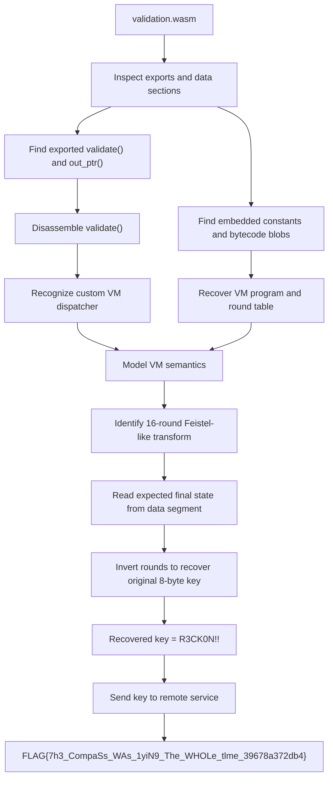

# DEAD RECKONING - Hackअस्त्र Write-up

## Challenge Description:
>The navigation module survived the incident but its firmware update routine is locked behind a keyed validation sequence.   
>`challenges.ctf.hackastra.tech:31130` 

## 1. TL;DR

This challenge provides a small WebAssembly binary, `validation.wasm`, and a remote service that asks for an unlock key.

The core idea is:

- The exported `validate` function checks an 8-byte input.
- The WASM does not validate the input directly.
- Instead, it runs a tiny custom VM whose bytecode is stored in a data segment.
- That VM transforms the input through 16 rounds of a Feistel-like construction.
- The final 64-bit state is compared against two embedded 32-bit constants.

Because the round structure is reversible, we can invert the transformation from the embedded target values and recover the original 8-byte key directly.

Recovered key:

```text
R3CK0N!!
```

Submitting that key to the remote service returns:

```text
FLAG{7h3_CompaSs_WAs_1yiN9_The_WHOLe_tlme_39678a372db4}
```

---

## Concept Map



---

## 2. What Data/File We Have and What Is Special

We are given a single file:

```text
validation.wasm
```

At first glance it looks small, which is usually a sign that either:

- the validation logic is simple, or
- the author embedded a custom interpreter/VM instead of writing the logic directly.

### Important observations

When inspecting the module structure, the most useful features are:

- Exported memory: `mem`
- Exported function: `validate`
- Exported function: `out_ptr`
- A start function that initializes a global value
- Multiple data segments containing:
  - a lookup table,
  - a compact bytecode program,
  - an 8-byte target state

What makes this file special is that the validation algorithm is intentionally hidden behind a miniature VM rather than implemented as a normal straight-line function. That adds a layer of indirection, but it also means the VM program can usually be reconstructed and analyzed offline.

---

## 3. Problem Analysis

## 3.1 Module structure

The WASM exports:

- `validate(ptr, len) -> i32`
- `out_ptr() -> i32`
- `mem`

The `validate` function clearly takes:

- a pointer to input bytes in linear memory
- an input length

The first obvious check inside `validate` is:

- if length is not `8`, return `0`

So we immediately know the unlock key is exactly 8 bytes long.

## 3.2 Hidden execution model

Disassembling the WASM reveals that `validate` does not process the 8-byte input directly. Instead it:

1. Copies the 8 input bytes into memory
2. Resets a few internal globals
3. Invokes another function that acts like a VM/interpreter
4. Compares the final VM-produced state against embedded constants

This is the key point: the challenge logic is not in native WASM control flow alone. The WASM is executing a custom bytecode program.

## 3.3 The custom VM

The interpreter has a dispatch loop that:

- reads one opcode byte at a time from a bytecode buffer,
- uses `br_table` as a jump table,
- performs stack-based operations,
- manipulates a pair of 32-bit values.

The bytecode blob is stored in a data segment and contains repeated instruction patterns. This is a strong hint that the program is round-based.

### VM helper behavior

Several helper functions reveal the available operations:

- `rotl(x, n)`
- `rotr(x, n)`
- push/pop stack operations
- read/write table values
- load embedded 32-bit constants
- a mixing function involving rotate/xor/add

There is also a CRC32-style initializer used by the start function to compute a global constant from an embedded data block.

## 3.4 The actual transformation

After reconstructing the helpers and bytecode flow, the VM computes a 16-round transformation over two 32-bit halves.

Let the 8-byte input be split as:

- `L0` = first 4 bytes
- `R0` = last 4 bytes

Each round uses a table entry `K[i]` and a nonlinear mixing function:

```text
mix(x, k):
    x = x xor k
    x = x + rotl(x, 5)
    x = rotl(x, 11)
    x = x xor (G0 + k)
    x = x + C9
    x = rotr(x, 7)
```

Then the round behaves like:

```text
newL = R
newR = L xor mix(R, K[i])
```

That is a Feistel-like construction.

This is important because Feistel networks are reversible even when the round function itself is not invertible.

## 3.5 Final comparison

The program compares the final pair of 32-bit values against two embedded expected values.

From the data segment, the expected final state is:

```text
r0 = 1863346421
r1 = 263048258
```

So the validation problem becomes:

> Find the 8-byte input that transforms into `(1863346421, 263048258)` after 16 rounds.

Because the construction is reversible, we can walk the rounds backward.

---

## 4. Exploitation Walkthrough / Flag Recovery

## 4.1 Recovering the constants

From the WASM data/global segments we recover:

- the final expected state
- the 16 round constants
- the CRC-derived global used by the mixing function

The round table is:

```text
[
  2712847316, 3735928559, 3405691582, 195948557,
  4277009102, 2343432205, 2880249322, 322420958,
  3237998080, 3135097598, 3735929054, 4207869677,
  12648430,   2976579765, 3735943697, 1592246494
]
```

The CRC-derived value is:

```text
G0 = 1534597857
```

## 4.2 Why inversion is easy

Forward round:

```text
newL = R
newR = L xor mix(R, K[i])
```

Backward round:

```text
oldR = newL
oldL = newR xor mix(oldR, K[i])
```

This means we do not need brute force.

We just start from the final expected pair and reverse the 16 rounds from round 15 down to round 0.

## 4.3 Recovered input

Running the inversion yields:

```text
L0 = 1379091275
R0 = 810426657
```

Interpreting those as big-endian bytes gives:

```text
52 33 43 4b 30 4e 21 21
```

ASCII:

```text
R3CK0N!!
```

## 4.4 Submitting to the remote service

Connecting to the service:

```text
challenges.ctf.hackastra.tech:31130
```

and sending:

```text
R3CK0N!!
```

returns:

```text
FLAG{7h3_CompaSs_WAs_1yiN9_The_WHOLe_tlme_39678a372db4}
```

## 4.5 Minimal solver sketch

The following Python-style pseudocode is enough to reproduce the solve:

```python
def rotl(x, n):
    n &= 31
    return ((x << n) | (x >> (32 - n))) & 0xffffffff

def rotr(x, n):
    n &= 31
    return ((x >> n) | (x << (32 - n))) & 0xffffffff

def mix(x, k, g0, c9):
    x ^= k
    x = (x + rotl(x, 5)) & 0xffffffff
    x = rotl(x, 11)
    x ^= (g0 + k) & 0xffffffff
    x = (x + c9) & 0xffffffff
    x = rotr(x, 7)
    return x

round_keys = [
    2712847316, 3735928559, 3405691582, 195948557,
    4277009102, 2343432205, 2880249322, 322420958,
    3237998080, 3135097598, 3735929054, 4207869677,
    12648430, 2976579765, 3735943697, 1592246494
]

g0 = 1534597857
c9 = 0x9e3779b9  # modulo 2^32 representation used in wasm globals

l, r = 1863346421, 263048258

for k in reversed(round_keys):
    old_r = l
    old_l = r ^ mix(old_r, k, g0, c9)
    l, r = old_l & 0xffffffff, old_r & 0xffffffff

key = l.to_bytes(4, "big") + r.to_bytes(4, "big")
print(key)         # b'R3CK0N!!'
print(key.decode())  # R3CK0N!!
```

---

## 5. What We Learned

- Small WASM binaries can still hide complex logic by embedding a custom VM.
- Exported functions alone are not enough; data segments often contain the real algorithm.
- Repeated bytecode patterns usually indicate rounds or a structured cryptographic transform.
- Feistel-like constructions are often reversible without brute force.
- Even when execution is obfuscated, recognizing the high-level design can simplify the solve dramatically.

In this challenge, the biggest step was not brute forcing anything. It was recognizing that the VM implemented a reversible 16-round transformation and then inverting it cleanly.
