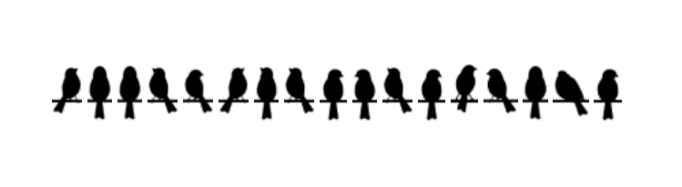
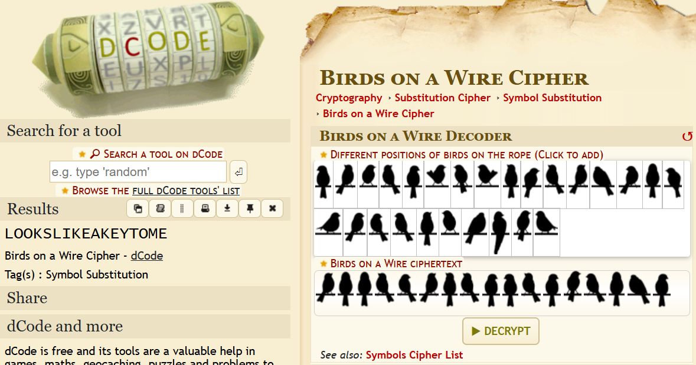

# Look Out - Incognito 7.0 Writeup
**Description :** Look it's plane, no it's a jet, no it's a bird!!!!!!!

## 1. TL;DR

This challenge was a **two-layer puzzle**.

- The image inside the PDF hinted at a **Birds on a Wire** cipher.
- Decoding that clue gave the key: `lookslikeakeytome`
- The actual payload was hidden in the PDF metadata, specifically the `Subject` field
- That `Subject` field contained a long binary string
- Converting the binary into bytes and XORing it with the repeating key `lookslikeakeytome` revealed the flag

**Final flag:**

```text
IIITL{this_was_annoying_lol_79823979735}
```


***

## 2. What data/file we have and what is special

We were given a single file:

```text
Untitled_document.pdf
```

At first glance, the PDF looked simple: it displayed a row of bird silhouettes perched on a wire. That visual detail was important because it strongly suggested a **Birds on a Wire** cipher rather than a normal text-based puzzle.

What made this file special was that the visible image was **not the final payload**. The PDF also contained hidden metadata, and one of the metadata fields stored a long binary string that turned out to be the real encrypted message.

The following is the data you can see in the PDF file :



***

## 3. Problem Analysis

The main difficulty in this challenge was identifying that the PDF had **two separate information layers**.

### Layer 1: the visible clue

The first layer was the bird image shown in the PDF. Since birds sitting on a wire are a known puzzle/cipher motif, the natural idea was to interpret the image as a **Birds on a Wire** encoding (https://www.dcode.fr/birds-on-a-wire-cipher).

That decoding led to the string:        


```text
LOOKSLIKEAKEYTOME
```

If we submit IIITL{LOOKSLIKEAKEYTOME}, it will be incorrect :(

This was the first major clue. The phrase itself reads like a hint rather than a flag. In other words, it was effectively telling us:

> “This is probably the key.”

That is a classic CTF design choice: the first decoded message is not the answer, but a tool for the second stage.

### Layer 2: the hidden payload

After realizing the first layer looked like a key, the next question became: **what is this key used for?**

The most likely place to hide extra content in a static file is:

- metadata
- comments
- appended content
- embedded objects
- alternate streams

Using `exiftool` on the PDF exposed a long binary string in the `Subject` metadata field. That immediately suggested the real payload was:

1. stored as binary
2. meant to be transformed into bytes
3. then decrypted using the key from the bird image

```text
$ exiftool Untitled_document.pdf
ExifTool Version Number         : 12.76
File Name                       : Untitled_document.pdf
Directory                       : .
File Size                       : 44 kB
File Modification Date/Time     : 2026:04:14 11:26:10+08:00
File Access Date/Time           : 2026:04:15 01:54:31+08:00
File Inode Change Date/Time     : 2026:04:14 11:43:59+08:00
File Permissions                : -rwxrwxrwx
File Type                       : PDF
File Type Extension             : pdf
MIME Type                       : application/pdf
PDF Version                     : 1.4
Linearized                      : No
Page Count                      : 1
Tagged PDF                      : Yes
Language                        : en_GB
XMP Toolkit                     : Image::ExifTool 13.50
Subject                         : 00100101001001100010011000111111001111110001011100011101000000110000110000010010001101000001001000011000000001110011000000001100000010110000001000000000000101100000001000011101000010110011011000000111000010100000110100110100010100100100000001001100010111010101111001011100010110110101011001011000010110000100011000010001
Title                           : Untitled document
Producer                        : Skia/PDF m148 Google Docs Renderer
Keywords                        : What, is, this?
```

### Why this approach makes sense

This attack path is consistent with typical CTF design:

- a visible clue gives a meaningful phrase
- that phrase acts as a key
- a hidden field contains encrypted data
- the final step is a simple but deliberate operation such as repeating XOR

This also explains why submitting the bird-text directly as the flag failed: it was only an intermediate artifact.

***

## 4. Initial Guesses / First Try

Our early guesses were reasonable, but incomplete.

### First guess

Once the bird image was interpreted as text, the first instinct was to try the decoded phrase directly as the flag:

```text
IIITL{LOOKSLIKEAKEYTOME} or maybe
IIITL{lookslikeakeytome}
```

That was incorrect.

The reason is simple: the string looked too much like a message and too little like a final flag. It behaved like a **hint**, not a solution.

### Why the wrong path was deceptive

The incorrect uppercase-key decode still produced something that looked human-readable, so it was tempting to assume the rest could be fixed manually. That is usually a bad sign in crypto challenges. If a decode requires guessing brackets, changing separators by hand, or trimming suspicious garbage, the solution is probably not fully correct yet.

***

## 5. Exploitation Walkthrough / Flag Recovery

This section shows the clean solve path from start to finish.

### Step 1: inspect the PDF metadata

Run:

```bash
exiftool Untitled_document.pdf
```

Among the metadata fields, the important one is `Subject`, which contains a long binary string:

```text
001001010010011000100110001111110011111100010111...
```

This is the hidden encrypted payload.

***

### Step 2: recover the key from the bird image

The visible image in the PDF is a birds-on-a-wire clue. Decoding that visual cipher yields:

```text
lookslikeakeytome
```

That becomes the XOR key.

***

### Step 3: convert the binary string to bytes

The `Subject` content is binary text, so split it into 8-bit chunks and convert each chunk into one byte.

Example logic:

```python
raw_bytes = bytes(
    int(binary_str[i:i+8], 2)
    for i in range(0, len(binary_str), 8)
)
```


***

### Step 4: XOR with the repeating key

Now XOR each byte against the repeating key `lookslikeakeytome`.

```python
decoded = bytes(
    b ^ ord(key[i % len(key)])
    for i, b in enumerate(raw_bytes)
)
```


***

### Step 5: print the decoded flag

The plaintext appears directly as:

```text
IIITL{this_was_annoying_lol_79823979735}
```

So we find final flag :D

***

### Full solve script

```python
#!/usr/bin/env python3
import subprocess
import re

PDF_PATH = "Untitled_document.pdf"

def extract_binary_from_subject(pdf_path):
    result = subprocess.run(
        ["exiftool", pdf_path],
        capture_output=True,
        text=True,
        check=True
    )

    for line in result.stdout.splitlines():
        if "Subject" in line:
            match = re.search(r"[^01]{50,}", line)
            if match:
                return match.group()

    raise RuntimeError("Could not find binary data in the Subject field.")

def binary_to_bytes(binary_str):
    if len(binary_str) % 8 != 0:
        raise ValueError("Binary string length is not divisible by 8.")
    return bytes(
        int(binary_str[i:i+8], 2)
        for i in range(0, len(binary_str), 8)
    )

def repeating_xor(data, key):
    key_bytes = key.encode()
    return bytes(
        b ^ key_bytes[i % len(key_bytes)]
        for i, b in enumerate(data)
    )

def main():
    key = "lookslikeakeytome"
    binary_str = extract_binary_from_subject(PDF_PATH)
    raw_bytes = binary_to_bytes(binary_str)
    decoded = repeating_xor(raw_bytes, key).decode()

    print(decoded)

if __name__ == "__main__":
    main()
```


***

### Expected output

```text
IIITL{this_was_annoying_lol_79823979735}
```


***

## 6. What We Learned

This challenge reinforced several useful CTF habits.

### 1. A decoded phrase is not always the flag

When a clue decodes into something like `lookslikeakeytome`, that usually means it is an **instruction** or a **key**, not the final answer.

### 2. File metadata matters

Static-file challenges often hide useful material in:

- EXIF fields
- document metadata
- comments
- embedded objects
- alternate streams

Checking metadata early can save a lot of time.

### 3. Case sensitivity can completely change a decryption result

The biggest trap here was the key casing. The uppercase version gave misleading near-readable output, while the lowercase version gave the exact flag. In CTF crypto, **case is part of the key**.

### 4. “Almost correct” is usually still wrong

If a result requires manual cleanup, guessed punctuation, or hand-fixed formatting, it probably means the decryption step is not fully correct yet. A proper solve should decode into a clean, natural output.
