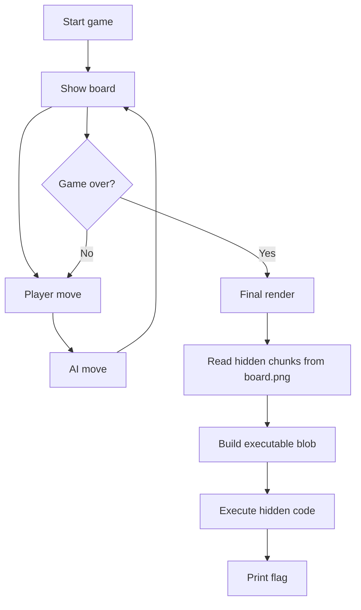

# Shall We Play a Game? - JerseyCTF VI Writeup

**Description:** "A suspicious arcade game was left by the origional developer on the system. It runs a simple tic-tac-toe game, but something feels off...    
You were able to copy the program and its assets onto your system, dig into the binary, figure out what it's really doing, and flip the right switch before the game ends.    
NOTE: the challenge is best experienced on a terminal which implements the Kitty Graphics Protocol."

## 1. TL;DR

This challenge looks like a normal tic-tac-toe game, but the real payload is hidden inside `board.png`.

The binary reads extra data from the PNG after `IEND`, reconstructs a small executable blob from a custom `SPRT` table, and runs it after the game ends. That hidden code prints the flag:

```text
jctf{6r3371N65_Pr0F3550r_F41K3N}
```

---

## 2. What Data/File We Have and What Is Special

We are given:

- `tictactoe`
- `board.png`

### What is special about them

- `tictactoe` is the actual game binary.
- `board.png` is a valid PNG image, but it is larger than a normal board image because it contains extra data after the PNG `IEND` chunk.
- The binary uses `board.png` in two different ways:
  - as the board background / sprite source
  - as a hidden storage file for the payload that gets executed at the end

### Interactive flow

This is a local interactive game, not a remote service.

The player interaction is:

1. The game starts and prints a tic-tac-toe board.
2. The player is `X`.
3. The AI is `O`.
4. The player enters moves from `1` to `9`.
5. The AI replies with its own move.
6. When the match ends, the game renders one final time.
7. That final render path triggers the hidden payload.

### High-level flow



---

## 3. Problem Analysis

The tic-tac-toe logic itself is mostly a decoy.

From the decompilation, the important functions are:

- `main()`
- `render_board()`
- `render_board_generic()`
- `render_board_optimized()`
- `load_sprite(offset)`

### What the game does

`main()` alternates between the player and the AI:

- player places `1`
- AI places `-1`
- the AI uses minimax
- the game ends on win, loss, or draw

That part is standard.

### The real clue: `board.png`

The binary opens `board.png` directly and reads bytes at fixed offsets:

- `load_sprite(0x747)`
- `load_sprite(0x4747)`

At first that looks like normal sprite loading, but the file is much larger than the actual PNG image.

That immediately suggests:

- the PNG ends normally at `IEND`
- extra data lives after the end of the image
- the file is being used as a container for hidden payload data

### The `SPRT` structure

In the binary, there is a structure in `.rodata` that begins with:

```text
SPRT
```

That structure contains two sets of chunk descriptors, i.e. `(offset, length)` pairs.

Those descriptors point into `board.png`.

So the file is not just an image. It is a packed data source for executable content.

### Why this matters

`render_board_optimized()` does the following after the game is over:

- opens `board.png`
- reads several chunks from offsets listed in `sprite_config`
- concatenates them into a buffer
- maps memory with execute permissions
- copies the buffer there
- calls it as code

That means the flag is not hidden in the board drawing itself. It is printed by code reconstructed from the PNG tail.

---

## 4. Initial Guesses / First Try

My first guesses were the usual ones:

1. **Solve the game normally**
   - The AI uses minimax, so brute forcing it is not the intended direction.

2. **Look for a flag string in the binary**
   - Nothing obvious appears in the main executable strings.

3. **Treat `board.png` as only an image**
   - That fails once you notice the file size and the hidden offsets.

The turning point was checking the PNG structure.

The file is a valid PNG through `IEND`, but there is a large amount of trailing data after that.

That is the actual payload carrier.

---

## 5. Exploitation Walkthrough / Flag Recovery

### Step 1: Confirm the PNG has trailing data

Parsing `board.png` shows a normal PNG structure:

- `IHDR`
- `IDAT`
- `IEND`

But after `IEND`, the file still contains tens of kilobytes of extra bytes.

So the hidden payload is appended after the image.

### Step 2: Find the `SPRT` table in the binary

In the executable, the `.rodata` section contains the magic value:

```text
SPRT
```

Immediately after that are offset/length descriptors.

These descriptors tell the program which slices of `board.png` to read.

### Step 3: Extract the referenced chunks

The table points to eight pieces of data in the PNG tail.

Those chunks are reassembled into a small blob of about 215 bytes.

That blob is not image data. It is x86-64 code.

### Step 4: Inspect the blob

The extracted blob contains two tiny syscall stubs.

They decrypt embedded strings using XOR with `0x80` and write the result to stdout.

That is why the shellcode is so short: it is not doing anything complex, just revealing the hidden message.

### Step 5: Recover the flag

Decrypting the embedded strings reveals:

```text
jctf{6r3371N65_Pr0F3550r_F41K3N}
```

### What actually triggers it

The hidden code runs only after the game reaches a terminal state.

So the intended path is:

- play the game until it ends
- let `render_board_optimized()` run
- the hidden payload is reconstructed from `board.png`
- the payload prints the flag

In practice, the exploitation is mostly static analysis. You do not need to “break” the AI or patch the binary. The real work is noticing that the PNG is a payload container.

---

## 6. What We Learned

This challenge is a good example of a containerized payload hidden inside a normal-looking asset.

### Key takeaways

- A PNG can legally contain extra bytes after `IEND`
- A binary can use an image file as a payload store
- A game renderer can hide post-game execution logic
- Small shellcode often just decrypts and prints embedded strings
- Hints about magic numbers and chunk descriptors are usually worth following literally

### Why the hints mattered

- `SPRT` pointed to the hidden descriptor table
- “What lives after the end of a PNG?” pointed to appended data
- “two sets of chunk descriptors” pointed to the chunk-based payload reconstruction

### Final lesson

When a challenge looks like a simple game, always check the asset files and the post-win / post-loss code paths.

In this case, the board itself was the payload.
