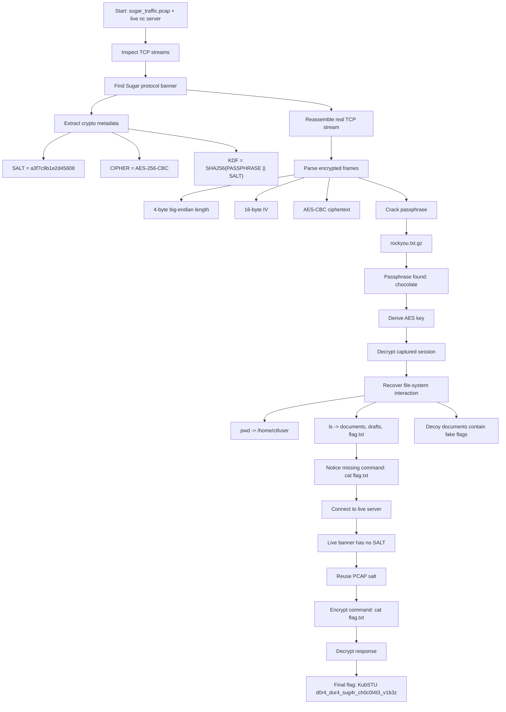

# Cipher "Сахар" — KubSTU CTF 2026 Writeup

## Challenge Description

> Sugar Capybara Talks — a group of capybaras from a secret unit encrypts their communications with a proprietary protocol.  
> The PCAP contains their intercepted session. They are communicating with some kind of command server.  
>  
> Server:
>
> `nc 217.26.29.80 31337
> nc 62.113.108.12 31337`

---

## TL;DR

The PCAP contains a custom encrypted TCP protocol. The server banner tells us the intended crypto format:

```text
[SUGAR_PROTOCOL v1.0]
SALT:a3f7c9b1e2d45608
CIPHER:AES-256-CBC
KDF:SHA256(PASSPHRASE||SALT)
>>>ENCRYPTED_CHANNEL_ACTIVE<<<
```

The encrypted packets are not raw AES blocks. Each packet is length-prefixed:

```text
uint32_be(length) || 16-byte IV || AES-CBC ciphertext
```

After extracting the real TCP stream and cracking the passphrase with `rockyou.txt.gz`, the password was:

```text
chocolate
```

The key derivation was:

```python
key = SHA256(b"chocolate" + b"a3f7c9b1e2d45608")
```

The decrypted capture showed that `flag.txt` existed in `/home/ctfuser`, but the captured user never read it. When connecting to the live server, the banner did not include the salt anymore, so the solver reused the salt recovered from the PCAP.

Final command:

```text
cat flag.txt
```

Final flag:

```text
KubSTU{d0r4_dur4_sug4r_ch0c0l4t3_v1b3z}
```

---

## What Data / Files We Have and What Is Special

We were given one important file:

```text
sugar_traffic.pcap
```

The challenge also gave two live command servers:

```text
217.26.29.80:31337
62.113.108.12:31337
```

The special part of the PCAP is that it contains both useful encrypted traffic and many misleading plaintext hints. Several decrypted documents contain fake "analysis result" blocks telling us to use passwords such as `sunshine`, `princess`, `dragon`, or `iloveyou`. These are decoys. The actual cryptographic result came from cracking the AES-CBC session itself, not trusting the text inside the files.

Important facts recovered from the PCAP:

```text
Real encrypted TCP stream: client port 54352
Salt: a3f7c9b1e2d45608
Client frames: 17
Server frames: 17
Passphrase: chocolate
KDF: sha256(passphrase || salt-ascii)
```

The decrypted session shows a small shell-like file system:

```text
/home/ctfuser
├── documents/
│   ├── chord_progression.md
│   ├── lyrics_v1.txt
│   ├── lyrics_v2_final.txt
│   ├── producer_notes.txt
│   ├── studio_booking.txt
│   └── .secret_mix.txt
├── drafts/
│   ├── beat_pattern.txt
│   └── vocal_arrangement.txt
└── flag.txt
```

The key observation is that the captured operator listed `flag.txt`, but never ran:

```text
cat flag.txt
```

That missing command became the final live-server step.

---

## Interactive Details: Server and Player Protocol

The live service starts with a cleartext banner:

```text
[SUGAR_PROTOCOL v1.0]
>>>ENCRYPTED_CHANNEL_ACTIVE<<<
```

In the PCAP, the full banner also included crypto parameters:

```text
SALT:a3f7c9b1e2d45608
CIPHER:AES-256-CBC
KDF:SHA256(PASSPHRASE||SALT)
```

After the banner, all commands and responses are encrypted. The player cannot just type normal shell commands through `nc`, because the server expects encrypted frames.

A normal player command like:

```text
ls
```

must be sent as:

```text
4-byte big-endian length || IV || AES-CBC(PKCS7(command))
```

The server response uses the same frame structure.

The effective command flow is:

```text
Player                                Server
------                                ------
connect --------------------------->  sends Sugar protocol banner
derive AES key from passphrase+salt
encrypt "ls" ---------------------->  decrypts command
                                      executes command
decrypt response <------------------  encrypts command output
encrypt "cat flag.txt" ------------>  decrypts command
decrypt flag <----------------------  returns encrypted flag output
```

The live server had one difference from the PCAP: it omitted the `SALT:` line from the banner. Since the PCAP already revealed the salt, the solver reused:

```text
a3f7c9b1e2d45608
```

---

## Concept Map



---

## Problem Analysis In Details

The challenge is a mixture of network forensics and cryptography. The PCAP contains an intercepted session with a command server. At first glance, it looks like the service provides everything directly in the banner: AES-256-CBC, a salt, and a KDF. The difficult part is not recognizing AES-CBC itself, but correctly reconstructing the custom protocol around it.

A common mistake is to treat the bytes after the banner as:

```text
IV || ciphertext
```

That fails, because the first four bytes are actually a frame length. If those four bytes are accidentally interpreted as part of the IV, AES decryption fails with errors such as:

```text
Incorrect IV length
```

The correct parser must read:

```python
n = struct.unpack(">I", sock.recv(4))[0]
body = recvn(sock, n)
iv = body[:16]
ct = body[16:]
```

Then the plaintext is:

```python
plaintext = AES_CBC_Decrypt(key, iv, ct)
plaintext = PKCS7_Unpad(plaintext)
```

The KDF uses the passphrase and the ASCII salt string:

```python
key = hashlib.sha256(passphrase.encode() + b"a3f7c9b1e2d45608").digest()
```

The passphrase was not visible in the useful plaintext. It had to be cracked. Using `rockyou.txt.gz`, the passphrase was found as:

```text
chocolate
```

Once decrypted, the PCAP revealed normal shell-like commands:

```text
ls
pwd
whoami
id
ls -la
ls documents/
cat documents/lyrics_v1.txt
cat documents/producer_notes.txt
...
find . -name '*.txt'
```

The most important decrypted lines were:

```text
[C -> S #0] ls
[S -> C #0] documents
drafts
flag.txt
```

and:

```text
[C -> S #1] pwd
[S -> C #1] /home/ctfuser
```

This means the actual flag file was probably:

```text
/home/ctfuser/flag.txt
```

The captured session never ran `cat flag.txt`. It only read many document files, which contained fake flags and misleading instructions. This is why the correct solution should not stop at the first `KubSTU{...}` string found in decrypted document content.

---

## Initial Guesses / First Try

The first manual attempt was to connect to the server and send commands directly:

```bash
nc 62.113.108.12 31337
```

The server returned the protocol banner, but normal commands did not work because the server expects encrypted packets after the banner.

The next attempt was to implement an AES-CBC client from the banner information. The first version failed because it did not parse the frame length correctly. The error looked like an IV problem:

```text
failed to decrypt response: Incorrect IV length
```

That was a protocol parsing bug, not a wrong AES mode.

After fixing the frame format to:

```text
length || IV || ciphertext
```

the solver could parse both client and server frames from the PCAP. The remaining unknown was the passphrase.

Several obvious passphrases were tested first:

```text
sugar
capybara
sunshine
caramel
sweetness
honey
toffee
```

These did not decrypt the real AES session. Then the solver used `rockyou.txt.gz` and found the real passphrase:

```text
chocolate
```

The decrypted documents included many fake analysis blocks. For example, some files claimed that the real password was `sunshine`, `dragon`, `princess`, or `iloveyou`, and some claimed that AES was fake. These were intentionally misleading. The reliable evidence was the successful AES-CBC decryption of the actual TCP frames.

---

## Exploitation Walkthrough / Flag Recovery

### Step 1: Run the solver against the PCAP

The final solver was executed with the known passphrase:

```bash
python3 solve.py 'sugar_traffic.pcap' -p chocolate --live
```

The script verified the crypto parameters:

```text
[+] AES backend: pycryptodome
[+] Real encrypted TCP stream: client port 54352
[+] Salt: a3f7c9b1e2d45608
[+] Client frames: 17
[+] Server frames: 17
[+] Passphrase verified: 'chocolate'
[+] KDF: sha256(passphrase || salt-ascii)
```

### Step 2: Decrypt the captured session

The decrypted session showed:

```text
[C -> S #0] ls
[S -> C #0] documents
drafts
flag.txt
```

Then:

```text
[C -> S #1] pwd
[S -> C #1] /home/ctfuser
```

This confirmed that the useful target was:

```text
/home/ctfuser/flag.txt
```

The file listing also confirmed that `flag.txt` was readable and 40 bytes long:

```text
-r--r--r-- 1 ctfuser ctfuser   40 Apr 25 15:05 flag.txt
```

### Step 3: Ignore fake flags in documents

The decrypted files contained many fake flags:

```text
KubSTU{sunn_sh1n3_y0u_4r3_my_0nly}
KubSTU{r34l_fl4g_n0t_1n_h0m3_d1r}
KubSTU{pr1nc3ss_0f_d4rkn3ss_f4k3}
KubSTU{dr4g0n_sl4y3r_f4k3_fl4g}
KubSTU{l0v3_1s_th3_4nsw3r_n0t}
```

These were not accepted as the final answer. They appeared inside text files as automated-analysis or security-audit notes, not as the direct output of `flag.txt`.

### Step 4: Connect to the live server

The live server banner was shorter than the PCAP banner:

```text
[SUGAR_PROTOCOL v1.0]
>>>ENCRYPTED_CHANNEL_ACTIVE<<<
```

It did not include the salt. The solver handled this by falling back to the salt recovered from the PCAP:

```text
[*] Live banner has no SALT; using PCAP salt: a3f7c9b1e2d45608
```

### Step 5: Send the missing encrypted command

The solver encrypted and sent:

```text
cat flag.txt
```

The server returned:

```text
KubSTU{d0r4_dur4_sug4r_ch0c0l4t3_v1b3z}
```

Final result:

```text
[+] FLAG FOUND FROM FLAG COMMAND
```

---

## Solver Logic

The essential parts of the solver are below.

### Key derivation

```python
import hashlib

passphrase = "chocolate"
salt = b"a3f7c9b1e2d45608"

key = hashlib.sha256(passphrase.encode() + salt).digest()
```

### Frame parsing

```python
import struct

def recv_frame(sock, key):
    hdr = recvn(sock, 4)
    n = struct.unpack(">I", hdr)[0]

    body = recvn(sock, n)
    iv = body[:16]
    ct = body[16:]

    pt = AES.new(key, AES.MODE_CBC, iv).decrypt(ct)
    return unpad(pt, 16)
```

### Frame sending

```python
import os
import struct
from Crypto.Cipher import AES
from Crypto.Util.Padding import pad

def send_frame(sock, key, plaintext):
    if isinstance(plaintext, str):
        plaintext = plaintext.encode()

    iv = os.urandom(16)
    ct = AES.new(key, AES.MODE_CBC, iv).encrypt(pad(plaintext, 16))
    body = iv + ct

    sock.sendall(struct.pack(">I", len(body)) + body)
```

The full working solve command was:

```bash
python3 solve.py 'sugar_traffic.pcap' -p chocolate --live
```

---

## What We Learned

This challenge is a good reminder that PCAP crypto challenges are usually not only about the cipher. The surrounding protocol format matters just as much. AES-CBC was not hard to use here, but the length-prefixed frame structure had to be recovered before decryption could work.

The most important mistake to avoid is trusting decrypted text blindly. The PCAP contained several fake flags and fake analysis blocks. A solver that simply greps for the first `KubSTU{...}` string would return the wrong answer. The correct approach is to separate command output from document content and follow the actual shell state.

The live server also differed slightly from the captured server. The PCAP banner included the salt, but the live server banner did not. Reusing the PCAP salt was enough because the protocol and password stayed the same.

Final flag:

```text
KubSTU{d0r4_dur4_sug4r_ch0c0l4t3_v1b3z}
```
