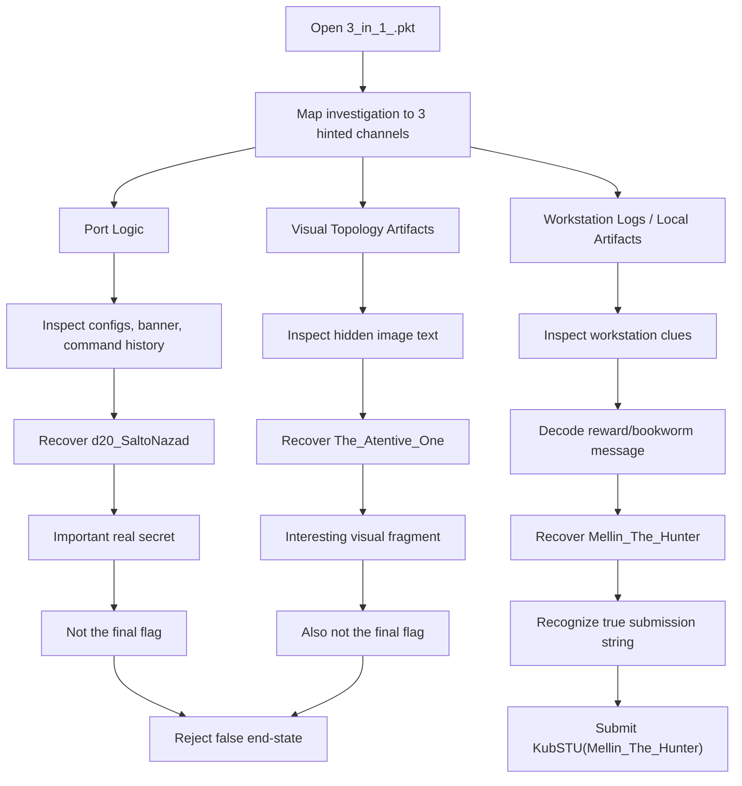

# Silence in Verona - KubSTU CTF 2026 Writeup

## Description

> You are a senior network engineer. The chief network architect has left the company, leaving the DD LAB infrastructure in lockdown mode. Before leaving, he split the Master Recovery Key into three fragments and hid them within the network itself: in port logic, in workstation system logs, and in visual artifacts of the topology. The former architect was quite an eccentric person — colleagues often called him a geek — but as a specialist he was damn good.
>
> Your task is to conduct an audit, collect all parts of the key, and restore access to the core before the system goes into full reset. Get to work.
>
> Flag format: `KubSTU(...)`

**Provided File:** `3_in_1_.pkt` (Cisco Packet Tracer lab)

---

## TL;DR

This challenge was solved from the Packet Tracer lab file `3_in_1_.pkt`. The main trap was assuming that the first important-looking secret was the flag. It was not.

The investigation naturally split into three channels, matching the prompt:

1. **Port logic**
2. **Workstation logs / local artifacts**
3. **Visual topology artifacts**

The port-logic side revealed a real recovery/access secret:

```text
d20_SaltoNazad
```

That value appeared in the device banner, in command history, and in credential configuration. It looked extremely convincing, but it was **not** the submission flag.

The visual-artifact side revealed hidden text such as:

```text
The_Atentive_One
```

This was also interesting, but still not the final answer.

The real flag came from the workstation-side investigation. After following the workstation clues and decoding the “bookworm reward” message, the hidden reward string was:

```text
Mellin_The_Hunter
```

Final flag:

```text
KubSTU(Mellin_The_Hunter)
```

---

## What Data / File We Have and What Is Special

We were given one Packet Tracer lab file:

```text
3_in_1_.pkt
```

This is important because the challenge is not a normal remote service with a single socket interaction. The whole environment is embedded inside the Packet Tracer project: routers, switches, PCs, saved configs, command history, files, notes, topology images, and visual decorations.

### What is special about this file

The challenge prompt explicitly tells us that the “Master Recovery Key” was split into three places:

- **in port logic**
- **in workstation system logs**
- **in visual artifacts of the topology**

That means we should not expect a one-step solve from a single config line. We have to inspect multiple classes of evidence inside the `.pkt`.

### Interactive elements inside the lab

There is no public nc-style service here. The interaction is inside the Packet Tracer environment itself. In practice, the “player” interacts with the lab through:

- switch/router CLI
- workstation desktop / command prompt / files
- saved device configs
- command history / banners / notes
- topology background images and hidden visual text

So the effective interaction model is:

```text
Player
  -> open lab
  -> inspect topology
  -> open device configs / CLI history
  -> inspect workstation files and logs
  -> inspect images / hidden text
  -> correlate clues
  -> recover final flag
```

### Why this challenge is tricky

The file contains several values that look “flag-like” or “secret-like,” but not all of them are the final submission value. The strongest early example is:

```text
d20_SaltoNazad
```

This is absolutely real, but it behaves like a **recovery / privilege / enable secret**, not the final flag.

Another example is the visual text:

```text
The_Atentive_One
```

This also looks intentional, but by itself it was not accepted as the flag.

---

## Concept Map



---

## Problem Analysis (in Details)

The challenge statement already tells us the author’s design philosophy: the answer is distributed across the network itself, and the hiding spots are of different types. That means our approach should also be split across those same types.

The first category is **port logic**. In a Packet Tracer environment, this usually means switch interface descriptions, access/trunk settings, VLAN assignments, port-security notes, shutdown interfaces, saved command history, or banners containing operational secrets. These are usually the first things worth checking, because they are compact and often intentionally planted.

The second category is **workstation system logs**. This is broader. It can mean local files, command history, notes, staged artifacts, encoded text, desktop items, text documents, or anything reachable from the PC side of the lab. In puzzle-style Packet Tracer challenges, workstation artifacts often contain more narrative hints or a final transformation step.

The third category is **visual artifacts of the topology**. This usually means background images, labels, embedded text in decorations, or hidden strings in images that are placed on the workspace rather than inside device configs. These clues are often easy to notice but hard to rank properly: some are core clues, and some are deliberate distractions.

The central analytical mistake in this challenge is assuming that “important” means “final.” That is not always true. Here, `d20_SaltoNazad` was clearly meaningful. It was repeated in multiple places and even verified cryptographically through the stored enable secret hash. That made it extremely tempting to submit directly. However, the prompt did not say “find one secret”; it said the architect split the recovery key into different places. That is a strong warning that intermediate secrets may exist.

The same thing happened with `The_Atentive_One`. It looked like a hidden visual clue and fit the story very well, but the rejection showed that visibility and intentionality do not guarantee finality.

The value that finally behaved like a real solution was the workstation-side reward string:

```text
Mellin_The_Hunter
```

That fit the “geek architect” theme much better as a named reward output than as a random infrastructure password. It also matched the experience of the solve: the final breakthrough came from the workstation artifact channel, not from raw credential reuse.

---

## Initial Guesses / First Try

The first instinct was to trust the strongest infra-looking secret.

### Guess 1: use the recovery secret directly

The most convincing early value was:

```text
d20_SaltoNazad
```

It appeared in multiple places such as:

```text
enable secret d20_SaltoNazad
username admin privilege 15 secret d20_SaltoNazad
```

and also through the banner/base64 clue:

```text
ZDIwX1NhbHRvTmF6YWQ=  ->  d20_SaltoNazad
```

So the first reasonable submissions were things like:

```text
KubSTU(d20_SaltoNazad)
```

But it was wrong.

### Guess 2: use the hidden visual text directly

The next strong-looking clue was the hidden text in the topology image:

```text
The_Atentive_One
```

That also looked very intentional, especially because it was not part of normal config output. But that was also rejected when used directly as the flag.

### What these failures taught us

Both failures pointed to the same conclusion: these values were **fragments, roles, or intermediate clues**, not the final submission string. At that point, the workstation side became the most promising place to continue.

---

## Exploitation Walkthrough / Flag Recovery

### Step 1: Treat the `.pkt` as the primary artifact

The whole solve starts from the lab file:

```text
3_in_1_.pkt
```

This is where all evidence lives. Rather than trying to force a single-string answer early, the better move is to classify every clue by source:

- network device / port logic
- workstation artifact
- visual artifact

That keeps the investigation aligned with the prompt.

### Step 2: Recover the port-logic secret

From the core/switch-side inspection, the repeated value was:

```text
d20_SaltoNazad
```

This came from configuration and auth-related artifacts, including the saved enable secret context. This confirmed that the lab really did contain a hidden recovery secret.

This was a useful clue, but submission attempts showed it was not the final flag.

### Step 3: Recover the visual fragment

From the visual/topology side, hidden text was visible in one of the images:

```text
The_Atentive_One
```

Again, this looked intentional and thematic, but direct submission failed. That meant the visual side was contributing clue material, not necessarily the final answer alone.

### Step 4: Pivot to the workstation-side artifact

The decisive step came from the workstation-side investigation. There was an encoded / hidden reward path that effectively produced a message for the solver. The important recovered output was:

```text
Good job bookworm, here's your reward
Mellin_The_Hunter
```

That changed the ranking of candidate strings immediately. Unlike the recovery secret, this value behaved like a curated challenge reward. Unlike the visual clue, it came out of a workstation-side transformation path, which matches the prompt’s mention of workstation logs/artifacts.

### Step 5: Submit the reward string in flag format

Using the recovered reward as the final payload gave the correct answer:

```text
KubSTU(Mellin_The_Hunter)
```

That was accepted as the flag.

---

## Suggested Solve Narrative

A clean way to describe the logic is:

1. The port/channel investigation reveals a real infrastructure secret.
2. The image/topology investigation reveals a hidden thematic fragment.
3. Neither of those alone is the flag.
4. The workstation investigation yields an explicit reward string.
5. That reward string is the actual flag payload.

This explains why the earlier candidate submissions felt “close” but still failed.

Run the program with `python3 solve_3in1_pkt.py '3_in_1_.pkt'`

The output is :
```
$ python3 solve_3in1_pkt.py '3_in_1_.pkt'
[*] Decrypting Packet Tracer project...
[*] Extracting recovery/access secret from port/config side...
    d20_SaltoNazad

[*] Decoding workstation artifact...
Good job bookworm, here's your reward
Mellin_The_Hunter

[+] Final flag:
KubSTU(Mellin_The_Hunter)
```

---

## What We Learned

This challenge is a good lesson in not collapsing “real secret” and “final flag” into the same thing. In infrastructure-themed challenges, especially Packet Tracer ones, a config secret can be perfectly real and still be only one layer of the puzzle.

It also shows why the prompt matters. The statement explicitly said the architect hid the key in **three different classes of artifacts**. That should push us away from single-clue submissions and toward correlation.

The visual clue was also a useful reminder that hidden text inside images can be intentional without being sufficient. It may function as flavor, confirmation, or one piece of a multi-step path rather than the terminal answer.

The final breakthrough came from trusting the workstation-side reward output more than the raw network secret. That was the correct move because it behaved like the challenge author speaking directly to the solver.

Final flag:

```text
KubSTU(Mellin_The_Hunter)
```
