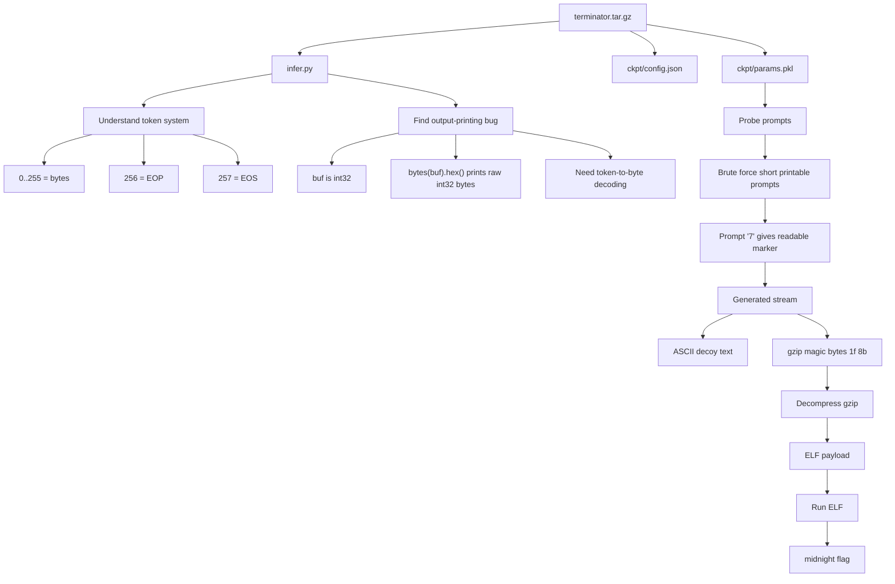

# terminator - Midnight Sun CTF 2026 Quals Write-up

## Challenge Description

> Small language models are all the rage. CUDA: use `jax[cuda13]` or similar in the `uv` shebang line.

We are given a small JAX/Flax language-model inference package. The goal is not to train the model, but to understand how the supplied model emits data for chosen prompts and recover the hidden flag.


## 1. TL;DR

The challenge ships a tiny transformer checkpoint and an inference script. The model accepts a prompt, appends an `EOP` token, greedily generates tokens, and stops at `EOS`.

The important bug/quirk is that `infer.py` prints the generated bytes using:

```python
sys.stdout.write(bytes(buf[len(prefix):i]).hex())
```

However, `buf` is a NumPy `int32` array. Calling `bytes()` on an `int32` array dumps the raw 4-byte integer representation, not the intended one-byte token stream. This makes the output look like padded hex, for example each ASCII byte becomes mixed with `000000` padding.

After decoding the generated token IDs correctly, a one-byte prompt brute force shows that prompt `7` produces:

```text
h1S_1S_n0T_4_flAAAG_iTT_1z_a_k3Y...
```

Immediately after that text, the generated byte stream contains a gzip file. Decompressing the gzip gives a small statically linked x86-64 ELF. Running that ELF prints the flag.

## 2. What Data / Files We Have and What Is Special

After extracting the archive, the meaningful files are:

```text
terminator.tar.gz
├── infer.py
└── ckpt/
    ├── config.json
    └── params.pkl
```

`config.json` describes a very small transformer:

```json
{"dim": 512, "heads": 8, "layers": 4}
```

`infer.py` defines the model architecture and the generation logic. The important constants are:

```python
EOP, EOS, VOCAB = 256, 257, 258
```

This means:

| Token | Meaning |
|---:|---|
| `0` to `255` | normal byte tokens |
| `256` | end-of-prompt marker, appended after our input |
| `257` | end-of-sequence marker |
| `258` | vocabulary size |

The core inference process is:

```python
prefix = np.array(list(prompt.encode()) + [EOP], dtype=np.int32)
buf = np.zeros(max_len, dtype=np.int32)
buf[:len(prefix)] = prefix

while i < max_len:
    nxt = int(jnp.argmax(predict(params, jnp.array(buf), jnp.array(i - 1))))
    if nxt == EOS:
        break
    buf[i] = nxt
    i += 1
```

The model is a deterministic greedy generator: for a chosen prompt, there is only one output stream.

### Interactive Behavior

There is no normal remote netcat-style interaction in the given files. The player interacts with the local inference script.

Interactive mode:

```text
$ ./infer.py
prompt: <player input>
<hex-looking output>
```

One-shot mode:

```text
$ ./infer.py <prompt>
<hex-looking output>
```

The “hex-looking output” is misleading because it is produced from the raw memory representation of an `int32` NumPy array, not from the intended generated byte tokens.

The player should treat the model output as token IDs first, then convert token IDs in `[0, 255]` to bytes.

## Concept Map



## 3. Problem Analysis

At first glance, this looks like an LLM prompt challenge: find the right prompt and ask the model for the flag. The file names and description suggest “small language model,” but the checkpoint is intentionally tiny and deterministic. There is no sampling, temperature, or randomness. Every prompt has a fixed output.

The model architecture itself is not the vulnerability. It is a normal small causal transformer with:

| Component | Detail |
|---|---|
| Embedding | `VOCAB = 258` |
| Transformer blocks | 4 layers |
| Hidden dimension | 512 |
| Attention heads | 8 |
| Positional encoding | RoPE |
| Output selection | greedy `argmax` |

The useful observation is the output encoding bug.

The generated buffer is declared as `np.int32`:

```python
buf = np.zeros(max_len, dtype=np.int32)
```

Each generated token is an integer token ID. For byte tokens, the token ID is exactly the byte value. For example, token `0x68` means ASCII `h`.

But the script prints:

```python
bytes(buf[len(prefix):i]).hex()
```

For a normal Python list of integers, `bytes([0x68, 0x69])` would become `b"hi"`. For a NumPy `int32` array, `bytes(array)` returns the raw memory bytes of the array. Therefore token `0x68` is printed as four bytes:

```text
68 00 00 00
```

This is why the original output is noisy and misleading. The real decoding should be:

```python
bytes([t for t in generated_tokens if 0 <= t < 256])
```

After fixing that mental model, the task becomes:

1. Load the checkpoint.
2. Generate token IDs for many candidate prompts.
3. Convert generated token IDs to bytes correctly.
4. Look for structured output: readable strings, gzip magic bytes, ELF magic bytes, or the flag format.

A brute force over single printable-byte prompts is enough. Prompt `7` stands out because it starts with readable text and then contains a gzip header:

```text
h1S_1S_n0T_4_flAAAG_iTT_1z_a_k3Y...
```

The gzip header begins with:

```text
1f 8b 08
```

After decompression, the result starts with the ELF magic:

```text
7f 45 4c 46
```

That confirms the hidden payload is an executable.

## 4. Exploitation Walkthrough / Flag Recovery

### Step 1 — Extract the archive

```bash
tar -xzf terminator.tar.gz
cd terminator
```

The directory contains:

```bash
ls -R
```

Expected structure:

```text
.
├── infer.py
└── ckpt
    ├── config.json
    └── params.pkl
```

### Step 2 — Identify the output bug

The original script prints from an `int32` buffer:

```python
buf = np.zeros(max_len, dtype=np.int32)
...
sys.stdout.write(bytes(buf[len(prefix):i]).hex())
```

This should not be interpreted as normal hex-encoded model text. The correct approach is to keep the generated token IDs and convert only valid byte tokens into bytes.

Correct decoding idea:

```python
data = bytes([t for t in generated_tokens if 0 <= t < 256])
```

### Step 3 — Probe prompts

A simple way to find the interesting prompt is to try printable one-byte prompts and score the decoded output for readable text or known file signatures.

Example strategy:

```python
import string

for prompt in string.printable:
    generated_tokens = generate(prompt)
    data = bytes([t for t in generated_tokens if 0 <= t < 256])

    if b"midnight" in data or b"\x1f\x8b" in data or b"ELF" in data:
        print(repr(prompt), data[:100])
```

The useful prompt is:

```text
7
```

For prompt `7`, the decoded generated stream begins with:

```text
h1S_1S_n0T_4_flAAAG_iTT_1z_a_k3Y...
```

Then the stream contains a gzip payload:

```text
1f 8b 08 08 ...
```

### Step 4 — Extract the gzip payload

Once we have the generated byte stream as `data`, search for the gzip magic bytes:

```python
idx = data.find(b"\x1f\x8b")
gz = data[idx:]
```

Then decompress it:

```python
import gzip

payload = gzip.decompress(gz)
open("payload_dec.bin", "wb").write(payload)
```

The decompressed payload is an ELF:

```bash
file payload_dec.bin
```

Output:

```text
payload_dec.bin: ELF 64-bit LSB executable, x86-64, statically linked, stripped
```

### Step 5 — Run the payload

```bash
chmod +x payload_dec.bin
./payload_dec.bin
```

Output:

```text
midnight{7h3_r1s3_of_the_m4ch1n3s}
```

### Minimal Recovery Script

The following script shows the core recovery logic. It assumes we already have a `generate(prompt)` helper that returns the raw generated token IDs from the model, instead of the broken printed hex from `infer.py`.

```python
import gzip

prompt = "7"
generated_tokens = generate(prompt)

# Correct token decoding: token IDs 0..255 are byte values.
data = bytes([t for t in generated_tokens if 0 <= t < 256])

print(data[:80])

idx = data.find(b"\x1f\x8b")
assert idx != -1, "gzip payload not found"

payload = gzip.decompress(data[idx:])
open("payload_dec.bin", "wb").write(payload)

print("wrote payload_dec.bin", len(payload), "bytes")
```

Then:

```bash
chmod +x payload_dec.bin
./payload_dec.bin
```

Flag:

```text
midnight{7h3_r1s3_of_the_m4ch1n3s}
```

## 5. What We Learned

This challenge is not about training, fine-tuning, or attacking a production LLM. It is a deterministic model-reversing challenge. The checkpoint behaves like a weird byte generator, and the correct solve path is to inspect the inference code carefully.

The main lesson is that model output format matters. The generated tokens were valid byte values, but the script accidentally printed the raw memory representation of a NumPy `int32` array. That small type-level detail hides the real output.

The second lesson is to search for file signatures when generated output looks strange. Once prompt `7` produced a readable marker and a gzip magic header, the rest became a normal forensics/reversing pipeline: carve gzip, decompress it, identify ELF, run it, recover flag.

The practical CTF pattern is:

| Symptom | Action |
|---|---|
| Model prints strange padded hex | Check dtype and output conversion |
| Token vocabulary includes `0..255` | Treat tokens as bytes |
| Output contains `1f 8b` | Try gzip decompression |
| Decompressed data starts with `7f 45 4c 46` | Treat it as ELF |
| ELF is executable | Run or reverse it to recover final output |

Final flag:

```text
midnight{7h3_r1s3_of_the_m4ch1n3s}
```
