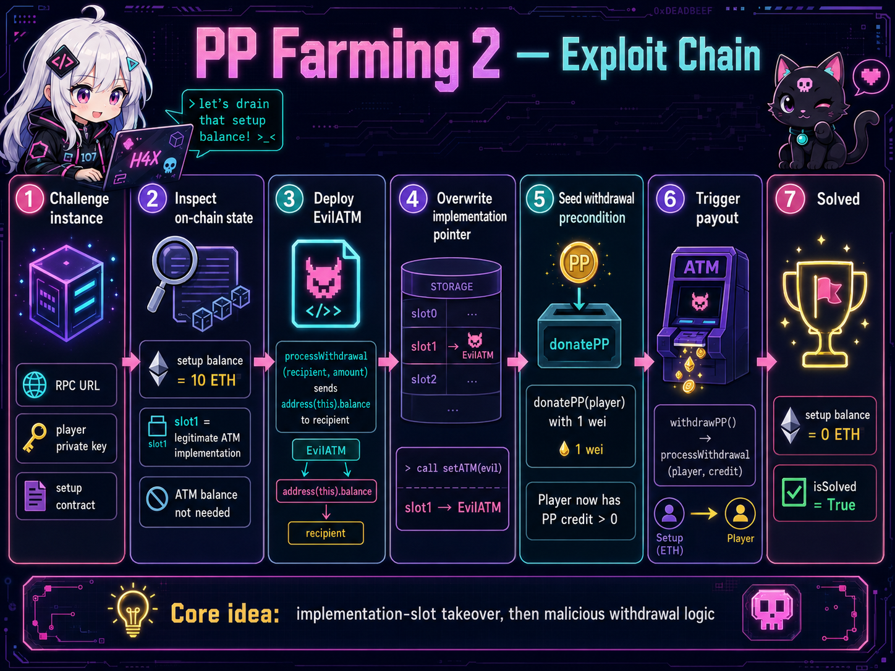
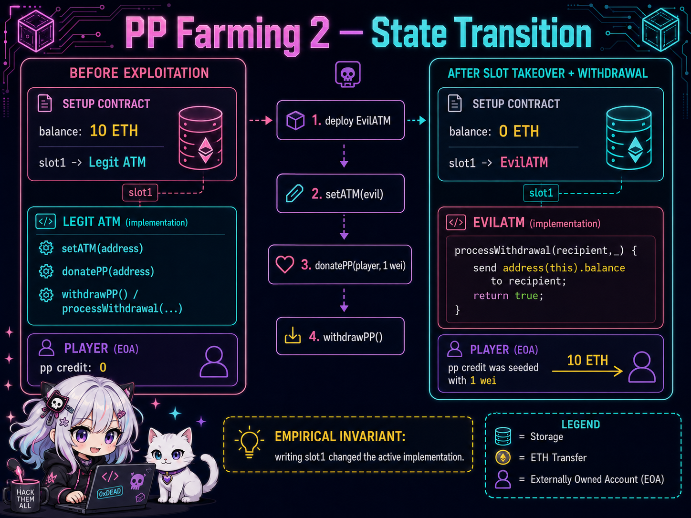
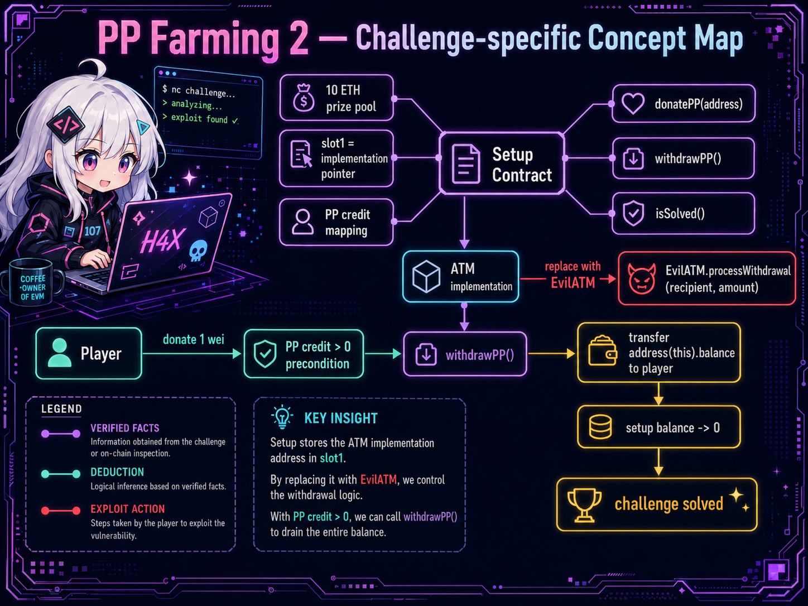
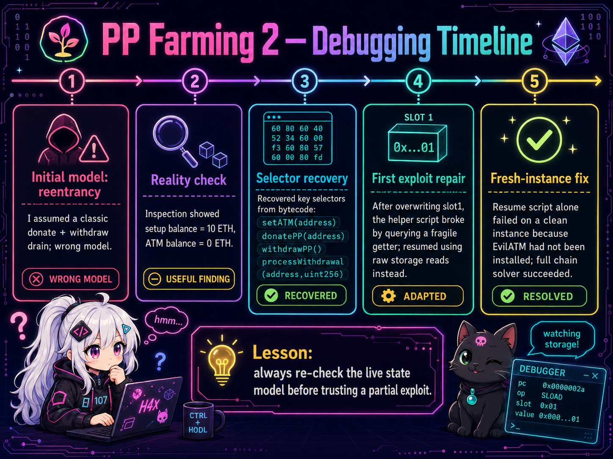

# PP Farming 2 - SekaiCTF 2026 writeup

## 1. Challenge Description

> I fixed the issue. I think...

## 2. TL;DR

I initially modeled this as a simple reentrancy challenge and went in the wrong direction. The live instance disproved that immediately: the setup contract held the 10 ETH, while the ATM implementation contract itself held `0 ETH`, so a naive “drain the ATM balance” plan made no sense.

The winning path was to treat the live chain as the main artifact, recover the important selectors from deployed bytecode, and then verify state transitions directly on-chain. The core exploit was:

1. deploy a malicious `EvilATM` implementation;
2. overwrite the active implementation pointer (`slot1`) so the setup now points to `EvilATM`;
3. give my own address a nonzero PP balance with `donatePP(player)` and `1 wei`;
4. call `withdrawPP()`;
5. let the malicious `processWithdrawal(...)` execute in the setup’s context and send `address(this).balance` to me.

That drained the full `10 ETH` from the setup and flipped `isSolved()` to `True`.



## 3. Files and Initial Observations

### Challenge-provided artifacts

The challenge gave me two kinds of inputs:

- the attachment `blockchain_pp-farming-2.7z`;
- the live instance parameters: RPC endpoint, player private key, and setup contract address.

### What I did with them first

The attachment was intentionally gated by the previous challenge’s flag, so I did **not** treat it as my primary route. Instead, I prioritized the live deployment, because the instance already exposed everything I needed to verify balances, storage, selectors, and success conditions.

### First real observation that changed the direction

From my inspection script, I got the critical starting picture:

```text
[setup] balance = 10 ETH
[atm] balance = 0 ETH
```

That single fact invalidated my initial reentrancy model. If the setup held the money and the ATM held nothing, then the real question was no longer “how do I reenter a funded ATM?” but rather “how do I make the setup execute attacker-controlled withdrawal logic?”

### Additional verified facts from inspection

I also recovered the key callable surface from bytecode and transaction behavior:

- the setup success check was reachable through selector `0x64d98f6e` (`isSolved()`);
- the withdrawal path involved `withdrawPP()` and `processWithdrawal(address,uint256)`;
- the implementation pointer was stored in `slot1`;
- sending a `setATM(evil)`-style payload changed `slot1` in the live instance.

That was enough to move from “guessing the source” to “controlling the state transition.”

## 4. Detailed Problem Analysis

### Observation → Inference → Design Decision

| Observation | Inference | Design Decision |
| --- | --- | --- |
| The setup contract held `10 ETH`, while the ATM held `0 ETH`. | A direct “drain the ATM contract” model was wrong. | Stop pursuing pure reentrancy and inspect the deployed control flow instead. |
| The live instance exposed an implementation address in `slot1`. | The setup relied on an external implementation contract. | Treat storage and implementation replacement as the likely attack surface. |
| After sending the implementation-update payload, `slot1` changed to my deployed contract. | The active implementation pointer was attacker-controlled in practice. | Use a malicious replacement implementation instead of trying to manipulate the original one. |
| Donating `1 wei` to my address succeeded. | `withdrawPP()` had a nonzero-credit precondition. | Seed my own PP credit before calling `withdrawPP()`. |
| After slot takeover, `withdrawPP()` left the setup at `0 ETH`. | The malicious withdrawal logic executed in the setup’s context. | Make `processWithdrawal(...)` send `address(this).balance` to my EOA. |

### Reconstructing the real model

Once I stopped assuming reentrancy, the challenge became much more structured.

The setup contract was the valuable object because it held the 10 ETH. The implementation address lived in `slot1`, so any exploit that changed `slot1` could redirect later logic into my own code. That immediately suggested a much stronger plan than fighting the original implementation’s intended behavior.

The only remaining question was whether I still needed to satisfy the contract’s normal withdrawal precondition. The answer was yes: simply replacing the implementation was not enough. I still needed some PP credit so that `withdrawPP()` would follow its success path. A tiny `1 wei` donation was enough to seed that state.

At that point the exploit collapsed into a clean two-part structure:

- **state takeover**: replace the active implementation;
- **state activation**: satisfy the PP-credit condition and trigger withdrawal.

### Why the malicious implementation works

My `EvilATM` implementation only needed one function:

```solidity
function processWithdrawal(address recipient, uint256) external returns (bool) {
    (bool ok,) = payable(recipient).call{value: address(this).balance}("");
    require(ok, "drain failed");
    return true;
}
```

The key property is that the withdrawal logic executes with the setup’s storage and balance in play. This is not just a source-level guess; it is supported by the final state transition:

- before withdrawal: setup balance = `10 ETH`;
- after withdrawal: setup balance = `0 ETH`;
- solver status: `isSolved = True`.

If the malicious code had executed in its own isolated balance context, the setup would still have held the funds. The observed result therefore supports the intended model.



## 5. Challenge-specific Concept Map

The exploit reduced to a small dependency graph:

- the **setup** stored the prize balance and the implementation pointer;
- the **implementation** defined withdrawal behavior;
- the **player** needed nonzero PP credit to enter the withdrawal path;
- after replacing the implementation, the withdrawal path became attacker-controlled.

That is the conceptual center of the challenge: I did not need to break the accounting math, only to redirect the logic used after the accounting precondition had been satisfied.



## 6. Exploitation Walkthrough / Flag Recovery

### Step 1: confirm the live state

My inspection phase told me that the setup held the money and that the existing ATM address in `slot1` was legitimate. On the fresh successful instance, the relevant starting state was:

```text
[*] player = 0xA3b175345d8058593BBD1ABf213c6171Cb9FdC22
[*] setup  = 0xe7A4746F3681aF97C09B83158F91da14ceca84c1
[*] balance= 10 ETH
[*] slot1  = 0x4A3bc5fB190ED08bCc220CD662b06396dc988Ec3
[*] solved = False
```

### Step 2: deploy `EvilATM`

I deployed my malicious replacement implementation first:

```text
[*] deploying EvilATM
[*] tx=37a49a34a36cc6d008b65f1671ba2f86f4cdbfcae643f9d9965ede78c10a8bf8 status=1 gas=219266
[+] evil   = 0xD83B3fDe64c11354D871E850433D9b6D69e8aefc
```

### Step 3: overwrite the active implementation pointer

Then I sent the implementation-replacement transaction and verified the storage change directly:

```text
[*] replacing implementation
[*] tx=83591effb1228853ec78418d96a6f80f2c7992982493be13ef5720b714f865da status=1 gas=30032
[*] slot1 now = 0xD83B3fDe64c11354D871E850433D9b6D69e8aefc
```

This was the decisive transition. From that point onward, the system’s withdrawal path was effectively using my code.

### Step 4: seed PP credit

I still needed to enter the normal withdrawal path, so I donated `1 wei` to my own player address:

```text
[*] crediting player with 1 wei
[*] tx=f3454aa6ebe51e641e2a50b04b0ad8f82247bbc14cd17c9c3702606d06c12e01 status=1 gas=44351
```

### Step 5: trigger withdrawal

Finally, I called `withdrawPP()`:

```text
[*] triggering malicious processWithdrawal
[*] tx=b962e34f33f26bc3d0954ae7eb83e0c4f69b4bf494cb31cc41a00b57103a42ae status=1 gas=36073
```

### Step 6: verify success

The post-state confirmed that the setup was drained and the challenge was solved:

```text
[+] setup balance after = 0 ETH
[+] isSolved = True
```

## 7. Final Solver Logic

I did **not** need a complex framework here. The final solver architecture was deliberately small and state-driven.

### High-level structure

1. connect to the provided RPC endpoint;
2. derive the player EOA from the private key;
3. read the setup balance and `slot1` directly;
4. compile and deploy `EvilATM`;
5. call the implementation-update entry point so `slot1` becomes the `EvilATM` address;
6. verify that the storage write really happened;
7. donate `1 wei` to the player to create PP credit;
8. call `withdrawPP()`;
9. check the final setup balance and `isSolved()`.

### Why this logic is robust

The solver’s important invariant is that it never trusts a guessed contract model when the chain can answer directly. In practice, that means:

- I read `slot1` instead of trusting a fragile getter;
- I checked balances before and after each strategic phase;
- I treated success as a **state transition problem**, not as a single magical function call.

### Complexity and exploit preconditions

The final exploit is constant-time and deterministic.

- **Number of meaningful transactions:** 4
  - deploy `EvilATM`;
  - replace implementation;
  - donate 1 wei;
  - withdraw.
- **On-chain preconditions:**
  - the setup must initially hold the challenge funds;
  - the implementation pointer update must succeed;
  - the player must have nonzero PP credit before withdrawal.

## 8. Meaningful Failed Attempts and Debugging

The interesting part of this challenge was not the final exploit volume, but how the wrong model got eliminated.

### Failed attempt 1: classic reentrancy mental model

My first approach assumed a “donate, reenter, drain” pattern. That failed immediately once I inspected balances and saw:

```text
[setup] balance = 10 ETH
[atm] balance = 0 ETH
```

That was the turning point. The failure was useful because it told me the money lived one layer higher than I first assumed.

### Failed attempt 2: post-overwrite helper used the wrong read path

After I first managed to overwrite the active implementation, one helper script tried to call a fragile getter and broke. The storage write itself had succeeded, but the script’s validation step was wrong for the mutated state.

I fixed that by reading `slot1` directly instead of depending on a high-level helper path.

### Failed attempt 3: resume script on a fresh instance

A later helper only performed the “donate + withdraw” half of the exploit. That worked on a previously mutated instance, but it failed on a fresh one because the legitimate implementation was still installed:

```text
[*] slot1 implementation = 0x4A3bc5fB190ED08bCc220CD662b06396dc988Ec3
[*] crediting player with 1 wei
[*] triggering malicious processWithdrawal
[+] setup balance after = 10 ETH
[+] isSolved = False
```

That failure was extremely informative: it confirmed that the full exploit needed the **entire chain**, not just the final two transactions.

### Tooling bug I had to correct

One intermediate script also had a Python compatibility issue around `raw_transaction` vs. `rawTransaction`. That was not a challenge bug, but it mattered operationally, so I fixed it before trusting later outputs.



## 9. What We Learned

This challenge was a good reminder that the shortest path to the solve is often to model the live state, not to overfit to a familiar vulnerability label.

My main takeaways were:

- **balance locality matters**: where the money actually resides should shape the exploit model immediately;
- **storage is often the real control plane**: once I confirmed `slot1` changed, the challenge became a storage-takeover problem rather than a withdrawal-math problem;
- **partial exploits are dangerous**: a helper that works on a mutated instance can silently fail on a clean one;
- **direct state verification beats assumptions**: balance reads, storage reads, and final-state checks were more reliable than guessed source-level explanations.

## 10. Reproduction Steps

### Environment

I used the provided RPC URL, private key, and setup contract from the challenge instance.

### Run the solver

```bash
python3 solve.py \
  'https://eth.chals.sekai.team/tnbHCIQNFnnAJVEbpqvWqSfy/main' \
  '07d663307fa0f53cd2280fc0b797aa703d1d4e5326bdb02c36053b55898716f0' \
  '0xe7A4746F3681aF97C09B83158F91da14ceca84c1'
```

### Expected successful output

```text
[*] player = 0xA3b175345d8058593BBD1ABf213c6171Cb9FdC22
[*] setup  = 0xe7A4746F3681aF97C09B83158F91da14ceca84c1
[*] balance= 10 ETH
[*] slot1  = 0x4A3bc5fB190ED08bCc220CD662b06396dc988Ec3
[*] solved = False
[*] deploying EvilATM
[*] tx=37a49a34a36cc6d008b65f1671ba2f86f4cdbfcae643f9d9965ede78c10a8bf8 status=1 gas=219266
[+] evil   = 0xD83B3fDe64c11354D871E850433D9b6D69e8aefc
[*] replacing implementation
[*] tx=83591effb1228853ec78418d96a6f80f2c7992982493be13ef5720b714f865da status=1 gas=30032
[*] slot1 now = 0xD83B3fDe64c11354D871E850433D9b6D69e8aefc
[*] crediting player with 1 wei
[*] tx=f3454aa6ebe51e641e2a50b04b0ad8f82247bbc14cd17c9c3702606d06c12e01 status=1 gas=44351
[*] triggering malicious processWithdrawal
[*] tx=b962e34f33f26bc3d0954ae7eb83e0c4f69b4bf494cb31cc41a00b57103a42ae status=1 gas=36073
[+] setup balance after = 0 ETH
[+] isSolved = True
```
