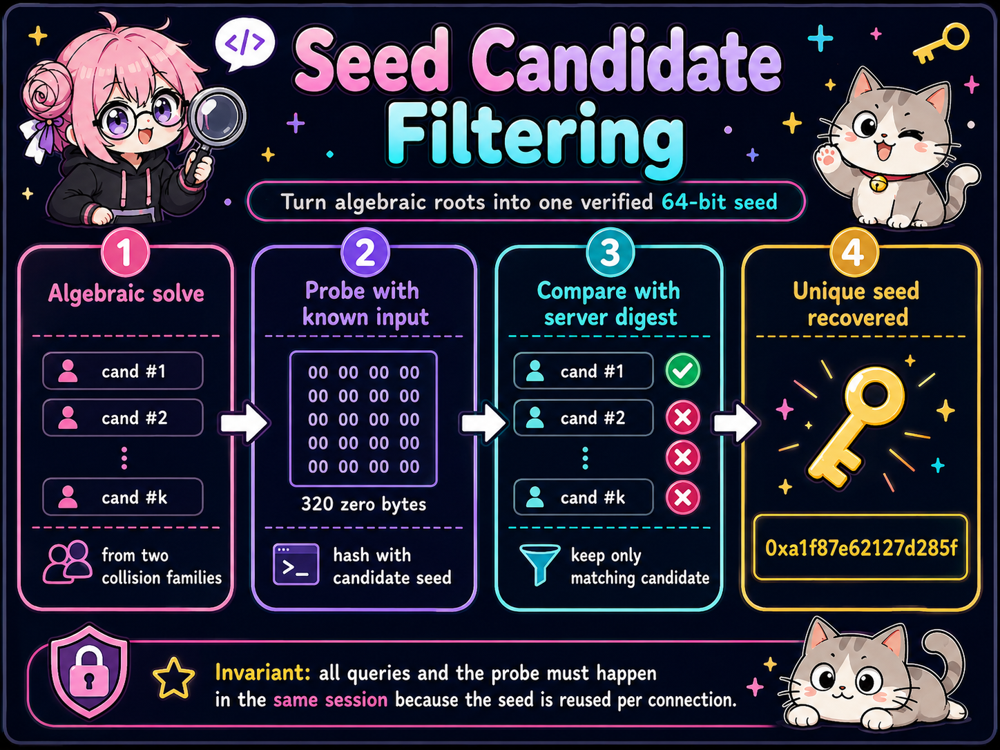
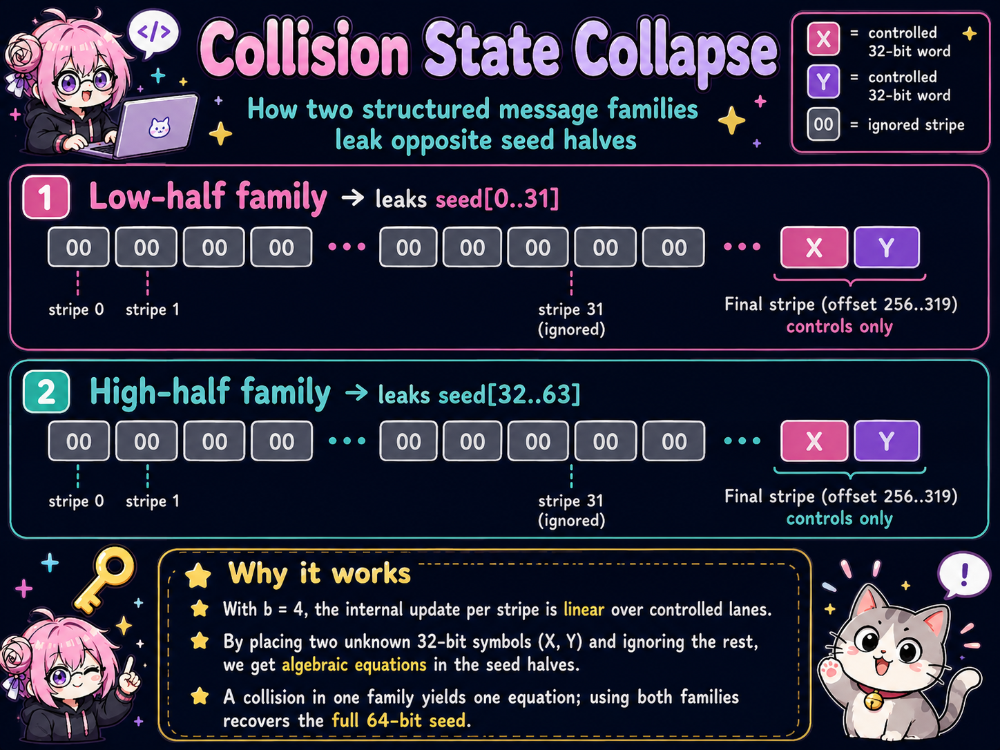
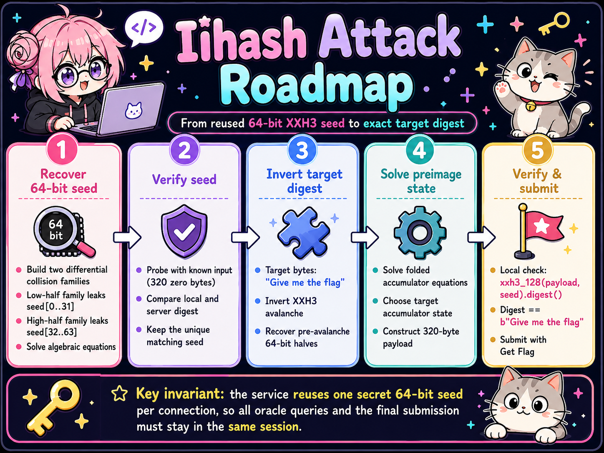
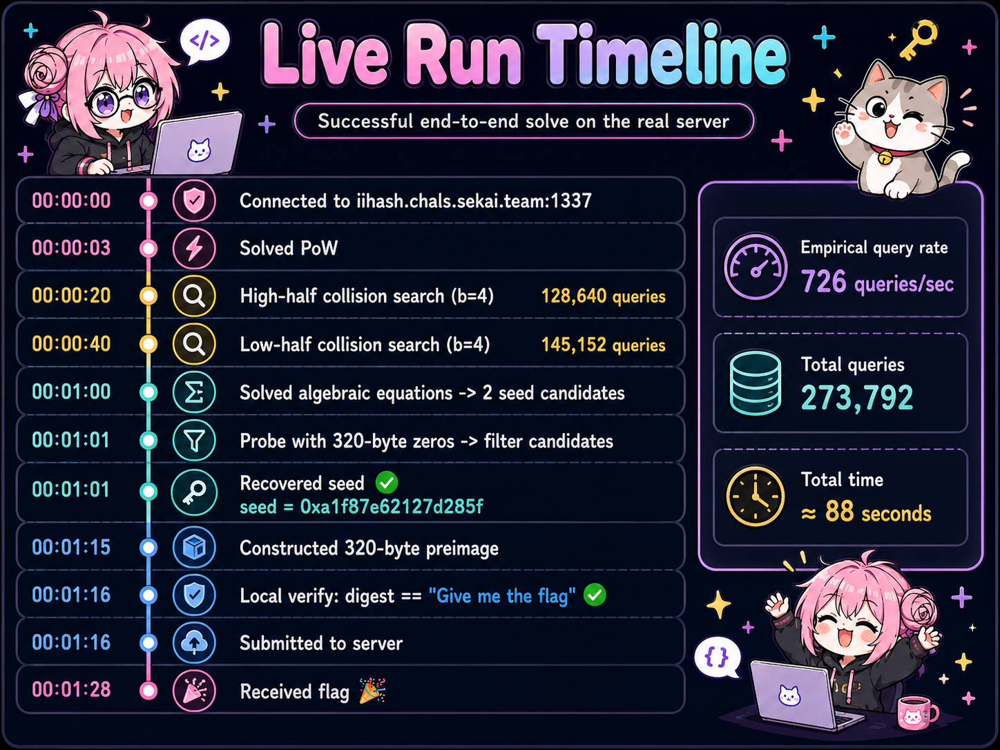

# Iihash - SekaiCTF 2026 writeup

## 1. Challenge Description

> Fast hash is good hash. A secret seed makes it even better, right?    
> Connection    
> `nc iihash.chals.sekai.team 1337`


## 2. TL;DR

I was given a chosen-message `XXH3-128` oracle keyed by one unknown 64-bit seed. The seed was generated once and then reused for every menu action in the same process. To get the flag, I had to submit a message longer than 256 bytes whose **raw 16-byte digest** was exactly:

```text
Give me the flag
```

I did not attack the 128-bit target directly. Instead, I split the solve into two controlled problems:

1. **Recover the seed.** I built two 1024-byte collision families whose variable accumulator contribution occupied only 36 effective bits. Birthday collisions appeared after about `2^18` oracle calls. One family exposed a piecewise-linear equation for the low 32 bits of the seed; the other exposed the high 32 bits.
2. **Construct an exact preimage.** With the seed known, I inverted the final XXH3 avalanche, reduced the merge step to folded-multiplication equations, solved those equations with LLL/BKZ, and realized the resulting eight-accumulator state using a 320-byte message.

The decisive correctness check was local and exact:

```python
xxhash.xxh3_128(payload, seed=seed).digest() == b"Give me the flag"
```

The successful run recovered:

```text
SEKAI{Im4g1n3_U5iNg_LLL_!n_d1ff3rEn7IAL_Cryp7aN@lySis}
```

## 3. Files and Initial Observations

The challenge archive contained two challenge-provided files:

```text
crypto_iihash/
├── challenge.py
└── flag.txt
```

| Challenge-provided artifact | Verified observation | Immediate consequence |
|---|---|---|
| `challenge.py` | The service creates `self.seed = random.getrandbits(64)` once in the constructor | Every hash query and final verification within one connection uses the same 64-bit seed |
| `challenge.py` | Menu option 1 returns `xxhash.xxh3_128(data, seed=self.seed).hexdigest()` | I have a chosen-message hash oracle under that reused seed |
| `challenge.py` | Menu option 2 compares `.digest()` with `b"Give me the flag"` | The target is 16 raw bytes, not a 32-character hexadecimal string |
| `challenge.py` | Both paths reject `len(data) <= 256` | Every accepted message enters the XXH3 long-input path |
| `challenge.py` | `signal.alarm(600)` is installed before the menu starts | Query complexity and network throughput are part of the exploit |
| `flag.txt` | The distributed file contains a dummy flag | It only proves where the server reads the flag after verification; it is not the remote answer |

The important source fragments were small enough to read as a complete specification:

```python
class XXH3Challenge:
    def __init__(self):
        self.seed = random.getrandbits(64)
```

```python
h = xxhash.xxh3_128(data, seed=self.seed).hexdigest()
```

```python
if xxhash.xxh3_128(data, seed=self.seed).digest() == TARGET_DIGEST:
    print("[+] Target verified.", open("flag.txt").read())
```

### Observation → Inference → Design Decision

| Observation | Evidence class | Inference | Design decision |
|---|---|---|---|
| The seed is sampled once per process | **Verified fact** | Reconnecting would discard all information gathered about the current seed | Keep one socket alive from PoW through both collision searches and final submission |
| Arbitrary messages longer than 256 bytes can be hashed | **Verified fact** | I can choose long-path stripes and collect many outputs under fixed hidden state | Model the service as an adaptive chosen-message oracle |
| The hidden state is only 64 bits | **Verified fact** | Seed recovery is a more plausible intermediate goal than a generic 128-bit preimage | Search for structured collision equations in the seed |
| The remote collision families produced repeated full 128-bit digests | **Empirical invariant** | The family construction preserved the complete final state, not merely one lane or one output half | Use each collision as an exact algebraic equality |
| The algebraic candidate reproduced an unrelated 320-byte probe hash | **Empirical invariant** | The candidate was the actual live seed, not just a root of the reduced equations | Require independent oracle confirmation before preimage construction |

At this stage, the live seed, the collision cost, the number of surviving candidates, and the practicality of exact preimage construction were still unknown. I therefore treated the solve as a sequence of falsifiable hypotheses rather than assuming the intended attack from the challenge title.

## 4. Detailed Problem Analysis

### 4.1 The exact win condition ruled out superficial parser tricks

The verifier compares the hash library's raw output with a 16-byte ASCII target:

```python
TARGET_DIGEST = b"Give me the flag"
```

The hash menu, however, prints hexadecimal text. I therefore normalized every oracle response back to 16 bytes before comparing or storing it. Confusing `.hexdigest()` with `.digest()` would preserve all the surrounding mathematics while solving the wrong problem.

A generic preimage attack against a 128-bit output would require approximately `2^128` work. The menu exposed no type mismatch, truncation, or alternate comparison path. The reusable 64-bit seed was the only state small enough to attack directly.

### 4.2 Seeded XXH3 expands one small secret into related words

In the long-input implementation used by the successful solver, XXH3 derives a 192-byte custom secret from the public default secret. For every 16-byte block, the two 64-bit words are adjusted by the same seed with opposite signs:

```text
custom[16i : 16i+8]     = kSecret[16i : 16i+8]     + seed
custom[16i+8 : 16i+16]  = kSecret[16i+8 : 16i+16]  - seed
```

All arithmetic is modulo `2^64`.

This was the first major reduction. The apparent 192-byte secret was not independent entropy; it was a public schedule parameterized by one 64-bit value. My revised goal became:

> Design long messages whose final collision condition becomes a tractable equation in that shared seed.

### 4.3 A 1024-byte layout collapsed the variable state to 36 bits

XXH3's long path maintains eight 64-bit accumulators. I used 1024-byte messages and placed eight independent 4-bit choices diagonally across the stripes so that each selected secret index contributed once to every lane.

For a selected secret word `w` and controlled data word `d`, I measured the variable contribution relative to the zero word as:

```text
Δ(w,d) = lo32(w xor d) · hi32(w xor d)
       + d
       - lo32(w) · hi32(w)                  mod 2^64
```

For one assignment `(t7, …, t14)`, every accumulator received the same variable sum:

```text
S(t7,…,t14) = Σq Δ(wq,dq)                   mod 2^64
```

Therefore, two different assignments with the same `S` produced the same eight accumulator values and consequently the same complete `XXH3-128` digest.

Each assignment contains eight 4-bit choices, so the family has `16^8 = 2^32` messages. The crucial preservation property is that every `Δ` in these families is divisible by `2^28`. Dividing out that fixed factor leaves only 36 effective state bits:

```text
64-bit modular state / 2^28  →  36-bit collision space
```

The birthday scale is therefore:

```text
sqrt(2^36) = 2^18 queries
```

The live collisions after 128,640 and 145,152 queries were consistent with that estimate.



### 4.4 The two families leaked opposite seed halves

I reused the same 4-bit assignments in two different positions:

```text
high family: dq = tq << 60
low family:  dq = tq << 28
```

The labels describe the **data-word position**, not the seed half recovered.

- Changing the high four bits of `d` makes the low 32-bit half of the secret word appear as a coefficient in `Δ`. This family recovers `seed_low`.
- Changing bits 28–31 of `d` makes the high 32-bit half of the secret word appear after lower-half carries and borrows are fixed. This family recovers `seed_high`.

A collision gives:

```text
Σq Δ(wq, dleft,q) = Σq Δ(wq, dright,q)      mod 2^64
```

After removing the common `2^28` factor, the equation is modulo `2^36`. The secret words are affine in a seed half only between carry, borrow, and high-nibble boundaries. I partitioned the 32-bit search ranges at those boundaries. Inside one interval, every relevant term had the form:

```text
A · x + B = 0 mod 2^36
```

I solved that linear congruence inside the interval, rejected roots outside it, reconstructed the 64-bit candidate, and substituted it into both original collision equations.

### 4.5 Candidate verification separated deduction from proof

The two collision equations generate algebraic candidates. They do not by themselves prove that my local model matches the live library exactly.

I queried an unrelated probe:

```python
probe = b"\x00" * 320
```

For each candidate seed, I computed the same probe locally and retained only exact remote matches. In the successful session, the algebraic stage yielded:

```text
0xa1f87e62127d285f
```

and the independent probe confirmed it.



This seed is a **run-specific intermediate value**, not a constant in the solver. A new process chooses a new seed and the attack repeats.

### 4.6 Recovering the seed was only half of the solve

With the seed known, I still needed an exact preimage for `b"Give me the flag"`.

The final XXH3 avalanche is invertible because it is composed of XOR-with-shift operations and multiplication by odd constants modulo `2^64`. Inverting it on the two target halves gave the required pre-avalanche merge values used by the solver:

```text
low  = 0x26d73906e5b3b9f7
high = 0x00b0c1155830d0a5
```

The long-input merge combines four accumulator pairs through:

```text
fold_mul(a,b) = lo64(a·b) xor hi64(a·b)
```

I partitioned the four pairs so that two pairs controlled the low merge and two controlled the high merge. By setting one operand of the unwanted merge to zero, each target half reduced to:

```text
fold_mul(c0,x0) + fold_mul(c1,x1) = T mod 2^64
```

I chose `x0`, subtracted its contribution, and inverted the remaining `fold_mul(c1,x1)` equation.

Writing `c·x = q·2^64 + r` and using `r xor q = T` turns divisibility by `c` into a 64-variable modular subset-sum in the bits of `q`. The solver encodes that relation in a 66-dimensional lattice, applies LLL followed by a small BKZ pass, and accepts a vector only after exact arithmetic checks.

Finally, I realized the selected eight-accumulator state with five 64-byte stripes, for a total payload length of 320 bytes. Each chosen data word differs from its stripe secret in only one 32-bit half, so:

```text
lo32(data xor secret) · hi32(data xor secret) = 0
```

That removes the nonlinear product term and leaves direct, controllable additions into the partner lanes.


The final payload was never submitted on faith. The solver first called the real local `xxhash` implementation and required the raw digest to equal the target exactly.

## 5. Challenge-specific Concept Map



The map emphasizes the dependency chain: the preimage stage is meaningful only after the live seed has been independently verified, and final submission occurs only after complete local hashing succeeds.

## 6. Exploitation Walkthrough / Flag Recovery

I kept one connection alive throughout the attack.

### Step 1 — Prepare PoW before consuming the challenge timer

The solver locates or caches the `pwn.red` helper before connecting. Once connected, it parses and solves the actual token:

```text
[*] Connected to iihash.chals.sekai.team:1337
[*] PoW challenge: s.AAAnEA==.qmQg/QXTlEMOxpwBw1mn+A==
[+] PoW solved in 2.85s
```

### Step 2 — Search the high-bit message family

Requests were pipelined in batches of 384. The first full-digest collision arrived at:

```text
[+] high-half collision after 128,640 queries (726 q/s)
```

This collision supplied the equation for the low 32 bits of the seed.

### Step 3 — Search the low-bit message family

The second full-digest collision arrived at:

```text
[+] low-half collision after 145,152 queries (726 q/s)
```

The two searches used 273,792 oracle queries in total.

### Step 4 — Recover and confirm the live seed

The piecewise congruence solver produced one candidate, then the independent probe confirmed it:

```text
[*] Recovering the 64-bit seed from collision equations
[+] Algebraic seed candidates: 0xa1f87e62127d285f
[+] Recovered seed: 0xa1f87e62127d285f
```

### Step 5 — Construct and verify the target preimage

The lattice stage solved the two folded-sum targets in a few randomized attempts:

```text
[*] Constructing an exact XXH3-128 preimage for b'Give me the flag'
[+] Fold sums solved (low attempts=5, high attempts=2)
[+] Local verification: b'Give me the flag'
```

### Step 6 — Submit through menu option 2

The server recomputed the digest with the same seed and returned:

```text
[+] Target verified. SEKAI{Im4g1n3_U5iNg_LLL_!n_d1ff3rEn7IAL_Cryp7aN@lySis}
```



### Recovered flag

```text
SEKAI{Im4g1n3_U5iNg_LLL_!n_d1ff3rEn7IAL_Cryp7aN@lySis}
```

## 7. Final Solver Logic

The final `solve.py` is one end-to-end program. It does not hard-code the live seed, collision assignments, or final payload.

| Phase | Core functions | Required invariant before continuing |
|---|---|---|
| Reproduce seeded secret schedule | `custom_secret()` | All 24 words derive from one 64-bit candidate exactly as the local XXH3 model expects |
| Generate structured messages | `collision_message_hex()` | Every message is exactly 1024 bytes and follows the selected diagonal layout |
| Find full-digest collisions | `find_remote_collision()` | Two distinct assignments produce identical 16-byte oracle outputs |
| Recover seed halves | `recover_seed_candidates()` | Candidate satisfies both original collision equations, not only reduced interval equations |
| Verify candidate remotely | `query_one_hash()` | Local and remote hashes of an unrelated 320-byte probe are equal |
| Solve final merge state | `construct_target_accumulators()` | Recomputed low/high pre-avalanche merge values match both target constants |
| Invert folded multiplication | `invert_fold_mul()` | Divisibility, range, quotient bits, and `fold_mul()` are rechecked exactly |
| Realize message bytes | `construct_preimage()` | The 320-byte payload produces the selected eight-accumulator state |
| Submit | `run_live()` | Local `xxhash.xxh3_128(...).digest()` equals `b"Give me the flag"` |

The runtime engineering is as important as the algebra:

- one persistent socket preserves the seed;
- the PoW binary is cached before the timed session;
- 384 hash requests are sent per batch;
- a receive buffer extracts multiple hash lines without round-trip synchronization;
- a Feistel permutation explores the `2^32` assignment space without a structured prefix;
- the collision table is freed between families;
- every stochastic lattice result is followed by deterministic verification.

The included `--self-test` runs the complete cryptanalytic pipeline offline with seed `0x123456789abcdef0`, including collision discovery, seed recovery, lattice inversion, 320-byte payload generation, and exact final hashing.

## 8. Meaningful Failed Attempts and Debugging

I did not preserve a genuine failed cryptanalytic branch from this solve, so I do not invent one. The meaningful debugging came from protecting the attack against several easy-to-miss model and deployment errors.

### Remote throughput, not local arithmetic, controlled feasibility

The live service sustained about `726 q/s`. At that rate, 273,792 queries consumed roughly 377 seconds, leaving a limited margin under the 600-second alarm.

**Resulting change:** I treated request batching as part of the exploit. A per-query request/response design would spend the timer on network latency rather than cryptanalysis.

### The displayed hash and the checked hash use different representations

Option 1 prints hexadecimal text; option 2 compares raw bytes.

**Resulting check:** oracle output is decoded with `bytes.fromhex()`, while the final assertion compares `.digest()` directly with `b"Give me the flag"`.

### Piecewise algebra can produce boundary artifacts

The seed equations are affine only while carries, borrows, and selected high nibbles remain fixed.

**Resulting check:** every interval root is substituted into both exact collision equations before it becomes a candidate.

### A collision-equation root is not yet the live seed

A locally consistent candidate could still reflect a modeling or library mismatch.

**Resulting check:** the candidate must reproduce an unrelated remote 320-byte probe.

### A short lattice vector is not automatically a semantic solution

LLL/BKZ optimizes vector length, not my intended quotient-bit interpretation.

**Resulting check:** the solver reconstructs the bits, verifies divisibility and range, recomputes `fold_mul`, recomputes both final merge values, and finally hashes the full payload with the actual library.

These checks are why the final solve is reproducible: each transition from model to implementation has an independent acceptance condition.

## 9. What We Learned

1. **Seeded does not automatically mean keyed.** Reusing a small seed behind a chosen-message oracle can expose enough related structure to recover it.
2. **The input restriction selected the vulnerable path.** Requiring more than 256 bytes forced the regular stripe-and-accumulator code that made controlled state construction possible.
3. **The main cryptanalytic gain came from message design.** The useful collision was not a generic XXH3 collision; it was a family whose variable state collapsed from 64 to 36 bits while preserving the full final digest.
4. **Cross-half multiplication leaks opposite information.** Moving four controlled bits between the upper word and the upper part of the lower half exposed different halves of the secret-derived word.
5. **Lattices work best after aggressive reduction.** LLL/BKZ solved one precise 64-bit folded-multiplication inversion, not the entire hash function at once.
6. **Correctness arguments belong in the exploit.** Exact collision substitution, independent seed probing, merge verification, and final local hashing were not optional debugging aids; they were part of the proof that the payload would work.
7. **Complexity must include the wire.** The `2^18` birthday design was viable only because the client pipelined the remote oracle efficiently enough to fit the server alarm.

## 10. Reproduction Steps

Install the dependencies and run the solver:

```bash
python3 -m pip install xxhash fpylll cysignals
python3 solve.py
```

Important successful output:

```text
[+] high-half collision after 128,640 queries (726 q/s)
[+] low-half collision after 145,152 queries (726 q/s)
[+] Recovered seed: 0xa1f87e62127d285f
[+] Local verification: b'Give me the flag'
[+] FLAG: SEKAI{Im4g1n3_U5iNg_LLL_!n_d1ff3rEn7IAL_Cryp7aN@lySis}
```

The seed and collision counts are run-specific. The recovered flag is:

```text
SEKAI{Im4g1n3_U5iNg_LLL_!n_d1ff3rEn7IAL_Cryp7aN@lySis}
```
