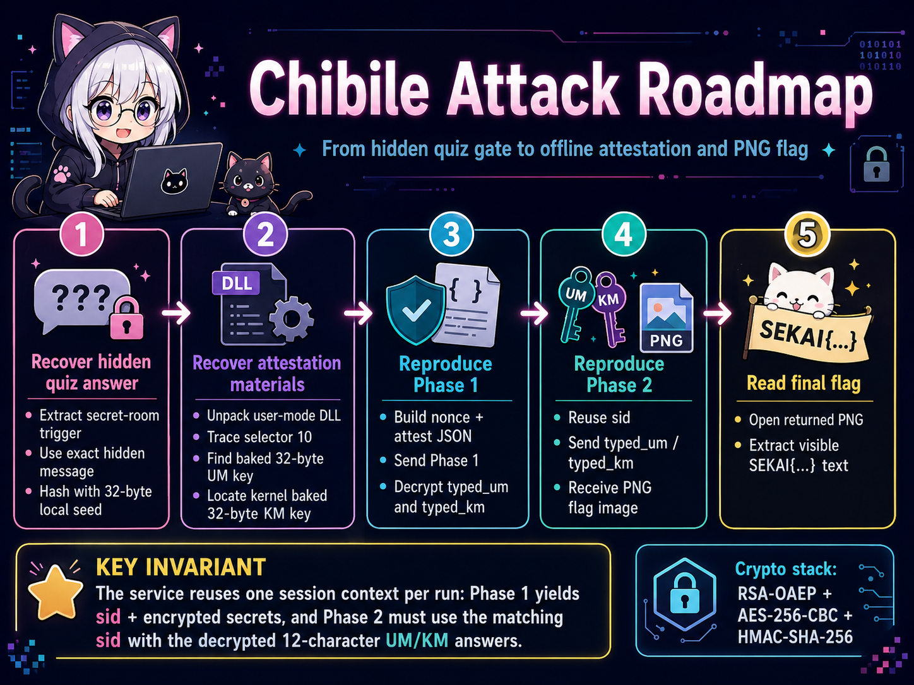
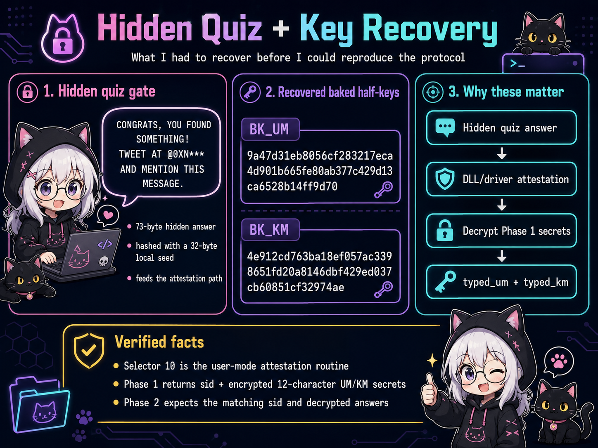
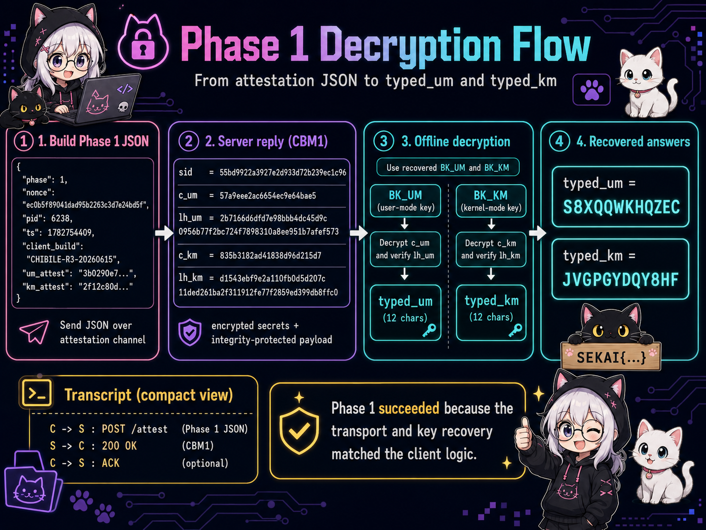
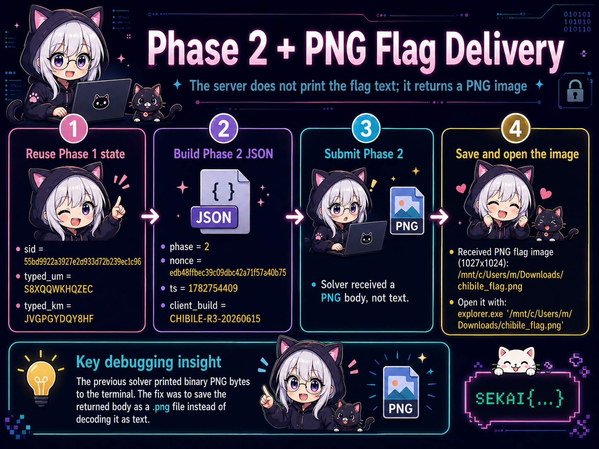
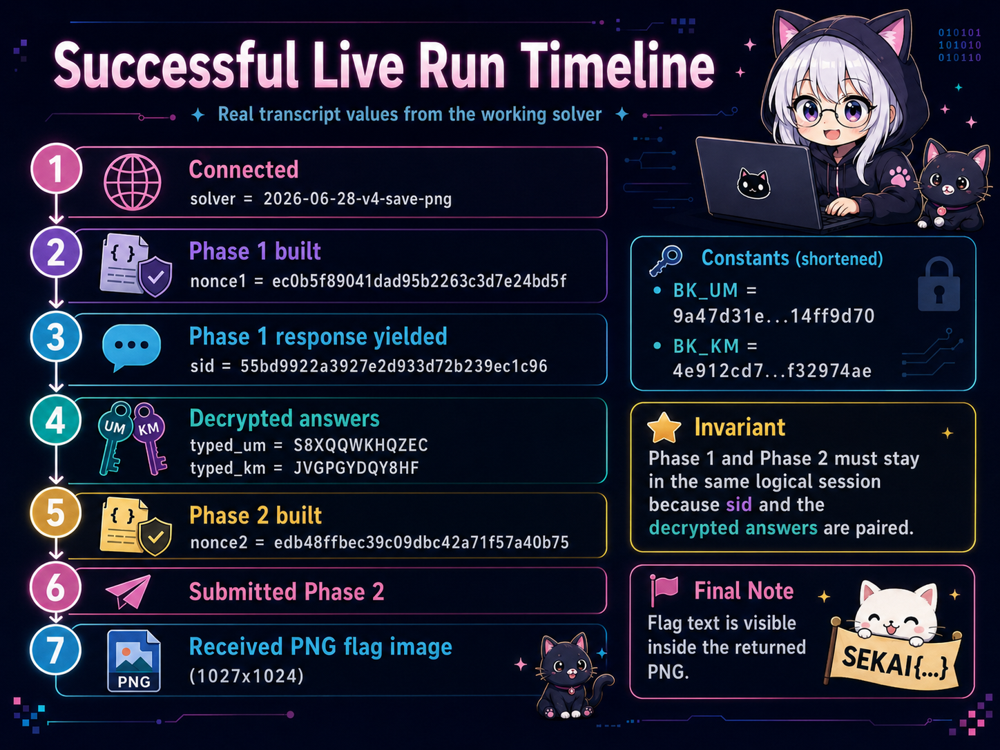
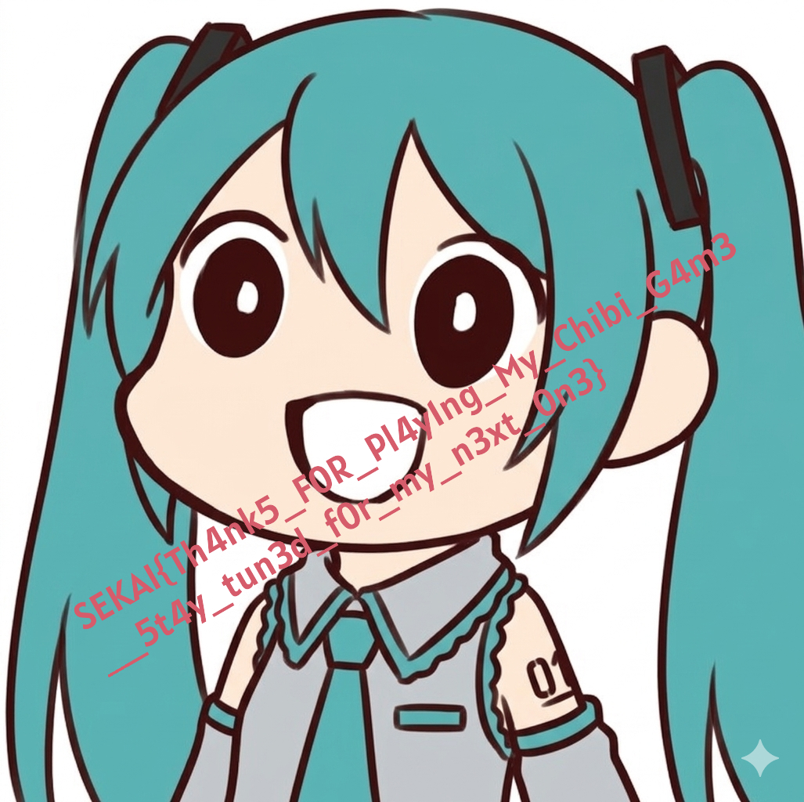

# Chibile - SekaiCTF 2026 writeup

## 1. Challenge Description

> I just created a mini anime knowledge game, and I wanted to share it with you. Can you give it a try? but no cheating ok😉

## 2. TL;DR

I did not solve the visible anime quiz in the intended UI. I treated the package as a protocol-recovery problem.

The main executable contained the Phase 1 and Phase 2 JSON formats, the `CBL2`/`CBR2` transport markers, the client build string, and a final `LoadImageFromMemory(".png", ...)` path. The user-mode DLL and kernel-style driver contained the two baked 32-byte half-keys required by the provided Phase 1 decryption formulas.

My solve was:

1. recover the hidden secret-room branch and reproduce its UM/KM attestation values;
2. rebuild the authenticated RSA-OAEP + AES-256-CBC transport;
3. submit Phase 1 and receive `{sid, c_um, lh_um, c_km, lh_km}`;
4. decrypt the two 12-character answers using the correct DLL/driver half-keys;
5. submit the matching `sid`, `typed_um`, and `typed_km` in Phase 2;
6. save the returned `CBF2` body as a PNG and read the flag from the image.



The recovered flag was:

```text
SEKAI{Th4nk5_F0R_Pl4y1ng_My_Chibi_G4m3__5t4y_tun3d_for_my_n3xt_0n3}
```

## 3. Files and Initial Observations

The challenge archive contained six challenge-provided files:

```text
rev_chibile/
├── Chibile_Launcher.exe
├── PROTOCOL.md
├── chibile.exe
├── eac_nocrt.dll
├── eac_shield.sys
└── raylib.dll
```

| File | Verified observation | Why it mattered |
|---|---|---|
| `Chibile_Launcher.exe` | Small PE64 GUI launcher; it contains the `Global\\CHIBILE_SINGLE_INSTANCE` mutex string | It was only a bootstrap/single-instance wrapper, not the main cryptographic logic |
| `chibile.exe` | Large PE64 GUI executable containing `CBL2`, `CBR2`, `CBM1`, `CBF2`, `CHIBILE-R3-20260615`, both JSON templates, `secret-room`, and `LoadImageFromMemory` | This was the protocol orchestrator and revealed the two-phase state machine |
| `eac_nocrt.dll` | Packed/obfuscated PE64 DLL; the active 32-byte UM half-key appears at file offset `0x5430` / RVA `0x6030` | Required to decrypt `c_um` |
| `eac_shield.sys` | PE64 native driver-style image; the active 32-byte KM half-key appears at file offset `0x820` / RVA `0x1420` | Required to decrypt `c_km` |
| `PROTOCOL.md` | Gives the exact `DK`, `KS`, rotation, and XOR equations for both secrets | Reduced the final task from guessing to recovering the correct baked keys |
| `raylib.dll` | GUI/image dependency | Supported the observation that the successful response was rendered as an image |

The service itself gave me several useful runtime artifacts:

- Phase 1 plaintext began with `CBM1` and contained a JSON object with `sid`, `c_um`, `lh_um`, `c_km`, and `lh_km`.
- Both decrypted answers were 12 characters from `ABCDEFGHJKLMNPQRSTUVWXYZ23456789`.
- Phase 2 plaintext began with `CBF2` and its body began with the PNG signature.
- A successful run returned a `1027x1024` image rather than a textual flag response.

### Observation → Inference → Design Decision

| Observation | Evidence class | Inference | Design decision |
|---|---|---|---|
| The main executable embeds both Phase JSON templates | **Verified fact** | The game is a deterministic two-phase protocol client | Reproduce the protocol directly instead of automating the GUI |
| `PROTOCOL.md` gives exact secret transforms but leaves `BK` unspecified | **Verified fact** | The hard part is selecting the live 32-byte constants from the DLL and driver | Trace data references and validate candidates against live Phase 1 ciphertexts |
| The response object includes a server-issued `sid` | **Verified fact** | Phase 2 is bound to Phase 1 logically, even if each request uses a new TCP connection | Preserve the exact `sid` and submit its matching decrypted answers |
| Candidate keys that were merely adjacent in the binary produced non-ASCII output | **Empirical invariant** | Proximity is not sufficient evidence that a constant is active | Require 12-character alphabet validation and captured-response regression tests |
| The `CBF2` body starts with `89 50 4e 47 0d 0a 1a 0a` | **Verified runtime fact** | The final response is a PNG, not terminal text | Save bytes to disk and parse dimensions before displaying them |
| Large unrelated DLL/driver regions were not needed after the active paths were isolated | **Deduction** | Much of the file size is anti-analysis surface or irrelevant payload | Reverse only the dispatcher, attestation, key references, and protocol path |

### Explicit unknowns

I did not need to prove the intended purpose of every packed section or every unused DLL selector. Those regions remained outside the minimal correctness argument for the solver.

## 4. Detailed Problem Analysis

### 4.1 Locating the real protocol client

The visible game suggested that the quiz itself was the challenge. Static strings in `chibile.exe` changed that model immediately:

```text
CBL2
CBR2
CBM1
CBF2
CHIBILE-R3-20260615
{"phase":1,...}
{"phase":2,...}
LoadImageFromMemory
```

That was enough to form a testable hypothesis:

> The quiz and anti-cheat components generate attestations, but the flag is delivered by a separate two-phase network protocol that can be reproduced offline.

The successful live run confirmed this. The solver never launched the Windows GUI, yet it completed both phases and received the same PNG that the GUI would have rendered.

### 4.2 Recovering the secret-room branch and attestations

The hidden quiz message was:

```text
CONGRATS, YOU FOUND SOMETHING! TWEET AT @0XN*** AND MENTION THIS MESSAGE.
```

Its role was to identify the secret-room path. The exact gate value used by the solver was derived as:

```text
secret_room_digest = HMAC-SHA256(QUIZ_SEED, "secret-room")
```

with:

```text
QUIZ_SEED =
81928d9335c6452d2588b681d6ef9807
5a79b38684840fac5198c40e4842c0de

secret_room_digest =
78a39767f1c301728aa1f169ffe9b486
3207805ad6f2396c606c86bc32c1d31e
```

Following the user-mode gate path produced the fixed `UM_GATE`:

```text
bb41607fc79bd502145ec8cd92ce5e20
5e13e8fc9f16da18f2e441c81c0b5789
```

For a fresh 16-byte request nonce, the attestations are:

```text
um_attest = HMAC-SHA256(UM_GATE, "UM-ATTEST" || nonce)

km_gate   = HMAC-SHA256(
              "CHIBILE-GATE-V1",
              um_attest || KM_ATTEST_CONST
            )

km_attest = HMAC-SHA256(km_gate, "KM-ATTEST" || nonce)
```



The important preservation property is that the nonce used in the attestation JSON is the same nonce carried by that request's transport envelope. Any mismatch changes both HMAC outputs and invalidates Phase 1.

### 4.3 Rebuilding the `CBL2` transport

Each request creates three fresh 32-byte values plus the 16-byte request nonce:

```text
enc_key || mac_key || mask_key || nonce    # 112 bytes total
```

That package is encrypted with the public RSA key using RSA-OAEP with SHA-256. The JSON plaintext is transformed in three layers:

1. XOR with a block stream:

   ```text
   mask_block(b) = HMAC-SHA256(mask_key, nonce || u64le(b))
   ```

2. AES-256-CBC with PKCS#7 padding and a fresh IV.
3. HMAC-SHA256 over the full request body.

The request body is:

```text
CBL2 || nonce || rsa_oaep(112-byte package) || iv || ciphertext || hmac
```

The TCP stream adds a 4-byte little-endian length prefix. The response mirrors the authenticated encryption layer:

```text
u32le(length) || CBR2 || iv || ciphertext || hmac
```

This design means Phase 1 and Phase 2 do **not** need to reuse one TCP socket. Their logical binding comes from the server-issued `sid`, while every request uses a fresh envelope and nonce.

### 4.4 Phase 1: decrypting the UM and KM answers

A successful Phase 1 response is:

```text
CBM1 || { sid, c_um, lh_um, c_km, lh_km }
```

The challenge-provided `PROTOCOL.md` defines, for each secret:

```text
DK     = HMAC-SHA256(BK, LH)
KS(b)  = HMAC-SHA256(DK, tag || u32le(b))
```

For the user-mode answer:

```text
S[i] = rotl8(C[i] xor KS(b)[j], 3) xor BK[j]
tag  = "UM-KS"
```

For the kernel-mode answer:

```text
S[i] = rotr8(C[i] xor DK[(i*7) mod 32], 3) xor KS(b)[j]
tag  = "KM-KS"
```

The active keys were:

```text
BK_UM =
9a47d31eb8056cf283217eca4d901b66
5fe80ab377c429d13ca6528b14ff9d70

BK_KM =
4e912cd763ba18ef057ac3398651fd20
a8146dbf429ed037cb60851cf32974ae
```

I validated them in three independent ways:

- each output decoded as ASCII;
- each output had length 12 and used only the documented alphabet;
- two earlier live Phase 1 captures were added to `--self-test` as regression vectors.



For the final successful run, the server returned:

```text
sid      = 55bd9922a3927e2d933d72b239ec1c96
typed_um = S8XQQWKHQZEC
typed_km = JVGPGYDQY8HF
```

These values are session-specific. The keys and formulas are stable; the encrypted answers and `sid` are not.

### 4.5 Phase 2: the flag is an image

Phase 2 submits:

```json
{
  "phase": 2,
  "nonce": "<fresh 16-byte nonce>",
  "sid": "<Phase 1 sid>",
  "typed_um": "<decrypted UM answer>",
  "typed_km": "<decrypted KM answer>",
  "ts": 1782754409,
  "client_build": "CHIBILE-R3-20260615"
}
```

The response begins with `CBF2`. The original client passes the body to `LoadImageFromMemory(".png", ...)`, so treating it as UTF-8 is incorrect. The final solver checks the PNG signature, reads the `IHDR` dimensions, writes the body to disk, and prints only a safe path.



## 5. Challenge-specific Concept Map


The core dependency chain is:

```text
secret-room path
    → valid UM/KM attestations
    → accepted Phase 1
    → sid + encrypted UM/KM answers
    → correct baked keys + PROTOCOL.md formulas
    → typed_um + typed_km
    → accepted Phase 2
    → CBF2 PNG body
    → visible flag
```

No individual step can be skipped: the attestations unlock Phase 1, the Phase 1 `sid` binds Phase 2, and the two answers must be decrypted with the correct mode-specific formulas.

## 6. Exploitation Walkthrough / Flag Recovery

I ran:

```bash
python3 solve.py -v --output chibile_flag.png
```

The successful transcript began by proving that the solver used the corrected constants:

```text
[*] solver     = 2026-06-28-v4-save-png
[*] BK_UM      = 9a47d31eb8056cf283217eca4d901b665fe80ab377c429d13ca6528b14ff9d70
[*] BK_KM      = 4e912cd763ba18ef057ac3398651fd20a8146dbf429ed037cb60851cf32974ae
```

Phase 1 used:

```text
nonce1    = ec0b5f89041dad95b2263c3d7e24bd5f
um_attest = 3b0290e786addede9c3f56733fe1f331ceffc2ad77098a0201df018cf018eb52
km_attest = 2f12c80d54b53fb0ca82827a5a5025e72ec3a3331a7ab1a41d9f42eeb4dbda27
```

The response decrypted to:

```text
[+] SID      = 55bd9922a3927e2d933d72b239ec1c96
[+] typed_um = S8XQQWKHQZEC
[+] typed_km = JVGPGYDQY8HF
```

The solver then submitted a fresh Phase 2 envelope while preserving the logical Phase 1 state:

```text
nonce2 = edb48ffbec39c09dbc42a71f57a40b75
```

The final result was:

```text
[+] Received PNG flag image (1027x1024): /mnt/c/Users/m/Downloads/chibile_flag.png
```



The returned image is included in this package:



Reading the two wrapped lines carefully gives **two underscores** between `G4m3` and `5t4y`:

```text
SEKAI{Th4nk5_F0R_Pl4y1ng_My_Chibi_G4m3__5t4y_tun3d_for_my_n3xt_0n3}
```

## 7. Final Solver Logic

The final `solve.py` is organized around five independently testable components.

| Component | Responsibility | Correctness check |
|---|---|---|
| Hidden gate / attestation | Reproduce `secret_room_digest`, `UM_GATE`, `um_attest`, and `km_attest` | Fixed nonce vector in `--self-test` |
| Crypto backend | RSA-OAEP/SHA-256 and AES-256-CBC/PKCS#7 | Encrypt/decrypt round trip and exact RSA ciphertext length |
| CBL2 transport | Mask, encrypt, authenticate, frame, receive, verify, decrypt | HMAC comparison and required `CBR2` magic |
| Phase 1 decoder | Parse `CBM1`, derive `DK`/`KS`, decrypt both 12-character values | Alphabet/length validation plus two captured live vectors |
| Phase 2 handler | Submit matching state and save `CBF2` body | PNG signature and `IHDR` dimensions before writing |

The solver also supports offline analysis:

```bash
python3 solve.py --inner-json '<captured Phase-1 object>'
```

That mode was useful while correcting key extraction because it separated network/transport correctness from the secret-decryption formulas.

## 8. Meaningful Failed Attempts and Debugging

### 8.1 Selecting nearby constants instead of referenced constants

My first solver used incorrect 32-byte blocks. The transport succeeded and the server returned a valid `CBM1` object, but UM decryption failed immediately:

```text
ValueError: decrypted UM secret is not ASCII:
4333d407071c7c997321f811
```

That failure was useful evidence. It showed that the RSA/AES/HMAC transport and Phase 1 parsing were already correct; the error was isolated to the baked key or final decryption model.

I revised the model from:

> “The adjacent 32-byte-looking block is probably the key.”

into:

> “Only a block consumed by the active routine, and validated against a live response, is acceptable.”

Tracing the actual references led to `BK_UM` at RVA `0x6030` and `BK_KM` at RVA `0x1420`.

### 8.2 Running a stale solver copy

A second run still produced:

```text
decrypted UM secret is not ASCII: 4ebee95db505875fb2732fe9
```

That byte pattern matched the stale `932a...` key, proving the corrected file had not actually been executed. I added:

- an explicit solver version banner;
- verbose printing of both baked keys;
- a second captured Phase 1 regression vector.

This converted a file-version problem into something visible in the first three output lines.

### 8.3 Printing compressed PNG bytes to the terminal

After Phase 2 succeeded, the earlier solver decoded the `CBF2` body as text. The result was terminal garbage and escape sequences, even though the challenge had already been solved.

The corrected model came directly from the client import path:

```text
LoadImageFromMemory(".png", body, length)
```

The fix was to test for the PNG signature and save the bytes instead of printing them. This is why the final solver reports dimensions and an output path.

### 8.4 Reading the rendered flag

The diagonal text wrapped across two lines, and the ambiguous separator after `G4m3` caused several incorrect submissions. Rotating the image made the exact text clear: the separator is `__`, not `___`.

## 9. What We Learned

1. **Protocol strings can collapse a large reversing target.** Four magic values and two JSON templates were more valuable than blindly exploring megabytes of packed code.
2. **A provided formula does not remove the reversing task.** `PROTOCOL.md` specified the transforms, but the active `BK_UM` and `BK_KM` still had to be recovered from the correct execution paths.
3. **Live ciphertext is a strong oracle for static analysis.** ASCII, length, alphabet, and HMAC-related invariants rejected decoy constants immediately.
4. **Logical sessions are not necessarily TCP sessions.** Phase 1 and Phase 2 use independent encrypted envelopes; the `sid` and decrypted answers preserve the actual state.
5. **Output type is part of the protocol.** A correct cryptographic solve can still appear broken if a PNG body is interpreted as text.
6. **Regression vectors matter in reverse engineering.** The two captured Phase 1 objects now detect both a wrong key and accidental execution of an old solver revision.
7. **The minimal proof is end-to-end.** The strongest correctness argument was not any single static observation; it was successful attestation, valid Phase 1 decryption, accepted Phase 2, and a rendered flag image.

## 10. Reproduction Steps

Install one supported crypto backend:

```bash
python3 -m pip install cryptography
```

Run the offline regression tests:

```bash
python3 solve.py --self-test
```

Run the exploit:

```bash
python3 solve.py -v --output chibile_flag.png
```

Expected final lines:

```text
[+] typed_um = <12 characters>
[+] typed_km = <12 characters>
[*] submitting Phase 2
[+] Received PNG flag image (1027x1024): .../chibile_flag.png
```

Open the returned image under WSL:

```bash
explorer.exe "$(wslpath -w "$PWD/chibile_flag.png")"
```

Recovered flag:

```text
SEKAI{Th4nk5_F0R_Pl4y1ng_My_Chibi_G4m3__5t4y_tun3d_for_my_n3xt_0n3}
```
