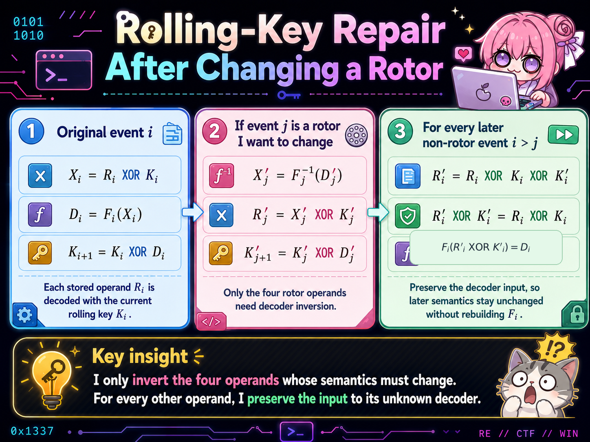
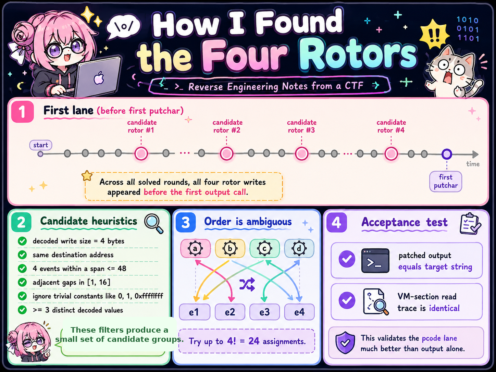
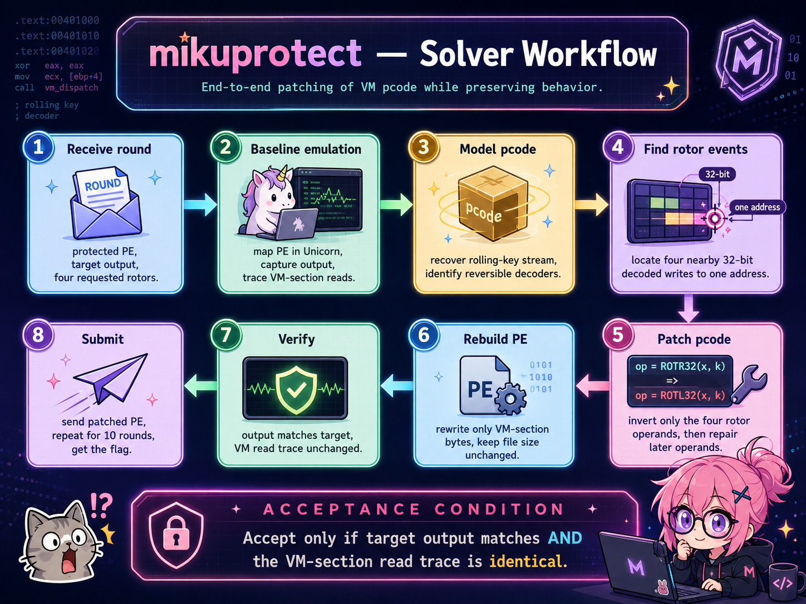

# mikuprotect - SekaiCTF 2026 writeup

<p align="center">
  
</p>

<p align="center"><em>Me after realizing the server was going to generate a fresh VMProtect-style binary for every round.</em></p>

## 1. Challenge Description

> vmprotect challenges are soooo unfun to solve, but what about patching the pcode of the vmprotect's vm?
>
> for each round, the server sends a protected sample and a target output string, patch only the vm pcode for the protected main so the binary prints the requested string
>
> the execution flow, and pcode lane must stay the same
>
> ib: all artists i (https://soundcloud.com/es3n1n) follow on soundcloud
>
> https://soundcloud.com/syuenn/vol2_ch4

## 2. TL;DR

The most important sentence in the challenge was not “print the requested string.” It was:

> **the execution flow, and pcode lane must stay the same**

That changed the problem completely. I was not looking for a code-injection primitive; I was looking for a way to **change four semantic values inside a stateful VM operand stream without changing how the stream was consumed**.

The final insight was:

> I only invert the four operand decoders whose semantics must change. For every later operand, I preserve the input to its unknown decoder.

For each round, I:

1. emulated the protected `main` with Unicorn;
2. traced reads from the VM section;
3. recognized operands protected by a rolling XOR key;
4. found four clustered initialization events before the first `putchar`;
5. tried the possible assignments of requested `(a,b,c,d)` to those events;
6. inverted only those four local decoders;
7. repaired the downstream stream by preserving each later decoder input; and
8. accepted a patch only when the target output matched and the complete VM-section read trace was identical.

After ten accepted rounds, the server returned:

```text
SEKAI{th3_fl4g_1s_th3_l1c3n5e3_w3_b4nn3d_al0ng_th3_w4y_https://imgur.com/a/HdsvLu3}
```

## 3. Files and Initial Observations

There was no single static binary that I could reverse once. The service sent the real input at runtime:

- a freshly generated protected PE;
- its size and SHA-256 digest;
- a 33-byte target output;
- four requested 32-bit values named `a`, `b`, `c`, and `d`; and
- a prompt for the patched PE.

The accepted run gave me several clues before I understood any VM internals.

### 3.1 The observations that shaped the solve

| Observation | What it suggested | Design decision |
|---|---|---|
| PE sizes ranged from about 2.50 MB to 2.56 MB | The service regenerated the binary, not just the target | Do not hard-code file offsets |
| Rotor event indices moved between rounds | Even locations inside the pcode lane were unstable | Detect events by behavior |
| Every target was exactly 33 bytes | The output routine probably kept the same shape | Preserve the original lane instead of replacing it |
| The unmodified binary printed the same 33-byte garbage string in every round | The protected program's baseline semantics were stable while the encoding changed | Search for a small stable state controlling the output |
| The same four decoded constants appeared in every sample | These values were semantic anchors, not random decoder noise | Track decoded values and their write behavior |
| The four values appeared close together before the first `putchar` | They looked like initialization, not per-character output operations | Analyze the pre-output prefix as the “first lane” |
| A successful patch changed 740–971 bytes, not merely 16 bytes | Changing four values affected a stateful downstream stream | Repair every later dependent operand |
| The full VM read trace could remain identical after patching | A data-only transformation was possible | Use trace equality as the acceptance invariant |

This table is the solve in miniature: the data told me that the **syntax** was randomized, while the **data flow** remained stable.

### 3.2 Concrete evidence from the ten accepted rounds

| Round | PE size | First-lane reads | Full VM reads | Rotor event indices | Changed bytes |
|---:|---:|---:|---:|---|---:|
| 1 | 2,512,384 | 412 | 10,010 | `[86,94,102,111]` | 916 |
| 2 | 2,539,520 | 427 | 10,072 | `[93,101,110,118]` | 954 |
| 3 | 2,526,208 | 425 | 10,027 | `[92,101,110,119]` | 944 |
| 4 | 2,507,776 | 404 | 10,112 | `[89,98,106,113]` | 877 |
| 5 | 2,556,416 | 409 | 10,372 | `[90,98,106,113]` | 740 |
| 6 | 2,541,056 | 422 | 10,064 | `[95,103,111,120]` | 928 |
| 7 | 2,554,368 | 421 | 10,189 | `[87,96,105,114]` | 971 |
| 8 | 2,510,848 | 425 | 9,880 | `[88,97,106,114]` | 965 |
| 9 | 2,537,984 | 420 | 10,016 | `[89,99,108,117]` | 947 |
| 10 | 2,504,704 | 411 | 10,076 | `[91,99,106,113]` | 891 |

The event indices moved, but their *relationship* did not: four nearby events, inside the pre-output prefix, produced the same baseline decoded values:

```text
0x8db4cbbf
0x3bb7e401
0x8a508236
0x3bbedbff
```

That was my first reliable semantic signature.

## 4. Detailed Problem Analysis

### 4.1 Reading the challenge statement as a technical constraint

The phrase “patch only the VM pcode” ruled out native-code replacement.

The phrase “execution flow and pcode lane must stay the same” ruled out changing the sequence of VM operations.

So the intended object to modify was not the native dispatcher or the output call. It had to be **data already consumed by the original VM path**.

That led to my first working hypothesis:

> The target output is controlled by a small number of pcode operands. If I can re-encode those operands and compensate for any state they disturb, I can preserve the lane.

### 4.2 Why I emulated before trying to devirtualize

A full devirtualizer would have had to survive a fresh randomized decoder in every round. That was solving a much larger problem than the server asked.

Instead, I treated the binary as an executable experiment.

I mapped the PE in Unicorn, provided only the runtime state needed by the protected `main`, stubbed the relevant imports, and recorded two things:

- bytes passed to `putchar`;
- every read from the VM section as:

```text
(section-relative address, read size, reader RIP)
```

This gave me a semantic trace without requiring a complete Windows environment or a complete VM specification.

### 4.3 The first turning point: the output loop looked stable

Every target was 33 bytes. The original output was also 33 bytes and was identical across the samples I observed.

That did not prove the internal algorithm, but it strongly suggested that:

- the output loop itself was stable;
- the number of output operations did not need to change; and
- the requested strings were likely produced by changing initialization state rather than rewriting the printing routine.

This is why I started looking at the pcode prefix before the first output call instead of attacking the whole 10,000-read execution trace at once.

### 4.4 The “first lane” and why it mattered

I call the VM-section reads before the first `putchar` the **first lane**.

Across all ten solved samples:

- the lane contained roughly 404–427 VM reads;
- all four rotor candidates appeared inside that prefix;
- they appeared around event 86–120; and
- repairing that prefix was sufficient to make the later full execution produce the target.

This was an empirical boundary, not a claim that I had statically recovered the VM's architecture. The evidence was practical:

> all four values I needed were initialized before output began, and preserving the full post-patch VM read trace showed that the later lane was still consumed in the same way.

### 4.5 Discovering the rolling-key relation

For each first-lane read, I inspected the native instructions executed before the next VM read.

The exact instruction sequence changed per sample, so publishing one literal disassembly would be misleading. The stable normalized data flow was:

```text
read raw operand R_i from VM section
        ↓
XOR with rolling key K_i
        ↓
apply a reversible local decoder F_i
        ↓
obtain decoded value D_i
        ↓
update rolling key with D_i
```

The mathematical model is:

```text
X_i       = R_i XOR K_i
D_i       = F_i(X_i)
K_{i+1}   = K_i XOR D_i
```

The decisive runtime check was:

```text
old_key XOR new_key == decoded_value
```

This relation was far more useful than matching instruction bytes. It let me recognize the same semantic operation even when the service changed the native decoder syntax.

### 4.6 A worked round: from four strange constants to four rotors

In round 1, the first-lane analysis produced this group:

| Event | Baseline decoded value |
|---:|---:|
| 86 | `0x8db4cbbf` |
| 94 | `0x3bb7e401` |
| 102 | `0x8a508236` |
| 111 | `0x3bbedbff` |

The server wanted:

```text
a = 0x2377cc20
b = 0x1529f5c6
c = 0xcf8f91b3
d = 0x45f49618
```

Why did I believe the four events were related?

- all four were 32-bit pcode events;
- all four decoded to nontrivial values;
- all four wrote their decoded values to the same destination address;
- they were tightly clustered in the first lane; and
- the same four baseline values reappeared in later randomized samples.

This looked exactly like a four-value initialization sequence.

I deliberately do **not** claim that I recovered the high-level structure behind that destination address. It may be a temporary slot used by an initialization handler rather than a literal four-element array. What the dynamic evidence proves is sufficient:

> replacing these four decoded values, in the correct semantic order, changes the protected output to the requested target.

### 4.7 The failure that revealed the real problem

Finding the four values was not enough.

If I changed one decoded rotor from `D_j` to `D'_j`, the next rolling key changed from:

```text
K_{j+1} = K_j XOR D_j
```

to:

```text
K'_{j+1} = K'_j XOR D'_j
```

From that point onward, directly reusing the original stored bytes caused every later operand to enter its decoder with a different input.

That is why a “patch four DWORDs” solution could never work.

The first successful round changed **916 bytes** inside the VM section. That number is important: it demonstrates that the solution was not merely replacing four constants. It was repairing a stateful encoded stream.

### 4.8 The key insight: invert four decoders, preserve every other decoder input

Only a rotor event needs a new semantic value. For those four events, I reconstruct the reversible decoder and run it backward.

For every later non-rotor event, I do something much cheaper:

```text
new_raw = old_raw XOR old_key XOR current_new_key
```

This preserves the original input to that event's decoder.

Therefore, I do not need to understand the later decoder at all. Whatever randomized function `F_i` the sample used, it receives the same input and produces the same decoded value.

This is the part of the solve that made the approach scalable:

> I inverted only the four decoders that had to change. I preserved the decoder input everywhere else.

<p align="center">
  
</p>

### 4.9 Finding the rotor group without fixed offsets

The solver searches behaviorally.

A candidate group must satisfy:

- pcode operand size is `4`;
- the decoded value is written as the low 32 bits of a `4`- or `8`-byte memory write;
- all four events write to the same address;
- the total group span is at most `48` events;
- each adjacent gap is between `1` and `16`;
- trivial values such as `0`, `1`, `0xffffffff`, `0x7fffffff`, and `0x80000000` are excluded;
- at least three decoded values are distinct.

These thresholds were not meant to prove “rotorness” in isolation. They reduced the dynamic trace to a small set of plausible initialization groups.

<p align="center">
  
</p>

### 4.10 Why I tried 24 permutations

The group detector identifies the *set* of four rotor events. It does not prove which one is `a`, `b`, `c`, or `d`.

Rather than invent a semantic ordering, I enumerated at most:

```text
4! = 24
```

assignments.

This was a controlled use of brute force after reverse engineering had reduced the search space to something tiny. A candidate assignment was accepted only if:

- the produced output exactly equaled the target;
- the first lane completed;
- the full VM-section read trace equaled the baseline trace; and
- a fresh emulation of the statically rebuilt PE reproduced both conditions.

### 4.11 What “trace unchanged” proves—and what it does not

The trace consists of:

```text
(VM-section read address, read size, reader RIP)
```

for the complete run until the target output length is reached.

An identical trace is strong evidence that:

- the same VM data locations were read;
- in the same order;
- with the same sizes;
- by the same native reader instructions.

That is a very useful operational invariant for “same pcode lane.”

It is not a formal proof that every native instruction, branch, and register value was identical. I therefore use the precise claim:

> the patch preserved the complete observed VM-section read lane.

That is both honest and strong enough for the challenge.

## 5. Challenge-specific Concept Map

<p align="center">
  
</p>

## 6. Exploitation Walkthrough / Flag Recovery

The first accepted round is a compact proof that the entire model worked:

```text
[*] Round 1/10: sample=2512384 bytes, target=b'Miku, Miku, you can call me Miku\n'
    requested rotors: a=0x2377cc20 b=0x1529f5c6 c=0xcf8f91b3 d=0x45f49618
    original=b'bRNE\x03\x1bhYDN\t\x10VTP\x10LZK\x10LZI\\\x0fV@\x10bRNE\n'
    first lane: 412 section reads; full trace: 10010 reads
    recognized 412/412 first-lane p-code operands
    rotor candidate 1: events [86,94,102,111], current=[0x8db4cbbf, 0x3bb7e401, 0x8a508236, 0x3bbedbff]
    solved: target=b'Miku, Miku, you can call me Miku\n', changed=916 bytes, trace unchanged, 6.73s
[+] Round 1/10 submitted (2512384 bytes)
round 01 ok
```

Each line provides a different piece of evidence:

- `412/412` recognized events shows that the rolling-key model covered the entire first lane;
- the four event indices show that the rotor group was found dynamically;
- the four stable constants connect this random sample to the other rounds;
- `changed=916 bytes` shows that downstream repair occurred;
- `trace unchanged` shows that the same observed VM operand lane was consumed;
- `round 01 ok` is the server's confirmation that the patch satisfied its hidden checks.

The same solver repeated this process for ten independently generated samples.

After the final submission:

```text
round 10 ok
SEKAI{th3_fl4g_1s_th3_l1c3n5e3_w3_b4nn3d_al0ng_th3_w4y_https://imgur.com/a/HdsvLu3}
```

## 7. Final Solver Logic

The final solver can be summarized as:

```python
baseline = emulate_and_trace(sample)

events = recognize_rolling_key_events(baseline.first_lane)
groups = find_behavioral_rotor_groups(events)

for group in groups:
    build_inverse_decoder_only_for(group)

    for requested_order in permutations(a, b, c, d):
        patched_run = emulate_with_runtime_reencoding(
            rotor_replacements=requested_order,
            downstream_rule="preserve decoder input",
        )

        if (
            patched_run.output == target
            and patched_run.first_lane_complete
            and patched_run.vm_read_trace == baseline.vm_read_trace
        ):
            patched_pe = persist_runtime_operand_changes(sample)

            if fresh_emulation(patched_pe) reproduces the same checks:
                submit(patched_pe)
```

The important asymmetry is intentional:

- **rotor events:** model and invert their local decoders;
- **later events:** do not reconstruct their decoders; preserve their original decoder inputs.

That is what avoids full devirtualization.

## 8. Meaningful Failed Attempts and Debugging

### 8.1 Static offsets: a solution that survived exactly one sample

The first sample tempted me to think in offsets: find the four constants, patch them, and reuse the result.

The second sample immediately invalidated that plan. Its PE size, first-lane length, and rotor indices were different.

The lesson was not merely “ASLR exists.” The generator was changing the protected representation itself. I needed a signature based on **runtime data flow**, not layout.

### 8.2 Four direct patches: the point where the lane diverged

After locating the four semantic values, I initially treated them as independent constants.

They were not independent. The decoded value of each event feeds the rolling key used by later events.

Once the first rotor changed, the patched execution had:

```text
K'_i != K_i
```

for subsequent events. Reusing the original raw operand then changed the next decoder input, which changed the next decoded value, which changed the next key again.

The corruption cascaded.

This failure directly produced the downstream repair formula.

### 8.3 Assuming candidate order: a semantic guess I did not need

The four events formed a convincing group, but I had no proof that their trace order matched `(a,b,c,d)`.

Trying all 24 assignments was cleaner than pretending I had recovered semantics I had not actually recovered.

The output and trace invariants resolved the ambiguity objectively.

### 8.4 Checking only output: correct bytes, insufficient proof

A modified binary could theoretically print the target after taking a different VM path.

Because the challenge explicitly required the same lane, output equality alone was not an adequate success condition.

Adding full VM-section read-trace equality turned the verifier into part of the exploit rather than an afterthought.

### 8.5 Full devirtualization: technically possible, strategically wrong

A full VMProtect devirtualizer might have produced a beautiful static model, but it would also have spent most of its effort on semantics irrelevant to the patch.

The successful approach was narrower:

- recover the state relation;
- invert four local transformations;
- preserve everything else.

The hardest part was not decoding every instruction. It was choosing the right abstraction.

## 9. What We Learned

- The wording of a challenge often reveals the intended invariant. Here, “same pcode lane” was more important than “print this string.”
- Randomized syntax can still expose stable semantic relationships.
- A fixed output length and stable baseline output can point toward state initialization rather than control-flow replacement.
- Stateful encodings turn local edits into stream-wide consistency problems.
- The best reverse-engineering result is sometimes a preservation theorem, not a full decompiler.
- Bounded search is powerful when reverse engineering has already reduced ambiguity to a tiny finite set.
- Verification can be part of the exploit design: the VM read trace was both a correctness check and a way to select the right rotor assignment.
- Precise claims make a writeup stronger. “Identical VM read lane” is better evidence than vaguely claiming every aspect of execution was identical.

## 10. Reproduction Steps

Run:

```bash
python3 solve.py
```

A successful run ends with:

```text
round 10 ok
SEKAI{th3_fl4g_1s_th3_l1c3n5e3_w3_b4nn3d_al0ng_th3_w4y_https://imgur.com/a/HdsvLu3}
```
