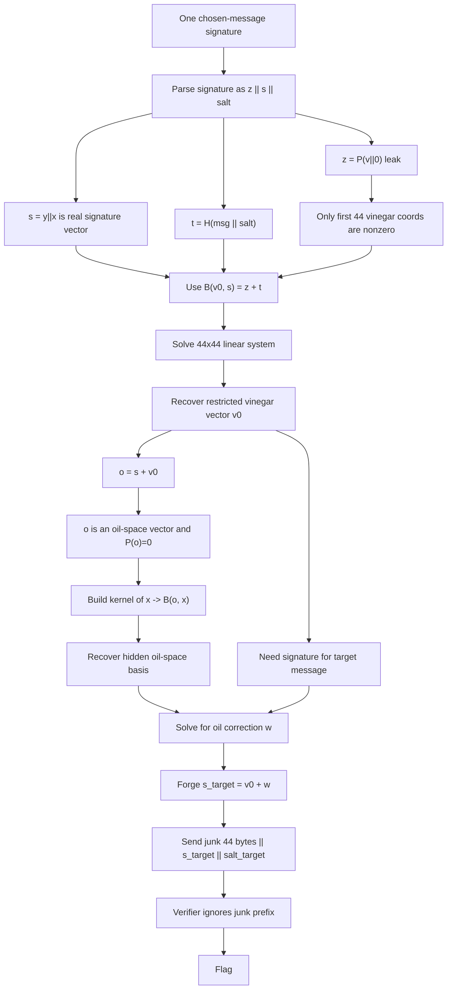

# Thinking Space II Revenge — Sieberrsec CTF 7.0 Write-up

## Challenge Description

> Here's some SPACE to tell me what I'm THINKING, in II steps, one signature and one verification!  
> This is a revenge challenge of Thinking Space II, we apologise for the cheese in the earlier version.   
> `nc chal.sieberr.live 20006`

---

We are given:
- one **public key**,
- one chance to ask for a signature on a message of our choice, except the forbidden target message,
- one verification check on the target message:

```python
thought = b'I am thinking of the flag'

msg = input('msg: ').encode()
assert msg != thought
print(uov.sign(msg,sk,pk).hex())

sig = bytes.fromhex(input('sig: '))
if uov.verify(sig,thought,pk):
    print(open('flag.txt','r').read().strip())
```

So the task is: **forge a valid UOV signature for** `b'I am thinking of the flag'` **after seeing only one signature on a different message**.

---

## 1. TL;DR

The challenge ships a modified `uov.py` with two critical bugs in `sign()`:

1. It leaks an extra 44-byte block equal to **`P(v || 0)`**, where `v` is the signer’s vinegar vector.
2. It generates only **44 random vinegar bytes** and pads the remaining **24 vinegar coordinates with zeros**.

Those two bugs completely destroy the intended hardness.

From a single signature on a chosen message, we can:

- recover the restricted vinegar vector `v0 = (v[0..43], 0, ..., 0)`,
- derive one nonzero oil-space vector,
- recover a basis of the hidden oil space,
- forge a valid signature for the forbidden message.

In other words: **one chosen signature is enough to reconstruct enough algebraic structure to sign the target message.**

---

## 2. What data/file we have and what is special

After unzipping the challenge, the interesting files are:

- `chall.py`
- `uov.py`

### `chall.py`

The server logic is extremely small:

```python
from pow import PoW
from uov import uov_1p_pkc as uov

PoW(25000)

pk, sk = uov.keygen()
thought = b'I am thinking of the flag'
print(pk.hex())

msg = input('msg: ').encode()
assert msg != thought
print(uov.sign(msg,sk,pk).hex())

sig = bytes.fromhex(input('sig: '))
if uov.verify(sig,thought,pk):
    print(open('flag.txt','r').read().strip())
```

This tells us:

- the scheme is **UOV over GF(256)**,
- we get **one chosen-message signature**,
- we must forge a signature for a different fixed message.

### What is special in `uov.py`

The header comment already hints that this is **not** stock UOV:

```python
# Slightly modified from https://github.com/mjosaarinen/uov-py/blob/main/uov.py
```

That is the entire challenge: the implementation changes are the vulnerability.

The two most important fragments are these.

#### Bug 1: truncated vinegar expansion

```python
v = self.gf_unpack(self.shake256(
        msg + salt + seed_sk + bytes([ctr]), self.m_sz)).ljust(self.v_sz, b'\0')
```

Parameters for this instance are:

- `n = 112`
- `m = 44`
- `v = n - m = 68`
- `m_sz = 44`
- `v_sz = 68`

So this code does:

- generate **44 bytes** from SHAKE,
- unpack them over GF(256), still **44 coordinates**,
- `ljust()` to length **68** with zeros.

Therefore the signer uses:

```text
v = (random_44_bytes, 0, 0, ..., 0)
```

instead of a full 68-byte vinegar vector.

That shrinks the hidden entropy from 68 variables down to only 44.

#### Bug 2: leak of `P(v || 0)` inside the signature

Later in `sign()` we get:

```python
y = bytearray(v)
for i in range(self.m):
    for j in range(self.v):
        y[j] ^= self.gf_mul(mo[i][j], x[i])

z = bytearray(v.ljust(self.n, b'\0'))
z = self.pubmap(z, pk)

sig = self.gf_pack(z) + self.gf_pack(y) + self.gf_pack(x) + salt
```

So the produced signature is actually:

```text
sig = z || y || x || salt
```

where:

- `z = P(v || 0)` is **44 bytes**,
- `y || x` is the real 112-byte signature vector,
- `salt` is 16 bytes.

Then `verify()` does this:

```python
x    = sig[self.m_sz : self.m_sz + self.n_sz]
salt = sig[self.m_sz + self.n_sz : self.m_sz + self.n_sz + self.salt_sz]
t    = self.shake256(msg + salt, self.m_sz)
return t == self.pubmap(x, pk)
```

So verification **skips the first 44 bytes entirely**.

That means the service leaks an additional algebraic value `P(v || 0)` that the verifier never checks.

### Signature layout

For this challenge, every signature is:

```text
[ 44 bytes leak ][ 112 bytes real signature vector ][ 16 bytes salt ]
```

Total: `44 + 112 + 16 = 172` bytes.

That perfectly matches the remote output.

---

## Concept Map



---

## 3. Problem Analysis (in details)

This section explains why the two bugs are enough to break the scheme.

### 3.1 UOV structure in one paragraph

UOV (Unbalanced Oil and Vinegar) is a multivariate quadratic signature scheme.

- Variables are split into **vinegar** and **oil** variables.
- The central map is constructed so that if vinegar variables are fixed, signing reduces to solving a **linear system** in the oil variables.
- Security relies on the public map hiding the secret oil/vinegar structure.

In this challenge, the implementation accidentally reveals enough information to partially recover that hidden structure.

---

### 3.2 Notation

Let:

- `P` = public quadratic map,
- `B(a,b) = P(a+b) + P(a) + P(b)` = polar bilinear form,
- `s = y || x` = the real 112-byte signature vector,
- `q = z = P(v || 0)` = the leaked 44-byte prefix,
- `t = H(msg || salt)` = the target hash value for the chosen signed message,
- `v0 = (v[0], ..., v[43], 0, ..., 0)` = the restricted vinegar vector.

Because the field is characteristic 2, quadratic and polar forms behave especially nicely:

```text
P(a+b) = P(a) + P(b) + B(a,b)
```

That identity is the engine of the solve.

---

### 3.3 Why `s + v0` lands in the oil space

The signer computes:

```text
y = v - O x
```

over characteristic 2, subtraction is XOR/addition, so:

```text
y = v + O x
```

Therefore the full signature vector is:

```text
s = y || x = (v + O x) || x
```

Now add `v0 = (v, 0)`:

```text
s + v0 = (O x) || x
```

This is a pure oil-space vector under the secret linearized structure. By construction of UOV, vectors of that form evaluate to zero under the public map. So if we define:

```text
o = s + v0
```

then:

```text
P(o) = 0
```

This single fact is enough to recover `v0`.

---

### 3.4 Recovering the restricted vinegar vector

We know:

```text
o = s + v0
```

and `P(o) = 0`. Apply the polarization identity:

```text
0 = P(s + v0) = P(s) + P(v0) + B(s, v0)
```

Rearrange:

```text
B(v0, s) = P(v0) + P(s)
```

But from the signature we know both right-hand values:

- `P(v0) = q` from the leaked prefix,
- `P(s) = t` because `s` is a valid signature for the chosen message.

So:

```text
B(v0, s) = q + t
```

Now comes the second bug: `v0` has only **44 unknown coordinates**.

Since `B(·, s)` is linear in its first input, this becomes a **44×44 linear system over GF(256)**.

So we build the columns:

```text
col_j = B(e_j, s)    for j = 0..43
```

and solve:

```text
sum_j v_j * col_j = q + t
```

This recovers `v0` exactly.

At that point we immediately get:

```text
o = s + v0
```

which is a nonzero oil-space vector.

---

### 3.5 From one oil vector to the whole oil space

Knowing one oil vector is not enough to sign arbitrary messages; we need the hidden oil subspace itself.

A key observation is:

```text
K = ker(x -> B(o, x))
```

has dimension 68 and contains the 44-dimensional oil space.

Why? Because if `u` is any oil-space vector, then both `P(o) = 0` and `P(u) = 0`, and the central UOV structure forces:

```text
B(o, u) = 0
```

So every oil vector lies in that kernel.

That does not yet isolate the oil space, but it reduces the search to a much smaller structured subspace.

Now restrict the quadratic form to `K`. On that restricted space, random scalar projections of the vector-valued quadratic/polar form have radicals that tend to reveal oil directions.

Concretely:

1. Compute a basis of `K`, dimension 68.
2. Restrict the bilinear form to `K`.
3. Pick random `λ in GF(256)^44`.
4. Collapse the vector-valued form into a scalar form `λ · B`.
5. Compute its radical.
6. The radical contributes vectors from the hidden oil space.
7. Repeat until the recovered vectors span dimension 44.

That gives a basis of the oil space.

---

### 3.6 Forging a signature on the forbidden message

Once we know:

- `v0`, and
- a basis `b1, ..., b44` of the oil space,

we can sign the target message.

Pick a new random salt and compute:

```text
target = H(target_msg || target_salt)
```

We want a vector of the form:

```text
s_target = v0 + w
```

where `w` lies in the oil space.

Since `P(w) = 0`, we get:

```text
P(v0 + w) = P(v0) + B(v0, w) = q + B(v0, w)
```

So we need:

```text
B(v0, w) = target + q
```

Write:

```text
w = c1*b1 + ... + c44*b44
```

This becomes another **44×44 linear system over GF(256)**. Solve for the coefficients `ci`, build `w`, and obtain:

```text
s_target = v0 + w
```

Finally, because `verify()` ignores the first 44 bytes, the forged signature can be:

```text
junk_44 || s_target || target_salt
```

with any 44-byte prefix.

That is enough to pass verification and get the flag.

---

## 4. Exploitation Walkthrough / Flag Recovery

This is the practical solve path.

### Step 1 — Connect and solve PoW

Connect to the server and solve the kCTF PoW.

### Step 2 — Read the public key

The service prints the compressed UOV public key as hex.

We expand it locally using the challenge’s own `uov.py` routines.

### Step 3 — Ask for one signature on a harmless message

Example chosen message:

```text
hello
```

The service returns a 172-byte signature:

```text
sig = q || s || salt
```

where:

- `q` is 44 bytes,
- `s` is 112 bytes,
- `salt` is 16 bytes.

### Step 4 — Recover `v0`

Compute:

```text
t = H(chosen_msg || salt)
```

Then solve:

```text
B(v0, s) = q + t
```

Because only 44 vinegar coordinates are unknown, this is a square 44×44 system and can be solved directly.

### Step 5 — Get one oil vector

Set:

```text
o = s + v0
```

Now `o` lies in the oil space and satisfies:

```text
P(o) = 0
```

### Step 6 — Recover an oil-space basis

Compute the kernel of:

```text
x -> B(o, x)
```

Then repeatedly take radicals of random scalarized restricted forms until 44 independent oil vectors are recovered.

### Step 7 — Forge for the target message

For the forbidden message:

```text
I am thinking of the flag
```

pick a fresh salt and solve:

```text
B(v0, w) = H(target || salt) + q
```

with `w` in the recovered oil space.

Then:

```text
s_target = v0 + w
```

### Step 8 — Build final signature

Because the verifier ignores the first 44 bytes:

```text
forge = arbitrary_44_bytes || s_target || salt
```

Send it to the service.

### Step 9 — Receive the flag

The server accepts the forged signature and prints:

```text
sctf{one_who_thinks_all_the_time_has_nothing_to_think_about_except_thoughts_REVENGE_40e224baa6a4c70cbb293b27a88d2c5f}
```

---

## Solver notes

My exploit script followed exactly that structure:

1. parse `pk`,
2. obtain one valid signature,
3. recover `v0` by solving `B(v0, s) = q + t`,
4. derive one oil vector `o = s + v0`,
5. reconstruct the oil space,
6. forge a signature for the target message.

The forged signature had the usual challenge size:

- 44 bytes ignored prefix,
- 112 bytes actual signature vector,
- 16 bytes salt.

---

## 5. What We Learned

### 1. “Small” implementation changes can completely break post-quantum schemes

The original UOV construction is already very delicate. A seemingly harmless modification to signature formatting and randomness expansion created a full forgery attack.

### 2. Extra leaked algebraic values are deadly

The leaked prefix `P(v || 0)` looks small, but in multivariate crypto it is more than enough to expose hidden structure when combined with one valid signature.

### 3. Dimension reduction matters

The truncated vinegar generation reduced the unknown vinegar part from 68 coordinates to 44. That turned a hard hidden-structure recovery problem into a directly solvable linear system.

### 4. Verifiers must parse signatures exactly as intended

If the verifier ignores bytes that the signer emits, that mismatch often becomes an attack surface. Here it gave the attacker a free side-channel value with zero downside.

### 5. Differential / polar viewpoints are extremely powerful

Once the public map is viewed through its polar bilinear form, the whole attack becomes linear algebra over GF(256).

---

## Vulnerability Summary

The challenge is broken by the combination of:

- **signature format mismatch**  
  `sign()` prepends 44 bytes that `verify()` ignores,

- **leak of `P(v || 0)`**  
  this leaks a structured evaluation of the signer’s internal vinegar vector,

- **truncated vinegar randomness**  
  only 44 of the 68 vinegar coordinates are random, the rest are zero,

- **linear-algebra recovery of the oil space**  
  one valid signature is enough to recover enough hidden structure to sign the forbidden message.

---

## Appendix: the two key buggy snippets

### Leaking `P(v || 0)`

```python
z = bytearray(v.ljust(self.n, b'\0'))
z = self.pubmap(z, pk)
sig = self.gf_pack(z) + self.gf_pack(y) + self.gf_pack(x) + salt
```

### Verifier ignores that leak

```python
x = sig[self.m_sz : self.m_sz + self.n_sz]
salt = sig[self.m_sz + self.n_sz : self.m_sz + self.n_sz + self.salt_sz]
return t == self.pubmap(x, pk)
```

### Truncated vinegar expansion

```python
v = self.gf_unpack(self.shake256(
        msg + salt + seed_sk + bytes([ctr]), self.m_sz)).ljust(self.v_sz, b'\0')
```

This should have generated a full `v_sz` vinegar vector, but instead generated only `m_sz` bytes and padded the rest with zeros.

---

## Final Flag

```text
sctf{one_who_thinks_all_the_time_has_nothing_to_think_about_except_thoughts_REVENGE_40e224baa6a4c70cbb293b27a88d2c5f}
```
