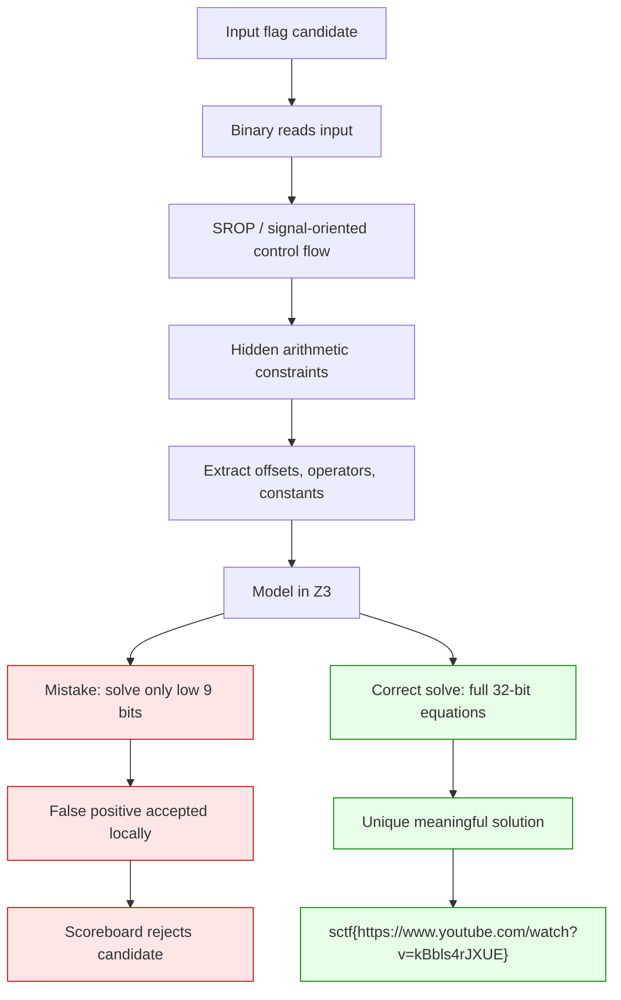

# sinking-feeling Sieberrsec CTF 7.0 Writeup

## Challenge Description
> sigreturn oriented program


## 1. TL;DR

The challenge binary is a flag checker disguised as a **sigreturn-oriented program**. Instead of exposing a clean comparison such as `strcmp(flag, target)`, it uses signal/syscall-oriented control flow to hide a set of arithmetic constraints over the input.

A first Z3 model produced this string:

```text
sctf{dt*Os,5Ow%w.youBueq.Hoq/satcd?lu5Bn8y0nfR!E}
```

It prints `:)` locally:

```bash
printf '%s\n' 'sctf{dt*Os,5Ow%w.youBueq.Hoq/satcd?lu5Bn8y0nfR!E}' | ./main
# :)
```

However, that was only a **false positive** caused by solving a weakened 9-bit condition. The real checker logic requires matching the full 32-bit expressions.

After recovering the full constraints, the correct flag is:

```text
sctf{https://www.youtube.com/watch?v=kBbls4rJXUE}
```

---

## 2. What Data/File We Have and What Is Special

We were given a single local executable:

```text
main
```

The binary behaves like a flag checker:

```bash
printf '%s\n' 'test' | ./main
# :(
```

For some candidate inputs, it prints:

```text
:)
```

The special part is that the binary is not a normal checker. It is built around a **sigreturn/syscall-oriented mechanism**:

- It uses signal/sigreturn-style control flow.
- It hides arithmetic validation behind unusual syscall/state behavior.
- Static control flow is intentionally confusing.
- The apparent accepted string may not be the real scoreboard flag.
- The program can accept decoy/weak solutions if only part of the hidden constraint is solved.

This makes the challenge dangerous because a local `:)` is not enough proof that the string is the intended flag.

---

## Concept Map



---

## 3. Problem Analysis

### 3.1 Surface behavior

The binary reads one line of input and prints either:

```text
:)
```

or:

```text
:(
```

At first glance, this looks like a standard reverse-engineering flag checker. However, the title and description strongly hint at the intended technique:

```text
sigreturn oriented program
```

That means the program does not simply execute a normal linear validation function. Instead, it abuses signal frames/syscall state to implement or obscure the checker.

---

### 3.2 Hidden structure

After reversing the checker, the important recovered structure was a list of arithmetic constraints. Each constraint uses three positions of the input and two binary operators.

Conceptually, each check looks like this:

```python
expr = op2(op1(A(i), A(j)), A(k))
```

where:

```python
A(i) = 0xffffffff - word(i)
```

and:

```python
word(i) = input[i] + (input[i + 1] << 8)
```

So each constraint depends on overlapping 16-bit little-endian windows of the input.

The checker uses operators such as:

```text
ADD, SUB, MUL, XOR
```

The input is therefore not checked character-by-character. Instead, it is constrained through overlapping arithmetic relations.

---

### 3.3 Why the first solution was wrong

The first solver modeled only this weak condition:

```python
expr & 0x1ff == target
```

This means only the low 9 bits of each expression were checked.

That produced:

```text
sctf{dt*Os,5Ow%w.youBueq.Hoq/satcd?lu5Bn8y0nfR!E}
```

and this string printed `:)` locally.

But because the condition was weakened to only 9 bits, many unrelated strings can satisfy it. The local acceptance was not enough evidence that it was the real challenge flag.

The actual target should be modeled as a full 32-bit value:

```python
expr == (~const) & 0xffffffff
```

This fixes the false-positive issue.

---

### 3.4 Final recovered constraint model

The recovered constraints have this form:

```python
cons = [
    ([16,15,26], (ADD,MUL)),
    ([1,3,13],   (SUB,SUB)),
    ([16,38,15], (XOR,XOR)),
    ([18,17,26], (ADD,SUB)),
    ([45,11,34], (ADD,SUB)),
    ([36,40,12], (MUL,SUB)),
    ([6,31,32],  (XOR,ADD)),
    ([11,31,7],  (MUL,XOR)),
    ([42,13,5],  (XOR,SUB)),
    ([15,6,18],  (ADD,XOR)),
    ([19,0,38],  (MUL,SUB)),
    ([1,14,20],  (XOR,SUB)),
    ([16,19,4],  (MUL,SUB)),
    ([9,13,21],  (ADD,MUL)),
    ([5,43,19],  (SUB,MUL)),
    ([27,24,40], (ADD,MUL)),
    ([40,3,46],  (ADD,SUB)),
    ([23,16,46], (MUL,SUB)),
    ([15,28,0],  (XOR,SUB)),
    ([16,28,47], (SUB,ADD)),
    ([38,4,31],  (SUB,XOR)),
    ([31,19,9],  (MUL,XOR)),
    ([21,24,6],  (SUB,SUB)),
    ([45,18,11], (ADD,ADD)),
    ([30,31,17], (MUL,SUB)),
]
```

The constants are:

```python
consts = [
    0xb8548bef,
    0xffff8184,
    0x351b,
    0x7779,
    0xe48,
    0xcfa50569,
    0x5163,
    0x12555084,
    0xffff8653,
    0xffff287c,
    0xd2c13644,
    0xffff8776,
    0xc8de6fd9,
    0xbb91a537,
    0xece9309b,
    0xbde50c26,
    0xa97d,
    0xea08ffef,
    0xffff4333,
    0x7f44,
    0x654d,
    0x2d3ee19d,
    0xffff8ad1,
    0xf9f8,
    0xd2c879bb,
    0,
]
```

The final constraint for each check is:

```python
expr == (~const) & 0xffffffff
```

not:

```python
expr & 0x1ff == target
```

---

## 4. Exploitation Walkthrough / Flag Recovery

### 4.1 Build the Z3 model

We model each input byte as an 8-bit symbolic variable:

```python
b = [z3.BitVec(f"b{i}", 8) for i in range(49)]
```

The flag format gives us fixed prefix and suffix constraints:

```python
for i, c in enumerate(b"sctf{"):
    s.add(b[i] == c)

s.add(b[48] == ord("}"))
```

The real flag is URL-like, so we can allow printable ASCII:

```python
for x in b:
    s.add(x >= 0x20, x <= 0x7e)
```

Then define the overlapping word function:

```python
def word(i):
    return z3.ZeroExt(24, b[i]) + (z3.ZeroExt(24, b[i + 1]) << 8)

def A(i):
    return z3.BitVecVal(0xffffffff, 32) - word(i)
```

Operator handling:

```python
def op(name, x, y):
    if name == ADD:
        return x + y
    if name == SUB:
        return x - y
    if name == MUL:
        return x * y
    if name == XOR:
        return x ^ y
    raise ValueError(name)
```

The critical part is to constrain the full 32-bit expression:

```python
for (offs, (o1, o2)), c in zip(cons, consts[:-1]):
    i, j, k = offs
    expr = op(o2, op(o1, A(i), A(j)), A(k))
    target = (~c) & 0xffffffff
    s.add(expr == z3.BitVecVal(target, 32))
```

---

### 4.2 Full solve script

```python
#!/usr/bin/env python3
import z3

ADD, SUB, MUL, XOR = "add", "sub", "mul", "xor"

cons = [
    ([16,15,26], (ADD,MUL)),
    ([1,3,13],   (SUB,SUB)),
    ([16,38,15], (XOR,XOR)),
    ([18,17,26], (ADD,SUB)),
    ([45,11,34], (ADD,SUB)),
    ([36,40,12], (MUL,SUB)),
    ([6,31,32],  (XOR,ADD)),
    ([11,31,7],  (MUL,XOR)),
    ([42,13,5],  (XOR,SUB)),
    ([15,6,18],  (ADD,XOR)),
    ([19,0,38],  (MUL,SUB)),
    ([1,14,20],  (XOR,SUB)),
    ([16,19,4],  (MUL,SUB)),
    ([9,13,21],  (ADD,MUL)),
    ([5,43,19],  (SUB,MUL)),
    ([27,24,40], (ADD,MUL)),
    ([40,3,46],  (ADD,SUB)),
    ([23,16,46], (MUL,SUB)),
    ([15,28,0],  (XOR,SUB)),
    ([16,28,47], (SUB,ADD)),
    ([38,4,31],  (SUB,XOR)),
    ([31,19,9],  (MUL,XOR)),
    ([21,24,6],  (SUB,SUB)),
    ([45,18,11], (ADD,ADD)),
    ([30,31,17], (MUL,SUB)),
]

consts = [
    0xb8548bef,
    0xffff8184,
    0x351b,
    0x7779,
    0xe48,
    0xcfa50569,
    0x5163,
    0x12555084,
    0xffff8653,
    0xffff287c,
    0xd2c13644,
    0xffff8776,
    0xc8de6fd9,
    0xbb91a537,
    0xece9309b,
    0xbde50c26,
    0xa97d,
    0xea08ffef,
    0xffff4333,
    0x7f44,
    0x654d,
    0x2d3ee19d,
    0xffff8ad1,
    0xf9f8,
    0xd2c879bb,
    0,
]

s = z3.Solver()

# The recovered flag length is 49 bytes.
b = [z3.BitVec(f"b{i}", 8) for i in range(49)]

# Flag format.
for i, c in enumerate(b"sctf{"):
    s.add(b[i] == c)

s.add(b[48] == ord("}"))

# Printable ASCII.
for x in b:
    s.add(x >= 0x20, x <= 0x7e)

def word(i):
    return z3.ZeroExt(24, b[i]) + (z3.ZeroExt(24, b[i + 1]) << 8)

def A(i):
    return z3.BitVecVal(0xffffffff, 32) - word(i)

def op(name, x, y):
    if name == ADD:
        return x + y
    if name == SUB:
        return x - y
    if name == MUL:
        return x * y
    if name == XOR:
        return x ^ y
    raise ValueError(name)

for (offs, (o1, o2)), c in zip(cons, consts[:-1]):
    i, j, k = offs
    expr = op(o2, op(o1, A(i), A(j)), A(k))
    target = (~c) & 0xffffffff

    # Important: full 32-bit equality.
    s.add(expr == z3.BitVecVal(target, 32))

res = s.check()
print(res)

if res == z3.sat:
    m = s.model()
    flag = bytes([m.eval(x).as_long() for x in b])
    print(flag.decode())
```

Run it:

```bash
python3 solve.py
```

Output:

```text
sat
sctf{https://www.youtube.com/watch?v=kBbls4rJXUE}
```

---

### 4.3 Verify locally

```bash
printf '%s\n' 'sctf{https://www.youtube.com/watch?v=kBbls4rJXUE}' | ./main
```

Expected output:

```text
:)
```

---

## 5. What We Learned

### 5.1 Local acceptance is not always enough

A local `:)` usually feels like proof, but in this challenge it was misleading. The earlier candidate passed a weakened interpretation of the checker but was rejected by the scoreboard.

The key lesson:

> Passing the visible branch does not always mean the recovered string is the intended flag.

---

### 5.2 Do not truncate constraints unless you prove the checker does

The first model used:

```python
expr & 0x1ff == target
```

That created many possible satisfying inputs.

The correct model used:

```python
expr == target
```

over the full 32-bit expression.

Partial-bit constraints are useful for exploration, but they can produce false positives.

---

### 5.3 SROP can be used as obfuscation, not just exploitation

Sigreturn-oriented programming is usually discussed in exploitation, where attackers forge signal frames to control registers. Here, the challenge used SROP-style behavior as an obfuscation method inside a verifier.

That means reversing the syscall/signal behavior was necessary to recover the actual arithmetic checks.

---

### 5.4 SMT solvers are powerful, but modeling accuracy matters most

Z3 solved the final constraints easily once the model was correct. The hard part was not the solver. The hard part was accurately translating the binary’s behavior into constraints.

Bad model:

```python
expr & 0x1ff == target
```

Good model:

```python
expr == ((~const) & 0xffffffff)
```

Once the model matched the binary, the flag was recovered directly.
