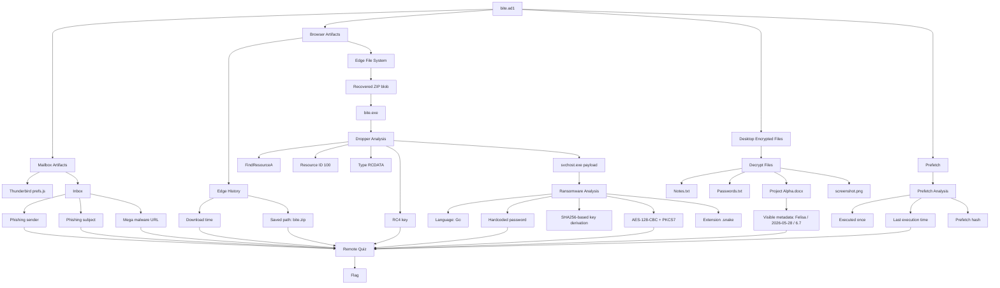

# bite - THEM!CTF v2 2026 writeup 

## Challenge Description

> Adooh cryptolocker nyerang laptop gwehj. Sekarang file di desktop ke encrypted semua.   
> Before you get the flag, I want to apologize :(  
>nc 45.130.164.173 30001

Provided artifact: `bite.ad1`

---

## 1. TL;DR

This challenge is a forensic triage + malware-analysis quiz wrapped behind a netcat service.

The core solve path was:

1. Parse the `AD1` evidence image.
2. Recover phishing email artifacts from Thunderbird.
3. Recover download evidence from Edge history.
4. Extract `bite.exe` from browser storage.
5. Reverse the dropper enough to recover:
   - embedded RC4 key,
   - decrypted ransomware payload,
   - AES key/IV derivation logic,
   - ransomware behavior.
6. Decrypt the encrypted desktop artifacts.
7. Answer all remote questions until the service returned the flag.

Final flag:

```text
THEM?!CTF{momen_ketika_bikin_challenge_4jam_sebelum_mulai_._mana_lama_banget_lagi_boot_windowsnya}
```

---

## Concept Map



---

## 2. What Data/File We Have and What Is Special

### Main Artifact

- `bite.ad1`

This is an `AD1` forensic container, commonly used by AccessData/FTK-style tooling.  
That means the challenge is not just about one malware sample. The image contains:

- user files,
- browser data,
- email client data,
- Windows execution artifacts,
- encrypted desktop files,
- and enough leftovers to reconstruct both infection and post-infection activity.

### Why This Artifact Is Special

What makes `bite.ad1` useful is that it combines three layers of evidence:

1. **Initial access evidence**
   - phishing email in Thunderbird,
   - malicious Mega link,
   - sender/subject/timestamps.

2. **Execution evidence**
   - Edge download records,
   - saved malware path,
   - Prefetch for `bite.exe`.

3. **Payload and impact evidence**
   - the dropper itself recoverable from browser storage,
   - encrypted ransomware payload embedded inside the dropper,
   - encrypted Desktop files and ransom note.

In other words, the image gives us everything from infection vector to encryption details.

---

## 3. Problem Analysis

### 3.1 Initial Triage

The remote service immediately made it clear this was a question-answer challenge, not a single static flag hunt:

```text
nc 45.130.164.173 30001
```

The service asked many forensic questions in sequence, so the real task was to build a complete picture of the incident.

The natural first questions were:

- Who sent the phishing email?
- What malware URL was used?
- When was it received?
- What file was downloaded and where?

That directed the investigation toward:

- Thunderbird profile data,
- Edge history/download traces,
- and Windows user Desktop contents.

---

### 3.2 Thunderbird Artifacts

From the Thunderbird profile, two files were especially useful:

- `prefs.js`
- mailbox content under the POP3 storage directory

`prefs.js` revealed the mail configuration, including the POP3 port:

- mail server host: `192.168.18.2`
- protocol: `pop3`
- port: `1110`

The mailbox content revealed the phishing message:

- Sender: `support@gamemaster.pro`
- Subject: `Your FREE Aimbot License Key Inside!`
- Received time: `2026-05-25 07:15:00 UTC`
- Malware URL: `https://mega.nz/folder/N3lBVQQT#AeiSi9X_pkYU29Xxz4tAzg`

This already answered the early remote questions and confirmed the infection vector.

---

### 3.3 Edge Download Evidence

The next stage was proving when and where the malware landed.

Edge history showed the malware was downloaded as:

```text
C:\Users\felisa\Downloads\bite.zip
```

and the accepted download timestamp was:

```text
2026-05-29 12:40:05 UTC
```

This was important because the service asked for:

- the saved filename on disk,
- the absolute saved path,
- and the exact UTC download time.

At this point we knew:

- victim username: `felisa`
- malware archive on disk: `bite.zip`
- execution artifact to hunt next: `bite.exe`

---

### 3.4 Recovering `bite.exe`

Simply locating `bite.zip` as a file entry was not enough. The useful copy turned out to be recoverable from Edge File System storage.

The key object was:

```text
.../Edge/User Data/Default/File System/001/p/00/00000000
```

That blob decompressed to a valid ZIP archive containing:

```text
bite.exe
```

From there we computed:

- SHA-256 of `bite.exe`:

```text
fba69a6f8d51e9cf32db3b8f5dc7750c80745b0865e4d22dcd0cb8223a98b6ab
```

This solved the first major malware-analysis checkpoint.

---

### 3.5 Dropper Analysis

The recovered `bite.exe` was a dropper containing an embedded resource.

Important recovered details:

- API used to locate the resource: `FindResourceA`
- resource ID: `100`
- resource type: `RCDATA`

The embedded resource was encrypted, and the dropper contained the RC4 key:

```text
e456bac6661a5c29
```

After RC4 decryption, the dropper wrote the second-stage payload to `%TEMP%` as:

```text
svchost.exe
```

This let us recover the ransomware payload itself and compute its hash:

```text
05bea37c91062cefcd3f845b54d971090cf3eb89ce6a9e07cb5095a9e4700220
```

---

### 3.6 Ransomware Analysis

The decrypted second stage was a Go binary.

Strings and symbols revealed:

- language: `Go`
- hardcoded password:

```text
thisissafepasswordbronocapongod
```

- key derivation hash algorithm:

```text
SHA256
```

- encryption algorithm/mode:

```text
AES-128-CBC
```

- padding:

```text
PKCS7
```

- appended extension:

```text
.snake
```

By testing derivation candidates against the remote service, the actual AES material was recovered:

- AES key:

```text
a2801dc6ee7154284c308f52f8cadb7e
```

- AES IV:

```text
bc10b391f3054bb1481bd9647bf4b453
```

The derivation pattern was:

- key = first 16 bytes of `SHA256(password + MachineGuid)`
- IV = first 16 bytes of `SHA256(MachineGuid + password)`

MachineGuid recovered from the image:

```text
2ec8f83b-8ec8-453b-8c2f-5a6a1773fe8b
```

---

### 3.7 Desktop Impact

The Desktop contained four encrypted files:

- `Notes.txt.snake`
- `Passwords.txt.snake`
- `Project Alpha.docx.snake`
- `screenshot.png.snake`

and the ransom note:

- `README_DECRYPT.txt`

The ransom note included the Bitcoin wallet:

```text
bc1qsnek55m3l0v3r1337deadbeef00000000000
```

The file count mattered because the service explicitly asked how many files on Desktop were encrypted:

```text
4
```

---

### 3.8 Prefetch Evidence

Windows Prefetch gave us execution confirmation for the dropper:

- file: `BITE.EXE-BB2343AF.pf`
- execution count: `1`
- accepted last execution time:

```text
2026-05-29 12:41:27 UTC
```

- SHA-256 of prefetch file:

```text
95871f0fe8437b2d229ea960edd9581973af2c5b635555288c5774c6597c04b2
```

This was especially useful because the challenge wanted both behavioral and artifact-integrity answers.

---

### 3.9 The DOCX Metadata Trap

One of the trickier parts was the question:

```text
What is the Author, Date, and Version of the decrypted docx file?
```

At first, it looked like Office document properties from `docProps/core.xml` and `docProps/app.xml` should be used.

Those properties gave:

- author: `Felisa`
- created: `2013-12-23T23:15:00Z`
- app version: `16.0000`

But that answer was rejected.

The correct interpretation was that the challenge wanted the **visible metadata inside the document body**, not the package metadata.

The decrypted document text showed:

- `Author: Felisa`
- `Date: 2026-05-28`
- `Version: 6.7`

So the accepted answer was:

```text
Felisa_2026-05-28_6.7
```

This is a good example of why challenge wording must be tested against actual artifact context, not only default forensic assumptions.

---

## 4. Exploitation Walkthrough / Flag Recovery

### Step 1: Identify the phishing email

From Thunderbird mailbox data:

- sender: `support@gamemaster.pro`
- subject: `Your FREE Aimbot License Key Inside!`
- received: `2026-05-25 07:15:00 UTC`
- malware URL: `https://mega.nz/folder/N3lBVQQT#AeiSi9X_pkYU29Xxz4tAzg`

### Step 2: Confirm the mail transport details

From Thunderbird `prefs.js`:

- POP3 port: `1110`

### Step 3: Confirm download path and time

From Edge artifacts:

- saved path: `C:\Users\felisa\Downloads\bite.zip`
- download time: `2026-05-29 12:40:05 UTC`

### Step 4: Recover the malware archive contents

Extract the ZIP blob from Edge File System storage and recover:

- `bite.exe`

Compute:

- SHA-256 of `bite.exe`:
  `fba69a6f8d51e9cf32db3b8f5dc7750c80745b0865e4d22dcd0cb8223a98b6ab`

### Step 5: Analyze the dropper resource

Recover:

- `FindResourceA`
- resource ID `100`
- resource type `RCDATA`
- RC4 key `e456bac6661a5c29`

Decrypt resource and recover second stage:

- output filename in `%TEMP%`: `svchost.exe`

### Step 6: Analyze the ransomware payload

Recover:

- language: `Go`
- password: `thisissafepasswordbronocapongod`
- KDF hash algorithm: `SHA256`
- mode: `AES-128-CBC`
- padding: `PKCS7`
- extension: `.snake`

Derive:

- AES key: `a2801dc6ee7154284c308f52f8cadb7e`
- AES IV: `bc10b391f3054bb1481bd9647bf4b453`

### Step 7: Decrypt the Desktop files

The four encrypted files on Desktop were:

- `Notes.txt.snake`
- `Passwords.txt.snake`
- `Project Alpha.docx.snake`
- `screenshot.png.snake`

The challenge later asked for:

- count of encrypted files: `4`
- one encrypted filename on Desktop:
  `Project Alpha.docx.snake`

### Step 8: Read the decrypted DOCX correctly

The accepted metadata came from the visible document text:

```text
Felisa_2026-05-28_6.7
```

### Step 9: Use Prefetch to answer execution questions

From `BITE.EXE-BB2343AF.pf`:

- execution count: `1`
- last execution time: `2026-05-29 12:41:27 UTC`
- prefetch hash:
  `95871f0fe8437b2d229ea960edd9581973af2c5b635555288c5774c6597c04b2`

### Step 10: Finish the remote questionnaire

After answering the final Desktop filename question:

```text
Project Alpha.docx.snake
```

the service returned:

```text
THEM?!CTF{momen_ketika_bikin_challenge_4jam_sebelum_mulai_._mana_lama_banget_lagi_boot_windowsnya}
```

---

## 5. What We Learned

### 5.1 Browser storage can hold the real payload

Even when the obvious disk file is incomplete or inconvenient, browser storage can preserve a usable copy of the downloaded malware.

### 5.2 Forensics and reversing often overlap

This challenge was not solvable with filesystem triage alone.  
We had to combine:

- email forensics,
- browser history analysis,
- Windows artifact analysis,
- PE resource extraction,
- and crypto behavior reconstruction.

### 5.3 Challenge wording matters

The DOCX question was the main trap:

- package metadata looked correct,
- but the accepted answer came from visible text inside the decrypted document.

Always validate assumptions against the service behavior.

### 5.4 Execution artifacts remain valuable even in small challenges

Prefetch answered:

- whether the dropper was executed,
- how many times,
- when it last ran,
- and provided another hashable artifact.

### 5.5 Derivation logic can be confirmed empirically

When static analysis is incomplete, remote-answer validation can help confirm:

- exact key derivation format,
- string formatting,
- and which artifact field the author intended.

---

## Appendix: Key Recovered Values

| Item | Value |
|---|---|
| Victim username | `felisa` |
| Malware URL | `https://mega.nz/folder/N3lBVQQT#AeiSi9X_pkYU29Xxz4tAzg` |
| Email sender | `support@gamemaster.pro` |
| Email subject | `Your FREE Aimbot License Key Inside!` |
| Email client | `Thunderbird` |
| POP3 port | `1110` |
| Downloaded archive | `C:\Users\felisa\Downloads\bite.zip` |
| Saved malware filename | `bite.exe` |
| Dropper SHA-256 | `fba69a6f8d51e9cf32db3b8f5dc7750c80745b0865e4d22dcd0cb8223a98b6ab` |
| Resource API | `FindResourceA` |
| Resource ID | `100` |
| Resource type | `RCDATA` |
| RC4 key | `e456bac6661a5c29` |
| Payload filename in `%TEMP%` | `svchost.exe` |
| Payload SHA-256 | `05bea37c91062cefcd3f845b54d971090cf3eb89ce6a9e07cb5095a9e4700220` |
| Language | `Go` |
| Password | `thisissafepasswordbronocapongod` |
| KDF hash | `SHA256` |
| AES key | `a2801dc6ee7154284c308f52f8cadb7e` |
| AES IV | `bc10b391f3054bb1481bd9647bf4b453` |
| Cipher mode | `AES-128-CBC` |
| Padding | `PKCS7` |
| Encrypted extension | `.snake` |
| Prefetch hash | `95871f0fe8437b2d229ea960edd9581973af2c5b635555288c5774c6597c04b2` |
| Ransom note | `README_DECRYPT.txt` |
| BTC address | `bc1qsnek55m3l0v3r1337deadbeef00000000000` |
| Encrypted Desktop file count | `4` |
| Accepted DOCX metadata answer | `Felisa_2026-05-28_6.7` |
| Final flag | `THEM?!CTF{momen_ketika_bikin_challenge_4jam_sebelum_mulai_._mana_lama_banget_lagi_boot_windowsnya}` |

