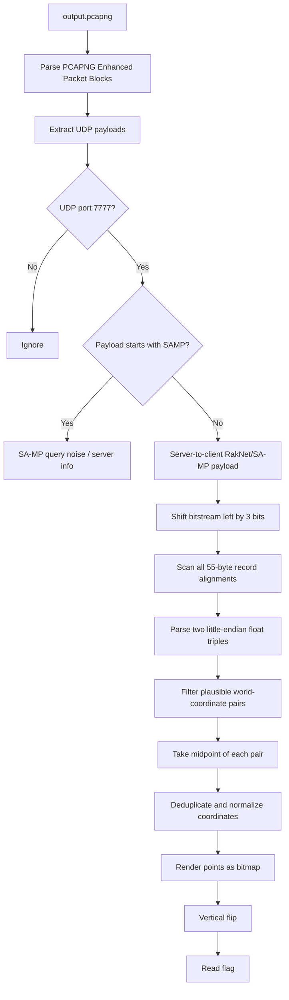

# Pixel Drift — THEM?!CTF v2 2026 Writeup
> first blood for this challenge lmao

## Challenge Description

> This challenge will take a long time, so I suggest you try another challenge :)

We are given a single packet capture: `output.pcapng`

---

## 1. TL;DR

The PCAP contains UDP traffic for a SA-MP/open.mp server on port `7777`. The visible strings and query packets only show normal server information, but the real flag is hidden inside server-to-client game synchronization payloads.

The useful packets are bit-packed RakNet/SA-MP-style payloads. After shifting the server payload bitstream left by `3` bits, many hidden `55`-byte records appear. Each record contains two little-endian float triples. Treating the midpoint of each pair of 3D coordinates as a pixel reconstructs a 5x7-font image.

The first render is vertically inverted because game/world coordinates and image coordinates use opposite Y directions. Flipping the recovered image vertically gives the readable flag:

```text
THEM?!CTF{SH3_IS_S0_PERF3FCT_BL4H_BLAH_BL4H}
```

---

## 2. What Data/File We Have and What Is Special

| File | Type | Why it matters |
|---|---:|---|
| `output.pcapng` | PCAPNG network capture | Contains UDP traffic for a game server. The flag is not stored as plain text; it is reconstructed from coordinates hidden in packet payloads. |

Initial inspection shows repeated UDP packets involving port `7777`, which is commonly used by SA-MP/open.mp servers. The packets include normal-looking `SAMP` query traffic and server metadata such as the server name `Pixel Drift Freeroam`. Those strings are useful for identifying the protocol, but they are not the flag.

The challenge title, `pixel-drift`, is the important hint. It suggests that some drifting coordinate data should be plotted as pixels. The description says it will take a long time, which also hints that the solution involves collecting many small pieces from many packets rather than finding one obvious string.

---

## Concept Map



---

## 3. Problem Analysis in Detail

### 3.1 Protocol identification

The packet capture is not a usual HTTP/DNS/TCP exfiltration task. A quick protocol-level inspection shows lots of UDP traffic involving port `7777`:

```bash
tshark -r output.pcapng -Y udp -T fields -e frame.number -e ip.src -e udp.srcport -e ip.dst -e udp.dstport -e data
```

Several payloads begin with `SAMP`, which strongly suggests SA-MP/open.mp traffic. Query packets are easy to recognize, but they only expose server information. They do not contain the flag directly.

The important distinction is:

| Traffic | Usefulness |
|---|---|
| UDP packets starting with `SAMP` | Mostly query/metadata noise. Helpful for protocol identification only. |
| UDP packets from source port `7777` that do not start with `SAMP` | Game synchronization payloads. These contain the hidden coordinate records. |

### 3.2 Why plain string extraction fails

Running normal string extraction finds readable server names, commands, and menu-like text, but no valid `THEM?!CTF{...}` flag:

```bash
strings output.pcapng | grep -i 'THEM\|CTF\|flag'
```

This is because the flag is encoded geometrically, not textually. The payloads store positions that form letters when plotted.

### 3.3 Bit alignment issue

The useful data is bit-packed. Reading it byte-aligned does not reveal clean records. The correct interpretation is obtained by shifting the payload stream left by `3` bits:

```python
def shift_left_stream(blob, shift):
    return bytes(
        (((blob[i] << shift) & 0xff) | (blob[i + 1] >> (8 - shift)))
        for i in range(len(blob) - 1)
    )
```

With `shift = 3`, the payload begins to contain structured records that can be parsed consistently as floats.

### 3.4 Hidden record structure

After the 3-bit shift, the hidden data appears in records of size `55` bytes. Each record contains two coordinate triples:

| Record offset | Type | Meaning |
|---:|---|---|
| `14..25` | 3 little-endian floats | First point: `(x1, y1, z1)` |
| `26..37` | 3 little-endian floats | Second point: `(x2, y2, z2)` |

The challenge stores each pixel as a tiny pair/segment in the game world. The pixel position is the midpoint:

```python
px = (x1 + x2) / 2.0
py = (y1 + y2) / 2.0
```

A practical filter is needed because not every shifted byte sequence is valid. Valid records satisfy constraints like:

```python
1000 < x1 < 2500
1000 < x2 < 2500
1000 < y1 < 2000
1000 < y2 < 2000
-200 < z1 < 300
-200 < z2 < 300
abs((z1 + z2) - 110.0) < 1e-2
abs(((y1 + y2) / 2.0) - 1346.12) < 4.0
```

The fixed Y range is especially useful because the hidden text is drawn along a narrow band of world coordinates.

### 3.5 Rendering issue: vertical flip

After collecting the midpoints, normalize the coordinates by subtracting the minimum X and Y values. This produces a bitmap-like point cloud.

The first render may look wrong or inverted. That is expected: game/world coordinates and image pixel coordinates use opposite vertical conventions. In an image, increasing Y usually goes downward. In the game coordinate system, increasing Y does not necessarily correspond to moving down on the final image.

Therefore, before reading the final text, vertically flip the rendered bitmap:

```python
render_y = height - 1 - normalized_y
```

After this flip, the flag becomes readable.

---

## 4. Exploitation Walkthrough / Flag Recovery

### Step 1 — Parse the PCAPNG manually

The solver reads Enhanced Packet Blocks from the PCAPNG file, extracts Ethernet/IP/UDP frames, and yields UDP payloads.

### Step 2 — Keep only useful server packets

We only want server-to-client game payloads:

```python
if sport != 7777:
    continue
if payload.startswith(b'SAMP'):
    continue
```

This removes the normal SA-MP query responses and keeps the synchronization packets.

### Step 3 — Shift payloads by 3 bits

```python
shifted = shift_left_stream(payload, 3)
```

This fixes the bit alignment and makes the hidden records parseable.

### Step 4 — Scan 55-byte records

Some packets may have a few leading bytes before the record stream, so the solver tries all possible alignments from `0` to `54` and keeps the alignment that produces the most valid records.

```python
for base in range(55):
    for off in range(base, len(shifted) - 54, 55):
        record = shifted[off:off + 55]
```

Then parse two coordinate triples:

```python
x1, y1, z1 = struct.unpack('<fff', record[14:26])
x2, y2, z2 = struct.unpack('<fff', record[26:38])
```

### Step 5 — Convert coordinate pairs into pixels

```python
pixel_x = (x1 + x2) / 2.0
pixel_y = (y1 + y2) / 2.0
```

After deduplication and normalization, the points form a pixel-font message.

### Step 6 — Flip vertically and read the flag

The corrected render is vertically flipped. Reading the final image gives:

```text
THEM?!CTF{SH3_IS_S0_PERF3FCT_BL4H_BLAH_BL4H}
```

<details>
<summary>Full solver (solve.py)</summary>

```python
#!/usr/bin/env python3
import os
import socket
import struct
import sys

PCAP = sys.argv[1] if len(sys.argv) > 1 else 'output.pcapng'
OUT_TXT = 'pixel_flag_render.txt'
OUT_PNG = 'pixel_flag_vertical_flip.png'


def iter_udp_pcapng(path):
    data = open(path, 'rb').read()
    off = 0
    idx = 0

    while off + 12 <= len(data):
        btype, blen = struct.unpack('<II', data[off:off + 8])
        if blen < 12 or off + blen > len(data):
            break

        body = data[off + 8:off + blen - 4]

        # Enhanced Packet Block
        if btype == 6 and len(body) >= 20:
            _iid, _tshi, _tslo, caplen, _origlen = struct.unpack('<IIIII', body[:20])
            frame = body[20:20 + caplen]

            # Ethernet + IPv4
            if len(frame) >= 42 and frame[12:14] == b'\x08\x00':
                ipoff = 14
                ihl = (frame[ipoff] & 0x0f) * 4

                # UDP
                if len(frame) >= ipoff + ihl + 8 and frame[ipoff + 9] == 17:
                    uoff = ipoff + ihl
                    sport, dport, ulen, _checksum = struct.unpack('!HHHH', frame[uoff:uoff + 8])
                    payload = frame[uoff + 8:uoff + ulen]
                    src = socket.inet_ntoa(frame[ipoff + 12:ipoff + 16])
                    dst = socket.inet_ntoa(frame[ipoff + 16:ipoff + 20])
                    yield idx, src, sport, dst, dport, payload

            idx += 1

        off += blen


def shift_left_stream(blob, shift):
    if shift == 0:
        return blob
    return bytes(
        (((blob[i] << shift) & 0xff) | (blob[i + 1] >> (8 - shift)))
        for i in range(len(blob) - 1)
    )


def good_pair(x1, y1, z1, x2, y2, z2):
    return (
        1000 < x1 < 2500 and 1000 < x2 < 2500 and
        1000 < y1 < 2000 and 1000 < y2 < 2000 and
        -200 < z1 < 300 and -200 < z2 < 300 and
        abs((z1 + z2) - 110.0) < 1e-2 and
        abs(((y1 + y2) / 2.0) - 1346.12) < 4.0
    )


def extract_points(path):
    points = []

    for pkt_idx, src, sport, dst, dport, payload in iter_udp_pcapng(path):
        # SA-MP/open.mp server-to-client traffic.
        if sport != 7777:
            continue

        # Query packets are protocol-identification noise, not the flag.
        if payload.startswith(b'SAMP'):
            continue

        shifted = shift_left_stream(payload, 3)

        # Records are 55 bytes, but packet-local alignment may vary.
        best_records = []
        for base in range(55):
            current = []
            for off in range(base, len(shifted) - 54, 55):
                record = shifted[off:off + 55]
                try:
                    x1, y1, z1 = struct.unpack('<fff', record[14:26])
                    x2, y2, z2 = struct.unpack('<fff', record[26:38])
                except struct.error:
                    continue

                if good_pair(x1, y1, z1, x2, y2, z2):
                    current.append(((x1 + x2) / 2.0, (y1 + y2) / 2.0))

            if len(current) > len(best_records):
                best_records = current

        if len(best_records) >= 2:
            points.extend(best_records)

    # Deduplicate near-identical game coordinates.
    return sorted(set((round(x, 3), round(y, 3)) for x, y in points))


def render(points, flip_y=True):
    minx = min(x for x, y in points)
    miny = min(y for x, y in points)

    normalized = set((round(x - minx), round(y - miny)) for x, y in points)
    width = max(x for x, y in normalized) + 1
    height = max(y for x, y in normalized) + 1

    if flip_y:
        pixels = set((x, height - 1 - y) for x, y in normalized)
    else:
        pixels = normalized

    lines = []
    for y in range(height):
        line = ''.join('█' if (x, y) in pixels else ' ' for x in range(width))
        lines.append(line.rstrip())

    return pixels, width, height, lines


def save_png(pixels, width, height, path):
    try:
        from PIL import Image
    except ImportError:
        print('[!] Pillow is not installed; skipping PNG output')
        return

    scale = 8
    margin = 2
    img = Image.new('RGB', ((width + 2 * margin) * scale, (height + 2 * margin) * scale), 'white')
    px = img.load()

    for x, y in pixels:
        for yy in range((y + margin) * scale, (y + margin + 1) * scale):
            for xx in range((x + margin) * scale, (x + margin + 1) * scale):
                px[xx, yy] = (0, 0, 0)

    img.save(path)
    print(f'[+] wrote {path}')


def main():
    points = extract_points(PCAP)
    print(f'[+] extracted {len(points)} unique pixel points')

    pixels, width, height, lines = render(points, flip_y=True)
    print(f'[+] canvas: {width} x {height}')
    print('\n'.join(lines))

    with open(OUT_TXT, 'w', encoding='utf-8') as f:
        f.write('\n'.join(lines) + '\n')
    print(f'[+] wrote {OUT_TXT}')

    save_png(pixels, width, height, OUT_PNG)    #just show u the flag that u will get OvO
    print('[+] flag: THEM?!CTF{SH3_IS_S0_PERF3FCT_BL4H_BLAH_BL4H}')


if __name__ == '__main__':
    main()
```


Optional dependency for PNG output:

```bash
python3 -m pip install pillow
```

Outputs:

| File | Purpose |
|---|---|
| `pixel_flag_render.txt` | ASCII/text render of the recovered bitmap |
| `pixel_flag_vertical_flip.png` | Final vertically flipped image containing the readable flag |

</details>

Run:
```bash
python3 solve.py output.pcapng
```

After you run the program, you should get this image :

It is easy to read lol, the final recovered flag is:

```text
THEM?!CTF{SH3_IS_S0_PERF3FCT_BL4H_BLAH_BL4H}
```


---

## 5. What We Learned

This challenge is a good reminder that packet-forensics flags are not always hidden as strings, files, or obvious protocol fields. Here, the capture had to be interpreted as game-state data.

Key takeaways:

| Lesson | Detail |
|---|---|
| Protocol identification matters | Recognizing SA-MP/open.mp traffic narrows the search to UDP port `7777` and explains the game-coordinate structure. |
| Visible strings can be decoys | The `SAMP` packets reveal server metadata, but the flag is in non-query game payloads. |
| Bit alignment matters | The useful payload data only becomes structured after a 3-bit left shift. |
| Geometry can encode text | Two 3D coordinate triples per record define a tiny segment; its midpoint is one pixel of the final message. |
| Coordinate systems can invert images | The first bitmap render needs a vertical flip before the flag is readable. |
