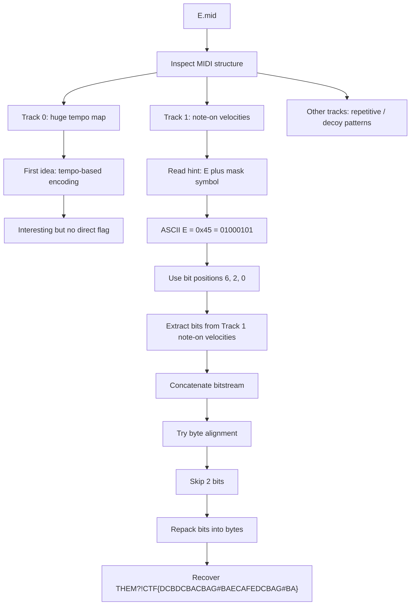

# spEEEEd - THEM?!CTF 2026 Writeup

> **Challenge:** spEEEEd  
> **Author:** Taokyle  
> **Description:** `E 🎭`

## TL;DR

This challenge gives us a single MIDI file, `E.mid`, and the hint `E 🎭`. There is no remote service, no APK, no packet capture, and no extra archive to brute-force. The entire solve path is inside the MIDI event stream.

The useful observation is that the hint is not about the musical note **E** directly. It is about using the character **`E`** as a **bit mask**. The ASCII value of `E` is `0x45`, which is binary `0100 0101`. That selects bit positions **6, 2, and 0**.

If we walk the **Track 1 Note-On velocities**, extract bits **6, 2, 0** from each velocity, concatenate them, shift by the correct bit alignment, and repack into bytes, we recover the flag directly:

```text
THEM?!CTF{DCBDCBACBAG#BAECAFEDCBAG#BA}
```

---

## What data/file we have and what is special

We only have one file:

```text
E.mid
```

Basic file information:

- Standard MIDI file
- Format 1
- 13 tracks
- Division / ticks per beat: 240

There is **no interactive server** in this challenge, so there is no client-server transcript to document. The entire challenge is offline.

What is special about this MIDI:

1. **Track 0 has a huge tempo map**  
   There are thousands of tempo change meta-events. The challenge title `spEEEEd` strongly suggests tempo / timing / speed is important, so this is an obvious thing to inspect first.

2. **Many tracks contain artificial-looking note patterns**  
   Several tracks use repeated note blocks, very regular timing, strange velocity distributions, or even lots of velocity-0 note-on events. That is a common sign that the MIDI is being used as a data container rather than as purely musical content.

3. **The hint is tiny but precise**  
   `E 🎭` is the real key. The theatrical mask suggests that `E` is used as a **mask**, not merely as a note name.

A quick structural summary from parsing the MIDI:

- **Track 0**: metadata + **2159 tempo events**
- **Track 1**: 2191 note-on + 2191 note-off
- **Track 2-12**: multiple dense note tracks with repetitive timing and suspicious velocity patterns

That immediately tells us this is a data-hiding challenge inside MIDI events, not a normal music-theory puzzle.

---

## Concept Map



---

## Problem Analysis (In Details)

### 1. Why Track 0 looks suspicious

When parsing the MIDI, Track 0 stands out immediately because it contains an unusually large number of tempo-change events:

```text
meta_51 (set_tempo): 2159 times
```

That is far beyond what we expect from a normal hand-authored MIDI. Combined with the challenge title `spEEEEd`, it is natural to think the tempo map itself is carrying data.

That is a reasonable first direction, but by itself it does not directly yield a clean `THEM?!CTF{...}` string.

### 2. Why Track 1 becomes the best target

Track 1 has a clean structure:

- 2191 note-on events
- 2191 note-off events
- no extra clutter beyond minimal metadata

Most importantly, its **velocity values vary a lot**. That is exactly the kind of field you would use to store bits while keeping the file playable.

Example early Track 1 events:

```text
(7680, note_on,  note=45, velocity=58)
(7800, note_on,  note=48, velocity=58)
(7800, note_on,  note=52, velocity=58)
(7920, note_on,  note=40, velocity=122)
(8040, note_on,  note=48, velocity=126)
(8040, note_on,  note=52, velocity=58)
(8130, note_on,  note=40, velocity=62)
```

These are much more useful than tempo meta-events because note velocities are compact and byte-like.

### 3. Interpreting the hint correctly

The hint is:

```text
E 🎭
```

The key step is to read the mask symbol literally.

Instead of thinking:

- “Look only at note E”
- “Use E major / E minor”
- “Extract all E pitches”

we should think:

- **Use E as a mask**

ASCII `E` is:

```text
'E' = 0x45 = 69 = 0b01000101
```

The set bits are at positions:

```text
6, 2, 0
```

That gives a very concrete extraction rule:

- For each Track 1 note-on velocity
- Read bits **6**, **2**, and **0**
- Append them to a growing bitstream

This produces 3 bits per note-on event.

### 4. Why alignment matters

After collecting the bitstream, we still need to decide where the byte boundaries begin.

That is common in stego: the payload exists, but it is shifted by a few bits. So we test small offsets, usually `0..7`.

When we try those alignments, **skip = 2** gives a perfect flag string:

```text
THEM?!CTF{DCBDCBACBAG#BAECAFEDCBAG#BA}
```

At that point the extraction is no longer ambiguous, because we get a clean flag with the correct format.

### 5. Why the flag content makes sense

The recovered body:

```text
DCBDCBACBAG#BAECAFEDCBAG#BA
```

looks like a musical note sequence rather than random ASCII. That fits the challenge theme perfectly:

- MIDI file
- title about speed
- hint about `E`
- final payload expressed as note names

So both the **method** and the **result** are consistent with the challenge design.

---

## Initial Guesses / First Try

The first natural ideas were:

1. **Tempo-map decoding**  
   Because the title is `spEEEEd`, Track 0 looked like the intended path. There are thousands of tempo changes, so it was worth checking whether tempo deltas or tempo values could be interpreted as bytes.

2. **Visual piano-roll stego**  
   MIDI challenges sometimes hide letters by arranging notes into shapes when plotted by pitch vs. time.

3. **Pitch-name extraction**  
   The hint starts with `E`, so a music-based interpretation such as extracting notes around E is an understandable first guess.

Those were not the shortest path. The clean solve came from taking the mask symbol seriously and treating `E` as a bit mask.

---

## Exploitation Walkthrough / Flag Recovery

### Step 1. Parse the MIDI manually

We do not need any third-party library. Standard MIDI files are easy enough to parse with a short Python script:

- read the `MThd` header
- read each `MTrk`
- parse variable-length delta times
- respect running status
- collect channel events

### Step 2. Isolate Track 1 note-on events

We only keep events where:

```text
message type = note_on
```

For each of those events, we extract the velocity byte.

### Step 3. Apply the `E` mask

Convert `E` to its ASCII value and use the set bits:

```python
mask = ord('E')          # 0x45
positions = [6, 2, 0]
```

Then for every velocity:

```python
for pos in positions:
    bits.append((velocity >> pos) & 1)
```

### Step 4. Try bit alignment

After building the bitstream, test small shifts until the bytes decode cleanly.

The correct alignment is:

```text
skip = 2
```

### Step 5. Repack into bytes

Group the shifted bitstream into 8-bit chunks and convert to bytes.

That yields:

```text
THEM?!CTF{DCBDCBACBAG#BAECAFEDCBAG#BA}
```

### Full solver

```python
from pathlib import Path
import re


data = Path("E.mid").read_bytes()


def read_var(b, i):
    val = 0
    while True:
        c = b[i]
        i += 1
        val = (val << 7) | (c & 0x7F)
        if c < 0x80:
            break
    return val, i


def read_u32(b, i):
    return int.from_bytes(b[i:i+4], "big"), i + 4


# Parse MIDI header
idx = 0
assert data[idx:idx+4] == b"MThd"
idx += 4
hdr_len, idx = read_u32(data, idx)
hdr = data[idx:idx+hdr_len]
idx += hdr_len
ntr = int.from_bytes(hdr[2:4], "big")

tracks = []
for _ in range(ntr):
    assert data[idx:idx+4] == b"MTrk"
    idx += 4
    length, idx = read_u32(data, idx)
    tracks.append(data[idx:idx+length])
    idx += length


def parse_track(track_bytes):
    i = 0
    tick = 0
    running = None
    events = []

    while i < len(track_bytes):
        dt, i = read_var(track_bytes, i)
        tick += dt

        b0 = track_bytes[i]
        if b0 < 0x80:
            status = running
        else:
            status = b0
            i += 1
            if status < 0xF0:
                running = status

        if status == 0xFF:
            meta = track_bytes[i]
            i += 1
            length, i = read_var(track_bytes, i)
            i += length
            continue

        if status in (0xF0, 0xF7):
            length, i = read_var(track_bytes, i)
            i += length
            continue

        typ = status >> 4
        size = 1 if typ in (0xC, 0xD) else 2
        payload = track_bytes[i:i+size]
        i += size
        events.append((tick, status, payload))

    return events


track1 = parse_track(tracks[1])

# E as bit mask: 0x45 = 0b01000101 => bit positions 6, 2, 0
positions = [6, 2, 0]
bitstream = []

for _, status, payload in track1:
    if (status >> 4) == 0x9 and len(payload) >= 2:  # note_on
        velocity = payload[1]
        for pos in positions:
            bitstream.append((velocity >> pos) & 1)

# Correct alignment
skip = 2
bitstream = bitstream[skip:]

out = bytearray()
for i in range(0, len(bitstream) - 7, 8):
    x = 0
    for bit in bitstream[i:i+8]:
        x = (x << 1) | bit
    out.append(x)

flag = re.search(rb"THEM\?!CTF\{[^}]+\}", bytes(out)).group(0).decode()
print(flag)
```

### Output

```text
THEM?!CTF{DCBDCBACBAG#BAECAFEDCBAG#BA}
```

---

## What We Learned

1. **A tiny hint can fully define the solve path**  
   `E 🎭` looked minimal, but it actually gave the exact operation: use `E` as a mask.

2. **In MIDI challenges, metadata is not always the final payload path**  
   The title and huge tempo map strongly pull attention toward Track 0, but the real data was in note velocities.

3. **Bit alignment is often the last missing piece**  
   Even with the correct extraction rule, the payload may still look wrong until the byte boundary is shifted properly.

4. **Theme consistency is a strong validation signal**  
   Recovering a flag body that looks like a note sequence is a good sign in a music-themed reverse/stego challenge.

5. **You do not need heavyweight tooling for many file-format challenges**  
   A small manual parser is often enough, especially when the format is well-structured like MIDI.

---

## Final Flag

```text
THEM?!CTF{DCBDCBACBAG#BAECAFEDCBAG#BA}
```
