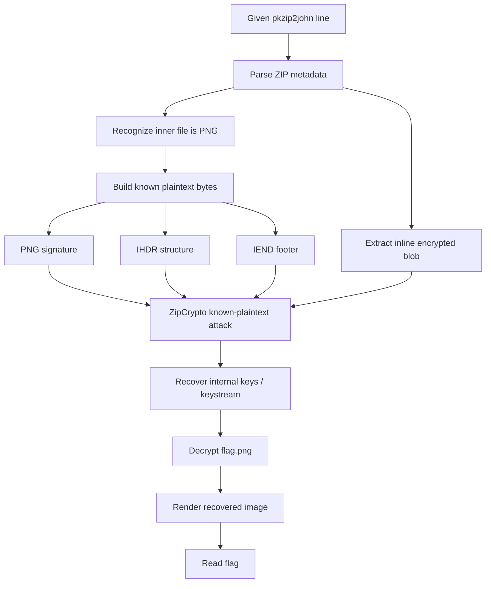

# skeleton - TJCTF 2026 Write-up

## Description

I zipped up a picture of the flag, but I forgot the password. Luckily, I saved the `zip2john` hash. Can you recover the image?

---

## 1. TL;DR

This was **not** a normal password brute-force challenge.

The provided `zip2john` output already contained the encrypted contents of `flag.png`, together with enough ZIP metadata to recognize that the archive used **legacy PKZIP ZipCrypto**. Because the file inside the ZIP was a **PNG**, we knew several plaintext bytes in advance:

- the PNG signature at the beginning
- the `IHDR` chunk structure near the front
- the `IEND` chunk at the end

With a stored PNG and enough known plaintext, ZipCrypto’s internal keys can be recovered directly. After recovering the keystream/state, we decrypt the PNG bytes, reconstruct the image, and read the flag from the recovered picture.

Recovered flag:

**`tjctf{1ts_4ll_ab0ut_th3_keys}`**

---

## 2. What data/file we have and what is special

### Files provided

We were given a single `zip2john` line:

```text
flag.zip/flag.png:$pkzip2$1*1*2*0*12c*120*c8a6617a*0*26*0*12c*c8a6*81bd*36bee62e49e2b2c41f6260bdc2e5fdd8cabd38956eb51f1d8a48c8f6228fd7392a8c53f3199068e3017e11c65e32cd55ea33033ab8b2fb52c4f86373098af1732591290e5c99a2a74239243b67108f232def15a73aac1537e75a593abe81fb3a8b0338afeb00835c67f8a31896a5f73facd1f481fd5ebc8882b5b183819f9b71c89506b3ae7d17bc07ab187ece8413a88af072018ccdc8a2db425082cec0715fd5aa3b3c47bb4f5c93b397154eb2212ffd593d0e4e614d83dafba289710be2e538f4610e8cb53c025aa722bfe832ec4d6cbe33350c09b690c92560292893f72c7e9894a50efaaf9635d64c86b053053b861a00e1717d7b2b963782ea4fe407008153d2d0564e2cbe3792eaa0dacd611b9eaf9d3e7d5b54ab63ae9906b62c830ef4b873d954c25c22e8a221c9*$/pkzip2$:flag.png:flag.zip::flag.zip
```

The important point is that this is **much more than a password hash**. The line contains embedded ZIP metadata and the encrypted file blob itself. From the uploaded hash line, we can extract the following useful facts. fileciteturn2file0

| Field | Meaning | Why it matters |
|---|---|---|
| `flag.png` | Inner file name | Tells us the plaintext file type is PNG |
| `12c` | Compressed size = `0x12c` = 300 bytes | Very small target |
| `120` | Uncompressed size = `0x120` = 288 bytes | Suggests little or no room for entropy |
| `c8a6617a` | CRC32 | Useful for validation |
| long hex blob | Encrypted data inline | We do not need the original ZIP file |

### What is special

The trap is the phrase "forgot the password." That makes you think of:

- `john` wordlists
- mask brute force
- guessing weak passwords

That is the wrong mindset here.

The real weakness is **ZipCrypto itself**. Old PKZIP encryption is not secure against known-plaintext attacks. Once the file type is recognizable and the format gives predictable bytes, the password is often unnecessary.

---

## 3. Problem Analysis (In Details)

### 3.1 Why this is not just password cracking

If the challenge only wanted brute force, the provided artifact would usually be treated like a conventional password hash problem. But here the target file is `flag.png`, and PNG is a **highly structured format**.

A PNG always begins with the same 8-byte signature:

```text
89 50 4E 47 0D 0A 1A 0A
```

Then it immediately contains a standard `IHDR` chunk. At the end, a valid PNG always terminates with the `IEND` chunk:

```text
00 00 00 00 49 45 4E 44 AE 42 60 82
```

That means we know plaintext bytes near both the beginning and the end of the file before decrypting anything.

### 3.2 Why known plaintext matters for ZipCrypto

Classic PKZIP ZipCrypto is not AES. It is an older stream-like construction with internal keys updated byte-by-byte. If you know enough plaintext/ciphertext pairs, you can recover the internal state and decrypt the rest of the file.

So the solve path becomes:

1. Parse the `zip2john` line.
2. Extract the encrypted bytes of the PNG member.
3. Build known plaintext from the PNG structure.
4. Recover ZipCrypto internal keys/state.
5. Decrypt the file.
6. Open the recovered image and read the flag.

### 3.3 Why the sizes are helpful

From the provided line, the member sizes are small: 300 encrypted bytes and 288 plaintext bytes. fileciteturn2file0

That is excellent for an attack because:

- the full target is tiny
- the file format is rigid
- the decrypted output can be validated quickly
- the final image can be checked visually

### 3.4 Why the challenge name is "skeleton"

The name hints that we are reconstructing something from a bare framework. We do **not** have the original archive and we do **not** know the password. We only have the essential structure left behind: the ZIP metadata, the ciphertext, and the known bones of the PNG format.

---

## Concept Map



---

## 4. Exploitation Walkthrough / Flag Recovery

### 4.1 Extract the useful data from the hash line

The first step is to treat the `pkzip2john` line as a container, not as a simple password digest.

We care about:

- the file name: `flag.png`
- the plaintext size: `0x120`
- the encrypted size: `0x12c`
- the CRC32: `c8a6617a`
- the encrypted member bytes embedded as hex

Because that encrypted member data is already present in the line, we can reconstruct the ciphertext stream directly without needing `flag.zip`.

### 4.2 Use PNG as known plaintext

We then build a partial plaintext template.

Known bytes at the beginning:

```text
89 50 4E 47 0D 0A 1A 0A
```

Known bytes at the end:

```text
00 00 00 00 49 45 4E 44 AE 42 60 82
```

For a tiny PNG, the beginning also strongly suggests the standard chunk progression, so we get even more anchored structure near the front.

### 4.3 Recover ZipCrypto state

This is the actual hard part.

Given enough ciphertext plus known plaintext, we run a ZipCrypto known-plaintext recovery process. Conceptually, the attacker matches the known bytes against the encrypted stream and prunes impossible internal key states until only valid candidates remain.

This is why the challenge feels difficult: the solve is not a one-line brute force. It is a **cryptanalytic recovery of the ZIP encryption state** from file format structure.

### 4.4 Decrypt the whole PNG

Once the correct state is found, the rest is straightforward:

- decrypt all 288 plaintext bytes
- write them to `flag.png`
- open the image
- read the visible flag text

Recovered image:


### 4.5 Read the flag from the image

The recovered PNG displays:

**`tjctf{1ts_4ll_ab0ut_th3_keys}`**

---

## 5. What We Learned

1. **Do not assume ZIP challenge = password brute force.**  
   If the archive uses legacy ZipCrypto and the file format is predictable, known-plaintext attacks may completely bypass password guessing.

2. **`zip2john` output can leak far more than people expect.**  
   In this challenge, the line carried enough metadata and encrypted content to recover the file offline.

3. **PNG is a very attacker-friendly format.**  
   Fixed signature bytes, fixed terminal chunk, and rigid chunk structure make it an excellent known-plaintext source.

4. **Small files are dangerous under weak encryption.**  
   When the whole target is only a few hundred bytes, validation and key-state pruning become much easier.

5. **The real secret was not the password.**  
   The challenge was about the weakness of the encryption scheme, which is exactly why the flag is:

   **`tjctf{1ts_4ll_ab0ut_th3_keys}`**

---

## Minimal Solve Summary

```text
Input: pkzip2john line only
↓
Recognize legacy PKZIP ZipCrypto + PNG file type
↓
Use PNG known plaintext (header + footer + structure)
↓
Recover ZipCrypto internal state
↓
Decrypt inline ciphertext into PNG
↓
Open image and read flag
```

---

## Optional Notes

If you want to reproduce this locally in a tooling-oriented way, the practical routes are usually:

- `bkcrack` with a reconstructed encrypted member and known plaintext bytes
- a custom ZipCrypto state-recovery script

The key insight is the same in both cases: **recover the encryption state from known plaintext, not the password from brute force**.
