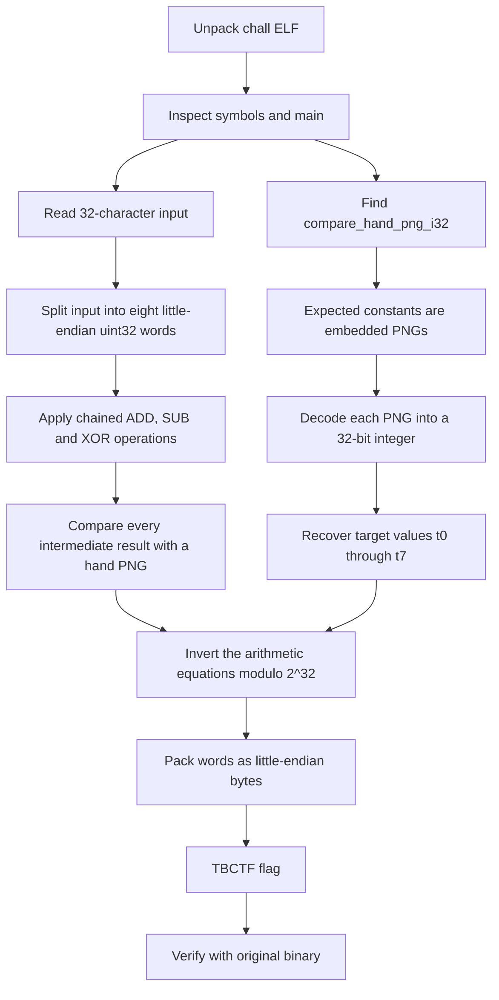

# Finger Arithmetic — TraceBash CTF Write-up

> **Category:** Reverse Engineering  
> **Points:** 499  
> **Author:** S31ZUR3  
> **Flag:** `TBCTF{ju75u5_n_d34d_3nd5_4w417!}`

## Challenge Description

> A verification mechanism locked behind a mysterious mathematical validation routine. You are presented with a binary that expects a 32-character key. Your goal is to bypass the validation checks and recover the key.
>
> Can you crack the code and unlock the flag?

The challenge provides one Linux executable inside `finger-arithmetic.zip`:

```text
finger-arithmetic.zip
└── chall
```

---

## 1. TL;DR

The binary reads a 32-character key, divides it into eight little-endian 32-bit words, and passes those words through a chained arithmetic routine.

The unusual part is that the expected constants are **not stored as normal integers**. Instead, each expected value is stored as an embedded PNG containing four hand-like diagrams. Each diagram encodes one byte using finger states.

After decoding the eight PNG-backed target integers, we invert the arithmetic chain modulo `2^32`, pack the recovered words in little-endian order, and obtain:

```text
TBCTF{ju75u5_n_d34d_3nd5_4w417!}
```

The recovered key was verified against the original binary:

```text
Enter the flag: Correct! The flag is the input you entered.
```

---

## Concept Map



---

## 2. What Data/File We Have and What Is Special

### Archive contents

```bash
unzip -l finger-arithmetic.zip
```

```text
Archive:  finger-arithmetic.zip
  Length      Name
---------     ----
   547032     chall
```

Basic inspection:

```bash
unzip finger-arithmetic.zip
chmod +x chall
file chall
```

```text
chall: ELF 64-bit LSB pie executable, x86-64, dynamically linked, not stripped
```

The binary being **not stripped** is very helpful. Important symbols are still visible:

```bash
nm -C chall | grep -E 'main|validate_checksum|compare_hand'
```

```text
0000000000001550 T validate_checksum_v2
0000000000001740 T main
0000000000015ee0 T compare_hand_png_i32
```

### What makes the binary unusual

A normal crackme might contain comparisons such as:

```c
if (value != 0x65657598)
    return false;
```

This binary does not expose its important constants that way. Instead, it repeatedly calls:

```c
compare_hand_png_i32(candidate, embedded_png, png_length);
```

`compare_hand_png_i32` renders the candidate integer into a deterministic `256 × 256` RGBA image and compares it with an embedded PNG.

The function processes the integer one byte at a time:

```text
32-bit integer
      │
      ├── byte 0 ──> hand diagram 0
      ├── byte 1 ──> hand diagram 1
      ├── byte 2 ──> hand diagram 2
      └── byte 3 ──> hand diagram 3
```

The byte order is little-endian. The first displayed byte is the least significant byte.

Within each diagram, eight finger states encode eight bits. An extended finger represents `1`, while a bent finger represents `0`. The thumb corresponds to the high bit, followed by the remaining seven bit positions.

This means the embedded images are effectively obfuscated integer constants.

---

## 3. Problem Analysis

### 3.1 Input handling in `main`

Disassembling `main`:

```bash
objdump -d -Mintel \
  --start-address=0x1740 \
  --stop-address=0x1912 \
  chall
```

The relevant logic can be simplified to:

```c
char input[64] = {0};

fgets(input, sizeof(input), stdin);
input[strcspn(input, "\n")] = '\0';

int length = strlen(input);

if (!compare_hand_png_i32(length, length_png, length_png_size))
    fail();

if (!compare_hand_png_i32(*(uint32_t *)input, first4_png, first4_png_size))
    fail();

if (!compare_hand_png_i32((int8_t)input[5], char5_png, char5_png_size))
    fail();

int valid = validate_checksum_v2((uint32_t *)input);

if (compare_hand_png_i32(valid, success_png, success_png_size))
    success();
else
    fail();
```

Decoding those preliminary image checks gives:

| Check | Required value | Meaning |
|---|---:|---|
| Input length | `32` | Key must contain exactly 32 characters |
| First DWORD | `0x54434254` | Little-endian bytes `TBCT` |
| `input[5]` | `0x7b` | Character `{` |
| Validator result | `1` | `validate_checksum_v2` must succeed |

The first four bytes illustrate the endianness clearly:

```python
>>> import struct
>>> struct.pack("<I", 0x54434254)
b'TBCT'
```

### 3.2 Arithmetic validation routine

`validate_checksum_v2` interprets the 32-byte input as eight unsigned 32-bit words:

```text
x0 x1 x2 x3 x4 x5 x6 x7
```

Each word contains four flag bytes in little-endian order.

The validator computes eight intermediate target values:

```c
t0 = x0 + 0x11223344;
t1 = x1 ^ t0;
t2 = x2 - t1;
t3 = x3 ^ t2;
t4 = x4 + t3;
t5 = x5 ^ t4;
t6 = x6 - t5;
t7 = x7 ^ t6;
```

After each operation, the result is checked using a different embedded hand PNG:

```c
compare_hand_png_i32(t0, png0, size0);
compare_hand_png_i32(t1, png1, size1);
compare_hand_png_i32(t2, png2, size2);
compare_hand_png_i32(t3, png3, size3);
compare_hand_png_i32(t4, png4, size4);
compare_hand_png_i32(t5, png5, size5);
compare_hand_png_i32(t6, png6, size6);
compare_hand_png_i32(t7, png7, size7);
```

All arithmetic is performed on 32-bit values, so addition and subtraction wrap modulo `2^32`.

### 3.3 Recovering the image-backed target constants

The eight arithmetic PNGs decode to:

```python
T = [
    0x65657598,
    0x100F0EDE,
    0x25662659,
    0x41394806,
    0xA09D7C39,
    0x95F9120A,
    0x9E7E2255,
    0xE35F1564,
]
```

These are the required values of `t0` through `t7`.

| Target | Decoded integer |
|---|---:|
| `t0` | `0x65657598` |
| `t1` | `0x100f0ede` |
| `t2` | `0x25662659` |
| `t3` | `0x41394806` |
| `t4` | `0xa09d7c39` |
| `t5` | `0x95f9120a` |
| `t6` | `0x9e7e2255` |
| `t7` | `0xe35f1564` |

### 3.4 Inverting the arithmetic chain

Each operation is reversible.

Original equations:

```text
t0 = x0 + 0x11223344
t1 = x1 XOR t0
t2 = x2 - t1
t3 = x3 XOR t2
t4 = x4 + t3
t5 = x5 XOR t4
t6 = x6 - t5
t7 = x7 XOR t6
```

Rearranging them gives:

```text
x0 = t0 - 0x11223344
x1 = t1 XOR t0
x2 = t2 + t1
x3 = t3 XOR t2
x4 = t4 - t3
x5 = t5 XOR t4
x6 = t6 + t5
x7 = t7 XOR t6
```

Again, addition and subtraction must be masked to 32 bits:

```python
value &= 0xffffffff
```

The recovered words are:

| Word | Integer | Little-endian bytes |
|---|---:|---|
| `x0` | `0x54434254` | `TBCT` |
| `x1` | `0x756a7b46` | `F{ju` |
| `x2` | `0x35753537` | `75u5` |
| `x3` | `0x645f6e5f` | `_n_d` |
| `x4` | `0x5f643433` | `34d_` |
| `x5` | `0x35646e33` | `3nd5` |
| `x6` | `0x3477345f` | `_4w4` |
| `x7` | `0x7d213731` | `17!}` |

Concatenating them gives the complete 32-byte key.

---

## 4. Exploitation Walkthrough / Flag Recovery

### Step 1 — Extract and inspect the binary

```bash
unzip finger-arithmetic.zip
chmod +x chall
file chall
nm -C chall | grep -E 'main|validate_checksum|compare_hand'
```

Because the binary is not stripped, the validator and image comparison function are immediately identifiable.

### Step 2 — Reconstruct the pseudocode

Inspect `main` and `validate_checksum_v2`:

```bash
objdump -d -Mintel \
  --start-address=0x1550 \
  --stop-address=0x1912 \
  chall
```

From the instructions at `validate_checksum_v2`, reconstruct the chained equations described above.

### Step 3 — Decode the embedded hand images

The `compare_hand_png_i32` calls contain:

```text
candidate integer
pointer to embedded PNG
embedded PNG length
```

The hand images reveal the expected target integers `t0` through `t7`.

An effective way to validate uncertain image decodings is to use the original renderer as an oracle: patch or call the comparison routine with a candidate integer and keep only candidates that exactly match the embedded PNG. This avoids relying solely on visual recognition.

### Step 4 — Run the recovery script

```python
#!/usr/bin/env python3

import struct

MASK32 = 0xFFFFFFFF

T = [
    0x65657598,
    0x100F0EDE,
    0x25662659,
    0x41394806,
    0xA09D7C39,
    0x95F9120A,
    0x9E7E2255,
    0xE35F1564,
]


def p32(value: int) -> bytes:
    return struct.pack("<I", value & MASK32)


words = [
    (T[0] - 0x11223344) & MASK32,
    T[1] ^ T[0],
    (T[2] + T[1]) & MASK32,
    T[3] ^ T[2],
    (T[4] - T[3]) & MASK32,
    T[5] ^ T[4],
    (T[6] + T[5]) & MASK32,
    T[7] ^ T[6],
]

flag = b"".join(p32(word) for word in words)
print(flag.decode())
```

Run it:

```bash
python3 solve_finger_arithmetic.py
```

Output:

```text
TBCTF{ju75u5_n_d34d_3nd5_4w417!}
```

### Step 5 — Verify against the original binary

```bash
printf '%s\n' 'TBCTF{ju75u5_n_d34d_3nd5_4w417!}' | ./chall
```

Output:

```text
Enter the flag: Correct! The flag is the input you entered.
```

Therefore, the flag is:

```text
TBCTF{ju75u5_n_d34d_3nd5_4w417!}
```

### Debugging pitfall: embedded newline byte

One target value is:

```text
t5 = 0x95f9120a
```

Its least significant byte is `0x0a`, the newline character.

During oracle-based testing, passing this integer directly as four raw bytes through the program's normal `fgets()` input path causes the input to terminate at the first byte. This can make a correct candidate appear incorrect.

The solution is to place the candidate directly into the comparison function, patch the relevant register/value, or use a harness that does not pass the target through `fgets()`.

---

## 5. What We Learned

### Constants do not need to look like constants

The expected values were stored as images rather than immediate operands. Searching only for suspicious integers would miss the core validation data.

### Endianness matters

The key is processed as eight little-endian 32-bit words. For example:

```text
0x54434254 -> 54 42 43 54 -> "TBCT"
```

Reading those values as big-endian would produce meaningless text.

### Arithmetic chains are often easier to invert than brute-force

Every operation in the validator is reversible:

- `+` is reversed with `-`;
- `-` is reversed with `+`;
- XOR is its own inverse.

Once the target values were known, no brute-force search over the 32-character key was required.

### Remember integer width

The calculations use 32-bit values. Python integers do not overflow automatically, so additions and subtractions must be masked with:

```python
& 0xffffffff
```

### Use the binary as an oracle

When a custom visual encoding is difficult to decode perfectly, the original comparison routine is the most reliable validator. A classifier or manual reading can generate candidates, while the binary confirms the exact answer.

### Input functions can interfere with binary testing

`fgets()` treats `0x0a` as a line terminator. Raw-byte testing must account for delimiter bytes, null bytes, signed-byte conversions, and other input-path behaviour.

---

## Final Flag

```text
TBCTF{ju75u5_n_d34d_3nd5_4w417!}
```
