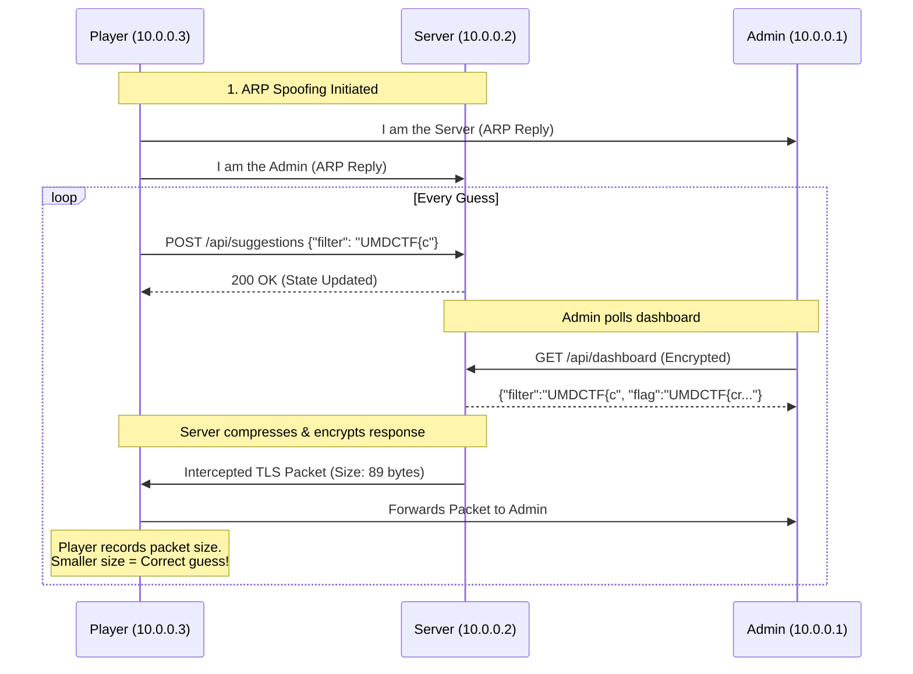

# Security Breach - UMDCTF 2026 Writeuo

**Challenge Description:**  
> Our agents have infiltrated the world's smallest--I mean largest--insider trading network!  
> They left a note for you on the server. Best of luck!  
> `nc challs.umdctf.io 31337`  
> *Flag format: `UMDCTF{...}`*

## 1. TL;DR
This challenge is a classic implementation of a **BREACH attack** (Browser Reconnaissance and Exfiltration via Adaptive Compression of Hypertext). By using **ARP Spoofing** to Man-in-the-Middle (MitM) the connection between an automated admin bot and an HTTPS server, we were able to measure the lengths of encrypted TLS packets. Because the server reflects our input alongside the secret flag and applies **DEFLATE compression**, we exploited the compression oracle to leak the flag character by character based on the resulting payload size.

---

## 2. What data/files we have and what is special

Upon connecting to the internal network via `nc`, we drop into a remote bash shell.
We are provided with a `notes.md` file and the source code for the infrastructure (`server.py` and `admin.py`).

### The Network Topology (`notes.md`)
- **`10.0.0.1` (Admin Box):** Runs `admin.py`. It's a simulated admin continuously hitting the server's dashboard every 50ms using a valid session cookie.
- **`10.0.0.2` (Server):** Runs `server.py` over HTTPS (self-signed cert) on port 443. 
- **`10.0.0.3` (Player Box):** Our machine. We have access to pre-installed network tools like `arpspoof`.

### The Server Interactivity
- **`POST /api/suggestions`**: Open to anyone. Allows us to submit a `"filter"` string.
- **`GET /api/dashboard`**: Admin-only endpoint. Returns a JSON response containing our recent filter suggestion AND the hidden flag:
  ```json
  {"filter":"<our_input>","flag":"UMDCTF{...}"}
  ```
- **The Catch:** The server applies HTTP compression (`gzip`, `deflate`, or `brotli`) to this response and encrypts it using TLS 1.2/1.3.

---

## 3. Problem Analysis (In Details)

At first glance, it seems impossible to steal the flag. We cannot guess the cryptographically secure `ADMIN_SESSION` cookie, and we cannot read the admin's traffic because it is encrypted via HTTPS. 

However, this setup contains the holy trinity of a **Compression Oracle (BREACH) vulnerability**:
1. **HTTP Compression is enabled** (The server compresses responses).
2. **Attacker-controlled input is reflected** (Our `/api/suggestions` filter is present in the response).
3. **A secret is in the same response body** (The `flag` is right next to our filter).

### How DEFLATE Compression Works
DEFLATE (used by gzip) shrinks data by finding repeated strings and replacing them with short back-references. 
- If our guess is `filter: "UMDCTF{a"`, and the flag is `"UMDCTF{cr1m3..."`, the compressor only sees `"UMDCTF{"` as a repeating string.
- If our guess is `filter: "UMDCTF{c"`, the compressor sees `"UMDCTF{c"` as a repeating string. Because the matching string is longer, the resulting compressed payload will be **measurably smaller**.

Although the traffic is encrypted via TLS, **TLS does not hide the length of the underlying application data**. By measuring the size of the encrypted packets, we can deduce the size of the compressed plaintext!

---

## 4. Concept Map

Here is the flow of the exploit visually mapped out:



---

## 5. Initial Guesses / First Try

1. **Authentication Bypass?** I initially checked if `parse_qs` or JSON parsing in `server.py` had a logic flaw that would let me bypass the admin check. But `secrets.token_hex(16)` is unbreakable.
2. **XSS?** The admin bot uses `http.client`—it isn't a real browser rendering DOM, so Cross-Site Scripting wouldn't execute anything.
3. **The "Aha" Moment:** Looking at `_ENCODERS` in `server.py` and the fact that the admin polls the server **every 50ms**, it became obvious that the challenge was designed to generate a massive amount of traffic for statistical size-analysis. The pre-installed `arpspoof` binary confirmed we were meant to perform network MitM.

---

## 6. Exploitation Walkthrough / Flag Recovery

We wrote a custom Python script that performs the attack from inside the provided remote shell.

### Step 1: Network Hijacking (MitM)
We enabled IP forwarding so we wouldn't break the admin's connection, and then spawned `arpspoof` to route all traffic between `10.0.0.1` and `10.0.0.2` through our machine.

### Step 2: Custom Packet Sniffer
Instead of relying on `tcpdump` (which wasn't installed), we used Python's `socket.AF_PACKET` raw sockets to sniff the TCP traffic passing through our machine. We manually parsed the IPv4 and TCP headers to isolate the **TLS Application Data** records (Content Type 23) and record their exact byte lengths.

### Step 3: The Oracle Loop
We iterated through a standard charset (`a-z0-9_}`). For each character:
1. Send the guess (e.g., `UMDCTF{a`) to `/api/suggestions`.
2. Wait a fraction of a second for the admin to fetch the dashboard.
3. Sniff the returning encrypted packet size.
4. Keep the character that resulted in the **smallest** packet size.

*(Note: Sometimes multiple characters resulted in the same packet size due to block/byte alignment. To fix this, we implemented a "tie-breaker" that prepends padding (`"A"`, `"AA"`) to shift the alignment, forcing the true character to compress better).*

### Step 4: The Execution
Running the script in the terminal yielded the flag character by character:

```text
player@insider-market:~$ python3 /tmp/solve.py
[*] Using interface: vp-i-62889803
[*] Waiting for ARP spoofing...
[*] Starting BREACH attack...
Testing: UMDCTF{} (size: 90)
[*] Best match: c (size: 89)
Testing: UMDCTF{c} (size: 90)
[*] Best match: r (size: 89)
Testing: UMDCTF{cr} (size: 90)
[*] Best match: 1 (size: 89)
...
[*] Best match: r (size: 89)
Testing: UMDCTF{cr1m3_p4ys_br34ch_m0r} (size: 90)
[*] Best match: e (size: 89)
Testing: UMDCTF{cr1m3_p4ys_br34ch_m0re} (size: 88)
[*] Best match: } (size: 88)

[!] Flag extracted: UMDCTF{cr1m3_p4ys_br34ch_m0re}
```

**Flag:** `UMDCTF{cr1m3_p4ys_br34ch_m0re}`

---

## 7. What We Learned

- **BREACH is incredibly practical:** Even with TLS 1.3, the length of the encrypted ciphertext is heavily correlated with the length of the compressed plaintext.
- **Mitigating Compression Oracles:** To protect APIs, you should either disable HTTP compression for endpoints reflecting user input alongside secrets, implement length-hiding techniques (like appending random amounts of garbage padding to responses), or separate sensitive data into different endpoints.
- **Raw Sockets in Python:** We learned how to manually unpack IP and TCP headers (`struct.unpack`) directly from raw sockets to build a lightweight, dependency-free packet sniffer on the fly.