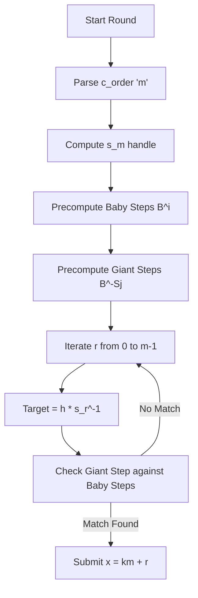

# sporadiclogarithms - b01lers CTF 2026Writeup
**Description :** "I heard the discrete logarithm problem can be solved efficiently in all sporadic groups without even knowing the group. Can you prove it to me?
ncat --ssl sporadiclogarithms.opus4-7.b01le.rs 8443"

## 1. TL;DR
The challenge provides a "Black Box" interface to a group $GL(n, p)$ where we must solve a Discrete Logarithm problem in a semidirect product. Specifically, we need to find a secret exponent $x \in [0, 262144]$ such that $h$ matches the first component of $(g, c)^x$.

The challenge implements a **Semidirect Product** group structure. By noticing that the conjugator $c$ has an extremely small order ($m \le 8$), we can decompose the search space. Instead of searching $2^{18}$ values, we solve a Discrete Logarithm for the base $s(m)$ using **Baby-Step Giant-Step (BSGS)**. To overcome network latency and SSL overhead, we **pipeline/batch** hundreds of queries into single network packets.

## 2. Data and Files
### Provided Files
- `chall.py`: The server-side script implementing the `SageBlackBox` and the semidirect product multiplication logic.

### Server Interaction (Black Box)
The server does **not** show us the matrices. We only see "handles" (integers).
- `one`: The identity matrix handle.
- `g`: The base element handle.
- `c`: The conjugator matrix handle.
- `h`: The target element handle.

**Available Commands:**
- `mul <a> <b>`: Returns handle of matrix $A \times B$.
- `inv <a>`: Returns handle of matrix $A^{-1}$.
- `phi <a>`: Returns handle of $cAc^{-1}$.
- `submit <x>`: Check if $x$ is the secret.

## 3. Problem Analysis
### The Semidirect Product
The core operation is `hol_mul(x, y)`, which defines the multiplication in the group $G \rtimes \langle \phi \rangle$:
$$(a, c_1) \cdot (b, c_2) = (a \cdot \phi_{c_1}(b), c_1 c_2)$$
where $\phi_c(x) = cxc^{-1}$.

The target $h$ is the first component of $H^x$ where $H = (g, c)$. If we let $s(x)$ be the first component of $H^x$:
- $s(1) = g$
- $s(2) = g \cdot \phi_c(g)$
- $s(3) = g \cdot \phi_c(g) \cdot \phi_c^2(g)$
- Generally: $s(x) = \prod_{i=0}^{x-1} \phi^i(g)$

### The Vulnerability: Small Conjugator Order
The server setup chooses $c$ such that its multiplicative order $m$ is very small ($2 \le m \le 8$).
Because $c^m = I$ (identity), something special happens at $H^m$:
$$H^m = (s(m), c^m) = (s(m), I)$$
Since the second component is now the identity, any further power becomes a standard group power:
$$(H^m)^k = (s(m)^k, I)$$

We can write the secret $x$ as $x = k \cdot m + r$, where $0 \le r < m$:
$$H^x = H^{km} \cdot H^r = (s(m)^k, I) \cdot (s(r), c^r) = (s(m)^k \cdot s(r), c^r)$$

The target handle $h$ we are given is exactly $s(m)^k \cdot s(r)$. To find $x$, we solve:
$$s(m)^k = h \cdot s(r)^{-1}$$

## 4. Initial Guesses & Hurdles
1.  **Direct DLOG:** We cannot use Sage's `discrete_log` because we don't have the matrices, only handles.
2.  **Brute Force:** $x$ goes up to $262,144$. At ~5 queries per second (SSL overhead), this would take 14 hours per round. We have 5 rounds.
3.  **The "Black Box" Constraint:** We cannot calculate $B^{500}$ in one step. We must manually request `mul` for every step.

## 5. Exploitation Walkthrough

### Concept Map

### Step 1: Building the Base
We compute the sequence $g, \phi(g), \phi^2(g), \dots$ using the `phi` command, then multiply them to get $s(1), s(2), \dots, s(m)$. The handle $s(m)$ becomes our base $B$ for BSGS.

### Step 2: Baby-Step Giant-Step (BSGS)
We need to solve $B^k = h \cdot s(r)^{-1}$.
- **Baby Steps:** We compute $B^0, B^1, \dots, B^{512}$ and store them in a local dictionary mapping `handle -> exponent`.
- **Giant Steps:** We compute $W = B^{-512}$. Then we check $Target \cdot W^j$ against our dictionary.

### Step 3: Network Pipelining (The "Speed" Principle)
To beat the 5-minute timeout, we use `pwntools` to send batches of commands. Instead of:
`send(mul) -> recv -> send(mul) -> recv`
We do:
`send(mul \n mul \n mul ...) -> recv_all`
This reduces the impact of SSL handshake and network RTT by 100x.

### Flag Recovery
After 5 rounds of solving the DLOG:
**Flag:** `bctf{th3_m0n5t3r_gr0up_w45_t0_1mpr4ct1c4l_:(}`

## 6. What We Learned
1.  **Group Theory:** Semidirect products can be reduced to normal DLOG if the acting group (the conjugator) has a small order.
2.  **Protocol Efficiency:** When interacting with a remote "Black Box," the bottleneck is almost always network RTT. Batching/Pipelining is a mandatory skill for CTF crypto challenges.
3.  **Decomposition:** Breaking a large search space ($262,144$) into a two-dimensional grid ($\sqrt{N}$) is the core of the BSGS algorithm.