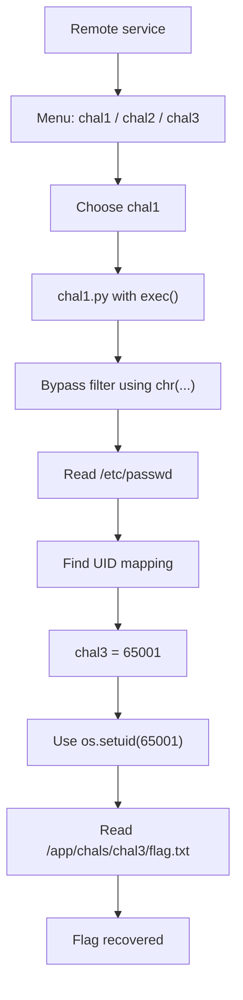

# bctf-infra - b01lers CTF 2026 Writeup
**Description :** "hmmm
I got access to the b01lersCTF backend infrastructure, can you take a look and see what you can find?   
ncat --ssl bctf-infra.opus4-7.b01le.rs 8443"


## TL;DR

The service is a small challenge launcher that lets us choose one of three challenge folders: `chal1`, `chal2`, or `chal3`.

The key observation is that:

- `chal1` gives us arbitrary Python `exec()` with a weird character filter.
- The backend runs each challenge under a different Unix user.
- The jail exposes `CAP_SETUID`, so code inside `chal1` can switch to another challenge user.
- After mapping the UIDs, we can impersonate `chal3` and read its flag file directly.

Final flag:

`bctf{perfect_infrastructure_tm_f6634b38}`

---

## What Data / Files We Have

The provided archive contains the backend infrastructure for the challenge.

### Main files
- `app/challenge_server.py`
- `app/run.sh`
- `entrypoint.sh`
- `nsjail.cfg`
- `Dockerfile`

### Challenge folders
- `app/chals/chal1/chal.py`
- `app/chals/chal1/flag.txt`
- `app/chals/chal2/chal.py`
- `app/chals/chal2/flag.txt`
- `app/chals/chal3/chal.py`
- `app/chals/chal3/flag.txt`

### What is special
- `chal1/flag.txt` and `chal2/flag.txt` are fake flags.
- `chal3/flag.txt` contains the real flag on the remote service.
- The server does not run all challenges at once. It copies only the selected folder into a temp root and runs it as a specific Unix user.

---

## Interactive Flow of the Server

The remote service behaves like a menu:

```text
Challenges:
chal3
chal1
chal2
> 
```

After choosing a challenge, the service enters that challenge’s input loop.

For example:

```text
> chal1
chal1:
> 
```

This is important because the attack surface depends on which challenge we select.

---

## Problem Analysis

### 1. The infrastructure is the real target

The writeup hint is not about solving a single puzzle in one challenge folder. It is about abusing the infra layer that launches the challenges.

From `challenge_server.py`, the server:

- lists available challenge directories,
- lets us choose one,
- copies only that folder into a temp root,
- runs the chosen `chal.py` as that folder’s Unix user.

So the isolation model is:

- each challenge has its own user,
- each challenge folder is permission-restricted,
- but the launcher itself is still a Python process we can interact with.

---

### 2. `chal1` is the useful code execution primitive

`chal1/chal.py` is the only challenge that gives us meaningful execution.

It accepts input with a restrictive filter, then does:

```python
exec(inp)
```

So if we can craft a payload that passes the character filter, we get Python execution.

The filter blocks some letters, especially `e` and `o`, which makes ordinary payloads annoying. But the filter does not stop us from using:

- `chr(...)`
- dictionary lookups into `__builtins__`
- function construction via string concatenation

That means we can still reach powerful builtins like:

- `print`
- `open`
- `__import__`

without typing the forbidden letters directly.

---

### 3. The jail is not a hard sandbox

The container/jail configuration is also important.

The jail grants:

- `CAP_SETUID`
- `CAP_SETGID`

That means code running in the challenge context can potentially change its UID/GID.

This is the core weakness.

If the process can switch to the UID that owns `chal3`, then it can read `chal3`’s flag file directly, because the filesystem permissions are per-user.

---

### 4. Why `chal3` matters

`chal3/chal.py` is basically locked down to whitespace-only input, so it is not the path to code execution.

But `chal3` owns the real flag file.

So the intended path is not “execute code in `chal3`,” but rather “use a weaker challenge to become the `chal3` user.”

---

## Initial Guesses / First Try

### Guess 1: Solve `chal3` directly
This was not practical because the input handler only allows whitespace. There is no useful direct execution path there.

### Guess 2: Read the flag from `chal1` with normal Python
This is the obvious first move, but the filter blocks many characters needed for clean payloads.

### Guess 3: Abuse `__import__("os")`
This eventually became the right direction, but it still required careful payload construction because literal forbidden letters were not allowed in the source.

### Guess 4: Maybe the flag file is globally readable
False. The challenge design uses Unix users and restrictive permissions, so we had to learn the UID mapping first.

---

## Exploitation Walkthrough

### Step 1: Confirm the menu and the available challenges

The service exposes:

```text
chal3
chal1
chal2
```

That already suggests each challenge is isolated by user, and `chal3` is the one worth targeting.

---

### Step 2: Use `chal1` as the code execution primitive

Because `chal1` supports `exec()`, it is the best place to run payloads.

The main obstacle is the character filter, so the payload has to avoid banned literal characters.

A reliable trick is to synthesize strings using `chr(...)`.

For example, instead of writing `print`, you can build it as:

```python
chr(112)+chr(114)+chr(105)+chr(110)+chr(116)
```

and then access it from `__builtins__.__dict__`.

That lets us call `print`, `open`, and `__import__` without typing them directly.

---

### Step 3: Read `/etc/passwd` to map challenge users

Before targeting the real flag, I first dumped `/etc/passwd` from inside the jail to identify the Unix users.

That produced:

```text
chal3:x:65001:65001::/:/bin/sh
chal1:x:65002:65002::/:/bin/sh
chal2:x:65003:65003::/:/bin/sh
```

This was the key discovery.

Now we know the exact UID for `chal3` is `65001`.

---

### Step 4: Switch to `chal3` with `os.setuid(65001)`

Since the jail gives `CAP_SETUID`, we can impersonate `chal3` from inside `chal1`.

The payload pattern is:

1. import `os`
2. call `os.setuid(65001)`
3. open the real flag path
4. print the contents

The important file path is:

```text
/app/chals/chal3/flag.txt
```

---

### Step 5: Read the real flag

After switching UID to `chal3`, the process can read the flag file successfully.

The recovered flag is:

```text
bctf{perfect_infrastructure_tm_f6634b38}
```


---

## Concept Map



---

## Payload Notes

A few implementation details mattered:

- The `chal1` filter blocks some literal letters, so the payload must avoid them directly.
- Building function names through `chr(...)` avoids the filter cleanly.
- `__builtins__.__dict__` is the easiest way to reach `print`, `open`, and `__import__`.
- `CAP_SETUID` is what makes the privilege switch possible.
- The UID mapping from `/etc/passwd` removes the guesswork.

---

## What We Learned

- Infrastructure challenges can be solved by breaking the isolation model, not by solving the mini-challenges themselves.
- A restrictive Python filter is often weak if `exec()` is still reachable.
- `CAP_SETUID` inside a jail is extremely dangerous if user isolation is meant to be a security boundary.
- Reading `/etc/passwd` is a useful recon step when filesystem permissions matter.
- The “real” flag may be hidden in a challenge folder you are not supposed to access directly, but the infra may still let you impersonate that user.

---

## Final Result

Flag:
`bctf{perfect_infrastructure_tm_f6634b38}`

